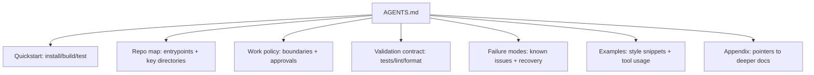
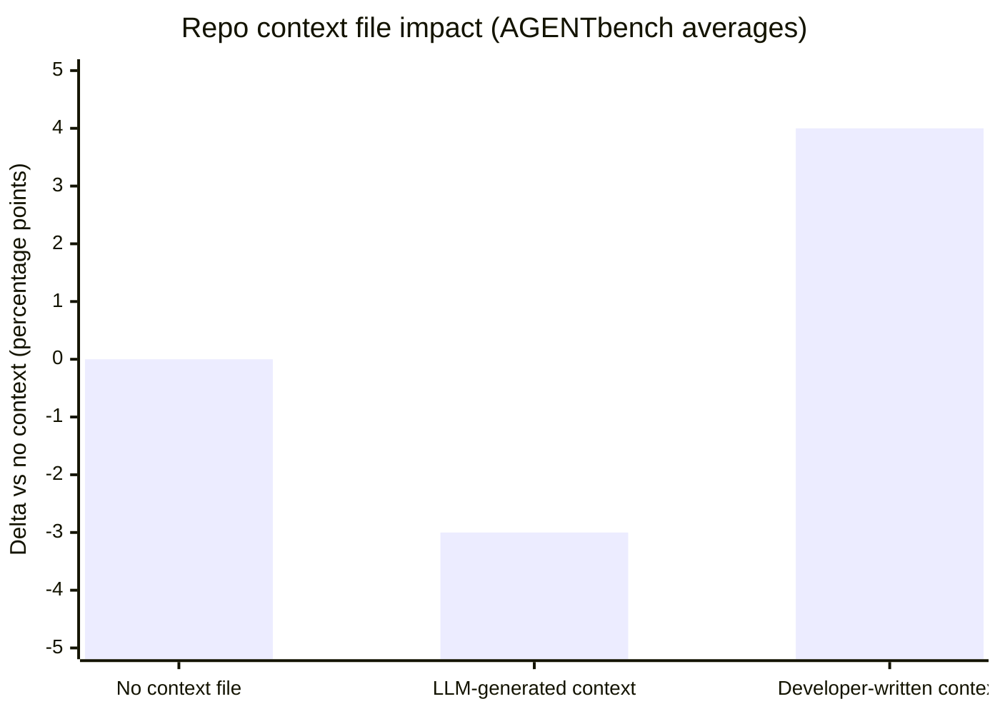

# Best Practices for an Effective AGENTS.md for Coding Agents

## Executive summary

AGENTS.md is increasingly treated as a “repo briefing” for autonomous or semi-autonomous coding agents: the smallest set of **non-inferable, actionable facts** that helps an agent (a) set up the environment, (b) navigate the repo correctly, (c) run the right validation commands, and (d) stay within safety/permission boundaries. The format is intentionally loose—plain Markdown with no required fields—yet the ecosystem around it has converged on repeatable patterns: **hierarchical scoping**, **command-first guidance**, **examples over admonitions**, and **operational guardrails**. citeturn7view3turn29view0turn22view0

Recent empirical evidence complicates the conventional “more context is better” intuition. A February 2026 study evaluating repo-level context files (including AGENTS.md-style files) found: developer-written context files provide only **modest average gains (+4%)**, LLM-generated ones can slightly **hurt success (−3%)**, and both can increase cost by **>20%** by encouraging broader exploration and more tool use. The authors recommend keeping such files **minimal and requirement-focused**. citeturn22view0

A rigorous AGENTS.md should therefore behave less like a “full onboarding handbook” and more like a **policy + runbook index**:

- Put **exact build/test/lint commands early**, because agents use them repeatedly and frameworks explicitly encourage “how to build, test, and validate changes” guidance. citeturn6view1turn6view3turn29view0  
- Prefer **scoped instructions** (nested AGENTS.md, or path-specific instruction files in other systems) to avoid bloating one global file. citeturn6view2turn6view1turn29view0turn9view2  
- Treat AGENTS.md as **context, not enforcement**: write rules that are concrete, checkable, non-contradictory, and sized to fit within real context budgets (for example, limits and guidance are explicitly discussed in multiple agent systems). citeturn9view2turn29view0turn22view0  
- Include **security and permissions constraints** using least privilege and prompt-injection-aware design, because agentic systems expand the blast radius of prompt injection, secret leakage, and unsafe tool use. citeturn24view0turn24view2turn25view0  
- Operationalize with **automation**: CI validation of structure/links, secret scanning, ownership and review controls for the instruction files, and evaluation metrics (success, regressions, latency/cost, and safety incidents). citeturn25view0turn27view0turn23view2turn16view0  

## Evidence and ecosystem comparison

### What AGENTS.md is and why it exists now

AGENTS.md is positioned as a predictable, agent-facing documentation surface: “a README for agents,” used across tens of thousands of repositories, with support for nested files and precedence rules (“closest wins”). It is plain Markdown and does not require mandated fields. citeturn7view3turn12view0turn29view0turn6view2

Governance has also moved toward standardization. entity["company","OpenAI","ai company"] announced co-founding the entity["organization","Agentic AI Foundation","aaif under linux foundation"] under the entity["organization","Linux Foundation","open source consortium"] and contributing AGENTS.md to neutral stewardship, explicitly framing it as an interoperability convention for agentic tools. citeturn12view0

### How major tools load and scope “agent context files”

A key cross-vendor convergence is **hierarchical resolution** plus **override precedence**:

- **Codex-style discovery (example)**: a global scope file (in a user home directory) + project scope walking the directory tree; per-directory precedence prefers `AGENTS.override.md` over `AGENTS.md`, concatenates from root toward working directory, and caps total bytes by configuration (32 KiB default in this reference). It also provides explicit troubleshooting guidance and mentions auditing via logs/session JSONL. citeturn29view0  
- **Repo-level vs path-specific instructions (example)**: repository-wide custom instructions and path-scoped instruction files with YAML frontmatter (`applyTo`) are formally documented, including glob syntax and optional exclusion for specific agent surfaces (e.g., exclude code-review vs coding-agent). citeturn15view0turn15view2  
- **“Memory files” in other systems (example)**: multiple scopes (org/user/project/local), load ordering, imports, and explicit size guidance (e.g., target under ~200 lines for a file that loads every session). citeturn9view2  
- **Rules systems (example)**: “rules” are joined into a system message in a documented order; local vs global rule locations behave differently. citeturn9view1  

### Comparison table: AGENTS.md and “similar” repo instruction surfaces

The table below compares widely used, well-documented instruction surfaces that serve the same *functional* role as AGENTS.md (persistent agent guidance), even when the filename differs.

| System / surface | Where it lives | Scoping & precedence | Machine-readable metadata | Strengths for coding agents | Key limitations / gotchas | Primary source |
|---|---|---|---|---|---|---|
| AGENTS.md “open format” | Repo root and nested directories | Nearest file in the directory tree wins; nested files are recommended for monorepos | None required (plain Markdown) | Simple, tool-agnostic, easy to adopt | No enforced schema; quality depends on authoring discipline | citeturn7view3turn12view0 |
| Codex-style AGENTS.md guidance layering | Global home + repo + nested override files | Explicit discovery chain; per-directory `AGENTS.override.md` > `AGENTS.md`; byte cap defaults; troubleshooting steps | Not required | Clear resolution model; supports fallback filenames; provides auditing/log hints | Byte caps can truncate; requires careful modularization | citeturn29view0turn7view0 |
| GitHub agent instructions via AGENTS.md | Anywhere in repo | “Nearest AGENTS.md takes precedence”; supports nested files | Not required | Integrates with a major platform’s agent workflows | Some environments may not load AGENTS.md outside workspace root by default | citeturn15view2turn6view2 |
| Repo-wide instruction file (Copilot-style) | `.github/copilot-instructions.md` | Applies across repo; can combine with path-specific instructions | No required frontmatter | Works for repo-wide norms; encourages build/test guidance | Can become bloated; applies broadly unless split | citeturn6view1turn14search10 |
| Path-specific instruction files | `.github/instructions/*.instructions.md` | YAML frontmatter `applyTo` globs; optional `excludeAgent` | Yes—frontmatter keys | Fine-grained scoping reduces prompt bloat | Requires maintenance of globs; incomplete support varies by environment | citeturn15view0turn15view2 |
| Persistent project memory file (CLAUDE.md-style) | Org/user/project/local scopes | Multiple scopes w/ precedence; imports with `@path`; explicit size guidance | Not required, but supports structured organization via imported docs | Clear guidance on concision; built-in modularity (imports, rules) | Treated as context, not enforcement; too-long files degrade adherence | citeturn9view2 |
| Rules as system-message components (Continue-style) | `.continue/rules` and global locations | Ordered joining into system message; explicit load order | Optional frontmatter patterns exist in ecosystem | Modular and tool-defined; rules are explicitly part of system message construction | Behavior differences across “hub vs local”; doc drift is possible in fast-moving tools | citeturn9view1turn13view0 |

### What the empirical evidence implies for “best practices”

The February 2026 arXiv study is directly about these repo-level context files. It reports: developer-provided files yield a modest average improvement (~+4%), LLM-generated files can slightly reduce success (~−3%), and both increase costs (>20%) by encouraging broader exploration (more tests, file traversal, reasoning). The paper suggests avoiding automatically generated context files and keeping human-written ones to minimal requirements (e.g., exact tooling commands). citeturn22view0

This aligns (indirectly) with practice-oriented docs that warn against instruction overload and emphasize scoping and modularity: prefer “always-on” rules only when truly universal, otherwise use more targeted mechanisms (skills, path-specific instructions, subagents) to avoid distracting the agent. citeturn16view0turn9view2turn15view0

## What to include in AGENTS.md

### Purpose and audience

A high-performing AGENTS.md is typically written for three audiences at once:

- The **agent runtime** (what it will load as context, how it resolves precedence, what it can execute). citeturn29view0turn15view2turn9view2  
- The **agent-as-operator** (the model deciding what commands/tools to run and what “done” means). citeturn23view0turn16view0turn29view0  
- Humans reviewing agent behavior: reviewers need to understand why the agent ran certain commands, what policy it followed, and whether it respected boundaries (especially for code changes). citeturn23view3turn25view0turn27view0  

In practice, this suggests a dual design principle:

1. **Command-and-contract first**: make it immediately obvious how to build/test and what counts as completion. citeturn6view3turn29view0turn16view0  
2. **Index to deeper docs rather than duplicating them**: keep AGENTS.md minimal, and reference canonical documentation (architecture docs, security policy) as needed—particularly when other systems are explicit about size limits and adherence degradation. citeturn9view2turn22view0turn29view0  

### Required metadata (recommended, even if the format doesn’t mandate it)

Although AGENTS.md itself is plain Markdown and does not require a schema, multiple adjacent ecosystems have converged on YAML-frontmatter metadata for scoping and agent configuration (`applyTo`, agent profiles, rule naming). citeturn15view0turn14search8turn13view0

For a repo-agnostic “best practice,” the pragmatic recommendation is:

- Provide **human-readable metadata** in a dedicated top section.
- Optionally make it **machine-readable** (YAML frontmatter or a colocated YAML/JSON file) *without assuming agents will parse it automatically*.

A “required metadata” set that is broadly useful across agents and languages:

- **Agent identity**: name, role, version/revision, owners/maintainers.  
- **Capabilities**: what kinds of tasks the agent should attempt here (bugfixes, refactors, test-writing), and what it must not do.  
- **Entry points**: repo layout, key directories, where to start reading.  
- **Dependencies**: language toolchains, package managers, system deps, expected versions.  
- **Runtime**: how to run dev server, tests, linters; OS assumptions; container/devcontainer info.  
- **Security/safety constraints**: prohibited paths, secrets policy, prompt-injection rules, approval gates. citeturn24view0turn24view2turn25view0  
- **Data access & permissions**: allowed external services, credential handling, whether network is available, how to access internal docs.  
- **Rate limits and quotas**: API limits, CI budgets, “max expensive tests” rules.  
- **Verification contract**: expectations for tests, lint, formatting, and evidence in the final response. citeturn23view0turn6view3turn29view0turn28view0  

Empirically, you should bias toward **non-inferable, repo-specific information** (exact commands, special harness constraints, unusual patterns) rather than verbose architecture summaries, because the measured gains of context files are modest and costs rise with increased exploration. citeturn22view0

## How to write it so agents follow it

### Instruction structure patterns that show up across trusted guidance

Across agent and platform docs, several consistent patterns emerge:

- **Persistence reminders**: Encourage “keep going until done,” especially in agentic workflows where intermediate steps and tool use are expected. citeturn23view0  
- **Tool grounding**: Instruct the agent to read files / run commands rather than guess. citeturn23view0turn16view0  
- **Concrete commands and flags**: community and platform guidance explicitly emphasizes listing the exact executable commands early. citeturn6view3turn29view0  
- **Examples separated from tool definitions**: OpenAI’s agent prompting guidance recommends keeping tool descriptions concise and placing usage examples in an explicit examples section rather than overloading schemas. citeturn23view0  
- **Avoid blanket requirements that inflate work**: the 2026 evaluation shows context files can cause agents to run more tests and explore more without proportional success gains, so rules should be proportional and scoped. citeturn22view0turn16view0  

### Recommended semantic sections in AGENTS.md

A structure that is both human-scannable and agent-friendly:

1. **Quickstart commands** (install, build, test, lint, format)  
2. **Repo map** (high-level folders + where “the truth” lives)  
3. **Work policy** (what edits are allowed, boundaries, review expectations)  
4. **Validation contract** (what must be run, when to ask before expensive runs)  
5. **Failure modes & recovery** (what to do when tests fail, env missing deps, network blocked)  
6. **Examples** (small, high-signal code snippets and “good patch” behaviors)  
7. **Appendix** (links/pointers to deeper docs)

This mirrors what successful files emphasize (concise, checkable sections; commands first; examples over prose). citeturn6view3turn9view2turn22view0

### Mermaid diagram: a recommended AGENTS.md section layout

The following structure is designed for fast agent scanning and progressive disclosure.



The emphasis on minimal, checkable guidance and avoiding unnecessary requirements is consistent with measured outcomes in recent evaluation work. citeturn22view0turn9view2

### Workflow design: “agent loop” with explicit recovery steps

Trusted guidance for agentic coding repeatedly stresses: tool use, verification, and iterative completion rather than “one-shot answers.” citeturn23view0turn23view3

A workflow-oriented AGENTS.md should therefore name specific recovery steps (not just “fix tests”):

- If unit tests fail: run the smallest relevant subset first, then expand.  
- If formatting/lint fails: run the formatter, then re-run the targeted tests.  
- If environment setup fails: list the expected package manager and lockfile, and what to do if missing system deps.  
- If network access is restricted: document offline strategies (vendored deps, mirrors) and how to detect the sandbox mode.

A concrete instance of this style exists in the entity["company","OpenAI","ai company"] Codex repository’s AGENTS.md: it provides targeted test commands, explicit guidance on when to ask before running the full test suite, formatting requirements, and sandbox-related constraints (network-disabled environment variables). citeturn28view0

## Formatting and machine-readability

### Why add machine-readability when AGENTS.md is plain Markdown?

Even though the AGENTS.md convention is intentionally schema-light, the broader “agent customization” ecosystem increasingly uses machine-readable descriptors:

- YAML frontmatter for path-scoped instructions (`applyTo`, `excludeAgent`). citeturn15view0turn15view1  
- Agent profiles with YAML frontmatter defining name/description/tools/MCP servers in some platforms. citeturn14search8turn16view0  
- Rules systems that use front matter (e.g., naming and always-apply toggles in rule blocks). citeturn13view0  

Machine readability matters because it enables:
- CI validation (“is the metadata complete?”),
- consistent discoverability (tags/owners),
- automatic generation of derived formats (e.g., exporting to other systems’ instruction files).

The same general principle appears in OpenAI’s Structured Outputs guidance: a schema reduces omissions and invalid fields and simplifies downstream handling. While that doc is about model outputs, the *engineering logic* carries to instruction metadata too: validated structure improves reliability. citeturn23view1

### A pragmatic approach: YAML frontmatter + strict semantic headings

The key best practice is to treat machine-readability as *optional augmentation*:

- Keep the body readable as normal Markdown.
- If using YAML frontmatter, make it concise and stable.
- Avoid putting highly volatile values (like ephemeral rate limits) in frontmatter unless they are maintained.

The metadata block should describe: **identity, versioning, scope, capabilities, permissions, runtime envelopes, and owners**.

### Mermaid diagram: metadata-to-validation pipeline

```mermaid
flowchart LR
  A[AGENTS.md with YAML frontmatter] --> B[CI: lint + schema validate]
  B --> C[CI: link check + spell/style checks]
  B --> D[CI: policy checks (protected paths, forbidden tokens)]
  B --> E[CI: secret scanning + dependency scanning]
  B --> F[Publish: badges + README links]
```

This pipeline mirrors how modern repos validate other critical policy/config artifacts (security scanning, ownership, and automation-based checks). citeturn25view0turn27view0turn27view1

## Operationalization: discoverability, maintenance, and CI automation

### Discoverability

If AGENTS.md exists but isn’t discoverable, it fails its operational purpose—especially because different tools may rely on different filenames and locations. Best practice is to make “agent guidance” an explicit navigation element:

- Link to AGENTS.md from README using relative links (GitHub supports stable relative paths and even auto-generated outlines). citeturn27view1  
- Use CODEOWNERS to assign responsibility for AGENTS.md (and any nested variants), so changes trigger review by maintainers who understand the agent policy surface. citeturn27view0  
- Use repository topics (and optionally badges) to signal that the repo is “agent-ready” and to aid discoverability; topics are explicitly a discoverability surface on GitHub. citeturn27view2turn27view3  

### Maintenance model: versioning + changelogs + “don’t break the agent”

Reliable instruction surfaces behave like APIs: changes should be intentional, reviewed, and testable.

Recommended maintenance practices grounded in platform guidance:

- **Version pinning for agent behavior**: prompt behavior changes over time; OpenAI’s prompt engineering guidance explicitly recommends pinning model snapshots and building evals to monitor prompt performance across iterations. citeturn23view2  
- **Changelogs for instruction changes**: treat AGENTS.md edits as behavior changes; document what rules changed and why.  
- **Scoping to reduce churn**: prefer nested files or path-specific instructions to isolate changes to the relevant subproject; multiple platforms encourage this direction (nested AGENTS.md, `applyTo` globs, scoped rules). citeturn6view2turn15view0turn9view2  

### Recommended CI checks and automated validations

A high-signal CI suite focuses on preventing the failure modes most likely to damage agent behavior or safety.

| CI check | Why it matters for agents | Example implementation approach |
|---|---|---|
| Markdown lint + link check | Agents rely on headings and stable pointers; broken links reduce retrieval quality | `markdownlint`, `lychee`, or equivalent |
| YAML/frontmatter schema validation (if used) | Prevents missing required metadata (permissions, runtime, owners) | JSON Schema / custom validator (align with “schema reduces omissions” idea) citeturn23view1 |
| “Command sanity” checks | Ensures documented commands still work (or are gated) | Minimal smoke CI job that runs the documented test command(s) |
| Secret scanning | Instructions sometimes mention env vars; repos frequently leak secrets; automated detection is a standard control | Native secret scanning + push protection + custom patterns citeturn25view0turn25view2 |
| Ownership enforcement | Prevents drive-by edits to policy-critical files | CODEOWNERS review requirements citeturn27view0 |
| Policy checks: protected paths | Prevent unauthorized edits (infra/security-critical) via agents | CI rule: deny changes under sensitive dirs unless approved |

Secret scanning deserves explicit emphasis: it scans git history and multiple GitHub surfaces (issues/PRs/discussions/wikis) and generates alerts so credentials can be rotated quickly. citeturn25view0turn25view1

## Security, privacy, and legal considerations

### Threat model: prompt injection + excessive agency + data leakage

As agents browse, read files, run commands, and connect to external tools, prompt injection becomes a “frontier security challenge,” especially when the agent ingests untrusted content from many sources. citeturn24view0

Authoritative security frameworks and guidance highlight prompt injection and related risks:

- OWASP describes prompt injection vulnerabilities and notes that RAG/fine-tuning do not fully mitigate them; the impacts include unauthorized access, infra leakage, and tool misuse. citeturn24view2  
- NIST’s Generative AI profile discusses direct and indirect prompt injection, including scenarios where injected content in retrieved data can lead to data theft or unintended code execution. citeturn24view1  
- OpenAI safety guidance recommends red-teaming, human oversight (especially for code), and mitigation against prompt injections. citeturn23view3  

### What to put in AGENTS.md for security (and what to avoid)

High-signal content to include:

- **Secrets policy**: never paste secrets into prompts, never commit credentials; specify where secrets live (vault, CI secrets) and how to rotate. Align with secret scanning controls. citeturn25view0turn25view1  
- **Least privilege**: document which tools are allowed, which directories are protected, and when user approval is required. OpenAI explicitly recommends limiting an agent’s access to sensitive data and carefully reviewing confirmation prompts. citeturn24view0turn23view3  
- **Network and sandbox constraints**: declare whether network access exists. Real-world example: the Codex repo AGENTS.md describes a sandbox where a “network disabled” environment variable is set and warns against modifying certain sandbox-related code. citeturn28view0  
- **Auditability**: note where logs are stored and how to verify what instruction files were loaded (some systems explicitly mention logs/session JSONL and auditing). citeturn29view0turn16view0  

What to avoid (or move to deeper docs):

- Long motivational prose or “be a helpful assistant”-style text that adds tokens without adding constraints or actionable steps (this is a known failure mode in real repo analyses and is consistent with empirical findings that verbose context increases cost). citeturn6view3turn22view0  
- Highly sensitive internal URLs, credentials, or proprietary incident details—treat AGENTS.md as potentially widely read.

### Privacy and data retention best practices

AGENTS.md should specify:

- **Data retention expectations** (what logs are kept, where, and for how long), especially if agent sessions are logged.  
- **PII/PHI policy** and what to do if encountered.  
- **License boundaries**: if the repo contains restricted assets or third-party code, describe what the agent may and may not reproduce (especially relevant to IP risk discussions in NIST’s GenAI profile). citeturn24view1  

## Templates, annotated example, metrics, and maintainer checklist

### A small chart: “more context” vs “more cost” (evidence-driven)

The following chart encodes key deltas reported in the February 2026 study (AGENTbench averages): developer-provided context files showed ~+4% success, LLM-generated showed ~−3% success, and context files increased cost by >20% due to broader exploration/tool use. citeturn22view0



Operationally, this supports a disciplined rule: **AGENTS.md should focus on minimal but high-leverage requirements**—especially exact commands, constraints, and non-obvious repo facts. citeturn22view0turn29view0

### Three AGENTS.md templates

Each template is “agent-agnostic” Markdown. The YAML block is optional and intended for maintainers and CI tooling; agents that ignore it will still benefit from the body.

#### Minimal template

```markdown
---
name: repo-agent-guidance
version: 0.1.0
owners:
  - team: platform
scope: repo-root
---

# AGENTS.md

## Quickstart commands
- Install: <COMMAND>
- Build: <COMMAND>
- Test: <COMMAND>
- Lint/format: <COMMAND>

## Repo map
- Entry point: <PATH OR FILE>
- Core modules: <PATHS>
- Where configs live: <PATHS>

## Validation contract
- Always run: <FAST TESTS>
- Ask before running: <SLOW / EXPENSIVE TESTS>

## Safety boundaries
- Do not modify: <PROTECTED PATHS / FILES>
- Secrets: never write credentials into code or prompts.
```

#### Standard template

```markdown
---
name: repo-agent-guidance
version: 1.0.0
owners:
  - team: platform
  - team: security
capabilities:
  - bugfix
  - refactor
  - add-tests
entrypoints:
  - path: README.md
  - path: docs/architecture.md
runtime:
  package_manager: <pnpm|npm|pip|poetry|bundler|maven|gradle|cargo|go>
  languages:
    - name: <LANG>
      version: <VERSION>
permissions:
  network: <allowed|restricted|offline>
  external_services:
    - <SERVICE>
rate_limits:
  external_api:
    policy: "<e.g., 10 rps, backoff>"
---

# AGENTS.md

## Mission
You are working in this repository to implement changes safely and verifiably.

## Quickstart commands (copy/paste)
- Install deps: `<COMMAND>`
- Run unit tests: `<COMMAND>`
- Run lint/format: `<COMMAND>`
- Run full CI-equivalent checks: `<COMMAND>` (ask before running if slow)

## How the repo is organized
- `src/`: <what lives here>
- `tests/`: <what lives here>
- `docs/`: <canonical documentation>
- <other key directories>

## Development workflow
- Branching/PR conventions: <rules>
- Commit message / changelog: <rules>
- Dependency changes: <rules>

## Tooling constraints
- OS assumptions: <Linux/macOS/Windows>
- If sandboxed/offline: <what to do>

## Failure modes and recovery
- If tests fail: <sequence>
- If lint fails: <sequence>
- If build fails: <sequence>
- If you can’t find where to change something: <search hints>

## Examples
- Preferred pattern for <X>: <short snippet>
- Testing example for <Y>: <short snippet>
```

#### Advanced template (monorepos, multiple agents, strict policy)

```markdown
---
name: repo-agent-guidance
version: 2.0.0
owners:
  - team: platform
  - team: security
  - team: release
tags:
  - agent-ready
  - monorepo
policy:
  protected_paths:
    - path: infra/
      requires_approval: true
    - path: security/
      requires_approval: true
  data_access:
    allowed:
      - repo-files
      - ci-logs
    prohibited:
      - production-databases
      - customer-pii
telemetry:
  required_metrics:
    - task_success
    - regression_rate
    - latency
    - tool_calls
    - safety_incidents
---

# AGENTS.md

## Command index (put first)
- Bootstrap:
  - `<COMMAND>`
- Targeted tests:
  - `<COMMAND>`
- Full suite:
  - `<COMMAND>` (requires approval)
- Lint/format:
  - `<COMMAND>`

## Repo topology and entry points
- Package map:
  - `packages/<A>/` — <what it is>
  - `services/<B>/` — <what it is>
- Where APIs are defined: <paths>
- Where integration boundaries are enforced: <paths>

## Policy and permissions
- Network policy: <allowed/restricted/offline>
- Secrets:
  - Stored in: <vault/CI secrets>
  - Never: commit, echo, or paste secrets
- Protected paths: see frontmatter `policy.protected_paths`
- Data retention:
  - Agent logs stored: <where>
  - Retention: <duration>

## Testing harness expectations
- “Done” means:
  - All relevant tests pass
  - No lint/format regressions
  - Public APIs documented (if changed)
- Test selection rules:
  - Start with smallest relevant suite
  - Expand only if failures indicate broader impact

## Recovery playbooks
- Flaky tests: <how to re-run, when to mark flaky>
- Performance regressions: <perf harness>
- Dependency updates: <lockfile policy>

## Scoping strategy
- Monorepo rule: create nested `AGENTS.md` for packages with specialized workflows.
- If nested overrides exist, keep root file minimal and refer to subproject files.

## Examples and anti-examples
- Good PR summary format: <example>
- Bad behaviors to avoid: <examples>
```

### Annotated trusted example: openai/codex AGENTS.md

The AGENTS.md in the Codex repository is a strong example of “high-leverage, repo-specific guidance”:

- It encodes **environment constraints** (sandbox/network limitations) and explicitly prohibits modifying certain sandbox-related code paths. citeturn28view0  
- It provides **actionable commands** and sequencing rules: run `just fmt`, run targeted tests first, ask before running the complete test suite, and provides additional commands for schema and lockfile maintenance. citeturn28view0  
- It includes **style and testing conventions** that are checkable (linting guidance, snapshot test workflow), which reduces ambiguity and aligns with “concrete enough to verify” instruction guidance seen in other systems. citeturn28view0turn9view2  

One improvement, if adapting this for a broader multi-agent environment, would be to add an explicit, compact metadata header (owners, version, protected paths) to support automated governance—without changing the core principle: command-first minimalism. citeturn22view0turn15view0

### Effectiveness metrics and suggested logging/telemetry

A robust AGENTS.md program should be evaluated like any other production control surface. OpenAI’s prompting guidance explicitly recommends building evals to measure prompt behavior across iterations and when upgrading model versions. citeturn23view2

Recommended metrics (define them precisely in the repo’s telemetry plan):

- **Task success rate**: % of tasks merged or tests passing without human rewrite. Align with benchmark-style measurement (SWE-bench defines success in terms of resolving real issues via patches; AGENTbench uses tests similarly). citeturn17search2turn22view0  
- **Regression rate**: % of agent PRs that fail CI or introduce post-merge incidents.  
- **Hallucination rate (operational definition)**: % of runs where the agent claims it ran tests/checked files but logs show it didn’t, or where it invents repo structure—mitigate with tool-grounding rules. citeturn23view0  
- **Latency and cost**: wall-clock time, token usage, tool-call counts; important because context files can increase exploration and cost. citeturn22view0turn16view0  
- **Safety incidents**: attempted protected-path edits, secret exposure attempts, prompt-injection indicators (e.g., instructions overridden by untrusted content).

For telemetry hooks:

- Some agent platforms explicitly support hooks at lifecycle events for guardrails and logging/telemetry (session start/end, pre/post tool use, error events), which can be used to implement audit logs and policy enforcement. citeturn16view0  

### Maintainer checklist (high-signal)

| Area | Checklist item | Pass criterion |
|---|---|---|
| Scope | Root file is short and high leverage; specialized areas use nested files | No “everything for everyone” mega-file; scoping rules documented citeturn6view2turn22view0 |
| Commands | Exact install/test/lint/format commands appear near top | A new contributor (or agent) can run them without guesswork citeturn6view3turn29view0 |
| Verification | Clear “done means…” contract exists | Agent must run relevant checks; expensive runs require approval citeturn23view0turn28view0 |
| Safety | Protected paths and secrets policy are explicit | CI enforces ownership + secret scanning; least privilege documented citeturn25view0turn27view0turn24view0 |
| Discoverability | README links to AGENTS.md; owners assigned | Navigable via relative links; CODEOWNERS includes AGENTS.md citeturn27view1turn27view0 |
| Maintenance | Versioning/changelog + evals exist | Instruction changes are reviewed, measurable, and regression-tested citeturn23view2 |

### Sources

- entity["company","OpenAI","ai company"] Codex AGENTS.md discovery and layering (precedence, byte caps, logs): citeturn29view0turn7view0  
- Codex repository AGENTS.md (trusted real-world example): citeturn28view0  
- AGENTS.md “open format” overview and precedence principles: citeturn7view3turn26search29  
- Agentic AI Foundation and donation of AGENTS.md under the entity["organization","Linux Foundation","open source consortium"] umbrella: citeturn12view0  
- February 2026 evaluation of AGENTS.md/context files (AGENTbench; +4% vs −3%; >20% cost): citeturn22view0  
- GitHub repository custom instructions and AGENTS.md precedence; `.instructions.md` frontmatter (`applyTo`, `excludeAgent`): citeturn15view0turn15view2turn6view2  
- Agent customization primitives (instructions vs skills vs hooks; logging via hooks): citeturn16view0  
- Guidance on concision, precedence, imports, and “context not enforcement” (CLAUDE.md memory model): citeturn9view2  
- OpenAI agent prompting guidance (tool grounding, examples, persistence): citeturn23view0  
- OpenAI prompt engineering guidance (pin model snapshots; build evals): citeturn23view2  
- OpenAI safety best practices (red-teaming, HITL, prompt injection awareness): citeturn23view3  
- Prompt injection risk framing (OpenAI) and controls (OWASP, NIST): citeturn24view0turn24view2turn24view1  
- Secret scanning (GitHub) and detection scope: citeturn25view0turn25view2  
- Discoverability controls (README relative links, topics, CODEOWNERS, badges): citeturn27view1turn27view2turn27view0turn27view3