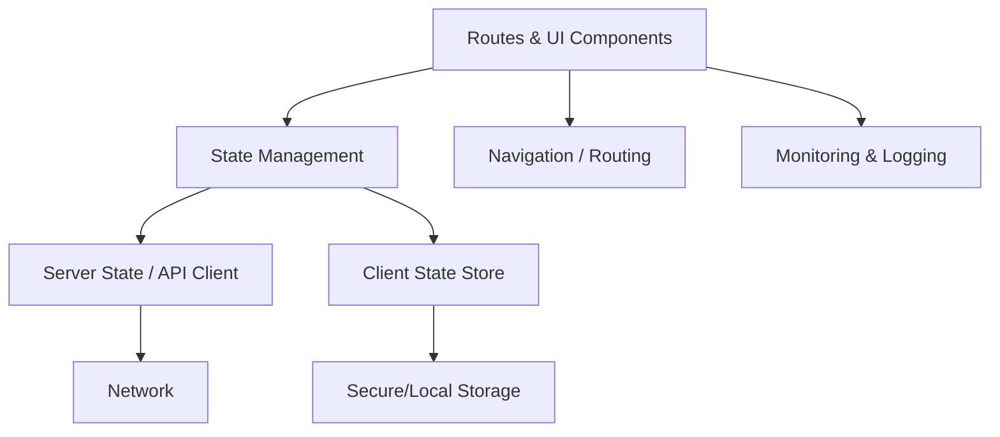

# Best Practices for Developing Mobile Apps with the Expo SDK and React Native

## Executive summary

Developing with the Expo SDK is best approached as an integrated lifecycle: choose an appropriate workflow (managed/“CNG” vs bare), standardize setup (TypeScript, linting, env vars), keep dependencies aligned to the Expo SDK version, and build a release pipeline that explicitly separates “native-layer” changes (requiring a rebuild) from “update-layer” changes (eligible for over‑the‑air updates). Expo’s documentation emphasizes that modern Expo development is built around Continuous Native Generation (CNG) and config plugins, and that “ejecting” is deprecated in favor of prebuild plus development builds when native code or configuration is needed. citeturn20view1turn15view0turn19view5

A robust default posture for most teams is:
- Prefer the managed/CNG (prebuild) workflow unless you have long‑lived bespoke native code that you intend to maintain manually. CNG is designed to regenerate native projects from SDK-specific templates, and config plugins are the primary customization mechanism. citeturn15view0turn1search9turn20view1  
- Use development builds instead of relying on Expo Go beyond prototyping because Expo Go cannot run arbitrary third‑party native modules and has other limitations tied to immutable native code. citeturn20view0turn20view1  
- For upgrades, move incrementally (one SDK at a time), use `npx expo install --fix` and `npx expo-doctor`, and—if you use CNG—regenerate `ios/` and `android/` after upgrading. citeturn17view4turn15view4  
- Treat EAS Update as a controlled delivery mechanism for the “update layer” (JS/assets) with explicit runtime versioning; any native-layer change requires a new build and (often) a runtime version bump. citeturn26view0turn15view3turn26view2  
- Apply a security model that assumes client bundles are readable by end users: never embed real secrets in client-side environment variables, use secure storage for tokens where appropriate, and rely on EAS “secret” variables only for build-job behavior (not as a way to hide embedded secrets). citeturn18view1turn15view2turn18view0  

## Workflow selection and project setup

### Managed/CNG vs bare workflow

In current Expo terminology, “managed” maps most closely to CNG/prebuild-driven projects where native projects are generated from configuration and config plugins, while “bare” maps to projects where native directories are present and treated as source-of-truth (often committed), which implies native tooling ownership and manual change management. Expo explicitly notes that when native directories are present, EAS Build does not run prebuild because doing so could overwrite manual customizations, shifting responsibility to you to manage native configuration. citeturn20view1turn19view5  

CNG’s technical rationale is that prebuild starts from an Expo SDK–specific native template aligned to the SDK’s React and React Native versions, enabling consistent reproduction of native projects and reducing drift across machines and CI. citeturn15view0  

### Comparison table: managed/CNG vs bare

| Dimension | Managed / CNG (prebuild-first) | Bare (native dirs as source-of-truth) |
|---|---|---|
| Native module access | Use Expo SDK modules freely; for third‑party native modules, use config plugins and a development build; you can also write native code via the Expo Modules API when needed. citeturn19view5turn20view0turn3search17 | Full native freedom; any library or custom code is possible, but you must integrate and maintain native code directly. EAS Build won’t regenerate native projects if native dirs are present. citeturn20view1turn19view5 |
| Build complexity | Lower day-to-day complexity: regenerate native projects from config; customization via config plugins; fewer “works on my machine” issues. citeturn15view0turn1search9 | Higher complexity: Xcode/Android Studio configuration is your responsibility; drift between branches/environments is more likely without discipline. citeturn20view1turn19view5 |
| OTA updates | First-class workflow: EAS Build and EAS Update integrate, with runtime version/channel guidance and config-driven setup (recommended `appVersion` runtime policy by default). citeturn21view2turn15view3turn26view1 | OTA still possible if `expo-updates` is installed and configured, but you may manage more native-side settings manually; native-layer changes still require rebuild/new runtime version. citeturn26view1turn26view0 |
| Team skill requirements | Primarily JS/TS + config plugin literacy; less native expertise required until you push beyond the SDK/plugin ecosystem. citeturn1search9turn19view5 | Requires consistent iOS/Android native skills to maintain build settings, entitlements, signing nuances, and native-module integration. citeturn20view1turn19view5 |
| Typical use cases | Fast iteration, cross-platform apps, teams wanting standardization, most product apps that don’t need bespoke native code long-term; monorepos are explicitly supported. citeturn19view0turn20view1turn21view2 | Apps with heavy bespoke native code, long-lived native forks, unusual build pipelines, or strict constraints requiring direct native control. citeturn20view1turn19view5 |
| Upgrade difficulty | Generally easier: upgrade SDK, fix dependency alignment, regenerate native projects; follow SDK changelog guidance. citeturn17view4turn15view4 | Often harder: you must apply native diffs yourself and reconcile upstream changes; upgrades can become a native merge/rebase exercise. citeturn20view1turn22view0 |

### Concrete setup recommendations

A generalized “baseline” setup that scales well is:

**Create project via the supported initializer and stick to Expo CLI conventions.** Expo CLI (`npx expo`) is documented as the primary interface for development, prebuild, local runs, and installing compatible packages. citeturn21view0turn2search12  

**Default to TypeScript from day one.** Expo explicitly states first-class TypeScript support, and the recommended quick start uses the default template created by `create-expo-app`. citeturn19view2turn2search12  

**Standardize linting and formatting.** Expo provides a guide for configuring ESLint and Prettier and notes a version-dependent split: from SDK 53 onward, the default configuration uses ESLint “flat config,” while SDK 52 and earlier use legacy config. citeturn19view3  

**In monorepos, rely on Expo’s built-in support rather than custom Metro hacks (when available).** Expo’s monorepo guide states first-class support for workspace-capable package managers and notes that since SDK 52, Expo configures Metro automatically for monorepos (and recommends removing certain manual Metro overrides when migrating). citeturn19view0turn15view0  

**Use environment variables intentionally.** Expo recommends `.env` files with `EXPO_PUBLIC_` variables for values that become available in application code. For build and CI concerns, EAS environment variables are the centralized approach, with explicit warnings that client bundles are readable by end users. citeturn15view1turn18view1turn15view2  

### Example: environment variables and variants with app config

```ts
// app.config.ts
import "dotenv/config";

export default ({ config }: any) => {
  const appVariant = process.env.APP_VARIANT ?? "dev";

  return {
    ...config,
    name: appVariant === "prod" ? "MyApp" : `MyApp (${appVariant})`,
    slug: "my-app",
    // Recommended runtime policy for EAS Update is frequently set via eas update:configure
    runtimeVersion: { policy: "appVersion" },
    extra: {
      // Safe for client-side only if it is not a secret:
      apiBaseUrl: process.env.EXPO_PUBLIC_API_BASE_URL,
      appVariant,
    },
  };
};
```

This mirrors Expo’s model: `EXPO_PUBLIC_…` values are intended for client-side consumption, while non-`EXPO_PUBLIC_` variables can drive app config and build-time decisions. citeturn15view1turn18view1turn8search14  

### Common pitfalls in setup

Over-customizing Metro and workspace resolution in monorepos is a recurring source of instability; Expo explicitly calls out properties that should be removed from custom Metro config when adopting SDK 52+ monorepo auto-configuration. citeturn19view0  

Treating environment variables as “secret storage” is a structural error: Expo’s EAS docs emphasize that even “secret” variables only secure build-job behavior and don’t add security for values embedded into the app bundle. citeturn15view2turn18view1  

Relying on Expo Go for production-like validation is unreliable; Expo’s docs and FAQ stress that Expo Go cannot load arbitrary native code and is not useful for production-grade projects compared with development builds. citeturn20view1turn20view0  

## Dependency management and upgrades

### Dependency alignment as a first-class constraint

Expo SDK versions track a specific React Native version; the Expo reference documentation includes an explicit mapping table and explains that each SDK release targets a single React Native version, with a stated cadence of three SDK releases per year. citeturn21view1  

Because of that coupling, “best practice” is not merely pinning versions—it is actively maintaining compatibility alignment. Expo CLI highlights `npx expo install` as the mechanism to “install and update packages” that work with the version of React Native in your project. citeturn21view0turn21view1  

**Actionable recommendation:** Use `npx expo install` (not raw `npm install`) for Expo SDK packages and for many common React Native libraries, because Expo CLI is explicitly positioned as a compatibility-aware installer in the Expo ecosystem. citeturn21view0turn21view1  

### Native modules and custom native code strategy

A generalized decision tree supported by Expo docs is:

- If a feature is available in the Expo SDK, prefer it: it is maintained in the Expo ecosystem and tends to upgrade more smoothly. citeturn15view5turn21view1  
- If a third-party library includes native code:
  - It will not work in Expo Go unless that native module is already included in the Expo Go binary. Expo’s development build docs demonstrate this with examples (a library included in Expo Go vs one not included) and explain the failure mode. citeturn20view0turn20view1  
  - In CNG projects, use config plugins when native configuration is required; Expo explicitly frames config plugins as the top‑level customization point executed during prebuild. citeturn1search9turn19view5  
- If no suitable library exists, Expo recommends the Expo Modules API (Swift/Kotlin) for most teams building native modules. citeturn19view5turn3search17  

### Upgrade/migration strategy for Expo SDK versions

Expo’s SDK upgrade walkthrough provides a concrete baseline process:

- Upgrade SDK versions incrementally “one at a time” to better isolate breakages. citeturn15view4turn3search0  
- Install the target Expo package version, then align dependencies via `npx expo install --fix`, and run `npx expo-doctor` for diagnostics. citeturn17view4turn3search21  
- If you use CNG, delete and regenerate `ios/` and `android/` after upgrading an SDK version that previously generated them. citeturn17view4turn15view0  
- Follow the SDK changelog/release notes for breaking changes, deprecations, and instructions. citeturn17view4turn23view0  

**Common upgrade pitfall:** SDK upgrades often include “soft breaks” via deprecations that become removals in subsequent SDKs. Expo’s SDK 54 changelog, for example, calls out planned removal of a deprecated SDK package (`expo-av`) and recommends migration targets. citeturn23view0  

### Recommended SDK upgrade checklist

- [ ] Read the target SDK changelog and “Upgrading your app” instructions for that SDK. citeturn17view4turn23view0  
- [ ] Upgrade `expo` to the target SDK range, then run `npx expo install --fix`. citeturn17view4  
- [ ] Run `npx expo-doctor` and resolve warnings before proceeding. citeturn17view4turn3search6  
- [ ] If using CNG/prebuild: delete `ios/` and `android/`, then regenerate via `npx expo prebuild` / `npx expo run:*` or via EAS Build. citeturn17view4turn15view0  
- [ ] Rebuild development builds used by the team; Expo Go compatibility may change because Expo Go supports only one SDK version at a time. citeturn20view0turn20view1  
- [ ] If using EAS Update: validate runtime version policy and ensure you rebuild when native code changes. citeturn26view0turn15view3  

## App architecture and code organization

### Architectural goals and rationale

Expo and React Native architectures that scale well share a few properties:
- A clear boundary between UI components and “application logic” (state, domain rules).
- Explicit separation between server-state (remote data) and client-state (local UI/session).
- Navigation defined in a way that supports deep linking and testing.

Expo’s navigation documentation recommends Expo Router for Expo projects and states it is file-based routing built on top of React Navigation, adding typed routes, automatic deep linking, and development-time lazy bundling semantics. citeturn16view1turn8search0turn8search12  

### Navigation best practices

**Default recommendation:** For new Expo projects, use Expo Router unless you have strong reasons to use “raw” React Navigation configuration. Expo explicitly states new projects created with `npx create-expo-app@latest` include Expo Router by default. citeturn16view1turn19view2  

**Actionable practices:**
- Treat route segments as the boundary for screen-level state. This helps keep screens cohesive and reduces accidental cross-screen coupling. Expo Router’s file system approach is designed around route files as first-class units. citeturn16view1turn16view0  
- Design deep link handling as part of the routing model. React Navigation’s deep linking docs describe the two key cases: initial state when the app wasn’t open, and state update when it was already open. citeturn8search1turn8search5  

**Testing pitfall:** If using Expo Router, do not place test files in the `app/` directory because Expo Router expects that directory to contain routes/layout files; Expo provides a Router testing library that builds on top of React Native Testing Library and supports in-memory router apps. citeturn27view0turn4search0  

### State management options and selection criteria

A generalized “best practice” is to avoid making one state tool solve every state problem:

- Use React local state for ephemeral UI. For more complex screens or flows, React documents combining reducer + context for scaling state without prop drilling. citeturn13search2  
- Use a server-state library when remote data caching, retries, and invalidation are central. TanStack Query’s overview positions itself around managing “server state” and related complexity; its React Native docs state it works out of the box with React Native. citeturn13search10turn13search18  
- Use a global client-state library when cross-cutting UI/session state becomes too complex for context + reducers.
  - Redux Toolkit is described in Redux’s official docs as the “official recommended approach” for writing Redux logic. citeturn13search3turn13search6  
  - Zustand describes itself as “small, fast, and scalable,” with a hooks-based API and minimal ceremony. citeturn13search1turn13search4  

**Selection guideline (actionable):**
- If you mainly need remote data management: adopt a server-state library first, and keep client-state small and local. citeturn13search10turn13search18  
- If you need a strongly structured global state for large teams or complex domains: Redux Toolkit is the documented recommended approach in the Redux ecosystem. citeturn13search3turn13search6  
- If you want a light global store and can enforce discipline around modularization: Zustand’s minimal API can reduce boilerplate, but you must define boundaries to avoid a “god store.” citeturn13search1turn13search4  

### Folder structure and module boundaries

A practical folder structure should align with how Expo Router resolves routes, and it must respect Expo Router’s constraint that route files live in `app/` (and that tests should not). citeturn27view0turn16view1  

A generalized, Router-friendly structure:

```text
.
├─ app/                     # routes and layouts only (Expo Router)
│  ├─ _layout.tsx
│  ├─ (auth)/
│  ├─ (tabs)/
│  └─ index.tsx
├─ src/                     # non-route code (recommended boundary)
│  ├─ components/
│  ├─ features/             # feature modules (UI + logic)
│  ├─ domain/               # pure domain logic, no RN imports
│  ├─ services/             # API clients, analytics, updates, etc.
│  ├─ state/                # global stores, query client, etc.
│  └─ utils/
├─ __tests__/               # unit/integration tests
├─ eas.json
├─ app.config.ts
└─ package.json
```

The key discipline is keeping `app/` “route-only,” which aligns with Expo’s Router testing guidance. citeturn27view0turn16view1  

### Diagram: generalized architecture layering



This reflects the practical separation encouraged by Expo’s navigation-first approach (Router), and Expo’s monitoring guidance emphasizing integration points like error monitoring. citeturn16view1turn5search20turn18view5  

## Performance optimization and profiling

### Performance model and rationale

Performance work is most effective when treated as measurement-driven, and React Native’s profiling guide emphasizes using platform profilers (Instruments on iOS, Android Studio Profiler on Android) and ensuring Development Mode is off before profiling. citeturn22view2  

Expo adds ecosystem-specific performance levers and analysis tools:
- Metro bundling configuration and minification controls. citeturn7search3turn16view4  
- Expo Atlas for visualizing JavaScript bundle composition and identifying heavy dependencies. citeturn16view3  
- Asset workflow guidance that distinguishes static assets bundled in the native binary from the JS bundle, and explains how assets are served in development vs production. citeturn16view5  

### Bundle size and code loading

**Actionable recommendations:**
- Minify JS for production builds; Expo states minification occurs during production export and EAS Build pathways. citeturn16view4  
- Use Expo Atlas to identify oversized dependencies and transitive bloat; Expo documents enabling Atlas via `EXPO_ATLAS=true` with `npx expo start` or `npx expo export`. citeturn16view3  
- If using Expo Router on web, consider async routes for route-based bundle splitting, but treat it as experimental because Expo marks async routes as “alpha” and bases it on React Suspense. citeturn16view0turn7search7  

### Assets and media

Expo’s asset guide provides several operationally important facts:
- Static assets are bundled with the app binary (not part of the JS bundle). citeturn16view5  
- In development, locally stored assets are served over HTTP; in production they’re bundled into the binary and served from disk. citeturn16view5  
- You can embed assets at build time via config plugins (for example with `expo-asset`), which typically requires a new development build after changing asset embedding. citeturn16view5  

**Common pitfalls:**
- Treating large media as “just assets” can lead to oversized binaries and store friction; separate “must ship” assets from CDN-delivered assets and explicitly manage caching policy (especially for images/video). The Expo docs on assets and image prefetching highlight caching behavior and considerations. citeturn16view5turn7search6turn7search17  

### Hermes and profiling workflow

React Native documents Hermes as an open-source JS engine optimized for React Native, with typical benefits (startup time, memory usage, smaller app size) and notes that Hermes is used by default by React Native. citeturn22view0  

**Actionable recommendations:**
- Treat Hermes as the default baseline and only opt out with a measured reason. citeturn22view0  
- For JS-thread bottlenecks: use React Native DevTools’ profiler (where supported) for debug insights, then validate with native profilers for user-impacting performance. Expo’s debugging tools page describes profiler availability and limitations in debug builds. citeturn15view6turn22view2  
- For deeper Hermes sampling profiling workflows, React Native’s Hermes profiling documentation describes recording a sampling profile, converting it via CLI, and loading it into Chrome DevTools. citeturn22view1  

## Testing, CI/CD, release, and deployment

### Testing strategy

React Native’s testing overview frames testing as a spectrum from static analysis to end-to-end tests. citeturn11search14turn4search10  

Expo provides concrete guidance for unit testing and for Router-specific integration testing:
- Unit testing with Jest via `jest-expo`, including best practices for structuring tests. citeturn4search0turn11search3  
- Router testing utilities (`expo-router/testing-library`) and explicit guidance on test file placement. citeturn27view0  

For E2E, Expo’s EAS Workflows documentation provides a practical “how-to” for running E2E tests using Maestro, including directory conventions and workflow integration. citeturn16view2turn11search1  

**Actionable recommendations:**
- Use unit tests for pure logic, reducers, and utilities; keep UI tests focused on stable contract behavior and avoid snapshot overuse unless it is controlled. citeturn4search0turn4search10  
- For end-to-end regressions, drive tests through a black-box UI tool (Expo’s docs demonstrate Maestro in EAS Workflows). citeturn16view2turn11search1  
- If you rely on Expo Router, use the Router testing library for integration-style tests that simulate routes and deep links in memory. citeturn27view0turn8search1  

### CI/CD with EAS

Expo’s EAS Build documentation positions build profiles in `eas.json` as named sets of build settings and highlights integration with EAS Workflows or external CI pipelines, plus automatic submission support. citeturn21view2turn17view0  

For CI usage, Expo’s “Trigger builds from CI” guide emphasizes that you should run a successful build locally first because that initializes project configuration, adds `eas.json`, and populates required native identifiers and credentials for future non-interactive CI runs. citeturn17view3turn17view0  

### Example: baseline `eas.json` with build profiles, env, and versioning

```json
{
  "cli": {
    "appVersionSource": "remote"
  },
  "build": {
    "development": {
      "developmentClient": true,
      "distribution": "internal",
      "env": {
        "APP_VARIANT": "dev",
        "EXPO_PUBLIC_API_BASE_URL": "https://api-dev.example.com"
      }
    },
    "preview": {
      "distribution": "internal",
      "env": {
        "APP_VARIANT": "preview",
        "EXPO_PUBLIC_API_BASE_URL": "https://api-staging.example.com"
      }
    },
    "production": {
      "autoIncrement": true,
      "env": {
        "APP_VARIANT": "prod",
        "EXPO_PUBLIC_API_BASE_URL": "https://api.example.com"
      }
    }
  }
}
```

This configuration reflects multiple Expo-documented best practices:
- `eas.json` is generated by `eas build:configure` and is the central project configuration file for EAS services. citeturn17view0  
- Build-profile `env` variables are supported by EAS Build and used for config evaluation and build execution. citeturn8search14turn17view0  
- Remote app version source is recommended from EAS CLI 12.0.0, and `autoIncrement` helps avoid duplicate build version numbers (a known cause of store rejections). citeturn17view1  

### Releases: store submission and internal distribution

Expo’s EAS Submit documentation defines EAS Submit as a hosted service for uploading and submitting binaries from the command line and outlines prerequisites for both iOS and Android. citeturn17view2turn5search4  

Notable operational details:
- For iOS, a developer account and configured bundle identifier are required. citeturn17view2  
- For Google Play submissions, Expo documents that you must upload your app manually at least once due to a limitation of the Google Play Store API. citeturn17view2  
- Internal distribution is positioned as a streamlined way to share installable builds with testers via a URL. citeturn12search2turn12search14  

### OTA updates with EAS Update and runtime versions

Expo’s runtime-version documentation frames builds as two layers—native layer vs update layer—and uses runtime versioning to guarantee compatibility between the native layer inside the binary and the update being applied. It explicitly states that any time native code is updated, you must create a new build before publishing an update. citeturn26view0turn15view3  

Expo’s deployment guidance for EAS Update states that `eas update:configure` sets a recommended default runtime policy: `"runtimeVersion": { "policy": "appVersion" }`, and clarifies that “app version” here refers to the user-visible store version, not build number/version code. citeturn15view3  

Expo’s “How EAS Update works” documentation describes update matching rules: build platform must match update platform, runtime versions must match exactly, and “channels” link to “branches” to control which builds receive which updates. citeturn26view2turn26view0  

### Diagram: recommended release flow


This pipeline aligns with Expo’s model: internal distribution builds for previews, EAS Submit for store releases, and EAS Update for shipping update-layer fixes between store submissions. citeturn12search2turn17view2turn26view2turn26view1  

### Store considerations and policy constraints

OTA updates are ultimately constrained by app store policies. Expo’s FAQ includes excerpts (as of April 25, 2024) from Google Play policy and Apple’s developer agreement language on interpreted code, emphasizing that interpreted code can be downloaded only if it does not change the app’s primary purpose and does not bypass security mechanisms, and that executable/native code downloads are restricted. citeturn25view0turn9search15turn8search3  

Expo’s “App stores best practices” documentation adds operational store guidance such as the need for privacy policies and the importance of testing rendering on iPads even if tablets are not a targeted form factor. citeturn23view3  

## Security, privacy, accessibility, and internationalization

### Secrets management and environment variables

Expo’s EAS environment variables documentation is explicit about “secret type” variables: they are intended for build or workflow jobs (e.g., private package tokens, source map upload keys) and do not add security for values embedded into the application bundle itself. citeturn15view2turn6search2  

Expo’s environment variable management guide explicitly warns: do not put secrets in `EXPO_PUBLIC_` variables because everything in client bundles is readable by end users. citeturn18view1turn6search18  

**Concrete recommendations:**
- Treat `EXPO_PUBLIC_` variables as configuration knobs, not secrets (feature flags, environment identifiers, public endpoints). citeturn18view1turn15view1  
- Use non-`EXPO_PUBLIC_` variables (EAS-side) for build-time and app config resolution where appropriate, but assume anything that ends up in the bundle can be extracted. citeturn18view1turn15view2  
- Use EAS “secret” variables for CI/build tasks (private registry auth, Sentry release automation), not for “hiding” credentials inside the app. citeturn15view2turn18view5  

### Secure storage and sensitive data

Expo SecureStore is explicitly documented as an encrypted key-value store, with platform caveats (payload size limits and configuration nuances) and config plugin support for privacy-sensitive prompts like Face ID usage text. citeturn18view0turn4search6  

**Actionable recommendations:**
- Store session tokens/refresh tokens in secure storage rather than unencrypted storage when threat modeling warrants it. citeturn18view0turn4search6  
- Handle failure cases and size constraints explicitly; SecureStore docs note that large payloads can be rejected by the underlying platform. citeturn18view0  

Example SecureStore usage:

```ts
import * as SecureStore from "expo-secure-store";

export async function saveRefreshToken(token: string) {
  await SecureStore.setItemAsync("refresh_token", token);
}

export async function readRefreshToken() {
  return SecureStore.getItemAsync("refresh_token");
}

export async function clearRefreshToken() {
  await SecureStore.deleteItemAsync("refresh_token");
}
```

### Permissions and privacy manifests

Expo’s permissions guide includes practical testing constraints: both iOS and Android restrict an app from prompting for the same permission more than once after rejection, so development testing may require uninstall/reinstall to retest permission flows. It also notes web security constraints (secure contexts for camera/location). citeturn18view3turn6search1  

For iOS privacy requirements, Expo provides a privacy manifest guide explaining that the PrivacyInfo.xcprivacy file is used to declare reasons for sensitive API usage, and that Expo projects can configure this via app config. It also warns that Apple may not parse all privacy manifests in static CocoaPods dependencies and that you may need to include required reasons manually and validate by submitting builds (for example through TestFlight external review). citeturn18view2  

### Accessibility

React Native’s accessibility documentation provides concrete guidance: when a view is accessible, setting an `accessibilityLabel` is good practice so screen readers can announce what is selected, and it documents key props (`accessible`, `accessibilityLabel`, `accessibilityHint`, roles, live regions, etc.). citeturn28view0  

**Actionable recommendations:**
- Treat accessibility props as part of the component API surface: encode labels/hints at component boundaries rather than sprinkling them in screens. citeturn28view0  
- Make dynamic content changes discoverable (e.g., Android `accessibilityLiveRegion`) when state updates affect what users need to hear. citeturn28view0  

Example accessible button:

```tsx
import { TouchableOpacity, Text, View } from "react-native";

export function PrimaryButton({
  label,
  onPress,
}: {
  label: string;
  onPress: () => void;
}) {
  return (
    <TouchableOpacity
      accessible
      accessibilityRole="button"
      accessibilityLabel={label}
      accessibilityHint="Activates the primary action"
      onPress={onPress}
    >
      <View>
        <Text>{label}</Text>
      </View>
    </TouchableOpacity>
  );
}
```

### Internationalization and localization

Expo’s localization guide recommends `expo-localization` to access user language settings and demonstrates using `i18n-js` as an example translation library. It also notes that on newer Android/iOS versions, language can be set per app, often removing the need for custom in-app locale pickers for the primary language. citeturn18view4turn6search7  

Example i18n bootstrap:

```ts
import { getLocales } from "expo-localization";
import { I18n } from "i18n-js";

export const i18n = new I18n({
  en: { welcome: "Welcome" },
  ja: { welcome: "ようこそ" },
});

i18n.enableFallback = true;
i18n.locale = getLocales()[0]?.languageCode ?? "en";
```

This follows Expo’s documented approach (locales via `expo-localization`, translations via a library such as `i18n-js`). citeturn18view4turn6search3  

## Maintenance, debugging, monitoring, and community practices

### Debugging and profiling in development

Expo documents React Native DevTools as a modern debugging tool that provides Console, Sources, Network (Expo-only), Memory, and React DevTools integration, and states it can be opened (for Hermes apps) by pressing `j` in the terminal where Expo was started. citeturn15view6turn6search4  

Expo also notes limitations: profiling in DevTools is not yet symbolicated with sourcemaps and is limited to debug builds at the time of writing. citeturn15view6  

**Actionable recommendations:**
- Standardize on a single debugging “happy path” (React Native DevTools) to reduce team confusion and avoid divergent toolchains. citeturn15view6turn6search4  
- Use native tools for native-layer debugging; React Native’s DevTools documentation explicitly states it is not meant to replace native tools like Xcode and Android Studio debugging when platform-layer inspection is needed. citeturn6search4turn22view2  

### Observability and monitoring

Expo maintains a guide for integrating entity["company","Sentry","error monitoring saas"] with Expo projects, covering installation, use with EAS Build and EAS Update, and setting up integration to view crash data in the EAS dashboard. citeturn18view5turn5search20  

**Actionable recommendations:**
- Upload sourcemaps for production builds and OTA updates so crash reports are actionable; Expo’s Sentry guide explicitly discusses EAS-related integration steps (build and update). citeturn18view5turn5search10  
- Record release identifiers in your monitoring system in a way that distinguishes “native build” vs “update layer” versions (runtime version/channel) to support rollback and targeted fix deployment; Expo’s EAS Update model is explicitly channel/runtime-version driven. citeturn26view2turn26view0  

### Community debugging tools (Reactotron, Flipper)

Community tools remain useful but should be treated as optional, version-sensitive additions:
- Reactotron is documented by its maintainers as a debugging tool for React Native apps that can inspect state, network, and other signals. citeturn10search2turn10search6  
- React Native DevTools’ introduction and related discussions indicate it replaces prior entry points like Flipper-based debugging for React Native 0.76+ Hermes apps, which implies that Flipper-centric workflows may become less central over time depending on your React Native version and setup. citeturn10search8turn6search4  

**Practical best practice:** Prefer “officially supported” debugging primitives first (React Native DevTools, native IDEs), then add optional tools like Reactotron only when they solve a recurring team pain (e.g., inspecting app state flows during development). citeturn15view6turn10search2  

### Community and maintenance practices

Operational excellence improves upgrade outcomes and onboarding speed:

- Maintain a curated changelog. The “Keep a Changelog” project defines a changelog as a curated, chronologically ordered list of notable changes and explains the rationale: helping users and contributors understand what changed between releases. citeturn14search0  
- Apply semantic versioning for your own app-level versioning practices where appropriate (especially if you ship SDKs or internal packages). Semantic Versioning provides a shared contract for how version numbers communicate change types. citeturn14search1  
- Use contribution guidelines. entity["company","GitHub","code hosting platform"] documents that adding contribution guidelines helps set expectations and makes them visible during issues/pull requests. citeturn14search2turn14search18  

Expo itself models this with a public CONTRIBUTING file in its repository, reflecting the practice of codifying workflow expectations. citeturn14search3  

### Recommended checklist for new Expo projects

- [ ] Choose workflow: default to CNG/prebuild unless you have a clear reason to own native projects manually. citeturn15view0turn20view1  
- [ ] Initialize with `create-expo-app` and adopt TypeScript from the start. citeturn19view2turn2search12  
- [ ] Configure ESLint + Prettier; note SDK-dependent ESLint config format (flat config from SDK 53+). citeturn19view3  
- [ ] Establish environment variable rules: `EXPO_PUBLIC_` is non-secret; EAS “secrets” are for CI/job behavior, not for protecting embedded values. citeturn18view1turn15view2  
- [ ] Decide navigation baseline (Expo Router recommended for Expo projects); keep non-route code out of `app/`. citeturn16view1turn27view0  
- [ ] Set up testing: Jest + `jest-expo` for unit tests; Router testing utilities if using Expo Router; plan E2E via Maestro if you want EAS Workflows support. citeturn4search0turn27view0turn16view2  
- [ ] Configure EAS Build early (development + preview + production profiles), and run at least one successful local build flow before relying on CI triggers. citeturn17view0turn17view3  
- [ ] If you intend to use OTA updates, configure EAS Update and adopt the recommended runtime version policy (`appVersion`) unless you have a reason to choose another policy. citeturn15view3turn26view0  
- [ ] Add monitoring (Sentry) with sourcemap upload integrated into build/update pipeline. citeturn18view5turn5search10  
- [ ] Document operational workflows (release notes, upgrade runbooks, issue templates, contributor guidelines). citeturn14search2turn14search0