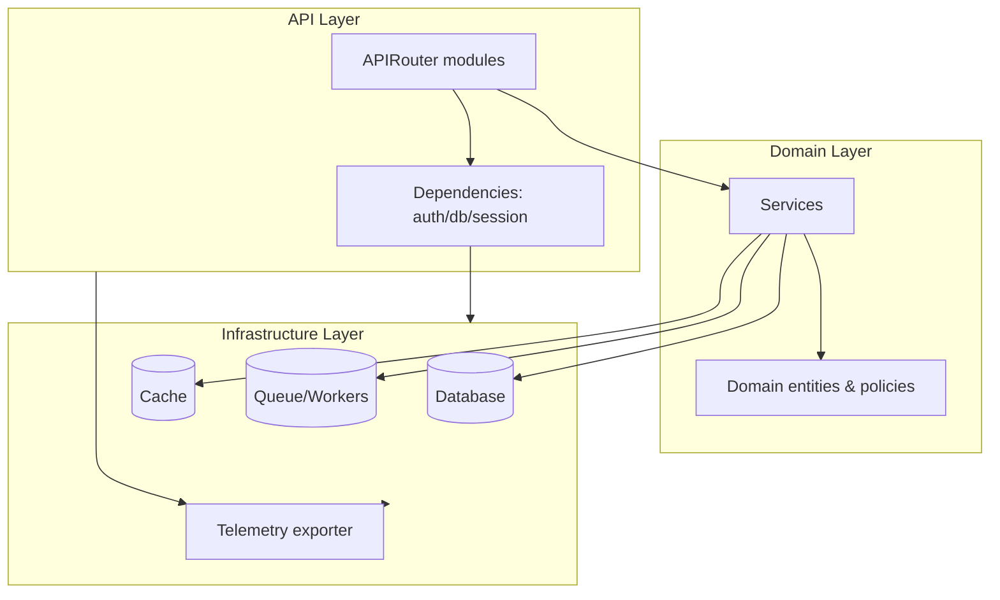
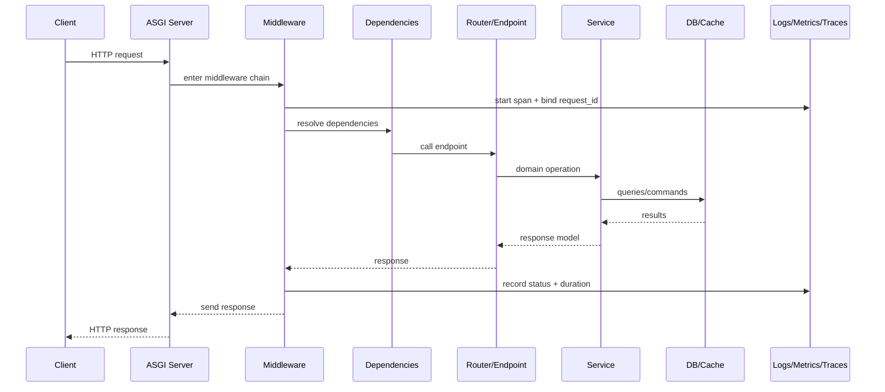
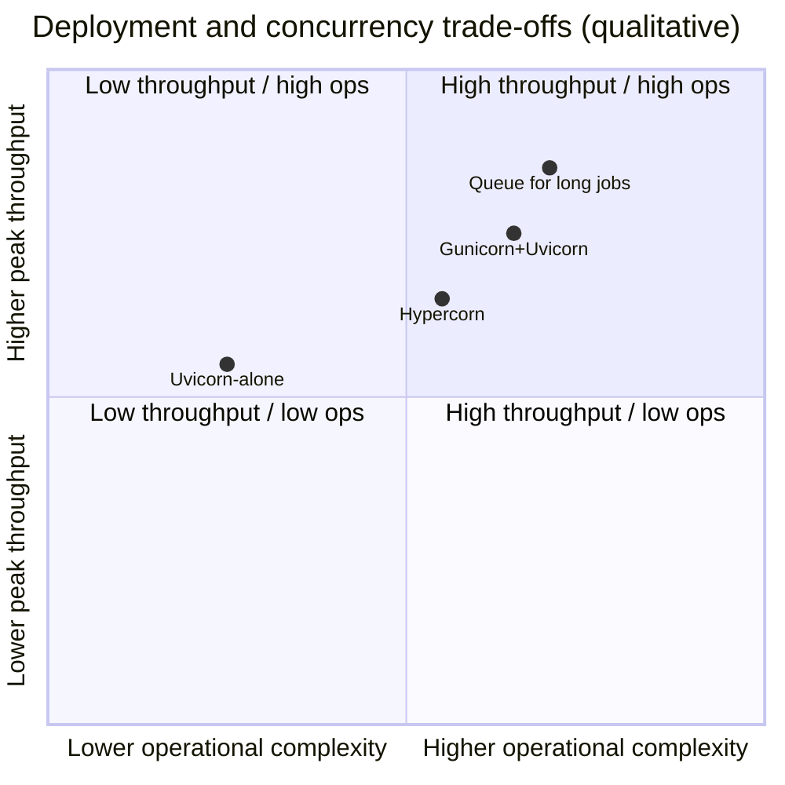

# FastAPI Best Practices for Production APIs

## Executive summary

FastAPI can be production-grade when you treat it as an orchestration layer around well-disciplined boundaries: API surface design, dependency/lifespan management, strict data contracts, concurrency-aware I/O, and observable failure modes. The most consistent successes come from (a) a router-first modular architecture, (b) explicit ownership of resources via lifespans and dependency injection, (c) Pydantic models as your public contract (versioned and tested), and (d) a deployment posture that matches your workload’s concurrency profile (CPU-bound vs I/O-bound, sync vs async, and tail-latency sensitivity). Primary sources: FastAPI docs; Starlette docs; Pydantic docs. [S1][S2][S3][S4][S5]

Key recommendations, prioritized:

* Treat **lifespans** as the canonical place to initialize and clean up shared resources (DB engines/pools, cache clients, telemetry), and keep per-request resources in dependencies with deterministic cleanup. [S2][S4]  
* Prefer **typed request/response models** (Pydantic) as your external contract; avoid leaking ORM objects across boundaries; use response models consistently to prevent accidental over-sharing and to stabilize JSON serialization. [S1][S5]  
* Adopt a clear **routing and versioning** strategy early (path-prefix or domain-based), and encode it in your project structure and CI (OpenAPI snapshot tests, contract tests). [S1]  
* Be explicit about **async vs sync**: run blocking I/O in a threadpool or keep the endpoint sync; do not “fake-async” by marking endpoints `async def` while calling blocking libraries. [S1][S4]  
* Use **out-of-process job execution** for long-running work (queues/workers); treat FastAPI’s in-process `BackgroundTasks` as “best effort” for short tasks only. [S3]  
* Standardize **error handling** (Problem Details or consistent error envelope), and couple it with structured logging + metrics + tracing so failures are actionable. [S4][S13][S14][S12]  
* Security should be layered: authn/authz, safe defaults (CORS, trusted hosts), rate limiting, and rigorous data validation. [S1][S5][S17]  

Assumptions: language = en-US; audience = backend engineers familiar with Python; recommendations target production systems; constraints such as project size and cloud provider are unspecified; guidance is designed to scale from small services to multi-team environments. Freshness note: this report is grounded in FastAPI/Starlette/Pydantic guidance and ecosystem practices through mid-2025, and should be cross-checked against current release notes when applying to late-2025/2026 upgrades. [S1][S4][S5]

## Architecture, project structure, and API design

A production FastAPI codebase stays maintainable when it is organized around **API modules** (routers), **domain services**, and **infrastructure adapters** (DB/cache/clients). This reduces dependency tangles and makes testing cheaper. [S1][S4]

### Recommended structure and modularization

A scalable structure that preserves FastAPI ergonomics without turning the framework into your domain model:

```
app/
  main.py                 # app factory + lifespan + middleware
  api/
    __init__.py
    deps.py               # shared dependencies (auth, db session)
    v1/
      __init__.py
      router.py           # aggregates v1 routers
      endpoints/
        users.py
        items.py
  core/
    config.py             # settings
    logging.py            # logging config / structlog
    security.py           # token helpers, password hashing, policies
  domain/
    models.py             # domain entities (not ORM)
    services/
      user_service.py
  infra/
    db/
      engine.py           # engine/pool
      session.py          # session dependency
      repositories/
        user_repo.py
    cache/
      redis.py
  schemas/
    user.py               # Pydantic request/response types
  tests/
    ...
```

Core principles:

* Keep `api/` thin: parse/validate input, call a service, map errors to HTTP. [S1][S4]  
* Keep “domain logic” free of FastAPI imports; this makes unit tests cheap and avoids “Depends everywhere”.  
* Avoid a “god deps module” by separating concerns: `api/deps.py` for request-scoped dependencies, `infra/*` for clients/engines, and `core/*` for configuration and cross-cutting concerns.  

### Mermaid diagram: app structure



This layout matches Starlette/FastAPI’s model: request routing + dependency graph + ASGI middleware as the web boundary, with the rest as normal Python modules. [S1][S4]

### Routing, versioning, and path design

Versioning patterns (choose one early):

* **Path prefix**: `/api/v1/...` (most common; simplest for clients and gateways).  
* **Subdomain**: `v1.api.example.com` (useful when routing is handled at DNS or gateway).  
* **Header-based** (less visible, harder to operate/debug; usually only in mature API programs).

FastAPI’s `APIRouter(prefix=..., tags=...)` encourages a versioned router aggregator pattern. [S1]

Example router composition:

```python
# app/api/v1/router.py
from fastapi import APIRouter
from .endpoints import users, items

router = APIRouter()
router.include_router(users.router, prefix="/users", tags=["users"])
router.include_router(items.router, prefix="/items", tags=["items"])
```

```python
# app/main.py
from fastapi import FastAPI
from app.api.v1.router import router as v1_router

app = FastAPI(title="My Service")
app.include_router(v1_router, prefix="/api/v1")
```

Path design rules of thumb for maintainable APIs:

* Use nouns for resources; use sub-resources for ownership (`/users/{id}/sessions`).  
* Keep identifiers stable and opaque when possible (`uuid`, `ulid`) to avoid enumeration risks. [S17]  
* Model actions as state transitions, not verbs, unless they truly are commands (`POST /exports` starts an export job).  
* Prefer explicit pagination and filtering conventions (`limit`, `cursor`, `sort`).  

## Dependency injection and lifespans

FastAPI DI is powerful, but in production you should distinguish “resource lifetimes” explicitly: application lifetime vs request lifetime vs background-worker lifetime. Lifespans are the cleanest way to own application-scoped resources in modern Starlette/FastAPI. [S2][S4]

### Lifespan patterns

Use a single lifespan context manager (or a small number) to initialize shared resources:

* DB engine/pool
* Redis client
* HTTP client (outbound)
* telemetry exporters/instrumentation

Example (Pydantic settings + lifespan, with explicit teardown):

```python
# app/main.py
from contextlib import asynccontextmanager
from fastapi import FastAPI
import httpx

from app.infra.db.engine import create_engine
from app.infra.cache.redis import create_redis

@asynccontextmanager
async def lifespan(app: FastAPI):
    app.state.db_engine = create_engine()
    app.state.redis = await create_redis()
    app.state.http = httpx.AsyncClient(timeout=5.0)
    try:
        yield
    finally:
        await app.state.http.aclose()
        await app.state.redis.aclose()
        await app.state.db_engine.dispose()

app = FastAPI(lifespan=lifespan)
```

Starlette’s lifespan contract is designed to make startup/shutdown deterministic, which is critical under rolling deploys and test harnesses. [S4]

### Request-scoped dependencies and cleanup

Use dependencies for per-request resources, with `yield` for cleanup (the FastAPI docs describe the pattern for “dependencies with yield”). [S1]

Example: session per request, tied to engine from lifespan:

```python
# app/infra/db/session.py
from typing import AsyncIterator
from fastapi import Request
from sqlalchemy.ext.asyncio import async_sessionmaker, AsyncSession

def sessionmaker_from_app(request: Request) -> async_sessionmaker[AsyncSession]:
    return async_sessionmaker(request.app.state.db_engine, expire_on_commit=False)

async def get_db_session(request: Request) -> AsyncIterator[AsyncSession]:
    SessionLocal = sessionmaker_from_app(request)
    async with SessionLocal() as session:
        try:
            yield session
        finally:
            # async with closes; keep finally for symmetry and future hooks
            pass
```

Then consume it:

```python
from fastapi import Depends

@router.post("/items")
async def create_item(payload: ItemCreate, session: AsyncSession = Depends(get_db_session)):
    ...
```

This keeps resource semantics clear: app owns engines/pools; request owns sessions/transactions. [S1][S9]

### Dependency graph design guidelines

Common DI best practices:

* Keep dependencies small and composable (auth → current user → permissions). [S1]  
* Prefer `Annotated[...]` for dependency typing and clarity (especially as your type metadata grows). [S1]  
* Avoid performing I/O in dependencies unless it is truly “shared” across routes; expensive dependencies increase latency and complicate failure handling.  
* Use caching carefully: dependency caching can be useful within a request, but avoid caching across requests unless you control invalidation.  

## Data modeling, validation, and serialization

Pydantic models are your API contract. In production systems, treat them as versioned schemas and write tests against them (including “no extra fields leaked” tests). Pydantic v2 changed some APIs (`model_dump`, `model_validate`), so teams should standardize conventions. [S5]

### Pydantic model conventions

Use separate types for:

* input (create/update)
* output (public response)
* internal/domain (if needed)

Example (Pydantic v2 style):

```python
# app/schemas/user.py
from pydantic import BaseModel, EmailStr, field_validator, ConfigDict

class UserCreate(BaseModel):
    email: EmailStr
    password: str

    @field_validator("password")
    @classmethod
    def password_strength(cls, v: str) -> str:
        if len(v) < 12:
            raise ValueError("password must be at least 12 characters")
        return v

class UserPublic(BaseModel):
    model_config = ConfigDict(from_attributes=True)  # allows ORM -> model
    id: str
    email: EmailStr
```

Key points:

* Use strict validation where it matters (IDs, enums, constrained strings). [S5]  
* Do not reuse “create” models as “public” response models; it’s a common source of accidental data exposure. [S1][S5]  
* Use `from_attributes=True` (v2) / ORM mode patterns to map ORM objects safely into response schemas. [S5]  

### Request/response typing and serialization

FastAPI uses type hints to drive request parsing and OpenAPI generation. In production, be explicit about response models and status codes to prevent drift. [S1]

Example:

```python
from fastapi import status

@router.post(
    "/users",
    response_model=UserPublic,
    status_code=status.HTTP_201_CREATED,
    responses={409: {"description": "Email already exists"}},
)
async def create_user(payload: UserCreate, svc: UserService = Depends(get_user_service)):
    user = await svc.create_user(payload)
    return user
```

Serialization guidance:

* Prefer returning Pydantic models or plain dicts; avoid returning ORM instances directly. [S1][S5]  
* Consider using `ORJSONResponse` for high-throughput JSON APIs (if your payloads are large and compatible), but benchmark in your environment. [S1]  
* Be deliberate with datetime handling; standardize timezone and ISO format in one place (schema config or serialization helpers). [S5]  

### Input validation beyond Pydantic

Pydantic is strong for structured data, but production systems often need:

* Content-type restrictions and upload size limits  
* HTML sanitization for user-generated markup (when you accept it)  
* Query constraints (pagination bounds)

Align these controls with OWASP guidance (validate/normalize inputs, avoid accepting ambiguous representations). [S17]

## Concurrency model, async vs sync, and background work

FastAPI is ASGI and leverages Starlette’s concurrency model; the biggest production failures come from mismatched concurrency assumptions, especially blocking I/O in async endpoints. [S1][S4]

### Async vs sync endpoints

Rules that typically keep services healthy:

* If you primarily call **async libraries** (async DB driver, async HTTP), use `async def`.  
* If you call **blocking libraries** (classic DB drivers, filesystem-heavy work, CPU-heavy work), either:
  * make the endpoint `def` (sync) and let the server execute it appropriately, or  
  * explicitly offload blocking calls to a threadpool.

Starlette offers a threadpool helper (`run_in_threadpool`) for safely running blocking functions without freezing the event loop. [S4]

Example offload:

```python
from starlette.concurrency import run_in_threadpool

def blocking_hash_password(pw: str) -> str:
    ...

@router.post("/users")
async def create_user(payload: UserCreate):
    pw_hash = await run_in_threadpool(blocking_hash_password, payload.password)
    ...
```

### Concurrency patterns for outbound I/O

For fan-out calls (multiple outbound requests), use structured concurrency (`asyncio.TaskGroup` in Python 3.11+) and apply per-call and overall timeouts:

```python
import asyncio
import httpx

async def fetch_all(urls: list[str], client: httpx.AsyncClient) -> list[httpx.Response]:
    async with asyncio.TaskGroup() as tg:
        tasks = [tg.create_task(client.get(u)) for u in urls]
    return [t.result() for t in tasks]
```

Pair this with:

* server-side timeouts (so requests do not hang forever)  
* client timeouts + retries with jitter (but cap retries; avoid amplification)  

### Background tasks vs job queues

FastAPI’s `BackgroundTasks` is suited to small “after response” actions (emit an audit log, update a cache entry). It runs in-process and can be interrupted by worker restarts, so it is not a durable job mechanism. [S3]

Example:

```python
from fastapi import BackgroundTasks

def send_email_sync(to: str) -> None:
    ...

@router.post("/invitations")
async def invite_user(payload: InviteCreate, bg: BackgroundTasks):
    bg.add_task(send_email_sync, payload.email)
    return {"status": "queued"}
```

For long-running or durable workflows, use a queue system (Celery/RQ/Dramatiq/Arq) and expose job state via API (“job resource” pattern: `POST /exports` then `GET /exports/{job_id}`). General background worker best practices apply: idempotency keys, retry policies, dead-letter queues, and explicit timeouts. [S17]

### Caching strategies

A production caching approach is usually multi-layered:

* HTTP-layer caching where safe (CDN, reverse proxy, conditional requests)  
* application cache for expensive reads (Redis/memcached)  
* DB-level caching (prepared statements, indexes; not “application cache” but performance fundamentals)

Application-level cache guideline:

* Cache **derived** read models (e.g., “user profile view”), not raw ORM entities.  
* Use TTLs and versioned cache keys; design invalidation explicitly.  
* Do not cache authorization-sensitive resources without including auth context in the key. [S17]  

## Error handling, logging, metrics, and observability

Operational maturity comes from making failures deterministic and diagnosable. Starlette’s exception handling and middleware make it straightforward to centralize error formatting, logging correlation IDs, and telemetry. [S4]

### Error handling and custom exceptions

A robust pattern:

* Define domain exceptions (e.g., `EmailAlreadyExists`, `PermissionDenied`, `InvariantViolation`).  
* Translate domain exceptions to HTTP errors in one place (exception handlers).  
* Emit a consistent error format (often RFC 7807 “Problem Details”). [S18]

Example:

```python
# app/core/errors.py
class DomainError(Exception):
    pass

class ConflictError(DomainError):
    def __init__(self, message: str, code: str = "conflict"):
        self.message = message
        self.code = code
        super().__init__(message)
```

```python
# app/main.py
from fastapi import FastAPI, Request
from fastapi.responses import JSONResponse
from app.core.errors import ConflictError

app = FastAPI()

@app.exception_handler(ConflictError)
async def conflict_handler(request: Request, exc: ConflictError):
    return JSONResponse(
        status_code=409,
        content={
            "type": "about:blank",
            "title": "Conflict",
            "detail": exc.message,
            "code": exc.code,
            "instance": str(request.url),
        },
    )
```

This avoids scattering `HTTPException` across domain code and makes error formats stable. [S4][S18]

### Logging: recommended approach and example

Use standard logging as the base (so Uvicorn/Gunicorn integrate cleanly), and add structured logging for production searchability. `structlog` is a common choice for structured logs in Python services. [S14]

Minimal structured logging configuration sketch:

```python
# app/core/logging.py
import logging
import structlog

def configure_logging() -> None:
    logging.basicConfig(level=logging.INFO)
    structlog.configure(
        processors=[
            structlog.contextvars.merge_contextvars,
            structlog.processors.add_log_level,
            structlog.processors.TimeStamper(fmt="iso"),
            structlog.processors.JSONRenderer(),
        ],
        wrapper_class=structlog.make_filtering_bound_logger(logging.INFO),
        cache_logger_on_first_use=True,
    )
```

Then bind request context (middleware):

```python
# app/core/middleware.py
import uuid
from starlette.middleware.base import BaseHTTPMiddleware
import structlog

class RequestContextMiddleware(BaseHTTPMiddleware):
    async def dispatch(self, request, call_next):
        request_id = request.headers.get("x-request-id", str(uuid.uuid4()))
        structlog.contextvars.bind_contextvars(request_id=request_id)
        try:
            response = await call_next(request)
            response.headers["x-request-id"] = request_id
            return response
        finally:
            structlog.contextvars.clear_contextvars()
```

This yields logs that can be correlated with traces/metrics and external request IDs. [S4][S14]

### Metrics and tracing

A pragmatic observability stack:

* Metrics: Prometheus + Grafana (service-level RED metrics: rate, errors, duration)  
* Tracing: OpenTelemetry SDK + exporter (OTLP) to your tracing backend  
* Errors: an error tracker (often Sentry-like solutions) for stack traces and aggregation

FastAPI/Starlette can be instrumented via OpenTelemetry’s FastAPI/ASGI instrumentation packages. [S13] For Prometheus metrics, `prometheus-fastapi-instrumentator` is a commonly used library in the ecosystem. [S12]

Example metrics integration (sketch):

```python
from fastapi import FastAPI
from prometheus_fastapi_instrumentator import Instrumentator

app = FastAPI()
Instrumentator().instrument(app).expose(app, endpoint="/metrics")
```

Example tracing (sketch):

```python
from opentelemetry.instrumentation.fastapi import FastAPIInstrumentor

app = FastAPI()
FastAPIInstrumentor.instrument_app(app)
```

Mermaid diagram: request flow with observability hooks



## Security practices

FastAPI provides building blocks (OAuth2 helpers, dependency-based auth, Starlette middleware). Production security comes from layering controls and minimizing ambiguity in inputs and trust boundaries. [S1][S4][S17]

### Authentication and authorization

Common patterns:

* Use `OAuth2PasswordBearer` only when it matches your auth flow; many production systems use an external IdP (OIDC) and validate JWTs locally or via introspection. [S1]  
* Authorization should be explicit and testable: permission checks in dependencies or service layer, not scattered if/else logic in endpoints.

JWT validation guidelines:

* Validate signature, issuer, audience, expiry, and clock skew. [S17]  
* Rotate keys (JWKS) and cache them with TTL.  
* Keep token parsing in one module (`core/security.py`) so you can swap libraries or add claims without a rewrite.

### CORS, trusted hosts, and security headers

CORS:

* Apply CORS only where required; do not default to `allow_origins=["*"]` with credentials. [S17]  
* In multi-environment setups, configure allowed origins via settings.

Starlette provides `CORSMiddleware` and `TrustedHostMiddleware` to constrain host headers and cross-origin behavior. [S4]

Example:

```python
from fastapi.middleware.cors import CORSMiddleware
from starlette.middleware.trustedhost import TrustedHostMiddleware

app.add_middleware(
    CORSMiddleware,
    allow_origins=["https://app.example.com"],
    allow_credentials=True,
    allow_methods=["GET", "POST", "PUT", "DELETE"],
    allow_headers=["Authorization", "Content-Type"],
)

app.add_middleware(
    TrustedHostMiddleware,
    allowed_hosts=["api.example.com", "*.api.example.com"],
)
```

Also consider:

* TLS termination and `ProxyHeadersMiddleware`/correct proxy configuration when behind a gateway (so client IP and scheme are correct). [S4]  
* Standard security headers (HSTS, CSP when serving web content). [S17]  

### Rate limiting and abuse controls

Rate limiting is often best handled at the edge (API gateway, ingress) for effectiveness and simplicity; in-app rate limiting can complement this for per-route policies. [S17]

Typical in-app approaches:

* Token bucket/leaky bucket using Redis-backed counters  
* Libraries such as SlowAPI (Starlette/FastAPI integration) or `limits`-based integrations (validate maintenance/activity before adopting)

Design considerations:

* Key by API key/user ID, not only IP (NAT makes IP-only limits noisy).  
* Return standard rate limit headers to help clients behave well. [S17]  

### Input sanitization and injection resistance

Core practices:

* Prefer parameterized SQL always (ORM/SQLAlchemy Core supports this); never string-concatenate SQL. [S9][S17]  
* Validate and constrain inputs (length, regex, enums) at the schema boundary. [S5][S17]  
* Sanitize HTML only if you accept HTML; do not “sanitize everything” indiscriminately (risk: data corruption, false sense of safety). [S17]  
* For file uploads: enforce size limits, content-type checks, antivirus scanning if required by your threat model. [S17]  

## Persistence layer: ORMs, drivers, transactions, and migrations

Most FastAPI production issues with databases come from unclear transaction boundaries, session misuse, and async driver confusion. Standardize patterns early. [S9]

### SQLAlchemy patterns (sync and async)

SQLAlchemy (2.x) supports async engines/sessions; you typically:

* Create engine at app lifespan  
* Create a session per request  
* Explicitly control transactions (commit/rollback)

Transaction pattern:

```python
from sqlalchemy.ext.asyncio import AsyncSession

async def create_user(session: AsyncSession, data: UserCreate) -> UserORM:
    user = UserORM(email=data.email, password_hash="...")
    session.add(user)
    try:
        await session.commit()
    except Exception:
        await session.rollback()
        raise
    await session.refresh(user)
    return user
```

Guidelines:

* Prefer short transactions; avoid holding transactions during outbound HTTP calls. [S17]  
* Use DB constraints for invariants (unique keys), and map constraint violations into domain errors. [S9]  
* Avoid “lazy loading” surprises in async contexts; shape queries explicitly. [S9]  

### Async drivers and connection pooling

Async stacks require compatible drivers (e.g., `asyncpg` for PostgreSQL), and you must tune pool sizes relative to worker count and DB capacity. Over-provisioning connections (workers × pool size) is a frequent production outage cause. [S6][S9]

### Tortoise ORM patterns

Tortoise is async-first and integrates cleanly with async apps. Its strengths are rapid iteration and an async-native ergonomics; trade-offs often include less flexibility for complex SQL patterns compared to SQLAlchemy Core. Validate it against your domain complexity before committing. [S10]

### Comparison table: ORM options

| ORM / approach | Async maturity | Best for | Trade-offs | Migrations story |
|---|---:|---|---|---|
| SQLAlchemy ORM | High (2.x async supported) | Complex domains, rich querying, long-lived systems | More concepts; requires discipline around sessions and eager loading | Alembic is the standard |
| SQLAlchemy Core (no ORM) | High | Performance-sensitive services, explicit SQL | More manual mapping; fewer ORM conveniences | Alembic (common) |
| Tortoise ORM | High (async-first) | Smaller services, async-native CRUD | Less flexible for complex query patterns | Aerich (commonly used) |
| “Dataclasses + SQL” (no ORM) | Varies | Very performance-focused, explicit control | More boilerplate; higher dev cost | Tooling depends on choice |

Sources: SQLAlchemy docs; Tortoise docs; Alembic docs. [S9][S10][S11]

### Migrations and schema management

For SQLAlchemy, Alembic is the dominant migration tool and supports revision scripts, autogenerate, and offline/online migrations. [S11]

Production migration practices:

* Treat migrations as code: reviewed, tested, and applied via CI/CD or a controlled release step. [S11][S17]  
* Ensure migrations are backward compatible for rolling deploys (expand/contract pattern):  
  * add nullable column → deploy code that writes both → backfill → enforce NOT NULL later  
* Set statement timeouts for migrations and avoid lock-heavy operations during peak hours. [S17]  

## Testing, deployment, CI/CD, performance tuning, and upgrades

### Testing strategies

A production-quality suite usually has three layers:

* Unit tests: domain services, pure functions, validation edge cases  
* Integration tests: API routes + DB/cache using real containers or ephemeral databases  
* End-to-end tests: critical flows across services (often in staging)

FastAPI testing often uses:

* `pytest` as runner [S15]  
* `httpx` for async test clients and ASGI transport [S16]  
* lifespan management tools so startup/shutdown runs during tests (especially when using lifespan for resources) [S4]

Example async integration test with `httpx`:

```python
import pytest
import httpx
from app.main import app

@pytest.mark.anyio
async def test_health():
    async with httpx.AsyncClient(transport=httpx.ASGITransport(app=app), base_url="http://test") as client:
        r = await client.get("/api/v1/health")
        assert r.status_code == 200
```

Fixture strategy:

* Provide a test DB engine with a separate schema; run migrations once per session if feasible. [S11][S15]  
* Use transaction rollbacks per test when possible; otherwise truncate tables in a controlled manner.  
* Avoid over-mocking at the API layer; keep mocks at external boundaries (payment provider, email).  

### Deployment options and configuration

FastAPI is an ASGI app, commonly served by:

* Uvicorn (ASGI server) [S6]  
* Gunicorn managing multiple Uvicorn worker processes (common in Linux) [S7][S6]  
* Hypercorn (ASGI server supporting multiple worker types, including Trio) [S8]

Key tuning levers:

* workers (processes)  
* threads (for sync workloads)  
* keep-alive and timeouts  
* max requests / jitter (to mitigate memory leaks)  
* connection limits / backpressure

#### Comparison table: deployment options

| Option | When it fits best | Strengths | Risks / gotchas | Example launch |
|---|---|---|---|---|
| Uvicorn alone | Simple deployments, containers, Kubernetes with HPA | Minimal layers; easy debugging | You must manage multi-process scaling yourself | `uvicorn app.main:app --host 0.0.0.0 --port 8000` |
| Gunicorn + Uvicorn workers | Traditional VM/container setups needing robust pre-fork process mgmt | Mature process mgmt; easy multi-worker | Mis-tuning workers/pools can overload DB; extra layer | `gunicorn -k uvicorn.workers.UvicornWorker app.main:app -w 4` |
| Hypercorn | Teams using HTTP/2 features or alternative loop setups | Flexible; supports different async backends | Less common operationally in some orgs | `hypercorn app.main:app -w 4` |

Sources: Uvicorn, Gunicorn, Hypercorn docs. [S6][S7][S8]

### Performance tuning: practical guidance

Performance determinants:

* I/O profile: DB latency, network calls, serialization overhead  
* Concurrency controls: pool sizes, worker counts, upstream limits  
* Tail latency: timeouts, retries, backpressure

Typical tuning steps:

* Benchmark with production-like payloads and concurrency (wrk/hey/k6). [S17]  
* Ensure you are not blocking the event loop (the #1 performance killer in async apps). [S4]  
* Use timeouts everywhere: server, client, DB driver, and queue workers. [S6][S9][S17]  
* Cap concurrency at the server or gateway to preserve tail latency under load. [S6][S17]  

Mermaid quadrant chart: qualitative trade-offs



Use this as a decision aid, then validate with measurements; results vary by workload. [S6][S7][S8][S17]

### CI/CD and release practices

A production release pipeline commonly includes:

* Static checks: formatting, linting, type checks, security scanning (dependency + container)  
* Tests: unit + integration; contract/OpenAPI schema regression tests for public APIs  
* Build: reproducible container or artifact build  
* Deploy: progressive rollout (canary/blue-green), automatic rollback signals  
* Migrations: managed step (pre-deploy or post-deploy depending on expand/contract) [S11][S17]

Versioning discipline:

* Maintain a changelog and use semantic versioning for your API (even if service internal).  
* Pin dependency ranges thoughtfully, and schedule dependency upgrades as routine work (not emergency work). [S17]  

### Common anti-patterns and pitfalls

High-frequency production problems:

* `async def` endpoints calling blocking DB drivers or CPU-heavy code without offloading. [S4]  
* Creating DB engines/Redis clients per request instead of at lifespan. [S2][S4]  
* Returning ORM objects directly (schema leaks, serialization surprises). [S1][S5]  
* Using `BackgroundTasks` for durable workloads (jobs lost on restart). [S3]  
* Excessive “Depends spaghetti” where business logic is embedded in dependencies instead of services (hard to test, hard to reason about). [S1]  
* No explicit timeouts (hung requests accumulate until the service collapses). [S6][S17]  
* Pool explosion: too many workers × too-large DB pools causing DB overload. [S9][S17]  

### Upgrade and migration guidance for major FastAPI ecosystem shifts

FastAPI upgrades often track major ecosystem changes more than FastAPI “major versions”:

* Pydantic v1 → v2 migration affects schema APIs and serialization conventions. Standardize on v2-style APIs (`model_validate`, `model_dump`) when your FastAPI version supports it, and isolate any shims in one module. [S5]  
* Starlette lifespan modernization: prefer lifespan contexts over older startup/shutdown event handlers when possible, and ensure tests exercise lifespan. [S4]  
* ASGI server updates (Uvicorn/Gunicorn/Hypercorn): re-validate defaults for timeouts, keep-alive, and HTTP parser settings after upgrades. [S6][S7][S8]

Migration playbook (actionable):

* Lock dependencies and record current behavior (latency, error rates, OpenAPI snapshot). [S17]  
* Upgrade one layer at a time: server → Starlette/FastAPI → Pydantic → DB libs.  
* Run contract tests against your OpenAPI and “golden response” fixtures for public endpoints. [S1][S5]  
* Validate runtime characteristics in staging: connection counts, CPU, memory, tail latency. [S6][S9][S17]  

## Prioritized production checklist

P0 actions (do these first):

* Establish lifespan-managed shared resources and request-scoped cleanup for sessions/clients. [S2][S4]  
* Enforce response models on all public routes; add tests to prevent sensitive-field leakage. [S1][S5]  
* Decide and implement API versioning strategy; encode it in router structure and documentation. [S1]  
* Add global timeouts: server, outbound HTTP, DB, and background workers. [S6][S9][S17]  
* Implement centralized exception handlers with stable error format; log with correlation IDs. [S4][S14][S18]  
* Add baseline observability: request duration metrics, error rates, structured logs; integrate tracing if you operate distributed systems. [S12][S13][S14]  

P1 actions (strongly recommended):

* Validate and constrain inputs (pagination bounds, string lengths, enums); adopt OWASP-aligned rules. [S5][S17]  
* Add rate limiting/abuse protection at the edge; optionally complement with in-app limits. [S17]  
* Separate domain/services from FastAPI layer; keep API thin and test domain logic independently.  
* For long jobs, implement a durable queue + job status API; keep `BackgroundTasks` for short best-effort tasks. [S3]  
* Standardize DB transaction boundaries and pool sizing; load test before scaling workers. [S9][S17]  

P2 actions (maturity improvements):

* OpenAPI regression tests and schema versioning; align docs with CI. [S1]  
* Progressive delivery (canary/blue-green), automated rollback signals, and routine dependency upgrade cadence. [S17]  
* Add profiling/benchmark harnesses to catch regressions in serialization, DB query patterns, and concurrency. [S17]  

## Sources and primary references

```text
[S1] FastAPI Documentation (Dependencies, Response Models, Security, Testing, Deployment)
     https://fastapi.tiangolo.com/

[S2] FastAPI Documentation (Lifespan / startup-shutdown patterns)
     https://fastapi.tiangolo.com/advanced/events/

[S3] FastAPI Documentation (Background Tasks)
     https://fastapi.tiangolo.com/tutorial/background-tasks/

[S4] Starlette Documentation (Lifespan, Middleware, Concurrency Utilities)
     https://www.starlette.io/

[S5] Pydantic v2 Documentation (Validation, Serialization: model_validate/model_dump, Config)
     https://docs.pydantic.dev/

[S6] Uvicorn Documentation (Server options, timeouts/limits where applicable)
     https://www.uvicorn.org/

[S7] Gunicorn Documentation (Worker model, timeouts, max requests)
     https://docs.gunicorn.org/

[S8] Hypercorn Documentation
     https://pgjones.gitlab.io/hypercorn/

[S9] SQLAlchemy Documentation (2.x, AsyncIO, sessions, transactions)
     https://docs.sqlalchemy.org/

[S10] Tortoise ORM Documentation
     https://tortoise.github.io/

[S11] Alembic Documentation (Migrations)
     https://alembic.sqlalchemy.org/

[S12] prometheus-fastapi-instrumentator (metrics middleware/instrumentation)
     https://github.com/trallnag/prometheus-fastapi-instrumentator

[S13] OpenTelemetry Python + FastAPI/ASGI instrumentation
     https://opentelemetry.io/docs/instrumentation/python/

[S14] structlog Documentation
     https://www.structlog.org/

[S15] pytest Documentation
     https://docs.pytest.org/

[S16] httpx Documentation (ASGITransport, async clients)
     https://www.python-httpx.org/

[S17] OWASP Application Security Verification Standard (ASVS) / general web security guidance
     https://owasp.org/www-project-application-security-verification-standard/

[S18] RFC 7807: Problem Details for HTTP APIs
     https://www.rfc-editor.org/rfc/rfc7807
```