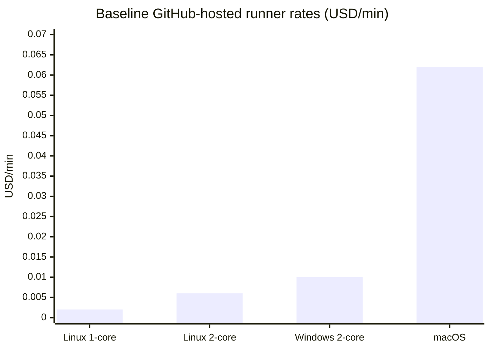
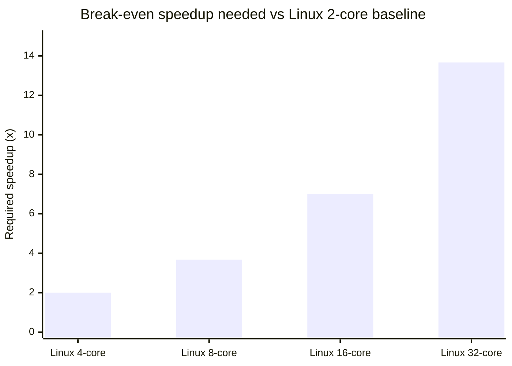
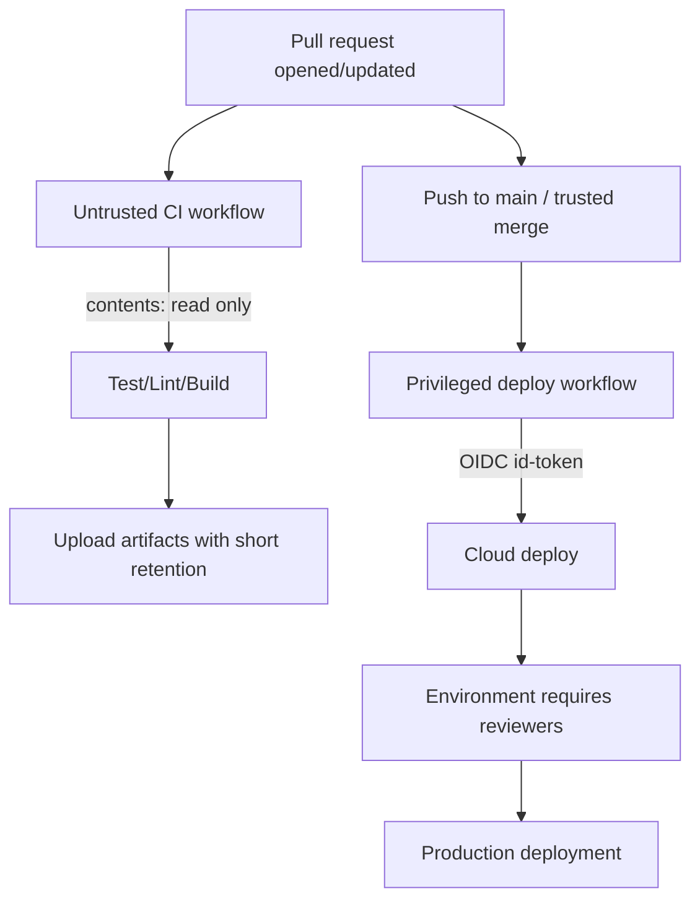

# GitHub Actions Best Practices in 2026

## Executive summary

This report synthesizes current (accessed February 17, 2026) best practices for designing, securing, operating, and governing GitHub Actions workflows—without assuming constraints beyond GitHub Actions itself. The most impactful recommendations cluster into three themes: sharply reducing credential blast radius, eliminating avoidable compute waste, and enforcing organization-wide policy for workflow safety and consistency. citeturn7view1turn3search0turn9search0turn14view0turn6search3

Key unspecified details (and why they matter): you did not specify whether repositories are public/private, which GitHub plan you use, whether you rely on self-hosted runners, or which ecosystems you build (Node/Java/.NET/etc.). Those factors change feature availability (for example, some environment protection rules depend on plan/repo visibility) and strongly influence security posture, performance tactics, and cost. citeturn16search6turn7view1turn9search3

High-priority findings (in order of risk reduction and ROI):

Security
- Set the default `GITHUB_TOKEN` permission model to least privilege (restricted by default) and explicitly grant only what each job needs via `permissions:`. citeturn0search1turn19search1turn19search10  
- Avoid privileged triggers (`pull_request_target`, `workflow_run`) that check out or execute untrusted PR code; this remains a top “pwn request” class failure mode. citeturn5search0turn9search2turn5search24  
- Prefer OIDC (`id-token: write`) over long-lived cloud secrets; constrain OIDC subject claims/conditions to prevent token minting from untrusted contexts. citeturn0search6turn4search6turn0search2  
- Pin third-party actions to full-length commit SHAs; as of 2025–2026, GitHub added policy controls to enforce SHA pinning and allow/deny lists (now available across all plan types per GitHub changelog). citeturn3search0turn9search0turn14view0turn9search20  
- Treat dependency changes as a first-class security gate: use dependency review (and scale it with rulesets/required workflows where available), plus Dependabot. citeturn2search7turn2search36turn5search17turn5search5  

Performance and cost
- Use caching intentionally (and conservatively): default cache limits and retention have become more configurable (with paid expansion beyond the default), but cache explosion and low-hit caches can create both slowness and waste. citeturn10search18turn7view1turn6search0turn15view0  
- Aggressively cancel redundant CI runs with `concurrency` for PR iteration, and cap matrix parallelism when it causes queueing or resource contention. citeturn17search0turn3search2turn6search29  
- Prefer Linux runners when feasible: baseline per-minute costs differ by OS by an order of magnitude (macOS remains the most expensive). citeturn7view0turn7view2  

Maintainability, reliability, observability, governance
- Centralize common pipelines with reusable workflows (`workflow_call`) and/or composite actions; document inputs/secrets and pin versions. citeturn2search1turn2search2turn3search0turn16search21  
- Implement reliability patterns (idempotency + controlled retries with backoff + deterministic artifact naming/retention) because GitHub Actions does not provide a universal built-in retry semantic for arbitrary steps. Artifact action versions have evolved quickly; keep them current to avoid deprecations and to improve speed. citeturn15view1turn13search15turn1search5  
- Use structured logging (workflow commands, grouping, annotations) and job summaries for operator-grade feedback; complement with API-driven metrics/log export if you need enterprise observability. citeturn2search0turn3search7turn16search0  
- Move governance “left” into platform rules: rulesets (including required reviewers, now GA per GitHub changelog on February 17, 2026) plus required workflows and environment-based approvals for deployments. citeturn6search3turn6search7turn16search2turn3search5  

Prioritized action checklist by organization size:

Small orgs (startups, small teams)
- Enforce least-privilege `GITHUB_TOKEN` defaults; set `permissions:` explicitly in every workflow (baseline: `contents: read`). citeturn0search1turn19search10turn3search0  
- Enable OIDC for cloud deployments; remove long-lived cloud secrets where possible. citeturn0search6turn4search6turn0search2  
- Enable Dependabot updates for GitHub Actions plus dependency review in PRs; make these required checks on protected branches. citeturn5search17turn2search7turn2search3  
- Add `concurrency` cancellation for PR workflows and cache only what measurably saves time. citeturn17search0turn6search0turn10search18  
- Shorten artifact retention for large build outputs and keep only what you actually need for debugging/release. citeturn1search5turn1search9  

Medium orgs (multiple teams/repos)
- Adopt allowed-actions policy (allowlist + SHA pinning) and standardize on reusable workflows for CI and deployments. citeturn14view0turn9search0turn2search1  
- Standardize self-hosted runner hygiene (or minimize their use): isolate runner groups, prefer ephemeral runners, and ensure runner versions stay above enforcement minimums. citeturn9search31turn14view1turn9search3  
- Introduce environment protection rules (required reviewers / wait timers where available) for production deployments. citeturn16search2turn3search5turn16search6  
- Add cost controls: reduce macOS usage, cap matrix parallelism, and track minutes/storage via billing views/APIs. citeturn7view1turn7view0turn6search6  

Large orgs (enterprise-scale)
- Use rulesets/required workflows (and required reviewer rules) to enforce CI/CD policy and security scanning at scale, including dependency review. citeturn6search27turn6search7turn6search3turn2search36  
- Establish an “actions supply chain” program: allowlist+SHA pinning, dependency update automation, and workflow security scanning (CodeQL for workflows). citeturn9search0turn5search15turn5search17  
- Implement centralized runner autoscaling and telemetry (scale set APIs / runner scale set client or Kubernetes-based controller) plus consistent logging/metrics egress. citeturn14view0turn16search0turn16search8  
- Formalize SDLC controls: merge queue + `merge_group` workflows for protected branches and consistent “merge-time” validation. citeturn16search3turn8search2turn8search8  

## Methodology

Source prioritization and approach:
- Primary sources: official GitHub documentation for Actions, security hardening, billing/pricing, rulesets, environments, APIs, and supply-chain features. citeturn3search0turn7view1turn7view0turn6search7turn16search2turn6search6  
- Change tracking: GitHub Changelog entries and release notes for recent platform shifts, notably around Actions security controls, runner lifecycle and minimum versions, caching policies, and repository rules/rulesets. citeturn14view0turn14view1turn10search18turn6search3turn13search16  
- Major community/industry guidance: GitHub Security Lab writeups on “pwn requests,” plus reputable security analysis from major security vendors used as triangulation (not as sole authority). citeturn9search2turn5search12turn5search24  
- Representative high-profile open-source repository patterns: inspected public workflows (example: `rust-lang/rust`), focusing on concurrency, permissions, environment gating, artifact retention, and external metrics export. citeturn18view0turn17search0turn2search0  

All sources were accessed on February 17, 2026 (America/Los_Angeles).

## Security

### Secrets management and credential minimization

Prefer short-lived, auditable credentials over static secrets:
- Use GitHub’s OIDC integration to request short-lived tokens from your cloud provider instead of storing long-lived cloud keys in GitHub secrets. This is explicitly positioned as a way to avoid storing long-lived credentials. citeturn4search13turn0search2turn0search6  
- OIDC requires requesting an ID token via `permissions: id-token: write`. Apply this only to jobs that genuinely need cloud access. citeturn4search6turn4search17  

When you must use secrets:
- Use GitHub Actions secrets at the appropriate scope (repository, environment, organization). citeturn9search1turn3search1  
- Prevent accidental leakage in logs by masking values before output (`add-mask`) and by avoiding echoing secrets or structured objects that may contain secrets. citeturn2search0turn3search3  
- Apply push protection and secret scanning to reduce the chance secrets enter the repository at all; push protection blocks pushes containing supported secrets. citeturn5search2turn5search10turn5search22  

Recommended pattern: OIDC instead of long-lived cloud secrets
```yaml
name: deploy
on:
  push:
    branches: [main]

permissions:
  contents: read
  id-token: write

jobs:
  deploy:
    runs-on: ubuntu-latest
    steps:
      - uses: actions/checkout@v6
      - name: Configure cloud credentials via OIDC
        uses: aws-actions/configure-aws-credentials@<PINNED_SHA>
        with:
          role-to-assume: arn:aws:iam::123456789012:role/gha-deploy
          aws-region: us-west-2
      - name: Deploy
        run: ./scripts/deploy.sh
```
Why this matters: the `id-token: write` permission is required to request the OIDC JWT, and GitHub recommends OIDC to avoid long-lived cloud secrets. citeturn4search6turn4search17turn4search13turn0search2  

Trade-off: OIDC requires careful cloud-side policy constraints (issuer/subject/claims) and disciplined job scoping. The security gain is large, but the misconfiguration risk is real; treat OIDC subject/claims constraints as part of your threat model. citeturn0search2turn4search13turn6search6  

### Least privilege for `GITHUB_TOKEN` and job permissions

Understand what `GITHUB_TOKEN` is and why it must be constrained:
- GitHub creates a unique `GITHUB_TOKEN` for each job, and it is a GitHub App installation access token scoped to the repository. citeturn19search5turn4search25  
- GitHub explicitly recommends granting minimum required permissions (least privilege) and setting repository defaults to a read-only baseline, then elevating per-job only when needed. citeturn0search0turn0search1turn19search1  

Use explicit permissions in YAML (and avoid ambient privilege):
- GitHub’s workflow syntax defines granular permission keys (for example, `contents`, `pull-requests`, `security-events`, `id-token`) with `read|write|none` semantics. If you specify any permissions, unspecified ones become `none`, which is a powerful safety feature. citeturn19search10turn19search1  
- Some sensitive alert domains (Dependabot alerts, secret scanning alerts) are not readable via `security-events` and require a GitHub App or PAT for certain operations—another reason to model tokens explicitly. citeturn19search10turn4search20turn4search4  

Recommended pattern: default deny, then elevate per job
```yaml
name: ci
on:
  pull_request:

permissions:
  contents: read

jobs:
  test:
    runs-on: ubuntu-latest
    steps:
      - uses: actions/checkout@v6
      - run: ./scripts/test.sh

  report:
    needs: [test]
    runs-on: ubuntu-latest
    permissions:
      pull-requests: write
    steps:
      - name: Post PR comment
        uses: actions/github-script@v7
        with:
          script: |
            // post a comment with results
```
This aligns with GitHub’s guidance to grant minimal permissions and elevate only for jobs that must write to PRs. citeturn19search1turn19search10turn0search0  

Anti-pattern: workflow-wide write-all
```yaml
permissions: write-all
```
This defeats least privilege and increases the blast radius if any dependency/action is compromised. GitHub’s docs provide fine-grained permissions specifically to avoid broad grants. citeturn19search10turn0search0turn5search12  

### Supply-chain security: pinning actions, allowlists, and dependency scanning

Action pinning and allowlisting:
- GitHub documents that pinning an action to a full-length commit SHA is the only immutable way to reference an action release, and it mitigates tag-move/supply-chain compromise risk. citeturn3search0turn3search4  
- GitHub introduced policy controls to enforce SHA pinning and block/allow specific actions; enterprise policy docs now include an explicit “Require actions to be pinned to a full-length commit SHA” option. citeturn9search0turn9search20  
- As of early February 2026 (per GitHub Changelog), allowlisting is available across all plans, not only enterprise tiers. citeturn14view0  

Recommended pattern: pin third-party actions to SHAs, keep official actions current
```yaml
- uses: actions/checkout@v6
- uses: actions/cache@v5
- uses: some-org/some-action@3b2e3c4d5e6f7a8b9c0d... # full-length SHA
```
This pattern matches GitHub’s secure-use guidance and supports centralized policy enforcement to reduce supply-chain blast radius. citeturn3search0turn9search0turn9search20  

Trade-off: SHA pinning increases maintenance burden unless you automate updates. GitHub explicitly supports updating Actions with Dependabot, including a configuration to monitor the `github-actions` ecosystem in `.github/dependabot.yml`. citeturn5search17turn5search1turn5search21  

Dependency scanning in PRs:
- The dependency review action can fail PRs that introduce vulnerable dependencies, and GitHub documents scaling this via repository rulesets/required workflows for organizations. citeturn2search7turn2search36turn2search3  
- Code scanning with CodeQL can analyze GitHub Actions workflows for security issues; GitHub announced this capability as generally available (workflow security analysis with CodeQL). citeturn5search15turn5search24  

Recommended pattern: dependency review on PRs
```yaml
name: dependency-review
on:
  pull_request:

permissions:
  contents: read

jobs:
  review:
    runs-on: ubuntu-latest
    steps:
      - uses: actions/checkout@v6
      - name: Dependency Review
        uses: actions/dependency-review-action@v4
```
This follows GitHub’s dependency review guidance (and can be enforced org-wide with rulesets where available). citeturn2search7turn2search3turn2search36  

### High-risk triggers and untrusted code execution

The highest-impact anti-pattern remains: privileged triggers + untrusted checkout/execution.
- GitHub explicitly warns that `pull_request_target` and `workflow_run` used with untrusted code checkout can expose secrets, write permissions, and privileged caches, enabling repository compromise. citeturn5search0turn9search2turn5search24  

Anti-pattern: `pull_request_target` with checkout of PR head
```yaml
on:
  pull_request_target:

jobs:
  dangerous:
    runs-on: ubuntu-latest
    steps:
      - uses: actions/checkout@v6
        with:
          ref: ${{ github.event.pull_request.head.sha }}
      - run: ./scripts/from-pr.sh
```
This directly violates GitHub’s documented risk model for privileged triggers, because it executes attacker-controlled code with elevated context. citeturn5search0turn9search2turn5search24  

Safer pattern: separate “untrusted” CI from “trusted” automation
- Use `pull_request` for untrusted code testing (no secrets). Reserve `pull_request_target` only for safe metadata operations (labels/comments) that do not check out PR code. GitHub Security Lab explicitly advises using `pull_request` when secrets/write perms are not needed. citeturn9search2turn5search0turn5search20  

## Performance and cost optimization

### Runner selection and cost model

Runner types and their cost/security implications:
- GitHub-hosted runners are generally ephemeral; GitHub notes that (except for single-CPU runners) each is a new VM hosted by GitHub. citeturn1search6  
- Larger runners are GitHub-hosted with different sizes/OS options and are billed per minute separately; included minutes generally do not apply to larger runners. citeturn1search2turn7view0  
- Self-hosted runner usage is free (per current billing docs), but carries materially different security assumptions, especially for public repos; GitHub recommends using self-hosted runners only with private repositories because public forks can execute dangerous code on your infrastructure. citeturn7view1turn9search3turn9search31  

Baseline GitHub-hosted runner rates (USD/min) for private repos (pricing is subject to change; see GitHub pricing reference):
- Linux (2-core x64): $0.006/min
- Windows (2-core x64): $0.010/min
- macOS (3/4-core): $0.062/min citeturn7view0turn7view2  

Cost chart: baseline per-minute rates

Rates are from GitHub’s Actions runner pricing and billing docs. citeturn7view0turn7view2  

Trade-off: larger runners can be cheaper per build only if they reduce runtime enough. The break-even speedup equals the per-minute rate ratio. For example, moving from Linux 2-core ($0.006) to Linux 8-core ($0.022) requires at least ~3.67× speedup to break even on compute cost. citeturn7view0  

Break-even concept chart (relative to Linux 2-core baseline)

Computed directly from published per-minute rates. citeturn7view0  

### Caching strategies that improve speed without creating new problems

Caching fundamentals and current platform behavior:
- GitHub’s dependency caching guidance recommends keys tied to dependency lockfiles rather than per-commit keys, and provides examples using `hashFiles()` + OS in the key. citeturn11view1turn6search0  
- Cache limits and policies have evolved: GitHub introduced configurable cache size eviction and retention limits, with a default 10 GB size limit and seven-day retention at no additional cost, and charging for increased limits beyond defaults. citeturn10search18turn7view1  
- The cache API also has per-repo rate limits (notably uploads/downloads per minute). citeturn0search3turn0search15  
- `actions/cache@v5` runs on Node.js 24 and requires a minimum Actions Runner version; GitHub states the cache backend was rewritten and integrates with newer cache service APIs. citeturn15view0turn13search16turn14view1  

Recommended pattern: cache keyed by lockfiles, not commits
```yaml
- name: Restore cache
  uses: actions/cache/restore@v5
  with:
    path: ~/.npm
    key: ${{ runner.os }}-npm-${{ hashFiles('**/package-lock.json') }}
    restore-keys: |
      ${{ runner.os }}-npm-

- run: npm ci

- name: Save cache (only on default branch)
  if: github.ref == 'refs/heads/main'
  uses: actions/cache/save@v5
  with:
    path: ~/.npm
    key: ${{ runner.os }}-npm-${{ hashFiles('**/package-lock.json') }}
```
This uses the “restore/save” split that `actions/cache` provides for finer control and prevents every PR branch from contributing noisy caches. citeturn15view0turn11view1  

Anti-pattern: cache key includes `${{ github.sha }}`
```yaml
- uses: actions/cache@v5
  with:
    path: ~/.npm
    key: ${{ runner.os }}-${{ github.sha }}
```
This creates near-zero cache re-use, bloats cache storage, increases eviction pressure, and can increase storage charges if you expand cache limits. GitHub’s examples emphasize lockfile-based keys to avoid this behavior. citeturn11view1turn7view1turn10search18  

“Built-in caching” where available:
- For Node, GitHub’s docs show using `actions/setup-node` with `cache: npm|yarn|pnpm` for simpler dependency caching. citeturn11view2turn6search8  
- For Python, `actions/setup-python` supports caching for pip/pipenv/poetry (caching is optional/off by default). citeturn10search1turn10search13  

### Matrix strategy, job parallelism, and concurrency controls

Matrix usage:
- GitHub documents matrix strategies and supports limiting concurrent jobs with `strategy.max-parallel`. citeturn17search9turn6search29  

Concurrency (cancel redundant runs):
- GitHub supports workflow/job `concurrency` groups and `cancel-in-progress` to automatically cancel older runs; GitHub also notes that ordering is not guaranteed inside a concurrency group. citeturn17search0turn3search2  

Recommended pattern: cancel older PR runs, avoid cross-workflow collisions
```yaml
concurrency:
  group: ${{ github.workflow }}-${{ github.ref }}
  cancel-in-progress: true
```
This is a GitHub-documented pattern. citeturn17search0  

Representative open-source example: `rust-lang/rust`
- The `rust-lang/rust` CI workflow uses workflow-scoped concurrency cancellation with a nuanced exception for special branches, and sets explicit `permissions` at the workflow level (for example, `contents: read`). citeturn18view0turn17search0turn19search10  

### Artifact retention and storage cost management

Artifacts and logs:
- Artifacts are retained for 90 days by default, but you can set a shorter `retention-days`; the value cannot exceed the retention limit set at repository/org/enterprise. citeturn1search5turn1search9turn15view2  
- Billing for storage is GB-hours and does not retroactively disappear when you delete artifacts; deletion stops future accrual but does not erase already accrued storage in the current cycle. citeturn7view1  

Recommended pattern: short retention by default, keep release artifacts separately
```yaml
- name: Upload build artifact
  uses: actions/upload-artifact@v6
  with:
    name: build-${{ github.run_id }}
    path: dist/
    retention-days: 7
```
Why v6: artifact actions have seen notable performance improvements and versioned deprecations; GitHub deprecated v3 and urged upgrading, and the action itself documents major speed and immutability improvements in v4+, with newer majors moving to Node.js 24 runtimes. citeturn13search15turn15view1  

Trade-off: newer major versions of official actions increasingly require newer self-hosted runner versions (Node.js 24 runtime compatibility). GitHub has announced minimum self-hosted runner version enforcement timelines (March 16, 2026 for v2.329.0+). citeturn14view1turn13search16turn15view1  

## Maintainability and reliability

### Workflow structure and reuse

Structural practices that scale:
- Prefer smaller, focused workflows (CI, security scanning, release/deploy) rather than monoliths that run everything for every event. GitHub’s workflow model is event-driven and encourages composing jobs and workflows. citeturn0search13turn8search5turn17search8  
- Use reusable workflows (`workflow_call`) to share full pipelines, and composite actions to share step bundles; GitHub docs explicitly describe the distinction and design intent. citeturn2search1turn2search2turn2search34  

Recommended pattern: reusable workflow as a standardized CI building block
Caller workflow:
```yaml
name: ci
on:
  pull_request:

jobs:
  ci:
    uses: org/.github/.github/workflows/ci-template.yml@v3
    with:
      run-tests: true
    secrets: inherit
```

Reusable workflow:
```yaml
name: ci-template
on:
  workflow_call:
    inputs:
      run-tests:
        required: true
        type: boolean

permissions:
  contents: read

jobs:
  test:
    runs-on: ubuntu-latest
    steps:
      - uses: actions/checkout@v6
      - if: inputs.run-tests
        run: ./scripts/test.sh
```
Notes grounded in GitHub docs:
- `secrets: inherit` passes secrets the caller has access to (including org/repo/environment secrets), but only within allowed org/enterprise boundaries. citeturn16search21turn2search1turn2search34  
- Environment secrets behave differently (environment cannot be passed as an input via `workflow_call`); GitHub documents this limitation. citeturn2search1turn3search1  

Versioning and pinning strategy trade-off:
- SHA pinning maximizes integrity; tag/major pinning maximizes ergonomics. GitHub provides tools (policy enforcement + Dependabot updates) that let you adopt SHA pinning while retaining maintainability. citeturn3search0turn9search0turn5search17  

### Reliability: retry/backoff, idempotency, and artifact handling

Retries with backoff (pattern-based, because step retry is not universal):
- Many failure modes in CI are transient (network pulls, package registry flakiness). GitHub’s rate limit guidance even indicates retry semantics through `Retry-After` for cache operations—an explicit sign that retry/backoff is a practical necessity in some workflows. citeturn0search3turn0search15  

Recommended pattern: exponential backoff wrapper for flaky commands
```yaml
- name: Install dependencies with retry
  shell: bash
  run: |
    set -euo pipefail
    attempt=1
    max=5
    delay=5
    until npm ci; do
      if [ "$attempt" -ge "$max" ]; then
        echo "npm ci failed after $attempt attempts"
        exit 1
      fi
      echo "Attempt $attempt failed; sleeping $delay seconds"
      sleep "$delay"
      attempt=$((attempt+1))
      delay=$((delay*2))
    done
```

Idempotency patterns:
- Use concurrency groups for actions that mutate shared state (deployments, environment updates) to prevent overlapping runs from racing. citeturn3search2turn17search0  
- Prefer deterministic artifact names and immutable archives: the artifact action documents immutability improvements (v4+ uploads as an immutable archive, and IDs become available immediately). This reduces accidental corruption across jobs. citeturn15view1turn16search35  

Artifact handling “gotchas” and best practices:
- To share data between jobs, you must upload and then download artifacts; GitHub’s tutorial provides explicit patterns and warns about cross-workflow downloads requiring tokens/run identifiers. citeturn15view2turn16search35  
- Select retention strategically to minimize storage accrual while keeping enough diagnostic context. citeturn7view1turn1search9turn1search5  

### Starter example: secure, maintainable, and reliable CI flow


This separation reflects GitHub’s documented risk model for untrusted PRs vs privileged triggers and the recommended use of environments for deployment protection rules. citeturn5search0turn4search13turn3search5turn8search0  

## Observability

### Logs, annotations, and job summaries

GitHub-native observability primitives:
- Workflow commands support grouped logs, warnings/errors/notices, and masking values (`add-mask`), and GitHub documents job summaries as part of workflow commands and system support. citeturn2search0turn3search3turn3search7  
- Job summaries are written to the `$GITHUB_STEP_SUMMARY` file; GitHub announced this as a feature that allows custom Markdown output in the run summary. citeturn3search7turn3search11turn2search0  

Recommended pattern: structured summary + grouped logs
```yaml
- name: Run tests
  run: |
    echo "::group::Unit tests"
    ./scripts/test.sh
    echo "::endgroup::"

- name: Write job summary
  run: |
    {
      echo "## CI Summary"
      echo ""
      echo "- Commit: $GITHUB_SHA"
      echo "- Runner: $RUNNER_OS"
    } >> "$GITHUB_STEP_SUMMARY"
```
This uses documented workflow commands and the job summary mechanism. citeturn2search0turn3search7turn3search11  

### Metrics, tracing, and notifications

Metrics and telemetry options (increasing sophistication):
- At minimum: use job summaries + structured logs + artifacts for reports (tests, coverage). GitHub explicitly distinguishes logs/job summaries from artifact billing and supports using artifacts to share data between jobs. citeturn7view1turn15view2  
- For programmatic observability: GitHub’s REST APIs let you list workflow runs and jobs, re-run/cancel, and download logs (run logs / job logs), enabling external monitoring pipelines. citeturn16search0turn16search8turn16search4  
- Platform shift: GitHub’s early February 2026 update introduced a runner scale set client (public preview) that explicitly mentions real-time telemetry with built-in metrics, which is relevant when you are building your own autoscaling runner fleet. citeturn14view0  

Trade-offs:
- GitHub APIs provide strong control-plane visibility, but you must build your own aggregation/retention and be mindful of API changes (GitHub has warned that some workflow usage endpoints are closing down). citeturn6search2turn16search0  

## Governance and policy

### Central controls: allowed actions policies, rulesets, and required workflows

Action governance:
- GitHub enterprise policy controls can restrict which actions and reusable workflows may run, and can require SHA pinning. citeturn9search20turn9search0  
- As of early February 2026 (GitHub Changelog), allowlisting is available across all GitHub plans, expanding governance reach beyond enterprise-only environments. citeturn14view0  

Rulesets and required workflows:
- Rulesets let you control how users interact with branches/tags and can be used to enforce workflows before merges (“required workflows” / repository rules mechanisms). citeturn6search7turn6search27turn6search15  
- Ruleset workflows must use supported triggers (`pull_request`, `pull_request_target`, `merge_group`), which matters if you plan to enforce merge-queue validation or PR gating centrally. citeturn8search8turn8search2  
- On February 17, 2026, GitHub announced the required reviewer rule for repository rulesets is now generally available, enabling more granular approvals on changes to specific branches/files across orgs/enterprises. citeturn6search3turn6search7  

### Approvals: forks, environments, and deployments

Fork-run approvals:
- GitHub supports manual approval workflows for runs triggered from fork PRs and documents that runs awaiting approval for over 30 days are automatically deleted. citeturn8search0turn8search6  
- Organizational/enterprise policy can require approval for first-time contributors or all outside collaborators, and `pull_request_target` runs on the base branch can still run regardless of some approval settings (per GitHub enterprise policy note). citeturn8search6turn5search0  

Environment approvals and deployment gates:
- Deployment protection rules can require manual approvals, delays (wait timers), or branch restrictions; required reviewers can be configured (up to six users/teams) and only one needs to approve for the job to proceed. citeturn3search5turn16search2turn16search10  
- Feature availability depends on repository visibility and plan: GitHub documents that some deployment protection rules (required reviewers / wait timers) may not be available for private repos on certain plans. citeturn3search1turn16search6  

Recommended pattern: environment-based deployment approval
```yaml
jobs:
  deploy_prod:
    runs-on: ubuntu-latest
    environment: production
    permissions:
      contents: read
      id-token: write
    steps:
      - uses: actions/checkout@v6
      - run: ./scripts/deploy-prod.sh
```
This aligns with GitHub’s environment/deployment protection rule model. citeturn3search5turn16search2turn16search6  

### Branch protections and merge queue alignment

Merge queue governance:
- GitHub documents that when using a merge queue, you must trigger your Actions workflow on `merge_group` or your required checks will not run and merges will fail. citeturn16search3turn8search2  

Recommended pattern: ensure CI runs on both PR and merge queue events
```yaml
on:
  pull_request:
  merge_group:
```
This is a GitHub-documented requirement for merge queue integrations. citeturn16search3turn8search2  

### Comparative tables

Runner types comparison (security, performance, cost)

| Runner type | Security properties | Performance characteristics | Cost model (as of access date) | Best fit |
|---|---|---|---|---|
| Standard GitHub-hosted | Ephemeral VMs (except single-CPU containerized runners); clean environment per job reduces persistence risk | Fast to start; preinstalled tooling; limited customization | Public repos free; private repos billed per minute beyond included quotas | Most CI/testing workloads; safe default citeturn1search6turn7view1turn7view0 |
| GitHub-hosted larger runners | GitHub-hosted; can use custom images; governance via runner targeting; still managed by GitHub | Higher CPU/mem; can reduce runtime if parallelizable | Billed per minute; included minutes do not apply; not free for public repos | Heavy builds, performance-sensitive workloads citeturn1search2turn7view0turn1search10 |
| Self-hosted | Security depends on your controls; GitHub warns against using with public repos; persistence risk; requires strong isolation | Maximum customization; can be fastest with pre-warmed dependencies | Usage currently free per billing docs; infra cost is yours; future pricing changes were publicly discussed and are subject to change | Specialized tooling, network access, compliance, at-scale fleets citeturn9search3turn7view1turn9search31turn1search0 |

Caching options comparison

| Caching option | What it caches | Pros | Cons / risks | When to use |
|---|---|---|---|---|
| `actions/cache@v5` (single step) | Arbitrary paths (deps/build outputs) | Simple; cache-hit output; integrates with newer cache services | Requires newer runner versions (Node 24); careless keys cause cache explosion; cache API rate limits | Quick wins for dependency-heavy builds citeturn15view0turn0search3turn0search15 |
| `actions/cache/restore` + `actions/cache/save` | Arbitrary paths with control over when saving happens | Prevents cache churn (save only on default branch); better concurrency hygiene | More YAML; still needs good keys | Multi-branch repos, high PR volume citeturn15view0turn11view1 |
| Toolchain action built-in caching (e.g., setup-node, setup-python) | Package-manager caches (npm/yarn/pnpm; pip/pipenv/poetry) | Less configuration; aligned with official guidance | Less flexible than generic cache; still subject to cache policies/storage | Standard language builds citeturn11view2turn10search1turn10search13 |
| Expanded cache limits (policy + billing) | Same as above, but larger size/retention | More stable caches for large monorepos; fewer evictions | Can increase storage costs; still requires governance | Large repos with measurable cache ROI citeturn10search18turn7view1turn0search3 |

Token scopes and authentication methods comparison

| Token type | Scope model | Lifetime | Typical use | Key trade-offs |
|---|---|---|---|---|
| `GITHUB_TOKEN` | Fine-grained per-workflow/job permissions; scoped to repo; GitHub App installation token | Per job; expires when job completes | GitHub API calls, repo actions, packages within repo | Must explicitly set least privilege; defaults vary by settings; not suitable for everything citeturn19search5turn19search10turn0search1 |
| OIDC (`id-token: write`) + cloud short-lived creds | Cloud-provider-defined, claim-conditioned; avoids storing cloud secrets | Short-lived tokens | Deployments to cloud providers without secrets | Requires careful claim/policy configuration; only needed for deploy jobs citeturn4search13turn4search6turn0search2 |
| GitHub App installation token | App permissions + repo targeting; designed for automation identity | Short-lived; regenerated | Cross-repo automation, higher-than-`GITHUB_TOKEN` needs | Better than PAT for scale; requires app setup and key management citeturn4search5turn4search2turn4search20 |
| Fine-grained PAT | Repo/org-scoped targeting + granular permissions; can require org approval | Configurable expiration | Scripts/automation where App is not feasible | More controllable than classic PAT but has limitations; tied to user identity citeturn4search4turn4search15 |
| Classic PAT | Broad scopes (often `repo`-wide); generally less safe | Configurable expiration | Legacy integrations | Higher blast radius; GitHub recommends fine-grained PATs when possible citeturn4search4turn4search15 |

Governance takeaway: design workflows so that the most privileged tokens (OIDC deploy credentials, GitHub App tokens, elevated `GITHUB_TOKEN` permissions) are only available in tightly-scoped jobs and only after required approvals/checks pass. GitHub’s own security hardening guidance repeatedly converges on this pattern. citeturn3search0turn5search0turn16search2