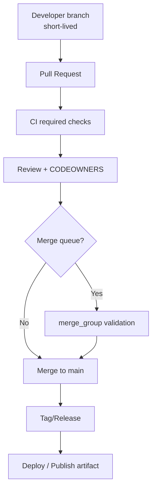
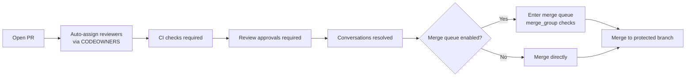

# Best Practices for Using GitHub Across Organizations and Projects

## Executive summary

A well-run GitHub estate is less about any single workflow choice and more about consistent, enforceable standards: predictable repository layout and naming; an explicit branching and release model; disciplined pull request (PR) gates; security and access controls applied centrally; and automation that makes “the right thing” the easiest thing. GitHub provides primitives for this—branch protection rules, CODEOWNERS enforcement, rulesets that can apply across repositories, reusable CI workflows, environments with gated secrets, and security capabilities like secret scanning, push protection, code scanning, and automated dependency updates. citeturn7view1turn13view0turn14view2turn6search0turn6search5turn15view0turn15view1turn15view2turn15view3

Branching and releases should be chosen via decision criteria, not tradition. GitHub Flow is explicitly positioned as a lightweight, branch-based workflow, and GitHub itself uses it broadly beyond code. citeturn14view1 GitFlow (as originally described by Vincent Driessen) is a structured model with multiple long-lived branches and explicit release/hotfix branches; it fits teams with scheduled releases and heavier coordination but has more process overhead. citeturn1search0turn1search12 Trunk-based development emphasizes small, frequent merges into a shared trunk with short-lived branches; it is commonly recommended for CI/CD effectiveness when teams can keep work small and use techniques like feature flags. citeturn1search5turn1search1turn1search13

Commit and changelog standards are a force multiplier for automation. Conventional Commits provides a machine-readable commit grammar intended to enable automated changelog generation and semantic version bumping. citeturn17search3 “Keep a Changelog” argues that changelogs exist to communicate meaningful user-facing differences and should not be reduced to raw commit logs. citeturn1search3 GitHub can also generate release notes automatically and supports customizing release-note categories via labels. citeturn7view3

For PR governance, implement a small set of “hard gates” using branch protections or rulesets—required PRs, required approvals, required CI status checks, and (where appropriate) required code-owner review. citeturn7view1turn13view0 GitHub merge queues can raise throughput on busy branches by validating queued PRs on temporary merge-group branches and merging only after required checks pass; workflows must listen to the `merge_group` event for merge-queue checks to run. citeturn4search2turn11search2turn11search6

Security and governance should be centralized and tiered. Use least-privilege repository roles (Read/Triage/Write/Maintain/Admin) and prefer GitHub Apps (or fine-grained tokens when necessary) over sprawling classic tokens; GitHub explicitly suggests GitHub Apps for scalability when many tokens/automations are needed. citeturn18view2turn5search3turn5search23 Enforce organizational authentication controls (2FA and SAML SSO where available), audit with GitHub’s audit log, and stream logs for compliance monitoring. citeturn4search3turn5search0turn5search1turn5search17

Finally, measure what you intend to improve. DORA’s metrics define throughput and stability measures (e.g., lead time, deployment frequency, recovery time, change fail rate) and explicitly report that speed and stability are not inherently tradeoffs. citeturn18view3 GitHub provides built-in repository-level views like Pulse (PRs/issues/commit activity) and traffic analytics; combine these with CI telemetry to monitor PR lead time, CI flakiness, and operational recovery performance. citeturn16search5turn16search3

## Repository design and standardization

**Rationale**  
Repository structure is an API for humans and automation. Standardizing structure and files improves discoverability, reduces onboarding time, and enables org-wide defaults (issue/PR templates, contributing guidelines, security policies) to be applied consistently. GitHub explicitly supports organization-wide “default community health files” via a dedicated `.github` repository, with a defined precedence order for where those defaults are discovered. citeturn7view2turn2search11

**Concrete recommendations**  
Use a small, repeatable set of repository “shapes,” and make it easy to spin them up via template repositories.

- **Repository naming** (recommended patterns; tailor to your domain taxonomy):
  - Prefer names that encode *what it is* and *where it sits* in your architecture: `team-service`, `product-component`, or `platform-library`.
  - Make names stable under refactoring: avoid embedding volatile details (e.g., sprint numbers).
  - For large orgs, keep a controlled vocabulary for “type” and “domain” tokens (e.g., `svc-`, `lib-`, `infra-`, `docs-`) so that search, CODEOWNERS patterns, and automation can match reliably.

- **Standard directory conventions** (language-agnostic defaults):
  - `.github/` for GitHub-native configuration (workflows, templates, CODEOWNERS, funding, etc.).
  - `docs/` for deeper documentation; keep the README short and link out.
  - `scripts/` or `tools/` for automation glue.
  - `examples/` for runnable samples and contract tests (optional).
  - For monorepos, group by domain boundaries (e.g., `apps/`, `services/`, `libs/`) and keep ownership boundaries explicit (see CODEOWNERS guidance below). citeturn13view0turn18view0

- **Standard “community health” files in every repo** (either directly or via org defaults):
  - `README.md` (purpose, how to run/use, how to get help). citeturn8search3
  - `CONTRIBUTING.md` (how to contribute; GitHub will link this when opening issues/PRs if placed in root, `docs/`, or `.github/`). citeturn8search0
  - `CODE_OF_CONDUCT.md` (use a template where possible so GitHub recognizes it in the community profile). citeturn8search1
  - `SECURITY.md` (how to report vulnerabilities; GitHub calls it good practice). citeturn8search14turn8search2
  - `CODEOWNERS` (maps paths to responsible teams/individuals; see PR governance). citeturn13view0

- **Centralize defaults with a `.github` repository**:
  - GitHub will use default files from the `.github` repository for repos that don’t define their own, and it searches defaults in `.github/`, then repo root, then `docs/` (same precedence order for defaults). citeturn7view2
  - The `.github` repository must be public for organization-wide templates to apply (important constraint for private-only enterprises). citeturn7view2

- **Use template repositories for “new repo bootstrap”**:
  - GitHub supports marking a repository as a template and creating new repositories from it, preserving directory structure, branches, and files. citeturn3search7turn3search3

**Example structures**

A “single service” repo (baseline):
```text
.
├── .github/
│   ├── workflows/
│   │   ├── ci.yml
│   │   └── release.yml
│   ├── ISSUE_TEMPLATE/
│   │   ├── bug.yml
│   │   └── feature.yml
│   └── pull_request_template.md
├── docs/
│   ├── architecture.md
│   └── runbooks.md
├── scripts/
│   └── verify.sh
├── src/
├── tests/
├── CODEOWNERS
├── CONTRIBUTING.md
├── SECURITY.md
└── README.md
```

A monorepo (domain-oriented; minimize cross-domain coupling):
```text
.
├── .github/
│   └── workflows/
├── apps/
│   ├── web-app/
│   └── admin-app/
├── services/
│   ├── billing/
│   └── identity/
├── libs/
│   ├── logging/
│   └── common-types/
├── docs/
└── CODEOWNERS
```

**Table comparing repo layouts (practical trade-offs)**

| Repo layout | What it optimizes for | Common risks | Decision criteria (org size/maturity) |
|---|---|---|---|
| Single-application / single-service repo | Clear boundaries; independent CI; simpler permissions | Cross-repo coordination for shared changes; duplicated tooling/config | Best default for small–large orgs when services are independently deployable and teams own services end-to-end |
| “Shared library” repo | Reuse; clean versioning boundary | Release/process overhead; consumers can lag | Good for medium–large orgs with many consumers and stable APIs; pair with SemVer and automated releases citeturn2search0 |
| Monorepo | Atomic refactors across components; unified tooling; easier global code search | Performance/scale issues; permissions are coarser; CI complexity increases | Favor when codebases are tightly coupled or refactors must be atomic; requires stronger CI investment and explicit ownership controls citeturn18view0turn18view1 |
| Multi-repo (“polyrepo”) | Autonomy; least-privilege access per component; independent versioning | Harder large refactors; dependency drift; duplication | Favor for large orgs with many teams and strong domain boundaries; fits compliance needs due to narrower access grants citeturn18view0turn18view2 |

**Trade-offs and decision criteria**  
Industry discussions emphasize that monorepos and multi-repos are both viable and are trade-off choices—monorepos can ease refactoring/testing cohesion but can create performance, CI/CD, and access-control challenges; multi-repos can improve isolation and permissioning but create coordination and dependency-management friction. citeturn18view0 A useful maturity heuristic is: start with simpler repo boundaries, adopt monorepo only when you have (a) frequent cross-component changes that must be atomic, (b) tooling readiness to avoid “run all tests on every change,” and (c) an ownership model you can enforce with CODEOWNERS and PR gates. citeturn18view1turn13view0

## Branching, releases, and versioning

**Rationale**  
Branching strategy is a control system: it trades off integration frequency, risk containment, and coordination cost. GitHub supports multiple workflows (GitHub Flow is explicitly described as lightweight and branch-based), while GitFlow and trunk-based development represent different points on the spectrum of structure vs. speed. citeturn14view1turn1search0turn1search5

**Concrete recommendations**

- **Default branch**: Treat `main` (or your default branch) as the primary integration line and protect it (required PRs, CI checks, review policies). citeturn3search0turn7view1
- **Branch naming**: Keep branch names short and descriptive; GitHub Flow guidance explicitly recommends this to make ongoing work easy to see. citeturn14view1
- **Pick one branching model per “release surface,” not per team preference**:
  - If you ship continuously (SaaS), bias toward trunk-based or GitHub Flow with very short-lived branches.
  - If you ship as versioned artifacts on a schedule (mobile apps, on-prem packages), bias toward a release-branch approach (GitFlow-like or “release branches on top of trunk”). citeturn1search0turn1search13

**Branching strategy comparison table**

| Strategy | Core idea | Pros | Cons | Decision criteria |
|---|---|---|---|---|
| GitHub Flow | Create a branch per change; PR back to default branch; deploy regularly | Simple mental model; aligns tightly with GitHub PR mechanics; encourages small changes citeturn14view1 | Requires disciplined PR sizing and automated tests; can be risky for long-lived releases unless tags/branches are managed well | Small–medium teams; SaaS/continuous delivery; low ceremony; high CI automation |
| Trunk-based development | Integrate small changes into trunk frequently; keep feature branches short-lived | Minimizes merge pain; supports CI/CD; encourages continuous integration citeturn1search5turn1search1turn1search13 | Requires strong test automation and ability to keep trunk releasable; may need feature flags for incomplete work citeturn1search5 | Medium–large orgs with mature CI and desire for high deployment frequency |
| GitFlow (classic) | Multiple long-lived branches (`develop`, `main`), plus feature/release/hotfix branches | Clear release staging mechanics; explicit hotfix path; supports scheduled releases citeturn1search0 | More long-lived branches and coordination overhead; delayed integration increases merge risk | Regulated or release-scheduled environments; teams needing strong separation between development and release preparation |

**Decision criteria you can operationalize**
- **Deployment frequency and blast radius**: Higher deployment frequency tends to favor trunk-based practices and smaller changes; DORA defines deployment frequency and change lead time as throughput measures and reports that speed and stability are not inherently tradeoffs over time. citeturn18view3
- **Release surface**: If consumers must “upgrade” (SDKs, libraries), you likely need stronger versioning, changelogs, and possibly release branches.
- **Team topology**: Many teams committing to a shared surface favors merge queue + required checks; highly independent components favor multi-repo autonomy.
- **Compliance**: If production changes require sign-offs and audit artifacts, release branches and environment gates are often easier to reason about, but can be layered on trunk-based as well via protected tags/releases. citeturn14view2turn7view1

**Release management, tagging, and SemVer**

- **Versioning**: Use Semantic Versioning for consumer-facing artifacts wherever compatible; SemVer’s stated goal is that version numbers convey meaning about what changed. citeturn2search0
- **Tagging**:
  - Use annotated tags for releases; Git’s documentation distinguishes annotated tags (with metadata and optional signatures) from lightweight tags and notes annotated tags are meant for releases. citeturn17search4
  - Sign tags/commits where required; GitHub supports verification of commit/tag signatures (GPG/SSH/S/MIME) and marks them “verified.” citeturn17search2turn17search1
- **GitHub Releases**:
  - GitHub supports releases with manual notes and also “Generate release notes,” producing an overview with merged PRs, contributors, and a link to a full changelog; release notes can be customized using labels for categories and exclusions. citeturn4search0turn7view3

**Example git commands for a release tag (annotated + pushed)**
```bash
# Create an annotated tag for a release
git tag -a v1.4.0 -m "v1.4.0"

# Push the tag
git push origin v1.4.0
```
citeturn17search4turn17search0

**Release cadence options as a timeline flowchart (policy choices)**
```mermaid
flowchart LR
  A[Change merged to main] --> B{Release cadence}
  B -->|Continuous (CD)| C[Deploy on merge<br/>small batch size]
  B -->|Daily/Weekly| D[Cut release branch or tag<br/>on schedule]
  B -->|Monthly| E[Stabilization window<br/>+ scheduled release]
  B -->|Quarterly/LTS| F[Long stabilization<br/>backports + support line]

  C --> G[Hotfix via PR to main]
  D --> H[Patch releases from release line]
  E --> H
  F --> H
```
The rationale for biasing toward smaller batch sizes is consistent with throughput/instability framing in the DORA metrics, where change lead time and deployment frequency are throughput measures and change fail rate/recovery time capture stability. citeturn18view3

**Workflow diagram: trunk-based + release tagging**

GitHub merge queues create temporary merge-group branches and require the `merge_group` event for Actions workflows that validate queued changes. citeturn4search2turn11search2turn11search6

## Pull request and review governance

**Rationale**  
PRs are the unit of collaboration and quality control on GitHub. Governance must be predictable (same standards across repos), enforceable (automated gates), and scalable (code ownership models that align with org structure). GitHub provides the enforcement hooks via branch protection rules (required PRs, approvals, status checks, linear history, signed commits, merge queue, etc.). citeturn7view1turn11search1turn3search1

**Concrete recommendations**

- **Standardize PR shape and intent**:
  - Prefer small PRs that can be reviewed quickly; enforce via cultural norms and PR templates.
  - Require PR descriptions that include: “what/why,” test evidence, risk/rollback, and linked issues.

- **Use PR templates**:
  - GitHub supports pull request templates placed in the repo root, `docs/`, or `.github/`. citeturn3search2

Example `.github/pull_request_template.md`:
```markdown
## Summary
What does this change do and why?

## Testing
- [ ] Unit tests
- [ ] Integration tests
- [ ] Manual verification (describe)

## Risk and rollout
- Risk level: low / medium / high
- Rollback plan:

## Tracking
Closes #
```
citeturn3search2turn3search16

- **Enforce CODEOWNERS where ownership boundaries matter**:
  - You can locate `CODEOWNERS` in `.github/`, repo root, or `docs/`; GitHub searches in that order and uses the first found. citeturn13view0
  - CODEOWNERS applies per branch; PRs use the CODEOWNERS file from the PR’s base branch. citeturn13view0
  - Code owners are requested for review on PRs that modify files they own; they are not automatically requested on draft PRs (but are notified when a draft becomes ready for review). citeturn13view1
  - For ownership to be enforceable, require “review from Code Owners” in branch protection settings. citeturn7view1turn3search4

Example `CODEOWNERS`:
```text
# Default owners
*               @org/platform-team

# Domain ownership
/services/billing/   @org/billing-team
/services/identity/  @org/identity-team

# Security-sensitive paths
/.github/            @org/security-engineering
```
citeturn13view0turn13view2

- **Baseline branch protection policy (recommended defaults)**  
From GitHub’s branch protection capabilities, a pragmatic baseline for `main` is:
  - Require a pull request before merging.
  - Require a minimum number of approvals.
  - Dismiss stale approvals when new commits are pushed (for high-safety repos).
  - Require code owner review (if CODEOWNERS is used).
  - Require status checks to pass before merging; optionally require branches to be up to date before merging.
  - Require conversation resolution before merging.
  - Optionally require signed commits and linear history.
  - Use merge queue for high-throughput, high-contention branches. citeturn7view1turn3search0turn4search2

**Merge method policy (and why it matters)**  
GitHub supports merge commits, squash merges, and rebase merges. citeturn3search1 If you require linear history in branch protection, GitHub notes that merge commits are prevented and PRs must use squash or rebase merges. citeturn11search1

Recommended merge-method selection:
- **Squash merge** (common default): produces a single commit per PR; easier revert-by-PR; clean history. GitHub allows configuring squash merging and describes how default squash messages are formed. citeturn3search9turn3search1
- **Merge commits**: retains full branch history and merge commit; helpful when you want to preserve detailed branch context (but can complicate revert operations).
- **Rebase merge**: linearizes commits without a merge commit; depends heavily on commit message discipline to avoid noisy history.

**Decision criteria by org maturity**
- **Small teams / early-stage**: Start with required PRs + required CI checks. Add CODEOWNERS only when ownership boundaries stabilize.
- **Scaling org**: Add CODEOWNERS + required approvals + merge queue to keep `main` green and reduce integration contention. citeturn4search5turn13view0
- **Regulated / high-risk systems**: Add signed commits, stricter review dismissal, and environment deployment gating (see CI/CD section). citeturn7view1turn17search1turn6search5

**Workflow diagram: PR review and merge queue**

CODEOWNERS + branch protections and merge queues are explicit GitHub-supported mechanisms with defined behaviors and triggers. citeturn13view1turn7view1turn4search2turn11search2

## Automation with CI/CD and testing

**Rationale**  
CI/CD is how policy becomes reality. Branch protections can require status checks; rulesets can apply requirements at scale across repositories; merge queues and environments add higher-order safety mechanisms for high-throughput and high-risk deployments. citeturn7view1turn14view2turn4search2turn6search5

**Concrete recommendations**

- **CI as a required check on PRs**:
  - GitHub protected branches can require status checks to be successful before merging. citeturn0search1turn0search13
  - If you use merge queues, ensure your workflows also trigger on `merge_group`, or required checks won’t run for queued merges. citeturn11search2turn11search6

- **Centralize CI logic using reusable workflows**:
  - GitHub Actions supports reusable workflows (`workflow_call`) and direct job-level calls via `uses`, which is a strong pattern for standardizing CI across many repositories. citeturn6search0turn6search4turn6search8

- **Use environments for deployment safety**:
  - Environment secrets are only available to jobs referencing the environment; if an environment requires approval, the job cannot access environment secrets until required reviewers approve. citeturn6search5turn6search1

- **Prefer OIDC over long-lived cloud secrets** (where supported):
  - GitHub Actions can use OIDC tokens to access cloud resources without storing long-lived credentials as secrets (federated identity). citeturn6search6turn6search2

- **Be conservative with self-hosted runners**:
  - GitHub states that hosted runners are ephemeral clean VMs; self-hosted runners can be persistently compromised by untrusted workflow code and “should almost never be used for public repositories.” citeturn14view0
  - If self-hosted is necessary (special hardware, network access), isolate runner groups and use ephemeral/just-in-time patterns where possible. citeturn14view0

**CI tool comparison table (major patterns)**

| CI option | Hosting model | GitHub integration pattern | Strengths | Risks / best-fit criteria |
|---|---|---|---|---|
| GitHub Actions | GitHub-hosted or self-hosted runners | Native checks + required status checks; workflows in `.github/workflows` citeturn11search15turn0search13 | Tight PR integration; reusable workflows; environments + OIDC support citeturn6search0turn6search6 | Self-hosted runner security risks; governance needed for workflow reuse citeturn14view0 |
| entity["company","CircleCI","ci platform company"] | SaaS | GitHub Checks and status updates to PRs citeturn12search0turn12search8 | Mature CI features; strong scaling for complex pipelines | Requires separate platform governance; ensure statuses map cleanly to branch protection requirements citeturn0search13turn12search0 |
| entity["company","Buildkite","ci platform company"] | Hybrid (you run agents; service orchestrates) | Updates commit statuses/checks via GitHub APIs citeturn12search1turn12search9 | Flexibility and control; strong for custom infrastructure | Agent hygiene and secret isolation become your responsibility |
| entity["organization","Jenkins","automation server project"] | Self-hosted | Multibranch pipelines discover `Jenkinsfile` per branch; GitHub Branch Source plugin supports repo-based discovery citeturn12search6turn12search2 | Highly customizable; widely adopted; full control | Highest operational overhead; security patching and plugin risk management |

**Example GitHub Actions workflow (language-agnostic skeleton)**  
This example shows PR checks + merge queue checks, minimal permissions, and an optional deployment job guarded by an environment.

```yaml
name: ci

on:
  pull_request:
  merge_group:
    types: [checks_requested]
  push:
    branches: [main]

permissions:
  contents: read

concurrency:
  group: ci-${{ github.ref }}
  cancel-in-progress: true

jobs:
  test:
    runs-on: ubuntu-latest
    steps:
      - uses: actions/checkout@v4
      - name: Lint
        run: ./scripts/lint.sh
      - name: Unit tests
        run: ./scripts/test-unit.sh
      - name: Integration tests
        run: ./scripts/test-integration.sh

  deploy:
    if: github.event_name == 'push' && github.ref == 'refs/heads/main'
    needs: [test]
    runs-on: ubuntu-latest
    environment: production
    permissions:
      id-token: write
      contents: read
    steps:
      - uses: actions/checkout@v4
      - name: Deploy
        run: ./scripts/deploy.sh
```
Workflows are defined as YAML in `.github/workflows`, merge queues require `merge_group` for checks, environments can gate secret access via approvals, and OIDC uses `id-token: write` instead of long-lived secrets. citeturn11search15turn11search2turn6search5turn6search6

**Testing strategy and test placement (language-agnostic guidance)**  
Testing strategy must align with branching model and release cadence:

- **On every PR**: fast unit tests + linting + critical integration tests (blocking). This directly supports protected branches requiring status checks. citeturn0search13turn7view1
- **On merge (main)**: a slightly broader suite, plus artifact builds (containers/packages) for traceability.
- **Nightly / scheduled**: heavier end-to-end tests, fuzzing, performance regression tests, and dependency/upstream compatibility checks (non-blocking unless failures persist).
- **Monorepos**: adopt “impacted tests” (only run tests for changed components) to maintain velocity at scale—this is commonly recommended in repository-scale guidance. citeturn18view1

**Dealing with CI flakiness**  
Treat flaky tests as production incidents: quarantine, track failure rates per test, and prefer rerun-on-failure only as a temporary mitigation because it can hide regressions (policy decision). While GitHub provides required checks and merge gating, flakiness management typically requires additional CI telemetry and ownership practices (often enforced via CODEOWNERS on test directories). citeturn0search13turn13view0

## Dependency and supply chain management

**Rationale**  
Dependency risk is both security and delivery risk: vulnerabilities, licensing issues, and breaking changes can enter through routine updates. GitHub’s supply-chain features (dependency graph, Dependabot alerts/updates, dependency review, dependency review action) are designed to surface and block risky changes earlier—especially at PR review time rather than after merge. citeturn10search2turn10search5turn15view3turn14view3

**Concrete recommendations**

- **Enable dependency graph and alerts**:
  - GitHub’s dependency graph identifies dependencies from manifests/lockfiles and supports many ecosystems. citeturn10search2turn10search22
  - Dependabot alerts surface known vulnerable dependencies in the Security tab and dependency graph. citeturn10search5

- **Automate updates (and manage noise)**:
  - Dependabot security updates can be customized via `dependabot.yml` for granular behavior. citeturn0search2turn0search10
  - GitHub supports grouped Dependabot security updates (per ecosystem) to reduce PR volume, with grouping configurable in settings or via `dependabot.yml`. citeturn15view3
  - Dependabot version updates are enabled via `dependabot.yml` and keep dependencies updated even when not vulnerable. citeturn0search6turn0search18

- **Make dependency review part of PR review**:
  - GitHub dependency review shows a rich diff in PRs (what changed, release dates, vulnerability data, indirect lockfile changes). citeturn14view3
  - The dependency review action can fail a workflow when vulnerable dependencies are introduced, blocking merges when the workflow is required. citeturn14view3turn7view1
  - Organizations can enforce dependency review at scale using repository rulesets and required workflows. citeturn14view3turn6search19

- **Alternative tool**: Renovate (if you need more customization than Dependabot)
  - Renovate is an automated dependency update tool that creates PRs for newer versions and supports monorepos; it is configured via Renovate configs and can reduce noise via scheduling and grouping. citeturn10search3turn10search6

**Example `dependabot.yml` (weekly version updates + grouped security updates)**
```yaml
version: 2
updates:
  - package-ecosystem: "github-actions"
    directory: "/"
    schedule:
      interval: "weekly"

  - package-ecosystem: "npm"
    directory: "/"
    schedule:
      interval: "weekly"
    open-pull-requests-limit: 10
    groups:
      security-fixes:
        applies-to: security-updates
        patterns:
          - "*"
```
Dependabot version updates require `dependabot.yml`, and for Actions updates the directory must be `/` to scan workflow files in `.github/workflows`. citeturn0search6turn0search21

**Example dependency review action**
```yaml
name: dependency-review
on:
  pull_request:

permissions:
  contents: read

jobs:
  review:
    runs-on: ubuntu-latest
    steps:
      - uses: actions/checkout@v4
      - uses: actions/dependency-review-action@v4
```
This action is explicitly described as scanning PR dependency changes and failing when vulnerabilities are introduced; when required by branch protection/rulesets it blocks merges. citeturn10search4turn14view3turn7view1

**Trade-offs and decision criteria**
- **Small orgs**: Start with dependency graph + Dependabot security updates; avoid drowning reviewers with version update PRs until CI is stable.
- **Scaling orgs**: Add dependency review action as a required workflow and enable grouping to manage PR volume. citeturn14view3turn15view3
- **Monorepos**: Group updates cautiously—one PR can affect many components; consider per-directory policies and stricter CI test selection (impacted testing). citeturn18view1turn10search10

## Security, access control, and compliance governance

**Rationale**  
Security posture is determined by defaults. GitHub’s built-in capabilities cover three major categories: (1) code and secrets (secret scanning + push protection, code scanning), (2) dependency risk (Dependabot + dependency review), and (3) identity/access governance (roles, SSO/2FA, audit logs, rulesets). citeturn15view0turn15view1turn15view2turn15view3turn18view2turn5search0turn4search3turn5search1turn14view2

**Concrete recommendations**

- **Secret management and prevention**
  - Enable secret scanning to detect secrets in commits and other GitHub surfaces (issues/PRs/discussions/wiki). citeturn15view0
  - Turn on push protection (blocks pushes containing secrets before they land, not just alerting after commit). citeturn15view1
  - Use remediation playbooks: rotate leaked credentials and close alerts promptly; centralize ownership for response (e.g., security team as CODEOWNERS for `.github/` and `SECURITY.md`). citeturn13view2turn8search14

- **Code scanning**
  - Use CodeQL for code scanning; GitHub describes default setup (auto-select languages/query suite/triggers) and advanced setup (customizable workflow using `github/codeql-action`), and it supports running CodeQL in external CI and uploading results. citeturn15view2

- **Least privilege and token hygiene**
  - Use repository roles (Read/Triage/Write/Maintain/Admin) and assign the minimum needed access; GitHub explicitly frames this as choosing roles “without giving people more access… than they need.” citeturn18view2
  - Prefer GitHub Apps for automation at scale; GitHub notes a limit on fine-grained personal access tokens and suggests GitHub Apps for better scalability/management for automations. citeturn5search3turn5search23

- **Strong authentication defaults**
  - Require 2FA for org members and outside collaborators; GitHub supports enforcing this and recommends notifying people beforehand. citeturn4search3turn4search14
  - Enforce SAML SSO where available (notably on GitHub Enterprise Cloud), so organization members authenticate via an identity provider. citeturn5search0turn5search4

- **Auditability**
  - Use the organization audit log for changes affecting org settings/access; GitHub states it lists events from the last 180 days and only owners can access it. citeturn5search1
  - For enterprise compliance, stream audit logs to retain copies and monitor activity externally. citeturn5search17

- **Governance at scale using rulesets**
  - Rulesets are named lists of rules that can apply to a repository or multiple repositories in an organization (Team/Enterprise plans), are visible to anyone with read access, and support bypass policies (roles, teams, GitHub Apps). citeturn14view2
  - Use rulesets to standardize: required workflows, signed commits, tag protections, and branch restrictions across many repos. citeturn6search19turn14view2

**Example governance “baseline” for mature orgs (policy checklist)**  
Use these as org-wide defaults (via rulesets where possible) and allow exceptions only with explicit approval:

- PRs required for protected branches; required approvals; required status checks; code owner review for critical paths. citeturn7view1turn13view0  
- Signed commits for high-integrity repos; GitHub supports requiring signed commits on protected branches and verifying commit signatures. citeturn17search1turn17search2  
- Tag rulesets for release tags (e.g., prevent force-updating `v*` tags, restrict deletion). Rulesets can target tags and control deletion/renaming and other interactions. citeturn14view2  
- Environments for production deployments with required reviewers, so deployment jobs cannot access environment secrets without approval. citeturn6search5  
- Use OIDC for cloud deployments when possible to avoid long-lived credentials. citeturn6search6turn6search2  

**Trade-offs and decision criteria**
- **Open source / public repos**: Be cautious with self-hosted runners and secret exposure; GitHub warns self-hosted runners should almost never be used for public repositories. citeturn14view0
- **Enterprise / regulated**: Prefer SAML SSO + mandatory 2FA + audit log streaming; use rulesets to enforce baseline controls at scale. citeturn5search0turn4search3turn5search17turn14view2
- **Small orgs**: Start with mandatory 2FA, branch protections, Dependabot security updates, and secret scanning/push protection where available; expand to code scanning and rulesets as you scale. citeturn4search3turn7view1turn15view0turn15view3

## Metrics, monitoring, and onboarding experience

**Rationale**  
Metrics align behavior with outcomes. Without measurement, teams optimize locally (e.g., “more merges”) instead of system outcomes (reliable, safe delivery). DORA’s metrics provide a widely-used framework for software delivery performance and explicitly define throughput measures (change lead time, deployment frequency, recovery time) and instability measures (change fail rate, rework rate). citeturn18view3 GitHub provides repo-level activity summaries (Pulse) and traffic analytics that can be inputs into engineering dashboards. citeturn16search5turn16search3

**Concrete recommendations**

- **Adopt a small scorecard (start simple, then mature)**:
  - **PR lead time**: from PR open → merged; use as a proxy for review throughput (often decomposed into pickup time + review time).
  - **CI health**: median CI duration; failure rate; flaky test rate (reruns / intermittent failures).
  - **Release/deploy cadence**: deployment frequency and change lead time (commit → prod) align with DORA definitions. citeturn18view3
  - **Operational recovery**: failed deployment recovery time / time to restore service (DORA framing). citeturn18view3

- **Use GitHub’s built-in visibility as the minimum bar**:
  - Pulse summarizes merged/open PRs, issues, and contributor commit activity for a selected period. citeturn16search5
  - Repository traffic shows visitors, referring sites, and clones over the past 14 days to help understand usage signals. citeturn16search3

- **Onboarding and contributor experience**:
  - Ensure `CONTRIBUTING.md` exists and is discoverable; GitHub links it when opening issues/PRs if placed in root/`docs/`/`.github/`. citeturn8search0turn7view2
  - Use issue templates (including YAML issue forms) to collect structured data and reduce back-and-forth during triage. GitHub issue forms live under `/.github/ISSUE_TEMPLATE` and support validations, default labels, and assignees. citeturn9search3turn9search7
  - Keep labeling consistent: labels categorize issues/PRs/discussions, but labels are repository-scoped and changes in one repo do not affect another—plan for automation if you want consistency across a large estate. citeturn9search0turn7view2
  - Use milestones to track progress across a group of issues/PRs when you have a release or project goal. citeturn9search1turn9search5
  - Use GitHub Projects when you need an org-level board/table/roadmap tied to issues and PRs. citeturn9search2turn9search6

**Example issue form (YAML) for structured bug reports**
```yaml
name: Bug report
description: Report a reproducible defect
title: "[Bug]: "
labels: ["bug", "triage"]
body:
  - type: textarea
    id: what-happened
    attributes:
      label: What happened?
      description: What did you observe?
    validations:
      required: true
  - type: textarea
    id: steps
    attributes:
      label: Steps to reproduce
      description: Include minimal steps and inputs
    validations:
      required: true
  - type: input
    id: version
    attributes:
      label: Version/commit
      description: Release tag or commit SHA
```
GitHub issue forms are YAML files stored under `/.github/ISSUE_TEMPLATE` and support validations and default labels. citeturn9search3turn9search7

**Example automation: label new issues for triage**
```yaml
name: auto-label-triage
on:
  issues:
    types: [opened, reopened]

permissions:
  issues: write

jobs:
  label:
    runs-on: ubuntu-latest
    steps:
      - run: gh issue edit ${{ github.event.issue.number }} --add-label "triage"
        env:
          GH_TOKEN: ${{ secrets.GITHUB_TOKEN }}
```
GitHub provides an Actions guide demonstrating labeling issues with GitHub CLI in workflows (a practical pattern for standard triage). citeturn9search8

**Trade-offs and decision criteria**
- **Small orgs**: Avoid heavy metric overhead; track PR lead time, CI pass rate, and release frequency. Use GitHub Pulse as baseline visibility. citeturn16search5
- **Scaling orgs**: Add DORA-aligned delivery metrics (commit→prod lead time, deployment frequency, recovery time, change fail rate) and build dashboards from CI + deploy logs; DORA provides definitions and guidance that these metrics apply across stacks and that speed/stability can correlate positively. citeturn18view3turn16search1
- **High-compliance orgs**: Emphasize auditability (release tags, approvals, environments, audit log streaming) alongside throughput metrics so governance does not become invisible toil. citeturn6search5turn5search17turn17search4