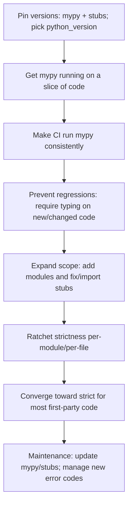

# Mypy Best Practices in 2026

## Executive summary

Mypy’s current stable release is **1.19.1** (released December 15, 2025) and it **requires Python ≥ 3.9 to run**. This matters operationally: teams that still run production code on Python 3.8 can often *type-check much of their code*, but they should expect rough edges because mypy has **removed support for targeting Python 3.8** (linked to typeshed’s post‑EOL policy). citeturn2view0turn9search8turn9search0

The most consistently successful production setups treat mypy as a **repeatable build step** (pinned versions, single canonical config, same invocation everywhere) rather than a best-effort developer tool. Mypy’s own “existing codebase” guidance emphasizes starting with a manageable slice of code, getting the checker green early, then preventing regressions via CI and conventions that require typing on new/changed code. citeturn12view0

A strong default is to store configuration in **one repo-root file** (either `mypy.ini` or `pyproject.toml`) and rely on mypy’s config discovery rules—*but* remember there is **no config merging**: one mypy invocation reads exactly one config file, and `--config-file` overrides discovery. This design has direct consequences for large monorepos and “config inheritance” approaches. citeturn10view0

Practically, most teams converge on a **strictness ladder**: begin with a “reliability core” (`warn_unused_configs`, `warn_unused_ignores`, consistent `python_version`, manageable import policy), then incrementally enable stricter checks per-module or per-file, with the long-term target being `strict = true` for the majority of first‑party code. Mypy explicitly supports **per-module configuration** and **per-file inline `# mypy:` settings** that override everything else. citeturn10view0turn11view0turn12view0

Typed dependencies are often the hidden bottleneck. Since mypy does not ship third‑party stubs by default, projects must either (a) prefer libraries that ship inline typing, (b) install stub packages (`types-…`) published from typeshed, or (c) author local `.pyi` stubs. Automated `--install-types` exists, but mypy documents why it is slower and less reproducible than explicitly pinning stub package dependencies. citeturn17view0turn18view0turn9search1

Finally, plugin usage should be intentional. Mypy’s plugin API is explicitly described as experimental and primarily intended for frameworks whose runtime “magic” is hard to model in the core type system. Django projects commonly rely on `django-stubs`’ mypy plugin; SQLAlchemy projects should generally migrate toward SQLAlchemy 2.x’s inline typing rather than relying on the deprecated mypy plugin ecosystem, which is not portable to Pyright/Pylance and has documented compatibility limits. citeturn24view0turn25search14turn26search2turn8search25

## Version and compatibility landscape

### Mypy versioning and supported Python runtimes

As of February 17, 2026, the latest stable mypy release available on PyPI is **1.19.1** (December 15, 2025). Its package metadata indicates it **requires Python ≥ 3.9** to execute, and classifiers indicate support through current newer Python minors. citeturn2view0

Mypy 1.19.0 is described in official release notes as a feature release with performance work (including a newer cache format) and it is called out as **the last feature release supporting Python 3.9** (which reached end-of-life in October 2025). This is relevant for forward planning: if your tooling fleet still includes Python 3.9 runners, you should treat “mypy ≥ next feature release” as a potentially breaking environment change. citeturn6view0

### Python 3.8 reality check in 2026

Python 3.8 is end-of-life (October 2024). Typeshed opened and tracked the work to drop 3.8 support after EOL, and mypy subsequently removed “targeting Python 3.8” support—myPy now requires `--python-version 3.9` or greater, and attempts to target 3.8 fall back to the oldest supported target. citeturn9search0turn9search8

**Actionable implication:** if production still runs on 3.8, you have three realistic options:

- **Upgrade runtime first** (preferred), then align `python_version` and the checker. (This aligns with the ecosystem’s sustained support rules.) citeturn9search8turn9search0  
- **Pin an older mypy** that still supported targeting 3.8 (and pin stubs accordingly), accepting you will lag feature/workarounds. (Mypy explicitly warns that newer stub packages may require newer mypy features, so pinning old mypy implies pinning stub packages too.) citeturn17view0  
- **Type-check “as 3.9”** while running “on 3.8”, relying heavily on version guards and postponed annotation evaluation to make syntax workable—useful as a temporary bridge, but it can miss 3.8-specific runtime realities. citeturn9search8turn15view0turn31search0

### Multi-version codebases and `python_version`

Mypy’s configuration supports a global `python_version = "MAJOR.MINOR"` that determines how it parses and checks the target program; by default it uses the version of the interpreter running mypy. Pinning this value is a best practice because it makes behavior stable across developer machines and CI runners. citeturn14view0

When maintaining multiple Python versions, mypy understands `sys.version_info` and `sys.platform` guards, letting you write conditional imports/definitions and have mypy ignore code paths that are statically unreachable for the configured target. citeturn15view0

### Strictness options and trade-offs

Mypy’s `strict = true` is a **meta-flag** that enables “all optional error checking flags”; mypy documents that the exact list can change over time and points users to `mypy --help` output for the authoritative current set. citeturn14view1

The mypy “existing codebase” guide also provides a concrete strict-equivalent set “as of mypy 1.0” and recommends aiming for `mypy --strict` over time, while acknowledging that teams may start strict and subtract. citeturn12view0

| Strictness approach | How to enable | What it’s good at catching | Cost profile | Typical use |
|---|---|---|---|---|
| Baseline “safety rails” | `warn_unused_configs = true`, `warn_unused_ignores = true`, set `python_version` | Config mistakes, stale ignores, inconsistent target version | Low noise, high ROI | Any project, including early adoption citeturn10view0turn14view0turn12view0 |
| “Core module strictness” | Per-module sections / overrides enabling `disallow_untyped_defs`, `check_untyped_defs`, etc. | Prevents new untyped code in stabilized modules; increases coverage | Medium effort; may require shaping APIs and reducing `Any` | Medium+ codebases doing gradual typing citeturn10view0turn12view0 |
| Global strict | `strict = true` | Broadest static guarantees; most type escapes become explicit (`# type: ignore`, `Any`) | High initial effort; can be noisy with untyped dependencies | Greenfield typed codebases; mature migrations citeturn14view1turn12view0 |
| “Strict + policy” | `strict = true` plus selective extra checks (and/or error code enablement) | Enforces stronger invariants and style around typing | Highest maintenance; best after you have stability | Highly-regulated or large teams enforcing a typed API surface citeturn12view0turn14view1 |

Per-file strictness is supported via inline `# mypy:` directives, which take precedence over all other configuration sources and can be used to ratchet strictness on individual modules or temporarily relax it. citeturn11view0

## Recommended best practices with rationale

### Standardize the checker as part of your build

Mypy’s own guidance for existing codebases highlights three practical necessities: (1) run mypy consistently, (2) keep everyone on the same options via a committed config file, and (3) pin the mypy version—especially before adding CI gating. citeturn12view0

A production-ready corollary is: **treat mypy + stubs as “toolchain dependencies”** with explicit versions. Mypy’s “installed packages” documentation notes that stub packages may use type system features not supported by older mypy versions; pinning mypy implies you should pin your `types-…` dependencies too for reproducible checking. citeturn17view0

### Make configuration explicit and centralized

Mypy searches for configuration files in a defined order (including `mypy.ini` and `pyproject.toml` with `[tool.mypy]`), but critically: **it does not merge configurations** discovered in different directories—there is exactly one config file per invocation. For predictable results, place the canonical config at the repo root and avoid “hidden” per-directory configs. citeturn10view0

For large organizations, this “no merging” constraint is not a nuisance—it drives architecture. You either maintain one shared config with many per-module overrides, or you run multiple mypy invocations with different configs (which your build system or wrapper scripts can generate and orchestrate). citeturn10view0turn12view0

### Control the import story before you chase strictness

Most early mypy failures in mature codebases come from imports: missing packages, untyped packages, or stubs not installed. Mypy recommends first trying to install newer typed versions or the relevant PEP 561 stub packages, and only suppressing missing imports as a last resort because it turns those imports into `Any` and reduces checking power downstream. citeturn18view0turn17view0turn8search3

In particular, avoid setting `ignore_missing_imports = true` globally unless you are deliberately running a “first-pass migration mode.” Mypy’s docs explicitly warn that global ignore-missing-imports is equivalent to adding `# type: ignore` on all unresolved imports and can hide real issues later. citeturn18view0turn12view0

### Prefer typed libraries, explicitly install stubs, and understand typeshed

Typeshed is the shared repository that supplies standard-library stubs and many third-party stubs; it also drives the auto-released `types-…` packages on PyPI. Typeshed itself describes this publishing flow and notes that type checkers should consume these stub packages when installed. citeturn9search1

Mypy’s docs explain three ways typed information can be distributed, standardized by PEP 561: inline annotations (`py.typed` marker), bundled stubs (`.pyi` shipped with runtime), or stub-only distributions. Within the mypy ecosystem, a common operational best practice is: **treat stub packages like any other dependency**—pin and review them. citeturn17view0turn8search3

When you have internal or missing stubs, mypy supports local `.pyi` stubs, placed either next to modules or in a dedicated stubs directory referenced from `MYPYPATH` / `mypy_path`. Mypy also warns against pointing `MYPYPATH` at `site-packages` because it tends to drag in third-party code and reduce stability. citeturn16view0turn18view0

### Use gradual typing deliberately, not accidentally

Mypy is designed around PEP 484’s gradual typing model: a type checker can accept a mixed codebase with typed and untyped code, using `Any` as an escape hatch and guarding behavior through optional checks. citeturn29search0turn12view0

Mypy’s migration guide for existing codebases recommends picking a slice (5k–50k LOC) to get passing quickly; adding `# type: ignore` where necessary; and using per-module `ignore_errors = True` to quarantine legacy areas while enforcing correctness in the modules you are ready to maintain. citeturn12view0

A robust pattern for medium and large codebases is an **allowlist model**:

- Default to lenient settings (or even `ignore_errors = True`) globally.
- Enable real checking only for modules owned by teams who are ready to fix errors.
- Expand the allowlist steadily, and raise strictness per-module as coverage grows. citeturn12view0turn10view0

This is more reliable than “run mypy on the whole repo and accept thousands of ignores,” because it keeps the signal quality high and creates safe team ownership boundaries. citeturn12view0

### Plugins: use them when runtime “magic” cannot be modeled in plain typing

Mypy’s plugin system exists because many frameworks perform transformations that are impractical to express purely through the base PEP 484 type system. The official mypy documentation describes plugin configuration via the `plugins` option and emphasizes that the plugin API is experimental and primarily meant to help mypy understand third-party frameworks. citeturn24view0

**Django.** `django-stubs` publishes type stubs plus a custom mypy plugin. Its PyPI documentation includes the canonical configuration: enable `mypy_django_plugin.main` and point it at `django_settings_module` under `[mypy.plugins.django-stubs]`. citeturn25search14turn8search0

**Attrs.** Mypy includes built-in understanding of the `attrs` ecosystem: the mypy docs describe that it can detect `attrs` usage and generate method definitions based on annotations, and they document important caveats (detection by function name only; boolean arguments must be literal). citeturn28view0turn27view0

**SQLAlchemy.** The SQLAlchemy mypy plugin and `sqlalchemy2-stubs` ecosystem should be treated with caution in 2026. SQLAlchemy’s own documentation states that the mypy plugin is **deprecated since SQLAlchemy 2.0**, may be removed as early as SQLAlchemy 2.1, is difficult to maintain across mypy releases, and (critically) is **not portable to Pyright/Pylance and other type checkers**. It also documents explicit compatibility concerns with newer mypy versions and urges users to migrate away. citeturn26search2turn8search25

## Configuration patterns and templates

### Key configuration rules to internalize

- **Discovery order and no merging.** Mypy walks up the directory tree looking for `mypy.ini`, `.mypy.ini`, `pyproject.toml` (with `[tool.mypy]`), then `setup.cfg`; and it does not merge multiple configs. `--config-file` has highest precedence. citeturn10view0  
- **Per-module overrides.** INI uses `[mypy-some.module.*]` sections; TOML uses `[[tool.mypy.overrides]]` blocks. citeturn10view0turn14view0  
- **Per-file overrides.** Inline `# mypy:` directives override everything else. citeturn11view0  
- **Pin your target.** `python_version` defaults to the Python running mypy; set it explicitly. citeturn14view0  

### Template for a small project

`pyproject.toml`:

```toml
[tool.mypy]
python_version = "3.12"
warn_unused_configs = true
warn_unused_ignores = true

# Choose ONE of these scoping styles:
# 1) let CI pass paths/packages on the command line, or
# 2) pin scope here:
files = ["src"]

# Pragmatic defaults for early adoption:
check_untyped_defs = true

# Optional: only after you have stable coverage
# strict = true
```

Rationale: This matches mypy’s recommendation to standardize options and gradually introduce stricter checks, while keeping the configuration simple and discoverable. citeturn12view0turn10view0turn14view1

### Template for a medium project with gradual strictness

`mypy.ini`:

```ini
[mypy]
python_version = 3.12

# Hygiene and reproducibility
warn_unused_configs = True
warn_unused_ignores = True

# Early ROI: improves signal without demanding full annotation coverage
check_untyped_defs = True

# Keep cache enabled (default), but relocate it if needed
cache_dir = .mypy_cache

# Example: temporarily quiet an untyped third-party dependency
[mypy-legacy_untyped_dependency.*]
ignore_missing_imports = True

# Example: enforce stricter rules in matured modules first
[mypy-myapp.core.*]
disallow_untyped_defs = True
disallow_incomplete_defs = True
disallow_untyped_calls = True
disallow_any_generics = True
```

Why this pattern works: mypy explicitly supports global options plus per-module overrides, enabling a “typed core” while the rest of the codebase migrates. citeturn10view0turn12view0turn14view1

### Template for a large monorepo

For monorepos, design around the “no config merging” rule. Either maintain one large config with per-module sections, or run multiple mypy invocations with different configs. citeturn10view0

A common wrapper-based approach is:

```mermaid
flowchart TD
  A[repo root] --> B[mypy.ini (single canonical config)]
  B --> C[per-module sections: pkg_a.*, pkg_b.*, ...]
  C --> D[CI runs: mypy --config-file mypy.ini packages/pkg_a packages/pkg_b]
  C --> E[local runs: dmypy run -- --config-file mypy.ini ...]
  F[constraint: no config merging] --> B
```

This architecture is motivated directly by mypy’s documented config discovery behavior and the explicit statement that configuration files are not merged. citeturn10view0turn13view0

If different packages require materially different configurations (e.g., different plugin sets), use separate configs and separate invocations; the orchestration belongs in your build tooling, not in mypy itself. citeturn10view0turn24view0

### Plugin configuration examples

Django (`django-stubs`) in `mypy.ini`:

```ini
[mypy]
plugins = mypy_django_plugin.main

[mypy.plugins.django-stubs]
django_settings_module = "myproject.settings"
```

This matches the canonical configuration shown in `django-stubs` documentation. citeturn25search14turn24view0

SQLAlchemy (legacy plugin usage) is **not recommended** for new projects; if you must use it for transitional reasons, follow SQLAlchemy’s documentation and pin versions rigorously due to its documented instability and compatibility limitations. citeturn26search2turn8search25

## Idiomatic annotations and before/after refactor patterns

### Use postponed evaluation for forward references and modern syntax in older runtimes

PEP 563 defines postponed evaluation of annotations (stringifying annotations rather than evaluating them at definition time). This is the language-level basis for the widespread `from __future__ import annotations` strategy. citeturn31search0

**Before (string literal forward reference):**

```python
class Node:
    def __init__(self, next: "Node | None") -> None:
        self.next = next
```

**After (postponed evaluation, cleaner syntax):**

```python
from __future__ import annotations

class Node:
    def __init__(self, next: Node | None) -> None:
        self.next = next
```

This style dovetails with PEP 604 union syntax (`X | Y`) and modern typing readability. citeturn29search2turn31search0

### Replace “mystery dicts” with `TypedDict` at API boundaries

Typed dictionaries were standardized in PEP 589 and are now maintained in the typing spec; they are particularly effective at stabilizing JSON-ish boundaries. citeturn30search1turn30search13

**Before:**

```python
def parse_user(payload: dict) -> str:
    return payload["name"]
```

**After:**

```python
from typing import TypedDict

class UserPayload(TypedDict):
    name: str
    age: int

def parse_user(payload: UserPayload) -> str:
    return payload["name"]
```

This refactor turns runtime key errors into static feedback and makes downstream code less `Any`-infected. citeturn30search1turn29search0

### Use `Protocol` to keep duck typing while gaining static guarantees

Protocols (PEP 544) provide structural subtyping: anything with the required members is accepted, without inheritance coupling. citeturn30search2turn30search6turn30search14

**Before (too concrete):**

```python
def render(items: list[dict[str, object]]) -> str:
    ...
```

**After (duck-typed interface):**

```python
from typing import Protocol

class Renderable(Protocol):
    def render(self) -> str: ...

def render_all(items: list[Renderable]) -> str:
    return "\n".join(x.render() for x in items)
```

This preserves “Pythonic” flexibility while making the contract explicit. citeturn30search2turn29search0

### Prefer explicit type aliases (`TypeAlias`) when meaning matters

Mypy documents the pitfalls of confusing “a variable whose value is a type” with “a true type alias,” and points to PEP 613’s explicit `TypeAlias` marker as the robust approach for non-top-level, class-body, or complex aliasing. citeturn15view0turn30search3

**Before (ambiguous in some contexts):**

```python
Json = dict[str, object]
```

**After (explicit):**

```python
from typing import TypeAlias

Json: TypeAlias = dict[str, object]
```

This helps both humans and type checkers distinguish intent. citeturn30search3turn15view0

### Use narrowing instead of `cast` where possible

Mypy’s common issues guide shows that explicit narrowing via `assert isinstance(...)` can often eliminate the need for `cast`, improving readability while preserving runtime truth. citeturn15view0

**Before (cast):**

```python
from typing import cast

def first_str(xs: list[object]) -> str:
    x = xs[0]
    return cast(str, x)
```

**After (narrowing):**

```python
def first_str(xs: list[object]) -> str:
    x = xs[0]
    assert isinstance(x, str)
    return x
```

### Use `TypeGuard` for reusable narrowing logic

User-defined type guards are standardized in PEP 647, and mypy documents support and examples for conditional narrowing driven by runtime tests. citeturn31search3turn31search19

**Example:**

```python
from typing import Any, TypeGuard

def is_str_list(x: Any) -> TypeGuard[list[str]]:
    return isinstance(x, list) and all(isinstance(i, str) for i in x)

def join_if_str_list(x: Any) -> str:
    if is_str_list(x):
        return ",".join(x)
    return ""
```

### Prefer dataclasses/attrs for “data objects” instead of ad-hoc attribute bags

PEP 557 introduced dataclasses; mypy documents special handling for generated methods and caveats about decorator aliasing (with `dataclass_transform` as the endorsed escape hatch, standardized by PEP 681). citeturn30search0turn28view0turn29search3

A pragmatic refactor pattern is: replace “init boilerplate + informal invariants” with dataclasses, then annotate and evolve the API from there.

## CI, pre-commit, and testing strategies

### CI integration pattern

Mypy’s migration guidance recommends adding mypy to CI “as soon as possible” to prevent regressions and to pin the mypy version and invocation. citeturn12view0

A minimal GitHub Actions workflow (illustrative) using dependency caching:

```yaml
name: typecheck

on:
  pull_request:
  push:

jobs:
  mypy:
    runs-on: ubuntu-latest
    steps:
      - uses: actions/checkout@v4

      - uses: actions/setup-python@v5
        with:
          python-version: "3.12"
          cache: "pip"

      - run: python -m pip install -U pip
      - run: python -m pip install -r requirements-dev.txt
      - run: python -m mypy --config-file pyproject.toml
```

This relies on the officially documented `actions/setup-python` caching support and keeps mypy’s environment deterministic by installing dependencies in the same environment used to execute mypy. citeturn23search2turn17view0turn10view0

For very large codebases, mypy’s docs describe remote-cache approaches by archiving `.mypy_cache` in CI and sharing it for developer runs; they also explain daemon-specific cache flags. citeturn28view0

### Pre-commit setups

The `pre-commit/mirrors-mypy` hook is the common off-the-shelf option. Its README calls out two operational gotchas: it runs mypy with opinionated defaults (notably `--ignore-missing-imports`), and it runs in an isolated environment that won’t automatically include your project dependencies. citeturn23search1turn23search0

A “do the right thing” configuration typically looks like:

```yaml
repos:
  - repo: https://github.com/pre-commit/mirrors-mypy
    rev: v1.19.1
    hooks:
      - id: mypy
        args: ["--config-file", "pyproject.toml"]
        additional_dependencies:
          - -rrequirements-dev.txt
```

This uses `additional_dependencies` (a feature of pre-commit’s python language) to ensure the hook environment has the same dependency set needed for accurate type checking. citeturn23search0turn23search1turn17view0

For plugin-heavy frameworks (notably Django), pre-commit can be fragile if the plugin loads settings requiring environment variables; this is a common source of “works in my venv, fails in pre-commit” problems. Users frequently end up preferring CI-only enforcement or a “system” hook that runs inside the project’s already-provisioned environment. citeturn25search14turn19search8turn23search21

### Testing strategy: treat types as a separate test stage

Mypy’s existing-codebase guidance suggests integrating with existing test tooling such as tox so your project has one consistent command surface for tests + type checks. citeturn12view0turn23search3

A common pattern is to add a `tox` environment dedicated to mypy and run it alongside unit tests, which keeps “type correctness” and “runtime correctness” as parallel gates. citeturn23search3turn12view0

### Interoperability: Black, isort, and Pyright

Black explicitly documents how to use it alongside other tools and notes that import formatting can conflict with isort defaults; isort’s own docs recommend its “black” profile for compatibility. citeturn19search10turn19search2

Black’s config discovery via `pyproject.toml` is well-supported and is a natural complement to mypy’s support for `pyproject.toml`. citeturn19search17turn10view0

If you also run Pyright (or Pylance in-editor), rely on its official config support: Pyright can read settings from `pyrightconfig.json` or from a `[tool.pyright]` section in `pyproject.toml`, and it supports config inheritance via `extends`. citeturn22view0

A pragmatic reason to run both mypy and pyright in CI is that different checkers catch different edge cases; the Python community discussion notes the trade-off explicitly (better coverage vs. checker divergence). citeturn8search36

## Migration playbook

### Migration workflow



This sequencing follows the mypy “existing codebase” recommendations: start small, get green quickly, enforce consistent invocation, then broaden coverage and introduce stricter options over time. citeturn12view0turn10view0turn11view0

### Migration checklist

A minimal-but-rigorous checklist, aligned with mypy’s documented guidance:

- Establish a single configuration file in repo root and ensure everyone uses the same invocation (including CI). citeturn12view0turn10view0  
- Pin mypy and explicitly install/pin required stub packages; avoid relying on `--install-types` in CI except as a temporary bootstrap. citeturn12view0turn17view0turn18view0  
- Decide how to handle untyped dependencies: prefer typed upgrades, PEP 561 stubs, or local stubs; use `ignore_missing_imports` only as a controlled, per-module suppression. citeturn18view0turn16view0turn8search3  
- Identify “widely imported” internal modules (models, utility layers) and annotate them early to maximize downstream benefit. citeturn12view0  
- Use per-module `ignore_errors` strategically to quarantine legacy areas while keeping new code honest. citeturn12view0  
- Increase strictness by module: enable `disallow_untyped_defs` first where ownership is clear, then add stricter `Any` controls and extra checks only once import hygiene is solid. citeturn12view0turn14view1  

### Timeline suggestions by project size

These are practical heuristics; exact timing depends on test coverage, dependency typing quality, and team discipline.

**Small (single package, <20k LOC).** Many teams can reach a stable baseline (consistent config, CI gating, minimal missing-import suppressions) in days to a couple of weeks, then converge toward strict over subsequent weeks as key modules are annotated. The “start small / enforce consistency / then add strictness” guidance maps directly here. citeturn12view0

**Medium (multiple packages or services, 20k–200k LOC).** Expect an initial phase focused on import and dependency hygiene plus typed boundaries (TypedDict/Protocol at interfaces), followed by incremental strictness per domain/module. Mypy explicitly recommends per-module controls and prioritizing widely imported modules for maximum leverage. citeturn12view0turn30search1turn30search2

**Large / monorepo (200k+ LOC).** Plan for toolchain engineering upfront: consistent invocation, cache strategy (daemon and/or remote caching), and an allowlist approach to keep signal high. Mypy’s docs call out daemon speedups and remote caching as major levers at large scale. citeturn13view0turn28view0turn12view0

## Performance, debugging, troubleshooting, and sources

### Performance tuning

Mypy uses incremental caching by default and writes cache artifacts (default `.mypy_cache`), with options to change location and to use SQLite-backed caching. For CI and developer ergonomics, explicitly managing `cache_dir` can prevent permission/path issues. citeturn14view1turn12view0

Mypy 1.19’s release notes describe the newer “fixed-format cache” as faster and smaller than the older JSON cache, enabled via `--fixed-format-cache`, and no longer considered experimental. citeturn7view0

For repeated local runs (especially on large projects), mypy’s daemon (`dmypy`) can be “10x or more” faster due to in-memory state and fine-grained dependency tracking. This is one of the highest-ROI performance upgrades once basic correctness practices are in place. citeturn13view0turn12view0

For very large repositories and branch-heavy workflows, mypy documents remote caching patterns built around uploading `.mypy_cache` from CI and retrieving it in developer runs, with additional knobs for daemon-compatible cache data. citeturn28view0

### Debugging techniques that scale

Mypy’s documentation recommends `reveal_type(...)` and `reveal_locals()` as first-line tools for understanding inference and narrowing. These are especially effective during migration when errors look unintuitive. citeturn15view0

On the reporting side, mypy supports config options for more actionable diagnostics: showing column numbers, enabling “pretty” output, and linking error codes. These reduce friction for large teams, particularly when pairing mypy with code review workflows. citeturn14view1

### Common pitfalls and troubleshooting patterns

**“Missing imports” spirals.** Mypy’s “running mypy” guide lays out a structured decision tree: upgrade typed libraries, install stubs, write local stubs, or (last resort) follow untyped imports / suppress import errors. It also explains why broad suppression is risky. citeturn18view0turn17view0turn16view0

**Overusing `--install-types` in CI.** Mypy explicitly documents that `--install-types` effectively runs mypy twice and can make stub versioning harder, reducing reproducibility; in CI, prefer explicit dependency installation so builds are deterministic. citeturn18view0turn17view0

**Plugins in multi-checker environments.** Some plugins (notably SQLAlchemy’s legacy plugin) are intrinsically mypy-specific and are documented as unusable by other tools such as Pyright/Pylance; SQLAlchemy’s docs strongly encourage migrating to SQLAlchemy 2.x’s inline typing. citeturn26search2turn22view0turn8search25

### Prioritized authoritative sources

Primary/official sources (start here):

1. Mypy documentation (configuration, existing-code migration, import handling, stubs, daemon). citeturn10view0turn12view0turn18view0turn16view0turn13view0  
2. Mypy release notes for feature and performance changes (including cache formats and new flags). citeturn7view0turn6view0  
3. Mypy package metadata on PyPI for current stable versioning and runtime requirements. citeturn2view0  
4. Typeshed repository and policy discussions (stub ecosystem and supported Python versions). citeturn9search1turn9search0  
5. Typing PEPs hosted by the entity["organization","Python Software Foundation","python nonprofit"] (canonical specifications and historical context): PEP 484, 561, 563, 526, 585, 604, 544, 589, 613, 557, 681, 695, 647. citeturn29search0turn8search3turn31search0turn31search1turn31search2turn29search2turn30search2turn30search1turn30search3turn30search0turn29search3turn29search1turn31search3  

Tooling interop sources (official docs):

6. Pre-commit framework docs; `mirrors-mypy` hook guidance. citeturn23search0turn23search1  
7. `actions/setup-python` dependency caching documentation for CI acceleration. citeturn23search2  
8. Black and isort interoperability guidance (Black’s guide + isort “black profile”). citeturn19search10turn19search2  
9. Pyright configuration reference (including `[tool.pyright]` support and inheritance). citeturn22view0  

Framework/plugin sources (useful but apply with care):

10. `django-stubs` configuration guidance (plugin + settings module integration). citeturn25search14  
11. SQLAlchemy’s own typing and mypy-plugin status documentation (deprecation and migration direction). citeturn26search2turn8search25