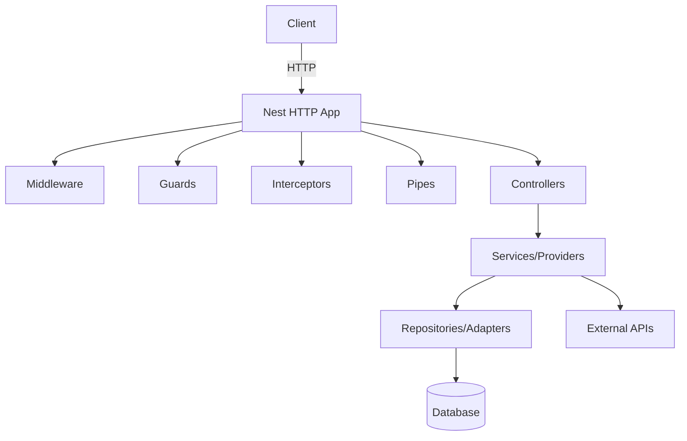

# NestJS Best Practices for Production-Grade Backend Systems

## Executive summary

Nest is designed around a small set of composable primitives—modules, controllers, and providers—backed by dependency injection (DI). Controllers should primarily translate transport concerns into a call to application logic, while providers encapsulate business logic and infrastructure access. Nest’s own docs explicitly frame controllers as request/response handlers and recommend delegating “more complex tasks” to providers. citeturn22view0turn22view1

A high-leverage way to build maintainable Nest systems is to treat modules as *architectural boundaries*, not just a file-organization tool. Modules form an application graph used to resolve dependencies, and their `imports`/`exports` define what is visible and injectable across boundaries. Nest also warns that “making everything global is not recommended,” suggesting controlled imports/exports for clarity and reduced coupling. citeturn20view0

Most “hard” production concerns map cleanly onto Nest’s request lifecycle and cross-cutting constructs. Nest documents the request flow as: middleware → guards → interceptors → pipes → route handler, then back through interceptors on the response path. Building on that mental model avoids a large class of accidental misplacements (e.g., doing authorization in middleware, or doing validation inconsistently). citeturn20view2

Configuration and security are inseparable in practice. Nest’s configuration guidance explicitly recommends failing fast at startup when required environment variables are missing or invalid (e.g., via schema validation). citeturn24view0 This aligns with the “config in env vars” principle from the Twelve-Factor methodology, while also highlighting why secrets still need dedicated handling beyond env vars (audit, rotation, access control). citeturn7search2turn16search3

Performance and scale in Nest are primarily about choosing the right runtime and distribution model. Nest supports swapping the HTTP adapter, and its performance guidance notes that Fastify can benchmark substantially faster than Express while Express remains the default due to ecosystem/middleware breadth. citeturn25view0 For horizontal scale, you typically prefer orchestrator-level replication (containers/VMs) over in-process clustering, but the Node cluster module remains a viable mechanism when you want multiple worker processes sharing a port. citeturn6search2

For persistence, migrations and transaction discipline are the difference between “works locally” and safe production operations. TypeORM’s docs explicitly warn against `synchronize: true` in production and recommend migrations; its transaction docs stress always using the transaction-scoped EntityManager (or a QueryRunner when you need full control). citeturn10search5turn9search0turn9search16 Prisma and Sequelize provide different transaction and migration workflows with distinct operational constraints, and you should align the ORM choice with your domain complexity, typing needs, and deployment workflow. citeturn10search0turn10search8turn10search2

## Architecture and project structure

**Rationale**  
The most reliable way to keep a Nest codebase maintainable under team and feature growth is to align code structure with dependency structure. Nest modules are explicitly intended to organize the application graph and dependency resolution, and the `exports` of a module function as its “public interface.” citeturn20view0 This is the primary enforcement mechanism you get “for free” to prevent a large monolith from turning into a shared-state tangle.

**Recommended patterns**

**Modular monolith by default, microservices selectively**  
A “modular monolith” is typically the best starting point: one deployable artifact but strict internal boundaries via feature modules and explicit imports/exports. Nest itself encourages multiple feature modules that encapsulate a closely related set of capabilities. citeturn20view0 Move to microservices when you have clear drivers (independent scaling, failure isolation, organizational boundaries, or heterogeneous workloads), and when you are prepared to pay the complexity tax of distributed systems.

**Vertical slice feature modules**  
Organize code by feature (users, billing, catalog) rather than by technical type (controllers/, services/, repositories/). Nest’s “feature modules” example groups a controller and service serving the same domain into a module, explicitly motivating this as a boundary/organization decision. citeturn20view0

**Explicit module APIs via `exports` (avoid global leakage)**  
Use module `exports` deliberately to represent your module API. Nest emphasizes that providers are encapsulated by default and must be exported to be visible to other modules. citeturn20view0 Prefer this over global modules except for truly foundational infrastructure (and even then, minimize scope). Nest explicitly warns that “making everything global is not recommended,” tying it to coupling and maintainability. citeturn20view0

**Dynamic modules for configurable infrastructure**  
If you are building reusable infrastructure modules (e.g., logging, database connection, cache), prefer dynamic modules (`forRoot`/`forRootAsync`) so consumers can configure them at import time. Nest documents dynamic modules as an API for importing modules with customized behavior. citeturn1search4

**DI-first design with custom providers and tokens**  
Dependency injection is central in Nest; “wiring up” providers is handled by the runtime. citeturn22view1turn20view1 For boundaries, prefer injecting abstractions (tokens/interfaces) rather than concrete implementations, and use custom providers (`useFactory`, `useClass`, `useValue`) where runtime configuration or environment-specific bindings are needed. citeturn20view1

**Handle circular dependencies as a code smell, not a normal tool**  
Nest documents forward references and `ModuleRef` as mechanisms to resolve circular dependencies, while also stating they should be avoided when possible. citeturn1search11 Treat circular deps as pressure to redesign boundaries (extract shared domain services, or invert dependencies using tokens).

**Suggested project layout (generalized)**  
This is a practical structure that fits Nest’s primitives and scales to large teams:

- `src/main.ts` (bootstrap, global middleware/pipes/filters, shutdown hooks)  
- `src/app.module.ts` (root module imports only)  
- `src/common/` (cross-cutting: interceptors, filters, guards, pipes, decorators)  
- `src/config/` (configuration schemas, typed config accessors)  
- `src/modules/<feature>/` (feature module vertical slice)  
- `src/infra/` (database module, cache module, messaging module, external clients)

This aligns with Nest’s recommendation to group related controller/service logic into feature modules and keep boundaries explicit. citeturn20view0turn22view1

**Code example: “feature module as boundary + explicit exports”**
```ts
// users/users.module.ts
import { Module } from '@nestjs/common';
import { UsersController } from './users.controller';
import { UsersService } from './users.service';

@Module({
  controllers: [UsersController],
  providers: [UsersService],
  exports: [UsersService], // module API surface
})
export class UsersModule {}
```
citeturn20view0turn22view1

**Trade-offs**

- A strict modular monolith reduces coupling but requires discipline in imports/exports and can feel slower to prototype than “just import everything.” citeturn20view0  
- Dynamic modules improve configurability but can increase complexity (especially when combined with complex initialization order). Nest explicitly warns that some config values may need `onModuleInit()` due to indeterminate module init ordering for partial registrations. citeturn24view0  
- Request-scoped providers can solve per-request state needs, but Nest documents that request scope “bubbles up the injection chain,” potentially making controllers request-scoped and increasing overhead. citeturn2search0

**Common pitfalls**

- Overusing `@Global()` modules, causing hidden dependencies and tight coupling (called out directly by Nest as not recommended as a design practice). citeturn20view0  
- Mixing application-domain logic and infrastructure concerns inside controllers, despite Nest’s guidance to delegate complex tasks to providers. citeturn22view1  
- Solving architecture problems with `forwardRef()` instead of rethinking boundaries. citeturn1search11  
- Introducing request-scoped providers for convenience and unintentionally turning large parts of the graph request-scoped. citeturn2search0

**Checklist**

- [ ] Every feature has a feature module (vertical slice) with explicit exports. citeturn20view0  
- [ ] Root module imports feature modules; feature modules do not import each other “freely” without a boundary reason. citeturn20view0  
- [ ] Global modules are rare and justified; “everything global” is avoided. citeturn20view0  
- [ ] Cross-cutting concerns are implemented via guards/interceptors/pipes/filters rather than ad hoc patterns. citeturn20view2  
- [ ] Circular dependencies are treated as a smell and reduced over time. citeturn1search11  

**Typical architectures (Mermaid)**


citeturn20view2turn22view0turn22view1

```mermaid
flowchart LR
  Client --> GW[API Gateway / BFF]
  GW --> S1[Service A (Nest)]
  GW --> S2[Service B (Nest)]
  S1 --> DB1[(DB A)]
  S2 --> DB2[(DB B)]
  S1 <--> MB[(Message Broker)]
  S2 <--> MB
```
citeturn28search3turn14search3turn14search5

```mermaid
flowchart TB
  Producer[Producer (Nest)] -->|Event| Broker[(Event Stream / Broker)]
  Broker --> Consumer1[Consumer 1 (Nest)]
  Broker --> Consumer2[Consumer 2 (Nest)]
  Consumer1 --> DB[(DB)]
  Consumer2 --> Cache[(Cache)]
```
citeturn28search3turn23view0

## Request lifecycle and cross-cutting concerns

**Rationale**  
Nest’s cross-cutting primitives are *first-class* and map directly onto the request lifecycle. Nest documents the ordering as middleware → guards → interceptors → pipes → route handler (and then interceptors again on the return path). citeturn20view2 You get more predictable behavior—and fewer security and correctness bugs—by placing logic according to that lifecycle rather than scattering it across controllers/services ad hoc.

### DTOs and validation

**Recommended patterns**  
- Use `ValidationPipe` globally so all endpoints enforce input contracts. Nest explicitly calls validation of incoming data “best practice” and documents binding `ValidationPipe` globally. citeturn27view3turn19search2  
- Enable `whitelist` and (for strict APIs) `forbidNonWhitelisted` to prevent unexpected fields. Nest documents both options and their semantics. citeturn19search2turn27view3  
- Keep DTOs as transport-layer contracts; map DTOs to domain commands/objects in services to avoid leaking transport concerns into the domain.

**Code example: global validation + strict whitelisting**
```ts
// main.ts
import { NestFactory } from '@nestjs/core';
import { ValidationPipe } from '@nestjs/common';
import { AppModule } from './app.module';

async function bootstrap() {
  const app = await NestFactory.create(AppModule);

  app.useGlobalPipes(new ValidationPipe({
    transform: true,
    whitelist: true,
    forbidNonWhitelisted: true,
  }));

  await app.listen(process.env.PORT ?? 3000);
}
bootstrap();
```
citeturn27view3turn19search2

**Trade-offs**  
- Strict whitelisting may break older clients that send extra fields, which can be desirable (fail fast) or painful (migration friction). Nest documents both “strip” (whitelist) and “error” (forbidNonWhitelisted) approaches. citeturn19search2turn27view3  
- `transform: true` can be useful but may surprise developers if they assume raw JSON types; treat it as part of the contract and test it.

**Common pitfalls**  
- Inconsistent validation (some controllers use DTOs, others accept `any`). Nest explicitly positions ValidationPipe as the systematic solution. citeturn27view3  
- Assuming `whitelist` throws errors by itself; Nest documents you need `forbidNonWhitelisted` for that behavior. citeturn19search2turn27view3  

**Checklist**  
- [ ] Global ValidationPipe is enabled. citeturn27view3  
- [ ] DTOs exist for every externally-facing request shape. citeturn27view3  
- [ ] `whitelist` and `forbidNonWhitelisted` are enabled for APIs that require strict contracts. citeturn19search2  

### Pipes, interceptors, guards, middleware, exception filters

**Pipes**  
Pipes are intended for transformation and validation. Nest defines them as classes implementing `PipeTransform` and calls out transformation/validation as the two typical use cases. citeturn1search5turn19search3

**Interceptors**  
Interceptors can wrap the request/response flow, can inject dependencies, and are bound globally/controller/method-scoped via `@UseInterceptors()`. citeturn0search3turn18search10

**Guards**  
Guards implement `CanActivate` and are designed for authorization decisions with access to `ExecutionContext`. Nest contrasts guards with middleware, specifically noting middleware doesn’t know what handler runs next, while guards do. citeturn22view2

**Middleware**  
Middleware runs before guards and supports DI. citeturn20view2turn0search6

**Exception filters**  
Nest has a built-in exceptions layer and a default global exception filter for `HttpException`. Exception filters let you customize the errors layer (including logging and response shape). citeturn26view1

**Code example: structured error responses aligned to RFC 9457 (Problem Details)**  
RFC 9457 defines a standard “problem detail” format and obsoletes RFC 7807. citeturn17search0
```ts
// common/filters/problem-details.filter.ts
import {
  ArgumentsHost,
  Catch,
  ExceptionFilter,
  HttpException,
  HttpStatus,
} from '@nestjs/common';

@Catch()
export class ProblemDetailsFilter implements ExceptionFilter {
  catch(exception: unknown, host: ArgumentsHost) {
    const ctx = host.switchToHttp();
    const res = ctx.getResponse();
    const req = ctx.getRequest();

    const status =
      exception instanceof HttpException
        ? exception.getStatus()
        : HttpStatus.INTERNAL_SERVER_ERROR;

    const title =
      exception instanceof HttpException
        ? (exception.getResponse() as any)?.message ?? 'Request failed'
        : 'Internal Server Error';

    res.status(status).json({
      type: 'about:blank',
      title,
      status,
      instance: req.url,
    });
  }
}
```
citeturn26view1turn17search0

**Trade-offs**  
- Global exception filters help consistency but can hide details during debugging if overly sanitized. Nest notes built-in exceptions are treated as normal flow and not logged by default, which can be surprising in production unless you add explicit logging. citeturn26view1  
- Interceptors are powerful but can introduce subtle behavior in GraphQL: Nest warns that in GraphQL, interceptors execute separately per field resolver, so `CacheModule` auto-caching won’t behave properly. citeturn23view0

**Common pitfalls**  
- Doing authorization in middleware instead of guards (loses access to route metadata/context), despite Nest’s explicit guard/middleware distinction. citeturn22view2  
- Registering security middleware like Helmet after routes; Nest warns order matters and late middleware won’t apply to earlier-defined routes. citeturn27view1  
- Using interceptors for input validation rather than pipes (harder to reason about; breaks locality). citeturn1search5turn20view2

**Checklist**  
- [ ] Middleware is reserved for request-scoped plumbing (correlation IDs, raw-body capture) and not authorization. citeturn22view2turn20view2  
- [ ] Authorization is implemented via guards; authentication integrates with Passport strategies when appropriate. citeturn22view2turn22view3  
- [ ] Interceptors are used for logging, tracing, response shaping, and performance-related cross-cutting concerns (with GraphQL caveats). citeturn23view0turn20view2  
- [ ] A global exception filter enforces a consistent error contract (optionally RFC 9457). citeturn17search0turn26view1  

### API design, OpenAPI, GraphQL, versioning

**REST + OpenAPI**  
The OpenAPI specification is a language-agnostic format for describing RESTful APIs; Nest provides `@nestjs/swagger` to generate an OpenAPI document using decorators, and documents generating the document via `SwaggerModule.createDocument()` on demand to save initialization time. citeturn25view2turn2search2 The OpenAPI Initiative describes OpenAPI as a formal standard enabling documentation, code generation, tests, and design standards. citeturn13search3turn13search16

**GraphQL**  
Nest supports both code-first and schema-first GraphQL approaches; the official docs recommend choosing what fits your needs. citeturn2search6turn17search2 Federation is documented as a gateway + federated services model that splits a monolithic schema into independently owned parts. citeturn2search3

**Versioning**  
Nest supports URI, Header, Media Type, and Custom versioning, and supports configuring a global default version. citeturn26view0

**Code example: enable versioning with a default**
```ts
// main.ts
import { NestFactory } from '@nestjs/core';
import { AppModule } from './app.module';

async function bootstrap() {
  const app = await NestFactory.create(AppModule);

  app.enableVersioning({
    defaultVersion: '1',
  });

  await app.listen(process.env.PORT ?? 3000);
}
bootstrap();
```
citeturn26view0

## Configuration, environment handling, logging, and error discipline

**Rationale**  
Misconfiguration is a common root cause of incidents and is highlighted by OWASP as a critical web risk category (e.g., security hardening gaps and overly informative error messages). citeturn8search12 Configuration in Nest is best treated as a typed, validated API that fails fast at startup.

### Configuration and environment management

**Recommended patterns**  
- Validate environment variables at startup. Nest calls this “standard practice” and supports Joi-based `validationSchema` or a custom `validate()` function in `ConfigModule.forRoot()`. citeturn24view0turn0search1  
- Prefer environment variables as the *injection point into the runtime*, consistent with Twelve-Factor guidance (but still separate secrets management from code). citeturn7search2turn16search3  
- Centralize typed configuration access via a dedicated config module/provider (e.g., `AppConfigService`) so application code never reaches into `process.env` directly (tightens auditability and testability).

**Code example: config schema validation (Joi)**
```ts
// app.module.ts
import { Module } from '@nestjs/common';
import { ConfigModule } from '@nestjs/config';
import * as Joi from 'joi';

@Module({
  imports: [
    ConfigModule.forRoot({
      validationSchema: Joi.object({
        NODE_ENV: Joi.string().valid('development', 'test', 'production').default('development'),
        PORT: Joi.number().port().default(3000),
      }),
    }),
  ],
})
export class AppModule {}
```
citeturn24view0turn0search1

**Trade-offs**  
- Strong env validation improves safety but can slow down “quick local hacking” if developers don’t have defaults; Nest documents defaults and `required()` as alternative strategies. citeturn24view0  
- Even with env vars, secrets still need lifecycle management (rotation, audit, access control). citeturn16search3turn16search1  

**Common pitfalls**  
- Reading values registered via `forFeature()` too early; Nest warns that module initialization order can be indeterminate and recommends `onModuleInit()` for safety. citeturn24view0  

### Logging (structured logs + contextual logging)

**Recommended patterns**  
- Keep Nest’s logger for local dev, but adopt structured logging in production. Nest explicitly notes production apps often use dedicated loggers (e.g., Winston) and that you can use any standard Node logging library. citeturn26view2turn13search0  
- Buffer logs at bootstrap and replace the logger once your custom logger is ready, as documented by Nest (`bufferLogs` + `useLogger`). citeturn26view2  
- Never log secrets; enforce redaction in middleware/interceptors and logger formatters (ties directly into secrets management guidance). citeturn16search3turn16search1  

**Code example: swap in a custom logger**
```ts
// main.ts
import { NestFactory } from '@nestjs/core';
import { AppModule } from './app.module';

class MyLogger {
  log(message: any) { /* ... */ }
  error(message: any, trace?: string) { /* ... */ }
  warn(message: any) { /* ... */ }
  debug?(message: any) { /* ... */ }
  verbose?(message: any) { /* ... */ }
}

async function bootstrap() {
  const app = await NestFactory.create(AppModule, { bufferLogs: true });
  app.useLogger(new MyLogger());
  await app.listen(process.env.PORT ?? 3000);
}
bootstrap();
```
citeturn26view2

**Trade-offs**  
- More structured logging improves observability and querying but requires discipline around schema stability and redaction. Nest explicitly suggests external loggers when you need centralized logging and formatting. citeturn26view2turn13search0  

**Checklist**  
- [ ] Config is validated at startup; missing/invalid env vars fail fast. citeturn24view0  
- [ ] `process.env` access is centralized and typed (config module pattern). citeturn24view0turn7search2  
- [ ] Production logs are structured and redact secrets. citeturn26view2turn16search3  
- [ ] Exception handling produces a stable, documented error contract. citeturn26view1turn17search0  

## Security and authentication strategies

**Rationale**  
A production Nest application is an HTTP API surface by default, and its security posture is shaped as much by defaults and configuration as by “auth code.” citeturn8search12turn24view0 entity["organization","OWASP","web app security nonprofit"] provides both awareness (Top 10) and actionable engineering guidance (Cheat Sheet Series, ASVS), which map well to practical Nest controls like rate limiting, security headers, and consistent error handling. citeturn8search0turn16search3turn8search1

### Baseline HTTP security controls

**Recommended patterns**  
- Apply Helmet early in bootstrap. Nest documents Helmet as middleware that sets security-related HTTP headers and explicitly warns that middleware order matters; applying it after routes means it won’t apply to earlier routes. citeturn27view1turn3search1  
- Configure CORS explicitly, not permissively. Nest documents enabling CORS via `enableCors()` or `cors: true`, deferring options to the underlying CORS package. citeturn27view0turn3search0  
- Enforce rate limiting on publicly exposed routes. Nest provides Throttler and describes rate limiting as a common brute-force mitigation technique. citeturn23view2turn3search2  
- If you use cookie-based auth, address CSRF explicitly. The OWASP CSRF cheat sheet describes CSRF as a browser being tricked into performing an unwanted action on a trusted site when authenticated. citeturn3search3  

**CORS nuance to get right**  
MDN explains that `Access-Control-Allow-Credentials: true` controls whether credentials can be included in cross-origin requests; this is a frequent source of production CORS mistakes (overly broad origins + credentials). citeturn11search3turn11search7

### Auth strategies (JWT, sessions, OAuth2/OIDC)

**Key primitives and why they matter**  
JWT is defined by RFC 7519 as a compact, URL-safe means of representing claims transferred between parties. citeturn5search3turn5search19 In Nest, the official security docs show a canonical pattern: authenticate via username/password, then issue a JWT and send it as a bearer token in the authorization header for subsequent requests. citeturn27view2turn22view3 OAuth 2.0 and OpenID Connect provide standardized authorization and authentication layers respectively, with OIDC explicitly defined as an identity layer built on top of OAuth 2.0. citeturn12search1turn12search2

**Recommended patterns**  
- Prefer “thin auth controllers” that delegate to `AuthService`, following Nest’s general controller/provider separation. citeturn22view1turn27view2  
- Use guards for authorization decisions (role checks, scopes, ABAC), per Nest’s explicit guard responsibility model. citeturn22view2  
- Model auth as two concerns: authentication (who are you) and authorization (what can you do). Nest docs mirror this conceptual split in guard and passport discussions. citeturn22view2turn22view3  
- For session-based approaches, ensure cookie security attributes are correct; Express session docs describe `cookie.secure` and warn about HTTPS vs HTTP visibility. citeturn12search3  

**Code example: guard-based JWT protection (conceptual Nest pattern)**  
```ts
// auth/jwt-auth.guard.ts
import { Injectable } from '@nestjs/common';
import { AuthGuard } from '@nestjs/passport';

@Injectable()
export class JwtAuthGuard extends AuthGuard('jwt') {}
```
citeturn22view3turn1search2

### Comparison table: common auth strategies

| Strategy | Strengths | Trade-offs / risks | CSRF exposure | Operational notes |
|---|---|---|---|---|
| Bearer JWT (access token) | Stateless verification; fits APIs and microservices; standardized token format (RFC 7519) | Revocation and rotation require extra design; token leakage is severe | Low CSRF if not in cookies; XSS remains key threat | Align with Nest guide for issuing JWT bearer tokens citeturn5search3turn27view2 |
| Session cookie | Simple for web apps; server-side revocation is straightforward | Requires session store at scale; cookie security settings are critical | High if state-changing endpoints exist; needs CSRF defense | Express session cookie.secure guidance is explicit citeturn12search3turn3search3 |
| OAuth2 + OIDC (external IdP) | Standardized delegation and SSO; OIDC specifies authentication on OAuth2 | Complexity (redirect flows, token validation, key rotation) | Depends on cookie use + flow | Defined by RFC 6749 and OIDC Core citeturn12search1turn12search2 |
| API keys | Simple for service-to-service or developer keys | Weak user identity; rotation and leakage management needed | Not primarily CSRF-related | Should be treated as secrets and managed accordingly citeturn16search3 |
| Mutual TLS (mTLS) | Strong client identity at transport layer | Harder client provisioning; not a full authorization model | Not CSRF-related | Often combined with service meshes / internal APIs (deployment-driven) |

**Common pitfalls**  
- Treating CORS as an auth mechanism. CORS controls browser access to responses; it is not identity or authorization. (This is a security design pitfall; MDN’s CORS guidance describes request/response sharing semantics, not authentication.) citeturn11search7  
- Registering Helmet/CORS after routes (they won’t apply). Nest explicitly warns about middleware order. citeturn27view1  
- Building authorization into “fat” middleware rather than guards, losing handler context and route metadata. citeturn22view2turn20view2  

**Checklist**  
- [ ] Helmet is applied early; CSP and other headers are validated in staging. citeturn27view1  
- [ ] CORS is explicit (origins, headers, credentials) and tested with real browser clients. citeturn27view0turn11search7  
- [ ] Rate limiting is enabled for sensitive endpoints (login, password reset). citeturn23view2  
- [ ] Cookie-based auth includes CSRF protection and safe cookie attributes. citeturn3search3turn12search3  
- [ ] AuthZ logic is implemented in guards (roles/scopes/policies), not scattered. citeturn22view2  

## Persistence and database patterns

**Rationale**  
Data access is where correctness, performance, and operability intersect. Nest provides first-class integration guidance for multiple ORMs and explicitly positions TypeORM integration as a core technique, while Prisma and Sequelize are covered as recipes. citeturn4search0turn4search1turn4search2 A production-grade system must also treat migrations and transactions as operational primitives, not as “dev conveniences.” citeturn10search5turn9search0turn10search8

### ORM comparison table (TypeORM vs Prisma vs Sequelize)

| Capability | TypeORM | Prisma | Sequelize |
|---|---|---|
| Nest integration | Official integration guidance via `@nestjs/typeorm` (database technique) citeturn4search0 | Official Nest recipe recommends abstracting Prisma Client behind a PrismaService citeturn4search1 | Nest recipe exists; also out-of-the-box `@nestjs/sequelize` package is recommended to avoid overhead citeturn4search2 |
| Transactions | Docs emphasize always using the provided transactional EntityManager, not global manager citeturn9search0 | Supports interactive transactions via `$transaction(async (tx) => ...)` citeturn9search2 | Supports managed transactions via `sequelize.transaction(async () => ...)` and documents this as recommended citeturn10search16 |
| Migrations | Strong migration tooling; “unsafe” to use `synchronize: true` in production citeturn10search5turn9search13 | Clear dev vs production workflows; apply migrations in production via `migrate deploy` citeturn10search8turn10search0 | Migration system documented; supports undo workflows citeturn9search3turn10search6 |
| Typing model | TS-first ORM, but runtime reflection patterns vary by setup citeturn4search0 | Strong typed client model generated from schema citeturn4search1turn9search2 | TypeScript support exists but tends to be model-centric citeturn9search3 |
| Operational gotchas | Transaction scope discipline; migration generation and review required citeturn9search0turn9search5 | Migration drift workflows; production uses deploy not dev citeturn10search8turn10search4 | Ensure transaction usage and migration practices, as docs state Sequelize doesn’t use transactions by default citeturn10search2 |

### Recommended database patterns

**Repository and service layering**  
- Controllers should delegate; providers encapsulate logic; repositories/adapters encapsulate persistence. Nest explicitly frames controllers as delegating complex tasks to providers. citeturn22view1  
- Do not leak ORM entities into external API DTOs. Map boundaries explicitly (reduces accidental coupling and security leakage).

**Transactions: define boundaries explicitly**  
- In TypeORM, always operate through the transaction-scoped EntityManager; TypeORM docs warn “DO NOT USE GLOBAL ENTITY MANAGER” inside transaction callback. citeturn9search0  
- Nest’s database technique recommends QueryRunner for full control over transaction. citeturn9search16  
- In Prisma, use `$transaction` for sequential operations (interactive transactions). citeturn9search2  
- In Sequelize, prefer managed transactions; docs state they are recommended and automatically roll back on error. citeturn10search16

**Code example: TypeORM transaction (QueryRunner style, conceptual)**
```ts
// orders.service.ts (TypeORM style)
import { Injectable } from '@nestjs/common';
import { DataSource } from 'typeorm';

@Injectable()
export class OrdersService {
  constructor(private readonly dataSource: DataSource) {}

  async placeOrder() {
    const queryRunner = this.dataSource.createQueryRunner();
    await queryRunner.connect();
    await queryRunner.startTransaction();
    try {
      // Use queryRunner.manager for all reads/writes
      // await queryRunner.manager.save(...)
      await queryRunner.commitTransaction();
    } catch (e) {
      await queryRunner.rollbackTransaction();
      throw e;
    } finally {
      await queryRunner.release();
    }
  }
}
```
citeturn9search16turn9search0

**Code example: Prisma interactive transaction**
```ts
// orders.service.ts (Prisma style)
import { Injectable } from '@nestjs/common';
import { PrismaService } from '../infra/prisma.service';

@Injectable()
export class OrdersService {
  constructor(private readonly prisma: PrismaService) {}

  async placeOrder() {
    return this.prisma.$transaction(async (tx) => {
      // await tx.order.create(...)
      // await tx.inventory.update(...)
      return { ok: true };
    });
  }
}
```
citeturn9search2turn4search1

**Migrations: production safety rules**  
- TypeORM: migrations are the production-safe mechanism; docs explicitly warn against `synchronize: true` in production. citeturn10search5turn9search1  
- Prisma: apply migrations in production via `migrate deploy` as part of CI/CD. citeturn10search8turn10search0  
- Sequelize: migrations are version control for schema; docs describe both applying and undoing migrations. citeturn9search3turn10search6

**Trade-offs**  
- Strict transaction discipline increases code verbosity but prevents subtle partial write bugs. TypeORM and Sequelize docs both highlight transaction boundary semantics explicitly. citeturn9search0turn10search16  
- ORM choice impacts migration workflow and deployment coupling (Prisma’s dev vs deploy split is explicit in docs). citeturn10search0turn10search8  

**Checklist**  
- [ ] Production uses migrations, not auto-sync schema hacks. citeturn10search5turn10search8  
- [ ] All multi-step writes run in explicit transactions appropriate to the ORM. citeturn9search0turn10search16turn9search2  
- [ ] DTOs are separated from entities/models; mapping is explicit. citeturn22view1turn27view3  

## Performance, scalability, microservices, WebSockets, and deployment patterns

**Rationale**  
Nest gives you several “scale levers”: swap HTTP adapters, use caching, move to message-based microservices, and choose real-time transport via WebSockets. citeturn25view0turn23view0turn28search3turn4search6 For production deployments, you also want predictable startup/shutdown behavior and health signaling, which Nest documents in its deployment and lifecycle guidance. citeturn23view3turn6search3turn28search2

### HTTP runtime performance: Express vs Fastify

By default Nest uses Express via an adapter; Nest’s performance documentation states Fastify is “much faster than Express” in benchmark results, while Express remains default due to being widely used and having extensive middleware compatibility. citeturn25view0turn6search0

**Code example: bootstrap with FastifyAdapter**
```ts
import { NestFactory } from '@nestjs/core';
import { FastifyAdapter, NestFastifyApplication } from '@nestjs/platform-fastify';
import { AppModule } from './app.module';

async function bootstrap() {
  const app = await NestFactory.create<NestFastifyApplication>(
    AppModule,
    new FastifyAdapter(),
  );
  await app.listen(process.env.PORT ?? 3000);
}
bootstrap();
```
citeturn25view0turn6search0

**Trade-offs**  
- Fastify can materially improve throughput/latency, but Express-oriented middleware/recipes may not work; Nest warns to use Fastify equivalents. citeturn25view0

### Caching

Nest’s caching technique documents that caching improves performance by storing frequently used data. It uses `@nestjs/cache-manager` and `cache-manager`, and explicitly notes it stores in memory by default and uses Keyv under the hood, enabling switching to Redis via the appropriate package. citeturn23view0turn0search2

**Caching solutions comparison**

| Cache approach | Best for | Key trade-offs | Notes |
|---|---|---|---|
| In-memory (default) | Single-instance apps, small datasets | Not shared across replicas; limited by process memory | Nest uses in-memory by default citeturn23view0 |
| Redis-backed cache | Shared cache across replicas | Requires eviction policy and capacity planning | Redis supports configurable eviction policies citeturn11search6turn11search2 |
| HTTP caching/CDN | Public GET endpoints, static-ish resources | Cache invalidation complexity; vary-by-auth | OpenAPI can document cache-related headers and semantics citeturn13search7turn25view2 |
| Application response caching interceptor | Simple GET response caching | Not suitable for GraphQL field-by-field execution | Nest warns CacheModule interceptor behavior in GraphQL citeturn23view0 |

**Code example: manual cache access**
```ts
import { Inject, Injectable } from '@nestjs/common';
import { CACHE_MANAGER } from '@nestjs/cache-manager';
import type { Cache } from 'cache-manager';

@Injectable()
export class PricingService {
  constructor(@Inject(CACHE_MANAGER) private cache: Cache) {}

  async getPrice(sku: string) {
    const key = `price:${sku}`;
    const cached = await this.cache.get<number>(key);
    if (cached != null) return cached;

    const computed = 123; // compute or fetch
    await this.cache.set(key, computed, 60_000);
    return computed;
  }
}
```
citeturn23view0turn0search2

### Clustering and horizontal scale

Node’s `cluster` module allows creating child processes that share server ports and distribute workload; Node docs also note that if process isolation is not needed, `worker_threads` may be preferable. citeturn6search2 For most production deployments, container/VM replication behind a load balancer is operationally simpler than in-process clustering, but `cluster` remains relevant for certain deployment models. citeturn6search2turn23view3

### Microservices and event-driven architectures

Nest microservices support multiple transporters and abstract them behind a canonical interface supporting request-response and event-based messaging. citeturn28search3turn14search9 Nest provides dedicated transporter guides, including Redis Pub/Sub, RabbitMQ, Kafka, and NATS. citeturn14search1turn14search3turn14search5turn14search0

entity["organization","Redis","in-memory data store"] is documented by Nest as a microservices transporter implementing publish/subscribe semantics. citeturn14search1  
entity["organization","RabbitMQ","message broker"] is described in Nest docs as a lightweight open-source broker supporting multiple protocols and high availability configurations. citeturn14search3  
entity["organization","Apache Kafka","event streaming platform"] is described in Nest’s Kafka chapter as a high-throughput, low-latency platform for real-time data feeds. citeturn14search5  
entity["organization","NATS","messaging system"] is described by Nest as supporting both at-most-once and at-least-once delivery. citeturn14search0

**Trade-offs**  
- Microservices improve independent scaling and fault isolation but add distributed tracing needs and consistency challenges. Nest’s canonical interface reduces some implementation friction, but operational concerns remain. citeturn28search3turn5search0  
- Redis Pub/Sub (as a transporter) does not store message history—Pub/Sub is ephemeral—so it’s not an event log (the Nest Redis transporter docs focus on Pub/Sub semantics). citeturn14search1  

### WebSockets

Nest documents gateways as classes annotated with `@WebSocketGateway()` and emphasizes that most Nest concepts (DI, filters, pipes, guards, interceptors) apply equally to gateways. It supports socket.io and ws out-of-the-box. citeturn4search6turn4search3 The adapter docs state `WsAdapter` is “far faster” than socket.io but has fewer out-of-the-box features. citeturn25view1

**Scaling socket.io**  
Nest’s WebSocket adapter docs warn that for socket.io with multiple load-balanced instances, you need to disable polling or use cookie-based routing (sticky sessions); Redis alone is not sufficient. citeturn25view1

### Deployment patterns: containers, serverless, and health checks

**Containers**  
Multi-stage builds allow multiple `FROM` stages and copying only build artifacts into the final image, reducing size and leaving behind build dependencies. citeturn8search2turn8search6

**Serverless**  
Nest’s serverless FAQ discusses cold start and provides benchmark comparisons; it also shows that bundling with webpack can significantly reduce bootstrap time in their example measurements. citeturn24view1turn7search0

**Health checks**  
Nest’s deployment docs recommend health checks for production and direct readers to `@nestjs/terminus`; the Terminus recipe describes readiness/liveness checks as crucial in complex setups. citeturn23view3turn28search2

**Readiness/liveness at the orchestrator**  
Kubernetes documents readiness, liveness, and startup probes as the mechanism to decide when to send traffic and when to restart containers. citeturn8search3turn8search7 entity["organization","Kubernetes","container orchestration"] secrets and probed deployments also strongly influence secrets injection and operational safety. citeturn16search0turn8search7

**Checklist**  
- [ ] Choose Fastify when throughput/latency is critical and middleware compatibility is understood. citeturn25view0  
- [ ] Cache keys have explicit TTLs and invalidation plans; GraphQL caching caveats are accounted for. citeturn23view0  
- [ ] WebSocket scaling uses correct socket.io settings (sticky sessions or transport config). citeturn25view1  
- [ ] Health endpoints exist and are wired into orchestrator probes. citeturn28search2turn8search7  
- [ ] Container builds use multi-stage builds to minimize runtime image surface. citeturn8search2turn8search6  

## Testing, CI/CD, observability, and migration strategies

**Rationale**  
Sustainable Nest systems treat tests, delivery, and observability as part of the architecture. Nest provides a dedicated testing module system (`TestingModule`) and documents how to compile and retrieve providers/controllers, including resolving scoped providers via `resolve()`. citeturn2search15

### Testing strategy: unit, integration, e2e

**Unit tests (module-level)**  
Use `Test.createTestingModule` and override providers for test doubles.

**Integration tests (real dependencies in containers)**  
Testcontainers provides throwaway instances of real services running in Docker containers, which improves fidelity vs mocks for data stores and brokers. citeturn15search3turn15search7

**E2E tests (HTTP surface)**  
SuperTest is a common Node library for HTTP assertions. citeturn15search2

**Code example: Nest TestingModule usage**
```ts
import { Test } from '@nestjs/testing';
import { UsersService } from './users.service';

describe('UsersService', () => {
  it('resolves from TestingModule', async () => {
    const moduleRef = await Test.createTestingModule({
      providers: [UsersService],
    }).compile();

    const users = moduleRef.get(UsersService);
    expect(users).toBeDefined();
  });
});
```
citeturn2search15

### Testing frameworks comparison

| Tooling | Strengths | Trade-offs | Sources |
|---|---|---|---|
| Jest | Mature ecosystem; rich mocking/timer controls | Can be heavier/slower in large repos | Jest docs (timer mocks) citeturn15search0turn15search13 |
| Vitest | Modern runner; Vite-powered; works beyond Vite apps | Ecosystem smaller than Jest in some areas | Vitest guide citeturn15search1turn15search5 |
| Node built-in test runner | No external dependency; ships with Node | Smaller plugin ecosystem; you build conventions yourself | Node docs on test runner citeturn21search3turn21search7 |
| Mocha (+ Chai) | Flexible, classic; pairs with many assertion libs | More assembly required (assertions, mocks, coverage) | Mocha/Chai sites citeturn21search0turn21search2 |

**Recommended conventions**  
- Keep unit tests pure: isolate side effects using provider overrides and interface tokens. citeturn20view1turn2search15  
- For integration tests, avoid bind mounts because they are not portable; Testcontainers docs explicitly call this “Not recommended.” citeturn15search21  
- For e2e tests, validate both response shape and error contract (especially if using RFC 9457). citeturn17search0turn26view1

### CI/CD

entity["company","GitHub","code hosting platform"] Actions supports caching dependencies; the official documentation explains cache lookup semantics using keys and restore keys. citeturn7search3turn7search11

**Code example: dependency caching pattern (conceptual)**
```yaml
name: ci
on: [push, pull_request]
jobs:
  test:
    runs-on: ubuntu-latest
    steps:
      - uses: actions/checkout@v4
      - uses: actions/setup-node@v4
        with:
          node-version: '24'
          cache: 'npm'
      - run: npm ci
      - run: npm test
```
citeturn7search11turn7search3turn18search0

**Recommended patterns**  
- Run migrations in CI/CD where applicable (e.g., Prisma `migrate deploy` in staging/prod). citeturn10search8turn10search0  
- Treat Node runtime upgrades as a delivery concern: Node’s official releases page lists version status and EOL state; Nest deployment docs recommend at least an LTS version in production. citeturn18search0turn23view3

### Observability: metrics, tracing, structured logs

entity["organization","OpenTelemetry","observability framework"] provides guidance for instrumenting Node.js apps with traces and metrics. citeturn5search0turn5search4  
entity["organization","Prometheus","monitoring system"] recommends instrumenting services using client libraries and exposing metrics via an HTTP endpoint. citeturn5search2 The widely used Node client `prom-client` also documents exposing metrics via `registry.metrics()`. citeturn5search6

**Recommended patterns**  
- Add request-level correlation IDs (middleware) and propagate into logs/traces. (This is primarily a design recommendation; OpenTelemetry resource/log correlation guidance motivates linking telemetry across signals.) citeturn5search16turn5search4  
- Prefer structured logs; Nest explicitly recommends external loggers like Winston or Pino for production needs. citeturn26view2turn13search0  
- Expose `/metrics` and `/health/*` endpoints and wire them to your orchestrator. citeturn5search2turn28search2turn8search7  

### Migration strategies (framework, runtime, architecture)

**Nest major upgrades**  
Nest maintains a migration guide; the current official doc explicitly describes migrating from v10 to v11 and recommends `npm-check-updates` for upgrading packages. citeturn24view2turn18search1

**Runtime upgrades (Node)**  
Node’s release status and EOL matter for security patch availability; Node’s EOL page explicitly states that EOL versions stop receiving updates, including security patches. citeturn18search8turn18search0

**Architecture migration (monolith → microservices)**  
Use Nest’s microservices abstraction to incrementally extract capabilities behind transporters while keeping a canonical messaging interface for request-response and event-based patterns. citeturn28search3turn14search9 Start with “strangler” cuts (one bounded context at a time), and invest early in distributed tracing and contract testing.

**HTTP adapter migration (Express → Fastify)**  
Nest’s performance chapter states migration between adapters is supported because of its framework adapter architecture; while the change can be straightforward, you must account for Express-specific middleware/recipes being incompatible under Fastify. citeturn25view0turn6search0

**Checklist**  
- [ ] Nest upgrades follow official migration guides; breaking changes are validated in CI. citeturn24view2turn18search1  
- [ ] Production Node versions are Active LTS or Maintenance LTS; EOL is avoided. citeturn18search0turn18search8  
- [ ] Microservice extraction is paired with observability (tracing/metrics/logs). citeturn5search0turn5search2turn26view2  

## Appendix

### Quick reference: Nest CLI and project generation

- Generate a module: `nest g module <name>` (referenced in module docs). citeturn20view0  
- Generate a resource (CRUD scaffold + DTOs + tests): `nest g resource <name>` (CRUD generator docs). citeturn18search6turn22view0  
- Build: `nest build` (CLI usage docs describe responsibilities including OpenAPI/GraphQL plugin annotation). citeturn18search2turn28search9  

### Configuration snippets

**Global env validation (Joi)** — see Section “Configuration and environment management.” citeturn24view0

### Validation snippets

**Strict global ValidationPipe**
```ts
app.useGlobalPipes(new ValidationPipe({
  transform: true,
  whitelist: true,
  forbidNonWhitelisted: true,
}));
```
citeturn19search2turn27view3

### Caching snippets

**Install and enable cache**
- Install: `npm install @nestjs/cache-manager cache-manager` citeturn23view0turn0search2  
- Enable: `CacheModule.register()` citeturn23view0  

### Database migration commands

**TypeORM CLI (examples)**
- `typeorm migration:generate`  
- `typeorm migration:run`  
- `typeorm migration:revert`  
(TypeORM “Using CLI” docs enumerate these commands.) citeturn9search13

**Prisma production migration**
- Run in CI/CD for staging/prod: `prisma migrate deploy` (Prisma docs explicitly recommend applying pending migrations as part of CI/CD). citeturn10search8turn10search0

**Sequelize migrations**
- Apply: `db:migrate`  
- Undo: `db:migrate:undo` / `db:migrate:undo:all` (documented in Sequelize migrations docs). citeturn10search6turn9search3

### Deployment snippets

**Docker multi-stage build (skeleton)**
```dockerfile
FROM node:24-alpine AS build
WORKDIR /app
COPY package*.json ./
RUN npm ci
COPY . .
RUN npm run build

FROM node:24-alpine
WORKDIR /app
COPY --from=build /app/dist ./dist
COPY --from=build /app/node_modules ./node_modules
CMD ["node", "dist/main.js"]
```
Multi-stage behavior (multiple `FROM`, copy artifacts between stages) is described in Docker’s documentation. citeturn8search2turn8search6

**Kubernetes probes (skeleton)**
```yaml
livenessProbe:
  httpGet:
    path: /health/liveness
    port: 3000
readinessProbe:
  httpGet:
    path: /health/readiness
    port: 3000
```
Kubernetes documents that liveness probes determine when to restart a container and readiness probes determine when a container is ready to receive traffic. citeturn8search7turn8search3

**Health checks with Terminus**  
Nest’s Terminus recipe frames readiness/liveness health checks as crucial in complex backend setups and provides conventional endpoint patterns. citeturn28search2turn23view3

### Secrets management quick guidance

Centralized secrets management focuses on storage, provisioning, auditing, rotation, and limiting access—captured directly in the OWASP Secrets Management Cheat Sheet. citeturn16search3 In Kubernetes, Secrets are explicitly designed to hold small sensitive data so you don’t embed confidential values in code or images. citeturn16search0 For managed cloud approaches, AWS Secrets Manager best practices emphasize rotation, monitoring, limiting access, and caching retrieval appropriately. citeturn16search1turn16search18