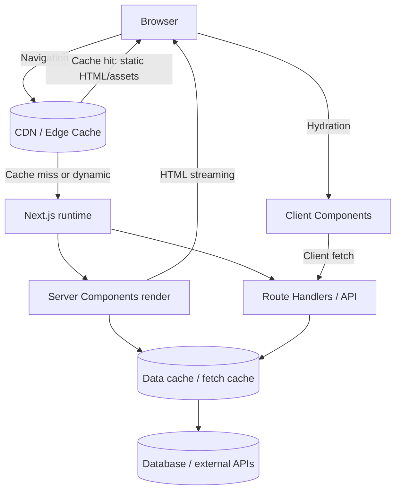
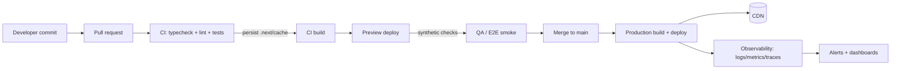

# Next.js Best Practices for the Latest Stable Release

## Executive summary

This document targets the current “latest stable” Next.js line (major v16; latest stable package on npm is v16.1.6 as of January 27, 2026). citeturn0search19turn0search16turn0search12 The guidance prioritizes App Router patterns (React Server Components by default), while providing clear decision points for staying on or incrementally migrating from the Pages Router (including `getStaticProps`, `getServerSideProps`, and ISR). citeturn8search11turn5search26turn0search34turn0search10

The most robust “default” strategy for modern Next.js applications is: adopt the App Router, minimize Client Components, fetch data on the server using `fetch` + explicit caching/revalidation semantics, treat caching as a multi-layer system (route, data, and client router), and measure performance with Core Web Vitals using production RUM, not only local Lighthouse. citeturn5search0turn6search5turn6search0turn4search2turn11search0

Operationally, teams should standardize on TypeScript, upgrade using official codemods, lock runtime baselines (Node 20.9+ for Next 16), and instrument early using the built-in instrumentation hook plus OpenTelemetry. citeturn3search1turn3search6turn11search5turn2search2

Finally, production readiness is achieved by treating Next as a full-stack runtime: apply a security posture (CSP, headers, data-leak auditing), enforce accessibility checks (lint + automated audits), and implement a CI/CD pipeline that caches `.next/cache`, runs tiered tests, and reports deploy-time regressions through dashboards and alerts. citeturn1search2turn9search17turn4search0turn12search3turn9search2

## Assumptions and baseline standards

This report is generalized; where unspecified, the recommendations assume the following “reasonable default” constraints:

A typical B2C or B2B web application: tens to hundreds of routes, a mix of marketing (mostly static) and authenticated product areas (dynamic), and moderate backend complexity (REST/GraphQL and/or direct database access). The team size is assumed to be 3–12 engineers, shipping weekly or faster, with a budget that supports managed hosting but still values cost control. (Where cost or compliance differs, each section highlights how to adapt.)

A modern runtime baseline: Next.js 16 requires Node.js 20.9+ and TypeScript 5+; the report assumes you can meet those prerequisites. citeturn3search1

Success is defined using measurable outcomes. Minimum “health targets” typically include: Core Web Vitals at the recommended “good” thresholds (LCP ≤ 2.5s, INP ≤ 200ms, CLS ≤ 0.1) at the 75th percentile of real-user page loads, plus stable error rates and acceptable server latency (TTFB and API p95). citeturn4search2turn4search13turn4search8

## Architecture and routing design

### Router selection and evolution strategy

The Pages Router remains supported, but current documentation explicitly recommends migrating to the App Router to leverage React’s latest capabilities. citeturn8search11turn0search34 In practice, the best practice for new greenfield work is App Router-first, with Pages Router reserved for legacy apps, incremental migrations, or specific compatibility constraints (for example, teams heavily invested in `getStaticProps`/`getServerSideProps` patterns or older middleware conventions).

A pragmatic migration approach is “hybrid by feature area”: keep existing `pages/` routes stable while introducing new product features in `app/`, converging slowly toward App Router. This aligns with Next.js’ maintained support for both routing systems while you adopt newer patterns like Server Components and route-level caching/revalidation. citeturn8search11turn5search26turn6search5

### File-system routing patterns that scale

For App Router, treat the filesystem as an architecture surface area, not merely a URL mapper:

Route Groups are a key maintainability tool: they organize code without affecting the URL path, enabling re-usable layouts, multiple “root-like” layouts for different sections, and clearer ownership boundaries. citeturn8search10

`not-found.js` and `global-not-found.js` should be used deliberately. Prefer segment-scoped not-found pages for feature areas that have distinct UX, and reserve a global 404 for truly unmatched routes across the app. citeturn8search0

Parallel Routes are best limited to cases where independent loading/error boundaries on the same URL materially improve UX (dashboards, multi-pane views, inboxes). They add power, but they also add cognitive complexity and more moving pieces to debug. citeturn3search4turn3search0

### Architecture diagram for a typical App Router system



This diagram reflects the modern “server-first” approach: render and fetch on the server (Server Components) with controlled client islands for interactivity, and avoid making the browser the default data orchestrator unless the UX genuinely requires it. citeturn5search0turn6search4turn6search5turn5search2

### Comparison table for routing approaches

| Approach | Best fit | Recommended patterns | Key trade-offs | Migration notes |
|---|---|---|---|---|
| App Router (`app/`) | Most new apps; complex layout composition; server-first rendering | Server Components by default; Route Groups; Route Handlers; segment-level error/loading/not-found | Steeper learning curve; caching model is powerful but subtle; requires discipline around Client Components | Incrementally adopt in a hybrid repo; use version upgrade guides and codemods when crossing majors citeturn3search1turn6search5turn8search10turn5search2 |
| Pages Router (`pages/`) | Legacy apps; teams with heavy `getStaticProps`/`getServerSideProps` usage; simpler mental model | Use `getStaticProps` + ISR for content; `getServerSideProps` for per-request auth; API Routes for BFF | Less direct access to RSC-centric features; requires explicit data fetching functions per page | Next docs recommend migrating toward App Router for newest features citeturn0search34turn0search2turn0search6turn5search6 |

## Data fetching, mutations, and state management

### Pages Router data fetching best practices

For Pages Router, the best practice is to select the rendering mode per route based on content volatility and personalization.

`getStaticProps` is ideal for static content and for content that can tolerate being stale between regenerations; it generates HTML and a JSON payload used for client-side transitions. citeturn0search2

ISR (“Incremental Static Regeneration”) is typically implemented by returning `revalidate` from `getStaticProps` (time-based) and/or using on-demand flows; the main operational benefit is reducing full rebuild frequency while keeping pages reasonably fresh. Next’s docs emphasize ISR as a first-class option in data fetching patterns. citeturn0search10turn0search2turn7search0

`getServerSideProps` is best for request-time personalization (auth-gated, per-user) or truly real-time data, with the explicit cost of per-request rendering latency. citeturn0search6

Concrete Pages Router snippet:

```ts
// pages/products/[id].tsx
export async function getStaticProps({ params }) {
  const product = await fetch(`https://api.example.com/products/${params.id}`).then(r => r.json())
  return { props: { product }, revalidate: 60 } // ISR every 60s
}

export async function getStaticPaths() {
  const ids = await fetch(`https://api.example.com/products`).then(r => r.json())
  return { paths: ids.map((id: string) => ({ params: { id } })), fallback: "blocking" }
}
```

The trade-off here is build-time vs runtime cost: generating many static paths increases build time; generating fewer paths reduces build time but relies on on-demand generation during traffic spikes. citeturn8search8turn8search5turn0search2

### App Router fetching and caching semantics

In App Router, Server Components are default, and you can fetch using `fetch` (or any server I/O) directly in your component tree. citeturn6search4turn5search0

The most important best practice: be explicit about caching and revalidation, because correctness issues (stale data) and cost issues (over-rendering) often come from implicit defaults and misunderstood layers. Next.js documents caching and revalidation as a core system and provides APIs for controlling it effectively. citeturn6search5turn6search0turn6search15turn6search9

Canonical pattern for time-based revalidation on server fetch:

```ts
// app/products/page.tsx
export default async function ProductsPage() {
  const products = await fetch("https://api.example.com/products", {
    next: { revalidate: 300 }, // refresh at most every 5 minutes
  }).then(r => r.json())

  return <ProductsList products={products} />
}
```

Next’s caching guidance highlights that `fetch` can be revalidated via `next.revalidate`, and route rendering behavior can be configured with Route Segment Config. citeturn0search24turn6search5turn6search7

For on-demand correctness after mutations, favor cache invalidation primitives like `revalidatePath` (invalidate a route) or tag-based invalidation, called from server-only contexts (Server Functions / Route Handlers). citeturn6search9turn6search17

```ts
// app/actions.ts
"use server"

import { revalidatePath } from "next/cache"

export async function updateInventory(productId: string) {
  await fetch(`https://api.example.com/products/${productId}/inventory`, { method: "POST" })
  revalidatePath("/products")
}
```

`revalidatePath` is documented as callable in Server Functions and Route Handlers (not Client Components). citeturn6search9

### Mutations and backend-for-frontend boundaries

Server Actions are the preferred mutation primitive in the App Router model when you are mutating data “from a component” (forms, buttons), because they keep mutation logic server-side without requiring you to manually create an internal API route. citeturn5search1turn5search14

Route Handlers are the preferred primitive when you need explicit HTTP endpoints (webhooks, third-party clients, proxy/BFF endpoints) and are described as App Router equivalents of Pages Router API Routes. citeturn5search2turn5search6turn5search9

Best practice: don’t mix both patterns for the same responsibility. Use Server Actions for internal UI-driven mutations; use Route Handlers for public HTTP APIs or integration boundaries.

### State management: choose the minimum viable mechanism

A modern Next.js best practice is to treat “server state” (data from APIs/databases) differently from “client UI state” (local interaction state), and avoid centralizing everything in a global client store by default.

For small-to-medium apps, prefer:
- server state: Server Components + cached `fetch` + revalidation
- local UI state: React component state in Client Components
- shared UI state: Context for low-frequency updates and limited scope

This aligns with Next.js’ “Server and Client Components” guidance: Server Components handle server data and rendering; Client Components exist for interactivity and browser APIs (including state hooks). citeturn5search0turn5search16

If you do need global client state (complex UI workflows, offline drafts, multi-step forms spanning routes), prefer to confine it to a small subtree rather than the whole app shell. Vercel’s guidance on using React context inside Next.js can help standardize patterns here. citeturn10search24turn10search35

If you adopt Redux, follow the App Router-specific setup guidance, because the App Router model changes assumptions about per-request isolation; Redux Toolkit warns about global variables like stores being shared across requests if misused. citeturn10search2

### Comparison table for data fetching methods

| Method | Router | Where it runs | Cache model | Best use cases | Common pitfalls |
|---|---|---|---|---|---|
| `getStaticProps` | Pages | Build time | Static output; can pair with ISR | Marketing pages, docs, content that changes predictably | Overbuilding too many pages; stale content if revalidate is too long citeturn0search2turn0search10 |
| `getServerSideProps` | Pages | Per request | No static cache by default; relies on HTTP/CDN caching you add | Auth-gated pages, personalization, real-time dashboards | Higher TTFB/cost; poor caching strategy can overload origin citeturn0search6 |
| ISR (`revalidate` in `getStaticProps`) | Pages | Background regeneration | Time-based regeneration; can reduce rebuilds | Large sites with frequent content updates | Confusing rebuild vs revalidate; missing on-demand invalidation conventions citeturn0search10turn7search0 |
| Server `fetch` in Server Components | App | Server render / preregeneration | Explicit cache + revalidate via `next` options; integrates with route caching | Default choice for most data reads | Misunderstanding caching layers; accidentally opting into dynamic rendering citeturn6search4turn6search5turn6search0 |
| Client-side fetching (SWR/Query libs or `fetch`) | Both | Browser | Browser cache + library cache | Highly interactive views; live updates; optimistic UI | Hydration waterfalls; duplicated fetching if server prefetch not coordinated citeturn6search4turn10search5 |

## Performance, caching, and delivery optimization

### Rendering strategy as a performance lever

Treat rendering as a cost/latency/correctness triangle:

Static rendering yields best CDN cacheability and low origin cost; dynamic rendering yields freshness and personalization but increases latency and origin compute; hybrid approaches attempt to combine benefits, but require carefully managed boundaries. Next explicitly documents rendering strategies and caching behavior, and highlights how static rendering results can be reused across requests. citeturn6search0turn0search11turn2search11

Next’s newer capabilities (like Cache Components and the `"use cache"` directive) are opt-in and exist to make caching more explicit and composable in Server Components, reducing the “static vs dynamic” false dichotomy. citeturn6search3turn6search32turn0search16turn6search2

Because these features directly affect correctness, treat them as “performance engineering tools” that should be adopted with measurable success criteria and clear ownership, not as default magic.

### A practical caching mental model

Use a layered mental model: server-side caching (data and route output) and client-side router caching interact, and “surprises” often occur at boundaries. Next’s caching guides emphasize rendering strategies and how caching relates to route HTML generation and reuse. citeturn6search0turn6search5turn2search11

Best practice debugging workflow:
1) Determine whether the route is static or dynamic (Route Segment Config, dynamic API usage, and fetch caching behavior).
2) Confirm fetch caching/revalidation semantics (time-based vs on-demand).
3) Validate client navigation behavior (router cache) vs full reload behavior.

This aligns with documented behaviors such as dynamic APIs opting into dynamic rendering and the framework’s surfaced errors/warnings for static-to-dynamic transitions and sync dynamic APIs. citeturn5search15turn6search35turn6search7

### Code splitting, dependency control, and bundle analysis

Next performs automatic code splitting and optimization, but it also documents cases where manual optimization is necessary and provides tooling guidance for package bundling and bundle analysis. citeturn2search3turn2search1

Best practice: enforce a bundle budget and investigate regressions before they hit production. Use bundle analyzers during performance work and when adding large dependencies. citeturn2search1turn9search2

A typical Webpack analyzer setup:

```ts
// next.config.ts
import type { NextConfig } from "next"
import bundleAnalyzer from "@next/bundle-analyzer"

const withBundleAnalyzer = bundleAnalyzer({ enabled: process.env.ANALYZE === "true" })

const nextConfig: NextConfig = {
  // config...
}

export default withBundleAnalyzer(nextConfig)
```

The `@next/bundle-analyzer` plugin is explicitly documented as a way to generate a visualization of module sizes to help reduce data transferred to the client. citeturn2search1

### Image optimization and its operational implications

Use `next/image` by default for user-facing images to reduce layout shift and deliver responsive formats; Next documents it as providing size optimization, visual stability, and lazy loading. citeturn7search28turn1search0turn1search4

A common production hardening step is restricting remote image sources via config, because misconfiguration results in runtime errors and unrestricted optimization can create abuse vectors. Next explicitly documents the “unconfigured host” error and points to `images.remotePatterns`. citeturn1search19turn1search8

```ts
// next.config.ts
import type { NextConfig } from "next"

const nextConfig: NextConfig = {
  images: {
    remotePatterns: [
      { protocol: "https", hostname: "cdn.example.com" },
      { protocol: "https", hostname: "images.example.org" },
    ],
  },
}

export default nextConfig
```

### CDN strategy and cache headers

When self-hosting, use a reverse proxy and treat CDN caching as a deliberate design choice. Next’s self-hosting guidance recommends placing a reverse proxy in front of the Next.js server and explains that dynamic APIs affect CDN cacheability via `Cache-Control` semantics (private vs public) depending on whether the output is fully static. citeturn2search11

Operationally, teams should measure:
- CDN cache hit ratio for static assets and static HTML
- origin request rate per route type (static vs dynamic)
- TTFB p50/p95 by route class
- revalidation frequency and failure rates (ISR errors, stale data incidents)

These align with the “production checklist” framing: optimize for user experience and security while understanding what Next does automatically and what you must configure. citeturn9search2turn2search11

## SEO and accessibility

### SEO fundamentals in the App Router model

Use the Metadata APIs (static `metadata` object or `generateMetadata`) to make SEO and shareability declarative and type-safe; these are documented as first-class features. citeturn1search1turn1search5

A typical dynamic metadata pattern:

```ts
// app/products/[id]/page.tsx
import type { Metadata } from "next"

type Props = { params: Promise<{ id: string }> }

export async function generateMetadata({ params }: Props): Promise<Metadata> {
  const { id } = await params
  const product = await fetch(`https://api.example.com/products/${id}`).then(r => r.json())

  return {
    title: product.name,
    description: product.shortDescription,
    openGraph: { title: product.name, description: product.shortDescription },
  }
}
```

This matches the documented support for async `generateMetadata` and segment props. citeturn1search1

For crawlability, prefer built-in `sitemap.(xml|js|ts)` and robots route conventions and scale them using `generateSitemaps` when route counts are large. citeturn4search4turn4search1turn1search9

### Measuring SEO outcomes with performance metrics

Performance directly affects SEO and user experience signals. Google defines Core Web Vitals thresholds and recommends achieving “good” metrics (LCP, INP, CLS) with assessment at the 75th percentile of page visits. citeturn4search2turn4search13turn4search8

Operationally, do not rely only on lab testing: adopt field measurement (RUM). If you deploy on entity["company","Vercel","hosting platform"], Speed Insights provides Core Web Vitals-based views to guide optimization, and the Next.js ecosystem documents both built-in reporting hooks and managed measurement options. citeturn11search0turn11search20turn11search8

### Accessibility as a build-time and runtime standard

Next frames accessibility as a core architectural commitment, and the best practice is to enforce accessibility early through linting and automated testing rather than relying on manual QA alone. citeturn4search0turn4search3

Recommended baseline:
- semantic HTML and correct heading structure
- `alt` text for meaningful images (consistent with `next/image` usage)
- keyboard navigation coverage for critical flows
- automated audits in CI (e.g., axe-based tests) with thresholds

While implementation details vary, the key operational standard is: accessibility issues are treated like defects, with enforcement gates comparable to typechecking or unit tests. Next’s learning materials explicitly position accessibility as part of building better applications, not an afterthought. citeturn4search3turn4search0

## Security and operations

### Security posture: headers, CSP, data boundaries, and secrets

At the HTTP layer, set security headers using `next.config.js` `headers()` and disable unnecessary disclosure headers (such as `x-powered-by`) where appropriate. citeturn9search17turn9search1

Content Security Policy is explicitly documented for Next.js and should be treated as a central anti-XSS control, especially when third-party scripts exist. citeturn1search2turn1search6

At the application boundary, treat Server Components and Server Actions as a data-leak risk surface. Next’s data security guidance emphasizes that React Server Components shift security assumptions, and Vercel’s security material highlights auditing for accidental data exposure. citeturn10search7turn10search19

A concrete best practice is isolation-by-default:
- keep secrets and privileged tokens in server-only modules
- never pass sensitive values as props into Client Components
- use environment variables correctly: only variables prefixed with `NEXT_PUBLIC_` are bundled for the browser; `.env*` should not be committed by default. citeturn4search14turn5search16

Authentication should be modeled explicitly (session, login, authorization), and Next provides guidance on implementing auth using framework primitives. citeturn4search11

### Testing strategy and tool choice

Next documents testing setups and explicitly covers common tools across unit and E2E layers. citeturn1search3

A practical best practice is a pyramid with explicit gates:
- unit tests for deterministic logic and components that do not rely on async Server Component behavior
- integration tests for route handlers and critical UI flows
- E2E tests for auth, navigation, caching correctness on client transitions, and critical business journeys

Next’s Jest guide notes current limitations around async Server Components for unit testing and recommends E2E for those scenarios. citeturn1search11

### Comparison table for testing strategies

| Strategy | What it validates | Best tools (typical) | Strengths | Trade-offs |
|---|---|---|---|---|
| Unit tests | pure functions, sync components, utilities | Jest/Vitest | Fast feedback; good for regressions | Limited for async Server Component behavior citeturn1search11turn1search3 |
| Integration tests | route handlers, data boundaries, component + API | Playwright (integration/E2E) | Validates full stack slices; catches framework edge cases | Slower; requires test data control citeturn1search16turn1search3 |
| E2E tests | user journeys, auth, caching behavior, critical paths | Playwright or Cypress | Highest confidence; closest to real usage | Highest cost; flakiness risk without discipline citeturn1search16turn1search7 |

### CI/CD and build reproducibility

A high-leverage CI best practice is persisting `.next/cache` between builds; Next documents this as necessary to avoid cache warnings and improve CI build performance. citeturn12search3

In addition, measure and trend:
- build time (cold and warm)
- test duration and flake rate
- bundle size budgets
- production error rate per deploy

Turbopack is now stable and default in Next 16; Next’s upgrade guide documents the shift and also documents how to opt out if needed, making CI behavior a version-controlled decision rather than an implicit one. citeturn3search1turn12search7turn0search16

### Observability: logging, metrics, tracing

Instrument early. Next provides an instrumentation file convention (`instrumentation.ts|js`) with a `register` function called once per server instance, designed for initializing monitoring/logging tooling. citeturn11search5turn11search1

OpenTelemetry is explicitly recommended in Next’s docs as a platform-agnostic approach that preserves provider flexibility. citeturn2search2turn11search18

```ts
// instrumentation.ts
import { registerOTel } from "@vercel/otel"

export function register() {
  registerOTel("my-next-app")
}
```

This pattern is directly reflected in the instrumentation convention documentation. citeturn11search5

A minimal observability SLO set commonly includes:
- request latency (p50/p95/p99) per route class
- error rate by route handler / server action
- cache hit ratios (CDN + server cache)
- Core Web Vitals in production (field)

Next also documents built-in approaches to measuring/reporting performance metrics, and managed workflows exist depending on hosting. citeturn11search20turn11search0

### Deployment options and platform trade-offs

Next’s deployment docs list four primary approaches: Node.js server, Docker container, static export, and platform-specific adapters. citeturn2search14turn2search11turn9search3

Key operational best practices across all platforms:
- keep runtime parity between local and production (Node version, env vars)
- ensure durable caching if you rely on ISR/caching across multiple instances
- treat image optimization as a compute/cost factor (especially in self-hosted Docker)

A Docker/self-hosting best practice is to use Output File Tracing / standalone output for smaller deploy artifacts; Next documents output tracing as a build feature that reduces deployment size and deprecates older serverless targets. citeturn2search8turn2search11

For monorepos, configure `outputFileTracingRoot` correctly so traced files outside the app dir are included, as documented in the output config caveats. citeturn3search32turn2search8

### Comparison table for hosting providers

| Platform | Strengths | Watch-outs | Best fit |
|---|---|---|---|
| entity["company","Vercel","hosting platform"] | First-party Next integration; documented support for ISR/Image Optimization; built-in performance insights | Vendor-specific features may influence architecture; cost needs monitoring at scale | Teams optimizing for speed-to-prod and managed operations citeturn7search0turn7search4turn11search0turn9search22 |
| entity["company","Amazon Web Services","cloud provider"] (Amplify Hosting) | Git-based CI/CD workflow; SSR support documented; integrates with AWS ecosystem | Support windows and feature parity vary by Next version; ensure current Next major compatibility | Teams already standardized on AWS and wanting managed hosting citeturn7search1turn7search5turn12search2 |
| entity["company","Netlify","hosting platform"] | “Zero config” Next support via adapter; deploy previews; built-in platform primitives | Platform-specific behavior differences documented (middleware/rewrites ordering, etc.) | Teams wanting Netlify workflows (previews, edge routing) with Next features citeturn11search34turn7search2turn12search1 |
| entity["company","Docker","container platform"] (self-host) | Maximum control; works anywhere Node can run; can customize proxies/CDN | You own scaling, caching durability, WAF/rate limiting; must design for multi-instance cache sharing | Regulated/air-gapped environments; custom infra needs citeturn2search11turn2search8turn2search14 |

### Monorepo and package management

In monorepos, codify boundaries:
- apps (Next apps) vs packages (shared UI/utilities)
- a single source of truth for TS config and lint rules
- reproducible builds through workspace-aware pruning

Turborepo’s documentation provides a canonical workspace structure and emphasizes workspaces as first-class. citeturn3search15

For Next apps inside the monorepo, use:
- `transpilePackages` (when needed for shared local packages)
- `output: "standalone"` + correct `outputFileTracingRoot` for containerized deployments

The output configuration caveats explicitly describe monorepo tracing roots and how to include files outside the app directory. citeturn3search32turn2search8

### TypeScript and configuration hardening

Next supports TypeScript out of the box and will bootstrap recommended config when TypeScript files are added and you run dev/build. citeturn3search2turn3search6

Best practice is to treat TS as a production control:
- enable strictness progressively
- prefer typed routes/links when available (if adopted)
- enforce no-`any` escape hatches in hot paths

Also treat `next.config.ts` as production code; document every non-default setting with rationale and measurable effects.

### Migration strategies and common pitfalls

For framework upgrades, follow version-specific upgrade guides and run official codemods; Next 16’s upgrade guide documents a codemod that updates config and migrates stabilized/deprecated features (including migration from `middleware` to `proxy`). citeturn3search1turn8search3

Be explicit about breaking changes tied to runtime requirements: Next 16 raises Node and TypeScript minimums and changes bundler defaults. citeturn3search1turn12search7

Common production pitfalls to preempt with automated checks:
- unexpected dynamic rendering due to “dynamic APIs” usage and async request APIs changes citeturn5search15turn3search1
- “static to dynamic” errors when static assumptions are violated citeturn6search35
- image optimization breakage due to remote host config mismatch citeturn1search19
- caching confusion after mutations when invalidation is missing or too broad citeturn6search9turn6search17turn6search5

### Deployment flow diagram with CI/CD and observability



CI build caching is documented as using `.next/cache` persisted across builds. citeturn12search3 The recommended instrumentation and OpenTelemetry approach is documented in Next guides. citeturn11search5turn2search2

### Actionable adoption checklist

Adopt these practices as a phased rollout, with explicit owners and measurable outcomes:

- Establish baselines: Node/TypeScript versions, Core Web Vitals targets (p75), error-rate SLOs. citeturn3search1turn4search2turn4search13
- Choose routing strategy: App Router for new work; document a migration plan if legacy Pages Router exists. citeturn8search11turn0search34
- Standardize data fetching: server-first reads with explicit caching/revalidation; on-demand invalidation after mutations. citeturn6search5turn6search9turn5search1
- Minimize Client Components: enforce “client islands” and avoid leaking server-only values to the browser. citeturn5search0turn10search7
- Implement security headers and CSP; disable `x-powered-by`; formalize secret handling and env var policy. citeturn1search2turn9search1turn4search14
- Add SEO primitives: metadata generation, sitemap/robots conventions, and structured release validation for crawlability. citeturn1search1turn4search4turn1search9
- Enforce accessibility: lint rules + automated audits in CI and gates for regressions. citeturn4search0turn4search3
- Add observability: instrumentation hook, OpenTelemetry traces, and production Web Vitals measurement. citeturn11search5turn2search2turn11search0
- Harden CI/CD: persist `.next/cache`, run tiered test suites, and require preview deploy checks before merge. citeturn12search3turn12search0turn12search1
- Document platform-specific constraints (Vercel/AWS/Netlify/Docker) and test them as part of release qualification. citeturn2search14turn7search1turn11search34turn2search11