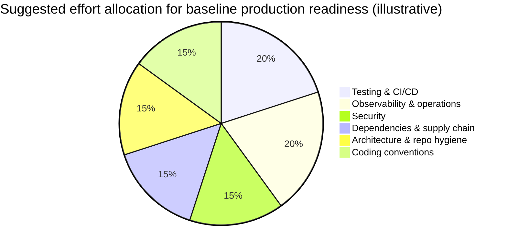
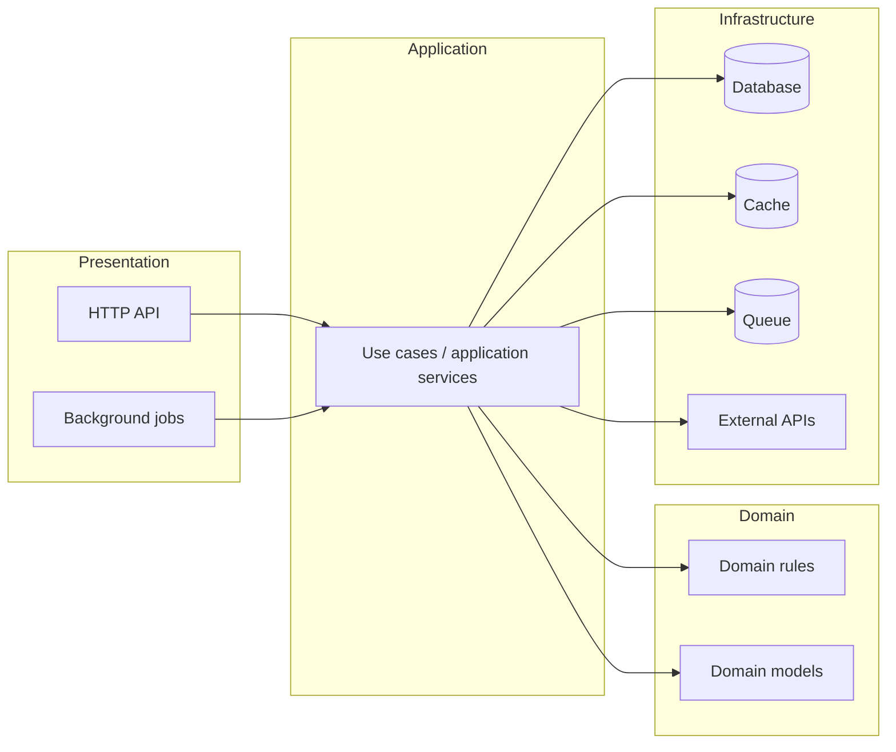

# Node.js Best Practices Blueprint

## Executive summary

A generalized best-practices document for Node.js should be structured as an *operationally enforceable* set of defaults: pinned runtime and tooling, repeatable builds, explicit module boundaries, measurable performance targets, and security/observability controls that can be verified in CI and production. This approach aligns with how Node.js itself evolves (annual major releases; long-term support lines) and how modern JavaScript features arrive via the embedded JavaScript engine. citeturn0search12turn10search11turn15search1

Versioning and determinism are the foundation. If the Node version is unspecified, the safest general default is “target the latest Node.js LTS in production,” and pin it everywhere (local dev, CI, containers). As of 2026-02-11, the Node.js core releases feed labels Node.js 24 as LTS and Node.js 25 as Current. citeturn0search12 A related toolchain implication is that Corepack is no longer distributed starting with Node.js v25, so a “best practices” doc should not assume Corepack availability in future non-LTS lines; instead, it should describe explicit package-manager pinning via project metadata and CI provisioning (or userland Corepack). citeturn5search0turn5search4

On code organization, prefer explicit boundaries over implicit conventions. Use a repository strategy (single repo vs monorepo) that matches the number of deployables, shared libraries, and governance needs. If using monorepos, standardize on workspaces and one build orchestrator (e.g., Nx/Turborepo/Rush) to enable caching and “affected” execution in CI; otherwise, keep the repo single-purpose and avoid introducing multi-package complexity prematurely. citeturn3search14turn6search4turn6search1turn6search6

In coding conventions, the modern default is to treat ECMAScript Modules (ESM) as first-class because Node.js fully supports ESM and provides interoperability with CommonJS. Package authors should prefer explicit package entry points—especially `exports`—to prevent accidental deep imports and to enable controlled public APIs. citeturn33search0turn5search1 If TypeScript is used, document *how* it is executed and built: Node’s TypeScript support is intentionally scoped (erasable syntax and type-stripping/transform flags), so production guidance should still discuss compilation, declaration emission, and runtime compatibility. citeturn1search0turn1search2

Operationally, the document should treat “performance, reliability, security, and observability” as inseparable. The Node event loop and microtask/nextTick behavior can be a hidden source of latency and starvation, so production best practices must explicitly address CPU-bound work (worker threads or separate processes), backpressure, timeouts, and graceful shutdown. citeturn35search0turn35search4turn1search10 For security, anchor controls in authoritative sources: Node.js security guidance plus OWASP cheat sheets (input validation, secure defaults), and enforce dependency and publishing controls (audits, 2FA, provenance). citeturn3search1turn3search0turn16search2turn23search11turn23search2

The chart below is an *illustrative* way to allocate engineering effort when drafting and rolling out the baseline; it is not a survey but a practical prioritization for “production-ready by default.”



## Scope and assumptions

The Node.js version is unspecified. The recommended baseline is to target the latest Node.js LTS line for production and to pin it across developer machines and CI. The Node.js releases feed indicates Node.js 24 is LTS (as of 2026-02-11) and Node.js 25 is Current. citeturn0search12

The deployment environment is unspecified (VMs, containers, Kubernetes, serverless). This report therefore focuses on practices that hold across environments: deterministic builds, minimal privileges, health checks, graceful shutdown, and first-class observability. Where environment-specific concerns matter (e.g., Kubernetes probes), they are presented as patterns with clearly stated assumptions. citeturn7search3turn25search2

Framework choice is unspecified. Guidance is written to apply to most Node.js services, with framework-specific examples for Express/Fastify/NestJS where their official docs provide clear, enforceable practices (error handling, validation, logging). citeturn10search0turn10search1turn10search2

Database choice is unspecified. Data management guidance is therefore primarily about *resource constraints and lifecycle management* (pooling, timeouts, graceful teardown) rather than vendor-specific SQL features. Where vendor docs support general points about connection/resource limits, they are cited. citeturn25search0turn25search9

## Project structure and architecture

### Repository strategy: single repo vs monorepo

**Rationale.** Repository structure is less about fashion and more about *change management*: how many components release independently, how often cross-cutting changes occur, and what governance (code owners, security reviews) is required. In Node.js ecosystems, “monorepo” is frequently implemented via package-manager workspaces, which install and link multiple packages in a single repo. citeturn3search14turn6search7

**Actionable recommendations.**
- Default to a **single repo** when you have one deployable and limited internal libraries; the simplest structure tends to yield the fastest onboarding and least CI/tooling overhead (trade-off: shared libraries may be copied or poorly standardized).
- Prefer a **monorepo** when you have multiple packages/apps with shared code, need consistent tooling and versions, and benefit from “affected-only” CI execution and caching. Nx’s “affected” workflow and Turborepo’s task caching are archetypal mechanisms for this. citeturn6search4turn6search1
- If monorepo: formalize *package boundaries* as if each package were published. Do not allow deep imports into sibling package internals; enforce via `exports` and lint rules. citeturn5search1

**Trade-offs.**
- Monorepos can improve coherence and refactoring velocity but increase tooling complexity and permission surface (more people touching more code). Orchestrators help, but create “tool lock-in” risks.
- Single repos minimize complexity but can lead to duplicated code or inconsistent patterns if multiple services are split later without shared governance.

**Common pitfalls.**
- “Monorepo without boundaries”: shared folders become ad-hoc dependencies and break encapsulation.
- “Multiple repos without standards”: every repo diverges in lint/test/build scaffolding; security controls become inconsistent.

### Monorepo build tooling comparison

| Choice | When it fits | Evidence-based strengths | Typical trade-offs |
|---|---|---|---|
| **entity["organization","Nx","monorepo tooling"]** | Many apps/libs with explicit project graph | “Affected” execution to run tasks only for changed projects improves CI speed. citeturn6search4 | More configuration and stronger conventions; can feel heavy for small repos. |
| **entity["organization","Turborepo","monorepo build system"]** | Task pipelines with aggressive caching | Caching restores task results based on fingerprints, reducing repeated work. citeturn6search1turn6search9 | Feature set is narrower than full “workspace platforms”; some teams add more tools later. |
| **entity["organization","Rush","microsoft monorepo tool"]** | Large-scale, end-to-end monorepo orchestration | Positioning as a unified orchestrator for install/link/build/version/changelogs/publish. citeturn6search6 | Upfront learning curve; best payoff at larger scale. |
| Workspaces-only (no orchestrator) | Small monorepo, few packages | Minimal tool surface; relies on package-manager workspaces. citeturn3search14turn6search7 | CI can become slow without caching/affected execution; scripting tends to grow complex. |

### Layering and module boundaries

**Rationale.** In Node.js services, architecture often degrades not because of performance but because *dependencies sprawl*: business logic becomes inseparable from HTTP concerns, databases, and third-party APIs. A best-practices document should recommend explicit layers (or hexagonal/clean architecture) to force seams for testing and to constrain the blast radius of changes (particularly dependency upgrades).

**Actionable recommendations.**
- Use a small number of *stable layers* (e.g., `presentation` → `application` → `domain` → `infrastructure`) and enforce import rules (“outer may depend on inner; not vice versa”).
- Treat “DTO validation” and “input parsing” as *boundary concerns* and keep domain logic free of transport details.
- Prefer composition at the boundary: construct dependencies in one place (often `main.ts`) and pass them down.

**Trade-offs.**
- Strict layering can feel slower early on because it requires more files and more dependency injection.
- It pays off when adding tests, changing frameworks (Express → Fastify), or swapping infrastructure clients.

**Common pitfalls.**
- Putting database clients into “domain” objects, making business logic untestable without a real DB.
- Writing “service” classes that effectively re-implement controllers and repositories with no clear boundary.

A reference architecture sketch:



### Example repo skeleton

A pragmatic baseline for a “single service” repo:

```text
.
├─ src/
│  ├─ main.ts              # composition root
│  ├─ presentation/        # HTTP, routing, controllers
│  ├─ application/         # use cases (or services)
│  ├─ domain/              # core rules + pure logic
│  ├─ infrastructure/      # DB clients, external APIs
│  └─ shared/              # shared utilities (small)
├─ test/
│  ├─ unit/
│  ├─ integration/
│  └─ e2e/
├─ package.json
├─ tsconfig.json
├─ eslint.config.js
├─ .prettierrc
├─ .editorconfig
└─ .github/workflows/ci.yml
```

For a workspace-based monorepo, the root would introduce workspaces configured by the package manager. citeturn3search14turn6search7

## Coding style, language choices, and API design

### ECMAScript targeting and the “modern Node” baseline

**Rationale.** Node.js language features are largely driven by its embedded JavaScript engine, entity["organization","V8","javascript engine"]. Node.js 24 upgraded to V8 13.6 and explicitly calls out new language features as part of that upgrade. citeturn15search1turn10search11 Practically, this means “supported ECMAScript” shifts with Node versions; targeting the latest LTS reduces the need for server-side transpilation for *server-only* code.

**Actionable recommendations.**
- For server-only services: set a policy of “language features available in the latest LTS are permitted,” and avoid adding Babel/TS transforms unless there is a clear operational need (bundle size, policy compliance, legacy runtime).
- Treat non-standard proposals as inappropriate for production unless they are Stage 4 in entity["organization","TC39","ecmascript standards body"]’s process (i.e., standardized) and supported by your pinned Node LTS. citeturn15search0
- Pin Node in CI and runtime images; “works on my machine” often comes from developers running newer Node than production.

**Trade-offs.**
- Aggressively adopting new language features can fragment tooling and require frequent dependency upgrades.
- Excessive conservatism increases boilerplate and encourages copy/paste patterns (because helpers aren’t available).

**Common pitfalls.**
- Using a feature because it works on a developer’s machine but not in CI due to differing Node versions.
- “Transpile everything” for a backend without clear requirements, adding build complexity and sourcemap/debugging overhead.

### ESM vs CommonJS and module interoperability

**Rationale.** Node.js fully supports ECMAScript modules and provides interoperability with CommonJS, but the two formats behave differently (resolution rules, default exports, top-level `await` constraints, etc.). citeturn33search0turn33search1 For libraries, the packaging surface (entry points and exports) is a major determinant of consumer ergonomics and long-term compatibility. citeturn5search1

**Actionable recommendations.**
- Default new applications to **ESM** unless you have a specific need for CommonJS compatibility (older tooling, embedding constraints, legacy plugin ecosystems). citeturn33search0
- For packages (internal or external): define **explicit entry points** using `exports`, and treat anything not exported as private implementation detail. citeturn5search1
- Avoid “accidental public API” by banning deep imports (e.g., `my-lib/dist/internal.js`) at lint level.

**Trade-offs.**
- ESM can require more upfront correctness (file extensions, conditional exports, interop shims).
- CommonJS remains simpler for some dynamic patterns (conditional require), but can complicate dual-publishing.

**Common pitfalls.**
- Publishing a package without `exports`, allowing consumers to import internal files; later refactors become breaking changes.
- Attempting to support both ESM and CJS without a strategy, leading to confusing interop bugs.

**Example: controlled public API via `exports`.**

```json
{
  "name": "@acme/example-lib",
  "version": "1.2.0",
  "type": "module",
  "exports": {
    ".": "./dist/index.js",
    "./errors": "./dist/errors.js"
  }
}
```

This aligns with Node’s packaging guidance: `main` and `exports` can define entry points, and `exports` restricts what paths are importable. citeturn5search1

### TypeScript vs JavaScript

**Rationale.** TypeScript is primarily a *type system and tooling layer*, not a runtime. Node.js has added explicit documentation for TypeScript modules and “running TypeScript natively,” but its support is scoped and relies on type stripping or experimental transforms depending on syntax. citeturn1search0turn1search2 This means a best-practices doc must state whether TypeScript is: (a) compiled to JS before deployment, or (b) executed directly by Node with documented constraints.

**Actionable recommendations.**
- Use **TypeScript** when team size is moderate-to-large, APIs are long-lived, or refactoring and correctness are high priorities; use **JavaScript + JSDoc + `checkJs`** when you want incremental typing without committing to TS build pipelines. TypeScript explicitly supports `allowJs` and `checkJs` for incremental adoption. citeturn15search10turn15search3
- Decide and document one of these “modes,” and enforce it via CI:
  - **Compile mode**: TypeScript → JS in `dist/`, run `node dist/main.js` in production.
  - **Native execution mode**: run TypeScript directly with Node’s documented constraints and flags (appropriate mostly for tooling, CLIs, or controlled environments). citeturn1search0turn1search2
- If using TS across multiple packages (monorepo), standardize `tsconfig` patterns and avoid package-local “creative” compiler settings.

**Trade-offs.**
- TypeScript increases toolchain surface area (tsconfig, build, declaration files) and can slow CI if type-aware linting or project references are misconfigured.
- JavaScript is simpler operationally, but correctness relies more heavily on tests and runtime validation.

**Common pitfalls.**
- Assuming Node “native TS” is equivalent to “no build tool needed” for all TypeScript syntax; Node’s TypeScript support is documented but constrained. citeturn1search0turn1search2
- Enabling type-aware linting everywhere without a performance plan; type-aware linting imposes extra cost because it requires TypeScript program analysis. citeturn26search10

#### Comparative table: TypeScript vs JavaScript (backend services)

| Dimension | TypeScript | JavaScript (optionally with JSDoc) |
|---|---|---|
| Correctness tooling | Strong static checks; can prevent entire classes of runtime errors. | Can add checks via `checkJs` + JSDoc; still less expressive than TS in large systems. citeturn15search3turn15search10 |
| Build/deploy complexity | Often requires compilation and sourcemaps; Node TS “native” support exists but is constrained. citeturn1search0turn1search2 | Minimal build complexity for backend-only apps; but requires discipline in validation/tests. |
| API design & refactoring | Better “rename/move” safety, especially across monorepos. | Refactoring safety depends on tests and conventions. |
| Runtime performance | Mostly neutral (types erased); performance depends on emitted JS and runtime behavior. | Equivalent; no compile overhead. |
| Suitable default | Larger teams, shared libraries, public APIs. | Small services, scripts, quick prototypes, incremental typing strategy. |

### Linting, formatting, and conventions

**Rationale.** Style consistency reduces code review load and improves maintainability, while linting catches common correctness and security issues early. A best-practices doc should distinguish “formatting” (automated, low-debate) from “linting” (rules enforcing correctness and architecture).

**Actionable recommendations.**
- Adopt an opinionated formatter like **entity["organization","Prettier","code formatter"]** to eliminate stylistic debates and make diffs smaller. citeturn26search1turn26search5
- Use **entity["organization","ESLint","javascript linter"]** as the baseline linter, and keep the rule set short, justified, and documented. citeturn26search0turn26search4
- If using TypeScript, use **entity["organization","typescript-eslint","typescript eslint tooling"]** for parsing and TS-aware lint rules, but only enable type-aware rules where value outweighs performance cost. citeturn26search3turn26search10
- Add **entity["organization","EditorConfig","editor configuration standard"]** to align whitespace/line endings across IDEs and platforms. citeturn26search2turn26search6

**Trade-offs.**
- Heavy lint rule sets can become “false positive spam,” leading to rule disabling and erosion of trust.
- Strict typed linting is powerful but can materially slow CI on large repositories. citeturn26search10

**Common pitfalls.**
- Mixing formatter responsibilities into ESLint rules instead of letting Prettier own formatting.
- Inconsistent editor defaults without .editorconfig, leading to “whitespace churn” PRs. citeturn26search2

### Package design, public vs private, and API stability

**Rationale.** Node.js ecosystems rely on semver expectations and package metadata correctness. npm documentation recommends following semantic versioning and provides explicit mechanics for public/private visibility, scopes, and publishing controls. citeturn17search2turn22search11turn22search0

**Actionable recommendations.**
- Distinguish **private repo** vs **private package**:
  - Setting `"private": true` in `package.json` prevents accidental publication. citeturn22search6
  - Scoped packages are private by default unless explicitly published as public. citeturn22search11turn22search4
- For any package that is consumed by other teams/services, define:
  - Compatibility policy (semver rules).
  - Public API surface (`exports`) and stability level (“experimental” vs “stable”). citeturn5search1turn5search3
- Use dist-tags for controlled rollouts (e.g., `next`, `beta`) rather than forcing consumers to pin prereleases. npm documents dist-tags as a supplement to semantic versioning for distribution control. citeturn22search5turn22search2

**Trade-offs.**
- Exposing a broad API surface increases adoption speed but permanently increases maintenance burden.
- Over-restricting exports can frustrate power users; mitigate by intentionally exporting advanced subpaths (e.g., `./testing`, `./internal` explicitly labeled unstable).

**Common pitfalls.**
- Publishing without a changelog or upgrade notes; consumers cannot tell if a change is breaking.
- Treating “minor” as safe while shipping behavior changes that are effectively breaking.

## Dependency and supply-chain management

### Deterministic installs and lockfiles

**Rationale.** Lockfiles are the mechanism by which Node.js projects turn semver ranges into a repeatable dependency tree. npm’s `package-lock.json` is described as capturing the exact dependency tree and is intended to be committed to source control so subsequent installs can generate identical trees. citeturn4search19

**Actionable recommendations.**
- Commit exactly one lockfile for the chosen package manager (and enforce “one package manager per repo”).
- Use clean CI installs:
  - `npm ci` is designed for automated environments and requires an existing lockfile; it fails if `package.json` and lockfile disagree, protecting determinism. citeturn4search11turn12search0
- For pnpm, use `--frozen-lockfile` style behavior in CI to guarantee lockfile consistency; pnpm documents failing installs in CI when the lockfile is out of date. citeturn1search3
- Document lockfile update policy (who updates, how often, how audited).

**Trade-offs.**
- Strict lockfile enforcement can slow “quick fix” workflows, but prevents production drift and heisenbugs.
- Loose enforcement speeds iteration but increases risk of “dependency roulette.”

**Common pitfalls.**
- Allowing lockfile-only PRs without tests; these can introduce runtime changes just as real as code edits.
- Pinning dependencies too aggressively (exact versions everywhere) and then accumulating “update debt.”

### Comparative table: npm vs Yarn vs pnpm

| Package manager | Strengths (documented) | Trade-offs | Best-fit scenarios |
|---|---|---|---|
| **entity["company","npm","javascript package manager"]** | Native to the ecosystem; `package-lock.json` supports repeatable installs. `npm ci` is purpose-built for CI/automation. citeturn4search19turn4search11 | Some ecosystems prefer alternative workspace & performance models; additional policy tooling may be needed for large monorepos. | Single repos; organizations standardizing on npm; simple CI/CD. |
| **entity["organization","Yarn","javascript package manager"]** | Workspaces are a first-class concept; often used for monorepos. citeturn6search7 | Multiple “generations” (Classic vs Berry) can complicate org-wide standardization if not explicitly governed. | Monorepos where Yarn is already established; teams needing workspaces and consistent linking. |
| **entity["organization","pnpm","javascript package manager"]** | Content-addressable store and linking model reduce disk usage; `pnpm install` can fail in CI when lockfile changes unless explicitly allowed, enforcing reproducibility. citeturn4search14turn1search3 | Linking model can expose undeclared dependency issues (often a feature, but may cause ecosystem friction). | Large repos/monorepos; CI environments where install speed and disk usage matter. |

**Tooling note (important for “best practices” docs):** **entity["organization","Corepack","package manager shim"]** is no longer distributed starting Node.js v25, so any guidance that depends on “Corepack is included” must be conditional or updated to recommend installing Corepack via userland mechanisms. citeturn5search0turn5search4

### Semver strategy, ranges, and update policy

**Rationale.** Semantic Versioning defines how version changes communicate compatibility expectations. citeturn5search3turn18search5 npm explicitly recommends following the semantic versioning spec for packages. citeturn17search2 npm’s semver documentation describes how tilde and caret ranges expand when selecting versions. citeturn18search0

**Actionable recommendations.**
- For applications (not libraries): prefer caret (`^`) or tilde (`~`) for most dependencies, but enforce frequent automated updates + CI testing.
- For libraries: be conservative with dependency ranges to avoid forcing transitive upgrades on consumers; treat peer dependencies explicitly and document them.
- Automate patch/minor updates with a dependency bot and require CI validation; GitHub’s Dependabot alerts are designed to identify vulnerable dependencies. citeturn23search1

**Trade-offs.**
- Wider ranges reduce update friction but can introduce behavior changes via transitive updates.
- Narrow ranges reduce surprise but create security patch lag.

**Common pitfalls.**
- Trusting semver blindly for all packages; real ecosystems sometimes ship breaking changes under minors.
- Ignoring `0.x` semantics—caret behavior is different for 0.x lines (the ecosystem often treats them as unstable). citeturn18search10turn18search0

### Auditing, pruning, and publishing security

**Rationale.** Dependency vulnerabilities are a primary attack vector in Node.js supply chains. npm provides `npm audit` to scan dependencies, and Yarn supports `yarn npm audit` as well. citeturn3search3turn3search4 Beyond scanning, the publishing path itself must be secured: npm requires 2FA (or granular tokens with bypass enabled) for publishing and package settings modification, and supports provenance statements to establish where and how a package was built. citeturn23search11turn23search2

**Actionable recommendations.**
- Run vulnerability scans in CI (baseline):
  - `npm audit` / `yarn npm audit` for policy gates (with documented thresholds). citeturn3search3turn3search4
  - Dependabot alerts enabled at repo/org level for continuous monitoring. citeturn23search1
- Keep production images lean:
  - `npm prune` removes extraneous packages; with `--omit=dev` or `NODE_ENV=production`, it removes devDependencies from disk. citeturn34search19turn12search1
- For any package you publish publicly:
  - Require 2FA and adopt provenance generation for releases. citeturn23search11turn23search2
  - If using GitHub Actions for builds, use trusted publishing/provenance flows documented by npm (provenance statements) and GitHub’s supply-chain guidance. citeturn23search2turn23search10
  - Note that npm provenance is Sigstore-powered; understanding the provenance model helps justify the control in security policy. citeturn23search6

**Common pitfalls.**
- Treating “audit clean” as sufficient; audits can be noisy and do not replace threat modeling.
- Publishing from developer laptops without hardened credentials and without provenance.

## Testing, QA, and build-and-release workflows

### Testing strategy: unit, integration, E2E

**Rationale.** A Node.js best-practices document should avoid “test everything the same way.” Unit tests stabilize pure logic; integration tests validate boundaries (DB/queue/HTTP); E2E tests validate deployed behavior. The Node.js built-in test runner exists, supports watch mode, and can collect coverage (currently marked experimental in its coverage flag). citeturn14search7turn32search4turn32search1

**Actionable recommendations.**
- Define a testing pyramid with explicit intent:
  - Unit: domain/application logic, no network.
  - Integration: “real” adapters (DB, message bus) using ephemeral containers or test instances.
  - E2E: deployed artifact, critical flows only.
- Require deterministic tests:
  - Freeze time when needed.
  - Avoid global state leaks between tests (especially in parallel runs).

**Trade-offs.**
- Heavy E2E suites catch real bugs but are slow and flaky unless heavily engineered.
- Over-reliance on unit tests can miss environment and integration failures.

**Common pitfalls.**
- Mocking everything: tests pass but production fails due to mismatched assumptions.
- Integration tests without timeouts and cleanup cause CI hangs.

### Test framework selection

**Rationale.** Framework choice affects mocking ergonomics, parallelism, speed, and ecosystem integration.

**Actionable recommendations.**
- Consider the built-in Node test runner when you want minimal dependencies and tight Node integration (watch mode, coverage). citeturn14search7turn32search4
- For established ecosystems and rich mocking:
  - **entity["organization","Jest","javascript test framework"]** provides a comprehensive test and mocking experience (as documented in its getting started and mocking docs). citeturn11search0turn11search20
  - **entity["organization","Mocha","javascript test framework"]** has explicit patterns for asynchronous testing (callbacks/promises). citeturn11search1
  - **entity["organization","Vitest","javascript test framework"]** runs in Node and documents request mocking approaches (e.g., recommending MSW for network mocking). citeturn11search2
- For browser-facing E2E:
  - **entity["organization","Playwright","e2e testing framework"]** provides cross-browser E2E testing and describes parallelization and reporting features in its docs. citeturn11search12turn11search3

**Trade-offs.**
- Frameworks with rich mocking often encourage excessive mocking; mitigate with integration tests and explicit “contract tests.”
- Built-in runners reduce dependency surface but may require assembling your own tooling ecosystem for snapshot testing, advanced reporters, etc.

### CI integration and build discipline

**Rationale.** CI should be the place where best practices are *enforced*, not merely suggested. GitHub’s `actions/setup-node` documents built-in caching support for npm/yarn/pnpm and is commonly used to standardize Node versions and installs. citeturn23search0turn23search12

**Actionable recommendations.**
- CI gates should minimally include: install (deterministic), lint, typecheck (if applicable), unit tests, integration tests (where feasible), build, and security scanning.
- Prefer `npm ci` for deterministic installs in CI. citeturn4search11turn12search0
- Use caching where it’s correct:
  - `actions/setup-node` caches package-manager data (not arbitrary `node_modules`) and supports npm/yarn/pnpm caching. citeturn23search0turn23search12

**Common pitfalls.**
- “CI passes but prod fails” because CI does not run the built artifact (e.g., it runs TS directly but prod runs compiled JS).
- Caching `node_modules` across OS/Node versions causing subtle native module issues.

A CI/CD flow sketch:

```mermaid
flowchart TD
  A[Pull request opened] --> B[Install: deterministic]
  B --> C[Lint + format check]
  C --> D[Typecheck (if TS)]
  D --> E[Unit tests]
  E --> F[Integration tests]
  F --> G[Build artifact]
  G --> H[Security scans: deps + SCA]
  H --> I[Publish artifact / image]
  I --> J[Deploy to staging]
  J --> K[Smoke tests]
  K --> L[Promote to production]
```

### Release tagging and changelogs

**Rationale.** Release tooling must communicate changes to both humans and automation. “Keep a Changelog” defines a curated changelog format. citeturn12search2 Conventional Commits defines a structured commit message convention that dovetails with semver. citeturn12search3 npm’s `npm version` command ties version bumps to updates in `package.json` and lockfiles, supporting consistent release mechanics. citeturn17search5turn18search4

**Actionable recommendations.**
- Require changelog updates for user-visible changes (especially for public packages).
- Consider Conventional Commits if you plan to automate changelog/versioning; otherwise, keep human-curated release notes and treat commit messages as secondary. citeturn12search3turn12search2
- For npm packages: define a release policy for dist-tags and prereleases (e.g., `next`), and avoid “silent breaking changes.” citeturn22search5turn17search2

**Common pitfalls.**
- Auto-generating changelogs that include noisy internal refactors while hiding breaking behavioral changes.
- Tagging releases in git without aligning package versions, creating confusion for consumers.

## Performance, resilience, observability, and operations

image_group{"layout":"carousel","aspect_ratio":"16:9","query":["Node.js event loop diagram","Node.js worker threads diagram","libuv thread pool diagram","Node.js AsyncLocalStorage diagram"],"num_per_query":1}

### Performance and scalability

**Rationale.** The Node.js concurrency model is event-loop driven; responsiveness depends on keeping the event loop from being blocked or starved. Node’s own documentation explains event loop phases and highlights how scheduling behaves around timers and polling; it also warns that `process.nextTick()` drains before the event loop continues and can create infinite loops if misused. citeturn35search0turn35search4

**Actionable recommendations.**
- Treat “do not block the event loop” as a top-level rule:
  - Offload CPU-heavy work to worker threads or separate processes rather than running it on the main thread. Node’s `worker_threads` module exists specifically for parallel JavaScript execution. citeturn1search10turn27search15
- Instrument performance at runtime:
  - Use `node:perf_hooks` for timing and event loop metrics; the API includes `eventLoopUtilization()` and node timing metrics. citeturn7search1turn29view0
- Scale horizontally:
  - Prefer multiple processes (one per core) behind a load balancer for isolation; worker threads are best when you need shared memory or low-overhead parallel compute in one process.
- Make async cancellation explicit:
  - Use `AbortController`/`AbortSignal` as an idiomatic cancellation mechanism; Node documents AbortController as a global and supports AbortSignal in promise-based timers. citeturn20search0turn20search2

**Trade-offs.**
- Worker threads add complexity in shared-state design; they prevent event-loop blocking but introduce concurrency issues.
- Multiprocessing improves isolation but increases memory footprint.

**Common pitfalls.**
- Using `process.nextTick()` for “async” behavior at high frequency, starving I/O; Node documents nextTick queue draining behavior. citeturn35search4turn35search1
- Benchmarking in unrealistic conditions (no warmup, no production-like load).

**Example: offloading CPU work to a worker thread (minimal pattern).**

```js
// main.js
import { Worker } from "node:worker_threads";

export function runCpuJob(input) {
  return new Promise((resolve, reject) => {
    const worker = new Worker(new URL("./worker.js", import.meta.url), {
      workerData: input,
    });
    worker.once("message", resolve);
    worker.once("error", reject);
    worker.once("exit", (code) => {
      if (code !== 0) reject(new Error(`Worker exit code ${code}`));
    });
  });
}
```

This pattern aligns with the worker_threads API’s intent: parallelize CPU work without blocking the main event loop. citeturn1search10turn27search15

### Error handling and resilience

**Rationale.** In Node.js, unhandled exceptions and promise rejections are reliability risks. Node’s documentation is explicit: `uncaughtException` indicates the application is in an undefined state; it is not safe to resume normal operation, and correct usage is synchronous cleanup followed by shutdown, with an external monitor restarting the process. citeturn24search16turn9view0

**Actionable recommendations.**
- Establish a “crash-only” posture for programmer bugs:
  - Log context, flush telemetry if possible, then exit. Do not attempt to keep serving after `uncaughtException`. citeturn24search16turn9view0
- Use structured error taxonomy:
  - Distinguish *operational errors* (timeouts, 429s, transient DB errors) from *programmer errors* (undefined variables, invariant breaks).
- Apply resilience patterns for dependencies:
  - Use timeouts and bounded retries for transient failures (Retry pattern). citeturn19search1turn19search11
  - Use circuit breakers for persistent downstream failures to prevent cascading collapse, as documented in Azure Architecture Center patterns. citeturn19search0turn19search4

**Trade-offs.**
- Retries can worsen incidents if unbounded (retry storms); bounded retries and jitter are essential. citeturn19search11
- Circuit breakers prevent overload but can misclassify partial failures; they require carefully selected thresholds.

**Common pitfalls.**
- Global `process.on('unhandledRejection')` handlers that swallow errors and keep running, masking data corruption risks.
- Infinite retry loops during downstream outages, producing self-inflicted DoS (retry storm). citeturn19search11

### Security: OWASP-aligned controls for Node.js services

**Rationale.** Node.js services are exposed to classic web risks (injection, auth issues) plus ecosystem-specific supply-chain risk through dependencies. OWASP provides Node.js-focused security guidance via cheat sheets, and OWASP’s Input Validation cheat sheet emphasizes validating data as early as possible in the flow, ideally at system boundaries. citeturn3search0turn16search2 Node.js itself publishes security best-practices guidance and recommends safe patterns. citeturn3search1

**Actionable recommendations.**
- Validate and normalize inputs at the boundary:
  - Prefer schema validation (JSON schema) for HTTP APIs; Fastify documents route validation using AJV and schema-based validation. citeturn10search1
  - For NestJS, Pipes are positioned as a best-practice technique for validating data at the system boundary, with exceptions handled by the exceptions layer. citeturn10search2turn10search6
- Use secure HTTP defaults where applicable:
  - Express’s production security guidance recommends Helmet; Helmet sets security-related headers (e.g., CSP, HSTS). citeturn16search0turn16search1
- Secrets management:
  - Keep configuration in environment variables rather than committing config files; Twelve-Factor explicitly recommends storing config in the environment due to deploy-time flexibility and lower risk of accidental commits. citeturn16search3turn16search6
- Reduce runtime blast radius:
  - Consider the Node.js Permission Model (`--permission`) to restrict resource access; Node documents it as stable (behind a flag) and describes restricting access to all available permissions by default when enabled. citeturn24search1
- Supply-chain hardening:
  - Require 2FA for publishing and settings changes; adopt provenance statements for published packages. citeturn23search11turn23search2

**Trade-offs.**
- Strict validation and security headers can introduce compatibility burdens (e.g., CSP policies require tuning).
- Permission model constraints can break libraries that assume file/network access; treat as an additional hardening layer, not as the only control. citeturn24search1

**Common pitfalls.**
- Relying on TypeScript types as “validation”; types do not exist at runtime.
- Logging secrets (env vars, tokens) during debugging—especially dangerous with centralized logging.

### Observability: logs, metrics, traces, diagnostics

**Rationale.** Observability needs to be designed into the runtime, not bolted on during incidents. Node provides diagnostics primitives like `diagnostics_channel` (stable) and performance hooks for measuring performance. citeturn27search8turn7search1 For distributed tracing and metrics, OpenTelemetry provides vendor-neutral instrumentation guidance for Node.js. citeturn7search2turn7search6 Metrics systems such as Prometheus collect metrics by scraping HTTP endpoints. citeturn21search0

**Actionable recommendations.**
- Logging:
  - Use structured logs (JSON) with consistent fields (service, env, version, trace_id, request_id).
  - Use context propagation via AsyncLocalStorage rather than manual “threading” of IDs; Node documents AsyncLocalStorage as a performant, memory-safe approach compared to building directly on `async_hooks`. citeturn24search7turn24search3
- Metrics:
  - Publish a `/metrics` endpoint if using Prometheus-style scraping, and ensure it is lightweight and does not allocate excessively under load. citeturn21search0
- Tracing:
  - Standardize on OpenTelemetry for generating traces/metrics in a vendor-agnostic way; follow OpenTelemetry’s Node.js getting started guidance. citeturn7search2turn7search10
- Diagnostics for incidents:
  - Enable Node diagnostic reports for fatal errors when appropriate; Node documents `--report-on-fatalerror` for capturing diagnostic data on fatal runtime errors. citeturn27search0

**Trade-offs.**
- Rich telemetry increases CPU and I/O; sampling and log level discipline are required.
- Context propagation can be tricky; AsyncLocalStorage reduces burden but still requires consistent entry points.

**Common pitfalls.**
- Logging at `debug` in production and overwhelming disk/ingestion.
- Missing stable identifiers (request ID/trace ID), making logs unusable during incidents.

**Example: request-scoped context with AsyncLocalStorage (conceptual pattern).**

```js
import { AsyncLocalStorage } from "node:async_hooks";
import { randomUUID } from "node:crypto";

const als = new AsyncLocalStorage();

export function withRequestContext(handler) {
  return (req, res) => {
    const ctx = { requestId: randomUUID() };
    als.run(ctx, () => handler(req, res));
  };
}

export function logInfo(msg, extra = {}) {
  const ctx = als.getStore() || {};
  console.log(JSON.stringify({ level: "info", msg, ...ctx, ...extra }));
}
```

Node recommends preferring AsyncLocalStorage over building directly on async_hooks for async context tracking. citeturn24search7turn24search3

### Deployment and operations

**Rationale.** Deployment guidance must ensure: repeatable artifacts, safe rollouts, and predictable shutdown behavior.

**Actionable recommendations.**
- Containerization:
  - Use multi-stage Docker builds to keep runtime images small and reduce attack surface; Docker documents multi-stage builds as a best practice for separating build and runtime stages. citeturn25search3turn25search11
- Health checks:
  - For Kubernetes, implement readiness and liveness probes appropriately; Kubernetes documents that liveness determines restarts and readiness controls traffic routing. citeturn7search7turn7search3
- Zero/low downtime deploys:
  - Kubernetes rolling updates are documented as enabling deployment updates with zero downtime by incrementally replacing pods and waiting for readiness. citeturn25search2
  - If using a process manager such as PM2, its docs describe “reload” as a zero-downtime restart strategy by restarting processes one by one. citeturn8search2

**Trade-offs.**
- “Zero downtime” still depends on correct readiness checks and graceful shutdown; without them, rolling updates can drop requests.
- Process managers simplify restarts but can hide bugs if they constantly restart a crashing app without alerting.

**Common pitfalls.**
- Using liveness probes as readiness probes (or vice versa), causing unnecessary restarts or traffic to unhealthy pods. citeturn7search7
- Not handling SIGTERM, leading to abrupt termination and in-flight request loss.

### Graceful shutdown and connection draining

**Rationale.** Graceful shutdown is a reliability requirement for rolling deploys and autoscaling. Node documents signal events (`SIGTERM`, `SIGINT`) in `process`, and documents that `server.close()` (net.Server) stops accepting new connections while keeping existing connections until they end, with a callback once close completes. citeturn8search0turn31search8

**Actionable recommendations.**
- Handle SIGTERM/SIGINT:
  - Stop accepting new traffic (readiness fails if applicable).
  - Close the server (`server.close`) and enforce a shutdown timeout to avoid hanging on keep-alive connections.
  - Close DB pools and stop consumers (queues).
- Ensure clients are nudged to reconnect elsewhere:
  - In LB environments, remove instance from rotation before shutdown (readiness).
- Record shutdown reason and duration in logs and metrics.

**Common pitfalls.**
- Assuming `server.close()` alone will always terminate quickly; idle keep-alive connections can keep a process alive if not bounded by timeouts and explicit socket tracking (this is a known practical issue, even while Node’s close semantics are documented at the net layer). citeturn31search8turn24search6

**Example: safe shutdown skeleton (HTTP server).**

```js
import process from "node:process";

let isShuttingDown = false;

export function installGracefulShutdown({ server, closeResources, timeoutMs = 30000 }) {
  async function shutdown(signal) {
    if (isShuttingDown) return;
    isShuttingDown = true;

    // Stop accepting new connections.
    await new Promise((resolve) => server.close(resolve));

    // Close DB pools, queues, etc.
    await closeResources();

    process.exit(0);
  }

  const forcedExit = (signal) => {
    // As last resort, exit non-zero to signal abnormal termination.
    process.exit(1);
  };

  process.on("SIGTERM", () => shutdown("SIGTERM"));
  process.on("SIGINT", () => shutdown("SIGINT"));

  // Force exit if graceful shutdown hangs.
  setTimeout(() => forcedExit("timeout"), timeoutMs).unref();
}
```

Signals in Node are documented on `process`, and `server.close()` behavior is documented in Node’s net server API. citeturn8search0turn31search8

### Data management: pooling, timeouts, migrations

**Rationale.** Databases impose connection and resource constraints; connection storms can overload DB servers. PostgreSQL documents that resources are sized based directly on `max_connections`, with higher connections increasing resource allocation (including shared memory). citeturn25search0 MySQL similarly documents connection limitations and operational consequences for “too many connections.” citeturn25search9

**Actionable recommendations.**
- Use connection pooling:
  - Create a pool per process, not per request.
  - Set sane maximums and timeouts; keep pool size aligned with DB limits and deployment scale.
- Use explicit timeouts and cancellation where possible:
  - Use AbortSignal-enabled timers and propagate timeouts through I/O; Node documents AbortSignal use in promise-based timers. citeturn20search2turn20search0
- Migrations:
  - Treat schema migrations as part of the release process; ensure backward-compatible migrations when doing rolling deploys (expand/contract pattern).
  - Keep migrations idempotent and tracked.

**Trade-offs.**
- Large pools reduce per-request latency but can exceed DB caps in horizontally scaled deployments.
- Small pools enforce backpressure but may raise tail latency under bursts.

**Common pitfalls.**
- Autoscaling application pods without adjusting DB connection limits, causing a cascading “too many connections” failure. citeturn25search0turn25search9

## Templates and checklists

### Repository setup template

This is a minimal, enforceable baseline for most Node.js backends (single service). Adjust only with explicit rationale.

```text
repo/
  src/
    main.ts|js
    presentation/
    application/
    domain/
    infrastructure/
  test/
    unit/
    integration/
    e2e/
  .github/workflows/ci.yml
  .editorconfig
  .gitignore
  eslint.config.js
  .prettierrc
  package.json
  lockfile (exactly one)
  tsconfig.json (if TS)
  README.md
  CHANGELOG.md
  SECURITY.md
  docs/runbook.md
```

**Checklist (baseline).**
- Node version pinned (e.g., `.nvmrc`, CI `node-version`). citeturn0search12turn23search12
- Exactly one lockfile committed; CI uses deterministic installs. citeturn4search19turn4search11
- Formatter + linter in CI. citeturn26search1turn26search0
- Test runner configured with at least unit tests; optional coverage enforcement. citeturn14search7turn32search4

### CI pipeline template (GitHub Actions example)

This template uses GitHub’s documented Node setup and caching behavior; adapt if your CI is not GitHub Actions. citeturn23search12turn23search0

```yaml
name: ci

on:
  pull_request:
  push:
    branches: [main]

jobs:
  test:
    runs-on: ubuntu-latest
    steps:
      - uses: actions/checkout@v5

      - uses: actions/setup-node@v4
        with:
          node-version: "24"   # pin to latest LTS (update per policy)
          cache: "npm"         # or "yarn" / "pnpm"

      - name: Install (deterministic)
        run: npm ci

      - name: Lint
        run: npm run lint

      - name: Typecheck
        run: npm run typecheck --if-present

      - name: Unit tests
        run: npm test

      - name: Build
        run: npm run build --if-present

      - name: Dependency audit
        run: npm audit --audit-level=high
```

`actions/setup-node` documents built-in caching support for npm/yarn/pnpm, and GitHub’s Node workflow docs show caching via setup-node. citeturn23search0turn23search12

### Security checklist template

Anchor this checklist in OWASP + Node guidance. citeturn3search0turn3search1turn16search2

**Boundary validation**
- Validate request bodies/params/headers at the boundary (schema validation). citeturn16search2turn10search1turn10search2
- Normalize and constrain inputs (lengths, formats, allowlists).

**Secure defaults**
- Set security headers appropriate to your app (Helmet for Express-style stacks). citeturn16search0turn16search1
- Disable unnecessary disclosure headers where applicable (document framework behavior).

**Secrets**
- Store configuration in environment variables and avoid committing secrets. citeturn16search3
- Scan repos for secrets; rotate compromised credentials.

**Dependencies / supply chain**
- Lockfile committed; deterministic CI installs. citeturn4search19turn4search11
- `npm audit` / `yarn npm audit` in CI with defined thresholds. citeturn3search3turn3search4
- Dependabot alerts enabled. citeturn23search1
- 2FA required for publishing; provenance enabled where relevant. citeturn23search11turn23search2

**Runtime hardening**
- Consider Node permission model (`--permission`) as a defense-in-depth control where compatible. citeturn24search1

### Production runbook template

A production runbook should be written for on-call use: concise, reproducible, and biased toward “what to do now.”

```text
Runbook: <service-name>

Owner:
On-call rotation:
Repository:
Environments:

Service overview
  - Purpose
  - Dependencies (DB, queue, third-party APIs)
  - SLOs (latency, error rate, availability)
  - Key dashboards and logs

Deployments
  - How to deploy (pipeline)
  - How to rollback
  - Rollout risks (migrations, feature flags)

Health and readiness
  - Health endpoints and probe behavior
  - Known failure modes

Common incidents
  - Elevated 5xx / error spikes
  - Latency spikes (event loop saturation, downstream slowness)
  - DB connection exhaustion
  - Memory leaks / OOM

Operational procedures
  - Restart policy (process manager / orchestration)
  - Graceful shutdown behavior (timeouts, draining)
  - Escalation paths

Security procedures
  - Handling secret leaks
  - Dependency compromise response
  - Publishing lock-down steps

Post-incident
  - Data to capture (diagnostic report if fatal crash)
  - Blameless review checklist
```

Node’s diagnostic report option `--report-on-fatalerror` is a useful runbook tool for fatal errors such as OOM, capturing heap/stack/event-loop state for analysis. citeturn27search0