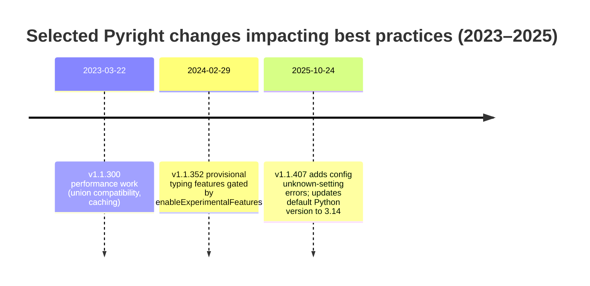

# Pyright Best Practices for Typed Python at Scale

## Executive Summary

Pyright is a high-performance, standards-oriented static type checker that underpins the Pylance language server experience in Visual Studio Code. Pylance is effectively “Pyright + IDE features,” and it ships with additional capabilities (semantic highlighting, extra stubs, refactorings) that do not exist in the open-source Pyright CLI. citeturn10view0turn18view0

Across production codebases, the strongest Pyright outcomes are correlated with: a committed, shared configuration; an explicit Python-version target (not implicit defaults); a deliberate strictness strategy (often “standard everywhere, strict where ready”); explicit management of third‑party typing (PEP 561 typed packages and stubs); and CI enforcement that pins the toolchain version for repeatability. citeturn15view0turn4view0turn16view0turn7view0turn7view1turn7view2

Key recommendations that hold up across small (single-package), medium (multi-module monolith), and large (monorepo / multi-service) Python systems:

- **Treat Pyright configuration as source code**: commit it, keep paths relative, and avoid developer-specific absolute paths. citeturn15view0turn4view0turn0search17  
- **Pin your intended Python semantics explicitly** (e.g., `pythonVersion`: `"3.8"` if you support 3.8+, or `"3.11"` if that’s your baseline). Pyright’s *implicit* default version can change as new Python versions become “latest stable,” which can introduce new diagnostics without any code change. citeturn4view0turn21view1turn13search15  
- **Choose strictness as a migration framework, not a binary switch**: keep the repo-wide baseline at `standard` or `basic`, then opt into strict for “ready” modules/dirs using the `strict` path list or `# pyright: strict` per-file. This is an explicitly recommended pattern by the maintainer, and it avoids strict mode’s hard coupling to complete third‑party typing. citeturn14search13turn4view0turn15view0turn14search18turn16view0  
- **Plan for third‑party typing**: Pyright prioritizes `.pyi` stubs and PEP 561 marker-based typing (`py.typed`) during import resolution; when neither is present, imported symbols become `Unknown`, which can block strict adoption. citeturn7view0turn7view1turn9view3turn14search18  
- **Enforce in CI, but make it fast**: use cached, pinned tooling (e.g., `jakebailey/pyright-action` on GitHub Actions) and run Pyright with consistent environment selection. Use `--outputjson` where CI integrations benefit from machine-readable results. citeturn7view2turn19search3turn5view1  

This report assumes no single “target Python version” constraint and presents examples that work across Python **3.8–3.12**, while also explaining how changing Python annotation semantics (PEP 563 → PEP 649/749) affects runtime annotation consumers and can intersect with type-checker configuration decisions. citeturn9view0turn8search4turn8search8turn9view1  

## Source Map and Standards Context

This report prioritizes sources in the following order:

**Primary (authoritative)**
- Pyright official documentation in the `microsoft/pyright` repository: configuration, import resolution, stub generation, CI integration, and getting-started progression. citeturn4view0turn16view0turn7view0turn7view1turn7view2turn15view0turn18view0turn5view1  
- Pylance documentation (FAQ/README/Marketplace) explaining how Pyright powers Pylance, plus Pylance performance and configuration behavior. citeturn10view0turn10view2turn0search1turn0search9  
- Typing standards via Python PEPs and typing specification docs:
  - PEP 484 (type hints goals and scope). citeturn9view2  
  - PEP 561 (distribution of typed packages / stubs; now largely “historical,” pointing to the typing spec site). citeturn9view3turn8search12  
  - PEP 563 (postponed evaluation of annotations) and its current status (“never became default,” replaced by PEP 649/749). citeturn9view0  
  - PEP 649 (deferred evaluation of annotations via `__annotate__`) and PEP 749’s implementation plan and timeline into Python 3.14. citeturn9view1turn8search4turn8search8  

**Operationally relevant (time-sensitive, still high-quality)**
- Pyright release notes and changelogs on GitHub releases for performance, behavior changes, and evolving defaults. citeturn20view0turn20view2turn21view1turn12view0  
- CI ecosystem docs for GitHub Actions usage patterns, GitLab Code Quality report format, and Azure Pipelines tasks for installing Node tooling. citeturn7view2turn19search7turn19search2turn19search0  

**High-quality community resources (since ~2022; curated)**
- Real Python articles demonstrating Pyright usage in modern typing tutorials and explaining annotation semantics changes. citeturn11search3turn8search14  
- Targeted GitHub issues/discussions with maintainer guidance on recommended gradual-typing patterns and strict-mode constraints. citeturn14search13turn14search18turn0search17turn11search21  
- Stack Overflow threads for field-tested import-resolution and stubPath pitfalls (used as “symptom catalogs,” not as normative spec). citeturn6search7turn6search4turn11search12  

### Typing PEPs that most directly shape Pyright practice

**PEP 484: type hints are primarily for static analysis, and typing is gradual.** PEP 484 frames type hints chiefly as an enabler for offline static type checkers and IDE tooling, while emphasizing Python remains dynamically typed. citeturn9view2  

**PEP 561: how typed libraries and stub packages are found.** PEP 561 standardizes how packages distribute typing info (inline annotations + `py.typed`, inline `.pyi`, or separate `*-stubs` distributions) and how type checkers resolve these. Pyright’s import-resolution documentation explicitly references this PEP’s resolution order and concepts. citeturn9view3turn7view0turn8search12  

**PEP 563 vs PEP 649/749: annotation evaluation semantics changed trajectory.** PEP 563’s “stringized annotations” never became the default behavior and is documented as replaced by PEP 649/749. citeturn9view0 PEP 649 introduces lazy computation of annotation dicts via a `__annotate__` mechanism and extends `inspect.get_annotations` / `typing.get_type_hints` with a `format` parameter. citeturn9view1 PEP 749 (implementation plan) states PEP 649 was accepted in 2023 and is expected to be implemented in Python 3.14, and Python’s “What’s New in 3.14” documents PEP 649/749 as changing annotation evaluation to deferred/lazy behavior. citeturn8search4turn8search8  

**Why this matters for Pyright users:** Pyright itself operates statically and can interpret forward references independent of runtime evaluation, but real-world codebases often have runtime consumers of annotations (frameworks, validation libraries, decorators). Understanding which Python versions you support (3.8–3.12 vs newer) helps you choose defensible conventions like `from __future__ import annotations` (common in 3.8–3.12 projects) and anticipate runtime changes where annotation evaluation is deferred by default in Python 3.14. citeturn9view0turn8search8turn9view1turn8search14  

## Installation and Integration Patterns

### Editor integration

For most Visual Studio Code users, Pyright’s own docs recommend **Pylance rather than the Pyright extension**, because Pylance incorporates the Pyright type checker and adds editor-focused capabilities like semantic tokens and symbol indexing. citeturn18view0turn10view0  

Pylance documentation is explicit:

- **Pylance is a language server** providing IntelliSense, navigation, code actions, and diagnostics.  
- **Pyright is the open-source type checker Pylance uses under the hood**, and Pylance is a superset.  
- Pylance also ships with **extra type stubs** for popular modules to improve completions and checking. citeturn10view0  

For performance tuning inside the editor, Pylance offers `python.analysis.languageServerMode` with `light`, `default`, and `full`, which trade memory/CPU footprint for richer IntelliSense features. citeturn10view0  

### CLI installation options

Pyright supports two main CLI installation routes:

- **npm global install**: `npm install -g pyright`. Pyright’s installation doc explicitly describes this as a core approach, noting you need a “recent version of node” first. citeturn18view0  
- **Python wrapper package**: A community-maintained Python package named `pyright` exists on PyPI and conda-forge; Pyright’s own installation doc calls this out and notes it installs node (required) and keeps Pyright updated. citeturn18view0turn17search4turn17search3  

As of early 2026, the npm package description shows Pyright at version **1.1.408**. citeturn17search7  

**Best-practice implication:** For CI reproducibility, prefer a pinned Pyright version rather than “latest,” whether you install via npm or via a wrapper. Pyright changes frequently, and even “default Python version” behavior has been updated to track the latest stable Python. citeturn21view1turn13search15turn19search3  

### Workflow and CI integration diagram

```mermaid
flowchart LR
  Dev[Developer] -->|edit| Editor[Pylance in VS Code<br/>Pyright engine]
  Dev -->|run locally| LocalCLI[pyright CLI<br/>--watch / --stats]
  LocalCLI -->|fast feedback| Fix[Fix types / add annotations]
  Editor --> Fix

  Fix --> PreCommit[Optional: pre-commit hook<br/>pyright wrapper]
  PreCommit --> Push[Push / PR]

  Push --> CI[CI job runs pyright<br/>pinned version]
  CI -->|fails on errors (and optionally warnings)| Gate[Merge gate]
  Gate -->|pass| Merge[Merge]
```

This workflow aligns with Pyright’s own “progression” guidance (start minimal config, then imported-library types, then incremental typing, then strict typing) and its CI integration recommendations. citeturn15view0turn7view2turn5view1  

### Command-line usage patterns that matter in practice

Pyright’s CLI supports flags that map cleanly to best-practice operational needs:

- `-p / --project` to ensure the correct configuration file is used. citeturn5view1  
- `--watch` for incremental re-analysis, where Pyright re-checks only “deltas” after initial analysis. citeturn5view1  
- `--stats` for performance instrumentation. citeturn5view1  
- `--outputjson` for CI parsing or conversion into platform-specific report formats. citeturn5view1turn7view2  
- `--warnings` to fail CI if warnings exist (useful once you’re “type clean”). citeturn5view1  
- `--threads` (experimental) for parallelization in large repos. citeturn5view1  

## Configuration Strategy for pyrightconfig.json and pyproject.toml

### Configuration file selection and precedence

Pyright supports configuration in:

- `pyrightconfig.json` (default filename, typically at project root)  
- a `[tool.pyright]` section within `pyproject.toml`  

If both exist, **`pyrightconfig.json` takes precedence**. Paths are interpreted relative to the config file location; shell variables like `~` are not supported. citeturn4view0  

Pyright also supports **multi-root workspaces** where each root can have its own config. citeturn4view0  

**Best-practice implication:** Use `pyproject.toml` if you strongly prefer consolidated tooling configuration, but keep in mind: many teams still prefer `pyrightconfig.json` because it’s explicit, discoverable, and easier to layer via `extends`. Use one as the “source of truth” to reduce editor-vs-CI drift. citeturn4view0turn16view0  

### Configuration options you should treat as “architectural”

The table below focuses on settings that frequently determine whether Pyright adoption is smooth or painful. Recommendations are grounded in Pyright’s own docs and common maintainer guidance.

| Option | What it controls | Recommended default | Why this is a best practice | When to deviate |
|---|---|---|---|---|
| `include` | Project roots to analyze | `["src"]` (if using `src` layout) or `["."]`/package dirs | Starting with explicit roots is part of Pyright’s own recommended initial progression. citeturn15view0turn4view0 | If monorepo, use multiple roots + `executionEnvironments`. citeturn16view0turn4view0 |
| `exclude` | Files/dirs not considered part of project | Exclude generated dirs, build output, large vendored trees | Pyright excludes common noise by default; widening this improves performance and signal. citeturn4view0 | If you need diagnostics in generated code, exclude less and rely on `ignore`. |
| `ignore` | Suppress diagnostics output for matched paths (even if imported) | Use for truly out-of-scope legacy or generated areas | Unlike `exclude`, `ignore` is meant to suppress diagnostics even when files are pulled into the transitive import graph. citeturn4view0turn7view2 | Don’t use to “hide” core product logic; prefer incremental fixes. |
| `strict` | Path list for “strict analysis” opt-in | Use for “type-mature” modules/dirs | Pyright treats this list as equivalent to a `# pyright: strict` file directive. citeturn4view0turn15view0 | If you want repo-wide strict and accept the burden, set `typeCheckingMode: "strict"` globally instead. citeturn16view0 |
| `extends` | Inherit from a base config | Use in orgs with many services/repos | Enables standardization across repos while allowing overrides. citeturn4view0 | If config is tiny and repo is small, you may not need it. |
| `pythonVersion` | Target Python version semantics | Set explicitly (e.g., `"3.8"` minimum supported, or `"3.11"` baseline) | Avoids drift and surprises; Pyright also uses this when selecting conditional typeshed definitions and reporting unsupported syntax. citeturn4view0turn21view1 | If CI pins interpreter and you want “current interpreter” semantics, you can omit, but expect defaults to change over time. citeturn4view0turn13search15 |
| `pythonPlatform` | Target OS/platform | `"All"` unless you really need OS-specific typing | Typeshed and conditional stubs frequently depend on platform. citeturn4view0 | Set if your deliverable is OS-specific (desktop/mobile). |
| `executionEnvironments` | Different import roots / Python versions for subtrees | Use for monorepos, tests, tools subtrees | Pyright maps each file to the first matching environment by root path. citeturn4view0turn16view0 | Avoid if repo is simple; complexity has a maintenance cost. |
| `extraPaths` | Add import-resolution paths beyond default | Prefer packaging-first; use sparingly | Extra paths are a common workaround but can mask packaging issues; Pyright searches them and `src` by convention. citeturn7view0turn4view0 | Accept in early migration or in scripts/tools areas. |
| `stubPath` | Location of custom stubs | Keep default `./typings` or set a repo-local dir | Pyright expects per-package subdirs here; default is `./typings`. citeturn4view0turn7view1 | If you already have a `stubs/` convention or monorepo, set accordingly. |
| `typeshedPath` | Override bundled typeshed | Usually leave unset | Bundled typeshed is the norm; override mainly for typeshed contributors. citeturn4view0 | When you need patched typeshed stubs temporarily. |
| `useLibraryCodeForTypes` | Analyze library code if stubs missing | Leave default `true` initially; revisit at scale | Pyright documents that inferred types from library code are often incomplete, and recommends stubs where possible. citeturn4view0turn7view1 | In very large repos, you may turn off or constrain via better stubs to reduce noise/perf cost. |
| `verboseOutput` / `--verbose` | Debug logging for import resolution | Keep `false` unless debugging; enable when stuck | Pyright explicitly calls this out as useful for diagnosing import issues. citeturn4view0turn5view1 | Turn on temporarily in CI debugging jobs. |

### Avoiding configuration foot-guns

**Relative, repo‑portable paths are not optional in shared teams.** Pyright’s config docs explicitly recommend relative paths so configs can be shared; a maintainer response reinforces that absolute paths break collaboration and should not be checked in. citeturn4view0turn0search17  

**`exclude` does not mean “never analyzed.”** Pyright documents that excluded files can still be analyzed if imported by included files, which is one of the largest sources of “why is Pyright complaining about this excluded file?” confusion. citeturn4view0  

**VS Code settings can be ignored when a config file exists.** Pyright’s docs state that if `pyrightconfig.json` or a `[tool.pyright]` configuration exists, VS Code `settings.json` Pyright settings are ignored. citeturn16view0 This behavior also appears in Pylance guidance about config precedence. citeturn0search28turn10view0  

## Strictness Levels and Diagnostic Management

### The four strictness presets: off, basic, standard, strict

Pyright uses `typeCheckingMode` with allowed values `"off"`, `"basic"`, `"standard"`, and `"strict"`, with a documented default of `"standard"`. citeturn4view0turn16view0  

Pylance documents the same four modes for `python.analysis.typeCheckingMode`, and it explicitly points users back to Pyright documentation for the default rule set per mode. citeturn0search1turn0search9turn4view0  

### What meaningfully changes across presets

Pyright’s configuration documentation includes a large defaults table mapping many rules and evaluation settings across modes. Several entries are especially important for best-practice decisions (because they strongly affect migration pain and third-party compatibility): citeturn16view0  

| Rule / setting (subset) | Off | Basic | Standard | Strict | Why it matters |
|---|---:|---:|---:|---:|---|
| `reportMissingImports` | warning | error | error | error | Controls whether unresolved imports block CI; almost always should be “error” once environment resolution is correct. citeturn16view0turn7view0 |
| `reportMissingTypeStubs` | none | none | none | error | Strict mode forces you to address missing stubs (or avoid strict for modules importing untyped libs). citeturn16view0turn7view1turn14search18 |
| `strictListInference` / `strictDictionaryInference` / `strictSetInference` | false | false | false | true | Strict mode makes inference “more precise,” which can increase friction but reduces accidental `Any`. citeturn16view0turn4view0 |
| `reportFunctionMemberAccess` | none | none | error | error | Some “deep” checking only appears starting in `standard`. citeturn16view0 |
| `reportUnknown*` family (e.g., `reportUnknownMemberType`) | none | none | none | error | Strict mode is strongly anti-`Unknown`, which is great for type maturity but punishing with untyped dependencies. citeturn16view0turn14search18 |

A critical nuance: Pyright’s docs state that in strict mode, rule overrides can only **increase** strictness (e.g., warning → error). citeturn16view0 This is an intentional design choice with practical consequences: strict is not a “preset you can easily soften”; it’s more like a commitment.

### A maintainable strictness strategy for real codebases

A maintainer-recommended pattern is:

- Use **basic** (or standard) by default.
- Use `# pyright: strict` or the `strict` path list for new or upgraded files/directories.
- Later, when an entire directory is strict-ready, add the directory to `strict` and remove per-file directives. citeturn14search13turn4view0turn15view0  

This strategy aligns with Pyright’s “getting started” progression (incremental typing first; strict typing last and often file-by-file). citeturn15view0  

### Handling ignores and suppressions without losing rigor

Pyright supports multiple suppression pathways, each appropriate for different purposes:

- Repository-level configuration overrides: set a rule’s severity to `"none"`, `"warning"`, `"information"`, or `"error"`, or use booleans for some settings. citeturn4view0turn16view0  
- Path-level suppression: `ignore` array (suppress diagnostics output for paths). citeturn4view0  
- Line-level suppression: `# type: ignore` is a PEP 484 feature, and Pyright can enable/disable its handling via `enableTypeIgnoreComments`. citeturn4view0turn9view2  
- Pyright-specific ignores: `# pyright: ignore[...]` appears in Pyright discussions and is widely used to isolate suppressions to Pyright when multiple checkers run. citeturn6search13turn6search5  

**Best-practice pattern for suppressions:** prefer narrow, rule-specific ignores over broad ignores. Community best-practice guidance emphasizes specifying a rule name in `pyright: ignore[...]` so you don’t accidentally hide future unrelated issues on the same line. citeturn14search15turn6search5  

## Type Stubs, Typed Third-Party Libraries, and Import Resolution

### How Pyright resolves imports

Pyright documents a deterministic import-resolution order. For absolute imports, it searches (summarized):

1. `stubPath` (custom stubs)  
2. workspace code (execution environment roots + extraPaths + common `src`)  
3. installed packages (stub packages, inline stubs, `py.typed` inline types, and possibly library code)  
4. typeshed stdlib stubs  
5. typeshed third-party stubs  
6. fallback heuristics citeturn7view0  

This resolution model implies several best practices:

- If your repo uses a `src/` layout, explicitly include it and consider setting `executionEnvironments` root(s) so Pyright doesn’t depend on heuristics. citeturn7view0turn4view0  
- Prefer “typed installations” (PEP 561 `py.typed` or stubs) over relying on `useLibraryCodeForTypes` inference. Pyright explicitly warns that analyzing `.py` library code is expensive and often yields low-value inference, particularly around generics and dynamic exports. citeturn7view1turn4view0  

### Why stubs and `py.typed` matter

Pyright’s type stub documentation is unambiguous:

- Stubs (`.pyi`) define the public interface contract.  
- Pyright will try to resolve imports with stubs first—and if it cannot locate type stubs for an external import and the package is not `py.typed`, then imported symbols are treated as `Unknown`. citeturn7view1  

This directly impacts strictness: strict mode escalates many “unknown/partial unknown” conditions to errors, which can make strict infeasible unless third-party types are in good shape. Maintainer guidance reinforces that strict will report uses of unknown or partially unknown types, and importing from libraries without full type information can block strict adoption. citeturn14search18turn16view0  

### Best practices for third-party library typing

Pyright’s getting-started guide recommends a pragmatic order:

1. **Update dependent libraries** because many popular libraries have added inlined types in recent versions. citeturn15view0  
2. Enable `reportMissingTypeStubs` and add minimal stubs where required. citeturn15view0turn7view1  
3. Look for stub companion packages named with `-stubs` suffix. citeturn15view0turn7view0  
4. If none exist, create custom stubs for the subset of API you consume and check them into your repo. citeturn15view0turn7view1  

This aligns with PEP 561: stub packages are expected to be named `distribution-name-stubs`, and `py.typed` is the marker for inline typing. citeturn7view0turn9view3turn8search12  

### Generating and maintaining `.pyi` files responsibly

Pyright can generate draft stubs both via VS Code Quick Fix and via CLI (`pyright --createstub <import-name>`). The docs stress that generated stubs are starting points and typically need cleanup; they call out specific failure modes (re-exports, try/except imports, decorators) and recommend enabling decorator-related checks like `reportUntypedFunctionDecorator` and `reportUntypedClassDecorator`. citeturn7view1turn5view1  

The canonical typing documentation also references Pyright’s `--createstub` capability as a stub generation tool. citeturn6search12  

### Pylance-specific nuance: shipped stubs beyond typeshed

Pylance documentation notes that it ships with a collection of type stubs for popular modules. citeturn10view0 Community analysis describes a related “python-type-stubs” repository used collaboratively for popular third-party stubs bundled with Pylance. citeturn6search16  

**Operational takeaway:** A library may “seem typed” in Pylance (because Pylance ships a stub) but still appear partially untyped in pure Pyright CLI environments unless you install the corresponding stub package or provide local stubs. When teams hit editor-vs-CI mismatches, this Pylance bundling difference is a common hidden variable. citeturn10view0turn7view1turn14search18  

### Code examples for third-party typing gaps

#### Example: add a minimal local stub for an untyped dependency

Directory layout (using Pyright’s default `stubPath: "./typings"`): citeturn4view0turn7view0  

```text
typings/
  untypedlib/
    __init__.pyi
```

`pyrightconfig.json`:

```json
{
  "include": ["src"],
  "stubPath": "typings",
  "reportMissingImports": "error"
}
```

`typings/untypedlib/__init__.pyi` (minimal surface you actually use):

```python
from typing import Protocol, Sequence

class Client(Protocol):
    def fetch(self, key: str) -> bytes: ...

def connect(url: str) -> Client: ...
def load_many(keys: Sequence[str]) -> list[bytes]: ...
```

This approach is directly aligned with Pyright’s recommendation: if stubs do not exist, create a custom stub defining the portion of the interface your code consumes. citeturn7view1turn15view0  

#### Example: avoid strict-mode blockage by scoping strictness

```json
{
  "include": ["src"],
  "typeCheckingMode": "standard",
  "strict": ["src/new_typed/"]
}
```

This mirrors the maintainer’s recommended approach (shared baseline + strict where ready) and avoids strict mode’s strong “unknown types are errors” posture from spilling into legacy or third-party-heavy areas. citeturn14search13turn16view0turn14search18  

## Migration, Performance Tuning, Debugging, CI Enforcement, and Interoperability

### Incremental adoption and migration checklist

Pyright provides an explicit staged progression: minimal config + first run, then address imported library typing, then incrementally add annotations, then opt into strict typing per file or directory. citeturn15view0  

A pragmatic migration checklist that adheres to Pyright’s model:

- Establish a minimal `pyrightconfig.json` with explicit `include`, commit it, and run Pyright once to create a baseline. citeturn15view0turn4view0  
- Fix import resolution first (venv/interpreter selection, `executionEnvironments`, and `extraPaths` only as needed). citeturn7view0turn4view0  
- Move to `typeCheckingMode: "standard"` (or `"basic"` if you need a softer ramp). citeturn4view0turn16view0turn14search13  
- Upgrade dependencies, then address typing for remaining untyped dependencies via `*-stubs` packages and local stubs under `stubPath`. citeturn15view0turn7view0turn7view1turn9view3  
- For new code or “upgraded” modules, enable strict with `# pyright: strict` or the `strict` path list. citeturn15view0turn4view0turn14search13  
- Once strict-ready coverage grows, begin enabling selected “hygiene” diagnostics (e.g., `reportUnusedCoroutine` to catch missing `await`) at warning/error levels. citeturn16view0  
- For mature repos, enable checks that detect stale suppressions (e.g., `reportUnnecessaryTypeIgnoreComment`) to keep debt from accumulating. citeturn16view0  

### Performance tuning levers that actually move the needle

**Minimize the analyzed set.** Pyright’s default exclusions include `**/node_modules`, `**/__pycache__`, and dotfiles, and it notes that Pylance additionally excludes virtual environment directories regardless of configured `exclude`. citeturn4view0 For large repos, ensure your own `exclude` list also covers generated files, build directories, vendored code, and large data/ETL artifacts.

**Use `ignore` for “do not report” areas.** If you truly don’t want diagnostics for legacy folders, `ignore` suppresses diagnostic output even if files are pulled in by imports, unlike `exclude`. citeturn4view0  

**Measure it.** Use `pyright --stats` to see time spent in various phases and drive targeted improvements. citeturn5view1  

**Parallelize cautiously.** `--threads` exists but is explicitly labeled experimental and runs multiple copies of Pyright. Validate determinism on your repo before relying on it in CI. citeturn5view1  

**Avoid slow third-party analysis loops.** Pyright explains why it doesn’t default to deep library source analysis: libraries may be large, dynamic, or native-backed; inference is often low quality; and it can expose non-public symbols. Those are structural reasons that “fix it with stubs” tends to outperform “let Pyright infer it.” citeturn7view1turn4view0  

Pyright’s own release notes also show performance work as an ongoing priority, citing large improvements for union compatibility and overall analyzer speed in real-world libraries. citeturn20view0  

### Debugging common pitfalls

**Import resolution mismatches (CI vs local, editor vs CLI)**  
Pyright’s import resolution doc describes how it chooses a Python environment—preferring `python.venvPath` + `venv` mechanism, then `python.pythonPath` (via VS Code environment picker APIs), then falling back to default `python`. It explicitly calls the `venvPath` + `venv` mechanism “not recommended for most users” because it is less robust than using a configured interpreter. citeturn7view0  

Config nuance: Pyright warns that `venvPath` is usually not appropriate in shared configs because it differs per developer, and that `venvPath`/`venv` settings are ignored when using Pylance (VS Code interpreter path is used instead). citeturn4view0turn7view0  

**Actionable debugging steps:**
- Verify which config is being picked up (especially in monorepos) using `pyright -p <path-to-config>`. citeturn5view1  
- Temporarily set `verboseOutput: true` or use `--verbose` to get import-resolution diagnostics. citeturn4view0turn5view1  
- Use `executionEnvironments` to separate tools/tests/apps that have different import roots. citeturn16view0turn7view0  

**Editable installs and import hooks**  
Pyright documents a sharp edge: editable installs that rely on `.pth` files containing executable “import hook” lines are not statically resolvable by Pyright, because resolving module locations would require executing Python code. It highlights setuptools’ default editable behavior and points to “compat/strict” modes that avoid hooks. citeturn7view0  

### CI enforcement patterns with comparative table

Pyright’s own CI integration doc includes examples for GitHub Actions (via `pyright-action`), GitLab (via JSON output + conversion tool), and pre-commit. citeturn7view2 The table below aligns those with platform-native best practices and official CI docs.

| CI system | Recommended approach | Strengths | Tradeoffs |
|---|---|---|---|
| GitHub Actions | Use `jakebailey/pyright-action` and pin version | Fast startup, annotations, avoids bespoke Node setup; supports explicit version pinning. citeturn7view2turn19search3turn19search7 | You still must ensure the Python environment and dependency installation match local assumptions. citeturn19search7turn7view0 |
| GitLab CI | Run `pyright --outputjson` then convert to a Code Quality report artifact | Produces GitLab-native MR “Code Quality” annotations via `artifacts:reports:codequality`. citeturn7view2turn19search6turn19search2 | Adds a converter dependency/pipeline step; report format needs upkeep. citeturn7view2turn19search6 |
| Azure Pipelines | Use Node installer task (e.g., NodeTool/UseNode) + npm install pyright + run in script | Fully explicit toolchain management; aligns with Microsoft-hosted pipeline guidance for Node tooling. citeturn19search0turn19search1turn18view0 | More boilerplate than a dedicated action; must manage caching/pinning yourself. citeturn19search1turn21view1 |

#### GitHub Actions example

```yaml
name: pyright
on: [pull_request, push]

jobs:
  typecheck:
    runs-on: ubuntu-latest
    steps:
      - uses: actions/checkout@v4

      - uses: actions/setup-python@v5
        with:
          python-version: "3.12"

      - run: pip install -r requirements.txt

      - uses: jakebailey/pyright-action@v3
        with:
          version: "1.1.408"
```

Pyright’s CI integration doc points to `pyright-action` and explicitly notes optional version pinning. citeturn7view2turn19search3  

#### GitLab CI example with Code Quality report

```yaml
pyright:
  image: node:20
  script:
    - npm i -g pyright pyright-to-gitlab-ci
    - pyright --outputjson > report_raw.json
    - pyright-to-gitlab-ci --src report_raw.json --output gl-code-quality-report.json --base_path .
  artifacts:
    reports:
      codequality: gl-code-quality-report.json
```

Pyright provides essentially this pattern (pyright → JSON → conversion tool) and GitLab documents that Code Quality results require a `codequality` report artifact. citeturn7view2turn19search6turn19search2  

#### Azure Pipelines example

```yaml
trigger:
- main

pool:
  vmImage: ubuntu-latest

steps:
- task: NodeTool@0
  inputs:
    versionSpec: "20.x"

- script: npm install -g pyright@1.1.408
  displayName: Install pyright

- script: pyright
  displayName: Run pyright
```

Azure’s Node tool installer task is documented as the supported way to fetch/cache Node versions and set PATH, and Pyright’s installation doc describes npm-based CLI installation. citeturn19search0turn18view0  

### Interoperability with mypy and other type checkers

**Shared standards foundation:** Pyright and mypy both implement the PEP 484/PEP 561 ecosystem model: type hints are a static-analysis layer (PEP 484), and typed packages/stubs are distributed and resolved following standardized rules (PEP 561). citeturn9view2turn9view3turn7view0turn8search20  

**Practical interoperability guidance:**
- Prefer type system constructs that are in the typing specification and avoid tool-specific behaviors unless necessary. PEP 561 is now explicitly “historical,” pointing to typing.python.org as the up-to-date spec source. citeturn9view3turn8search12  
- Use `# type: ignore` sparingly and consider checker-specific ignores (e.g., `# pyright: ignore[...]`) when running multiple checkers so you don’t unintentionally suppress diagnostics across all tools. Pyright exposes `enableTypeIgnoreComments` for PEP 484 ignores and treats Pyright-specific ignores separately. citeturn4view0turn9view2turn6search5  
- Expect differences in strictness defaults. Pyright’s “strict” preset turns on many “unknown” and “missing stubs” checks as errors by default. citeturn16view0turn14search18 If you run both mypy and Pyright, you typically need a shared policy for third-party typing (install stubs, ship `py.typed`, or maintain local stubs). citeturn7view1turn9view3turn8search20  

### Timeline of selected Pyright evolution since 2022

The goal here is not to list every weekly release, but to highlight changes that often affect best practices: performance, defaults, and experimental feature gating.



Release 1.1.300 explicitly calls out analyzer performance improvements and notes large speed improvements on a major typed library workload. citeturn20view0 Release 1.1.352 documents provisional support for a typing PEP gated behind `enableExperimentalFeatures`, illustrating why teams should keep “experimental” off in production unless intentionally testing. citeturn20view2turn16view0 Release 1.1.407 includes “error reporting for unknown or unsupported config settings” and changes the default Python version to reflect the latest stable Python, reinforcing the recommendation to set `pythonVersion` explicitly. citeturn21view1turn13search15turn4view0  

## Actionable Recommendations

### Recommended policies that scale

**Configuration policy**
- Commit a shared config and make it portable (relative paths, no shell-variable paths). citeturn15view0turn4view0  
- Explicitly set `pythonVersion` to your minimum supported runtime (3.8–3.12 range) or your baseline (e.g., 3.11/3.12) to avoid default drift. citeturn4view0turn21view1turn13search15  
- Prefer `executionEnvironments` over ad-hoc `extraPaths` sprawl when you truly have multiple import roots or subprojects. citeturn16view0turn7view0  

**Strictness policy**
- Default to `standard` (or `basic` if you must) repo-wide; opt into strict via the `strict` list (directory-level) or `# pyright: strict` (file-level). citeturn14search13turn15view0turn16view0  
- Treat strict mode readiness as depending on third-party type quality; if a module imports untyped libs, keep it non-strict until you install stubs or write minimal local stubs. citeturn14search18turn7view1turn9view3  

**Third-party typing policy**
- Upgrade dependencies first; then install stub packages; then maintain local stubs as a last resort (but do it deliberately and check them in). citeturn15view0turn7view0turn7view1turn9view3  
- Use stub generation (`--createstub`) as a bootstrap, not as a finished product; clean up re-exports and decorator signatures. citeturn7view1turn5view1  

**CI policy**
- Pin Pyright versions in CI. Use `pyright-action` where possible for speed and annotations. citeturn7view2turn19search3turn21view1  
- Decide early whether warnings should fail builds (`--warnings`) and treat that as a maturity lever. citeturn5view1  

### Sample pyrightconfig.json templates

These templates are meant to be starting points. They bias toward clarity and repeatability across environments.

#### Small codebase template

Suitable for a single-package repo, modest dependency graph, and early adoption.

```json
{
  "include": ["src"],
  "exclude": ["**/__pycache__", "**/.venv", "**/build", "**/dist"],
  "typeCheckingMode": "standard",
  "pythonVersion": "3.11",
  "pythonPlatform": "All",
  "stubPath": "typings",
  "reportMissingImports": "error"
}
```

Rationale: `standard` is Pyright’s documented default mode and avoids the strict-mode requirement that missing type stubs be treated as errors; `stubPath` keeps a place ready for local stubs if needed. citeturn16view0turn4view0turn7view1  

#### Medium codebase template

Suitable for a monolith with tests, scripts, and an incremental strict rollout.

```json
{
  "include": ["src", "tests"],
  "exclude": [
    "**/__pycache__",
    "**/.venv",
    "**/node_modules",
    "src/generated"
  ],
  "ignore": ["src/legacy"],
  "typeCheckingMode": "standard",
  "strict": ["src/core", "src/new_features"],
  "pythonVersion": "3.10",
  "pythonPlatform": "All",
  "stubPath": "typings",
  "reportMissingImports": "error",
  "reportUnusedCoroutine": "error",
  "reportImportCycles": "warning",
  "verboseOutput": false
}
```

Rationale: Combining a `standard` baseline with a `strict` allowlist matches maintainer guidance and avoids strict in areas that import partially typed libs; `reportUnusedCoroutine` is a high-signal bug catcher. citeturn14search13turn16view0turn4view0  

#### Large codebase template

Suitable for monorepos or multi-service repos with different import roots and execution contexts.

```json
{
  "include": ["services", "libs", "tools"],
  "exclude": [
    "**/__pycache__",
    "**/.venv",
    "**/node_modules",
    "**/dist",
    "**/build",
    "**/.pytest_cache",
    "**/.mypy_cache"
  ],
  "typeCheckingMode": "standard",
  "pythonVersion": "3.9",
  "pythonPlatform": "All",
  "stubPath": "typings",
  "reportMissingImports": "error",
  "executionEnvironments": [
    {
      "root": "services/api",
      "extraPaths": ["libs/common"]
    },
    {
      "root": "services/worker",
      "extraPaths": ["libs/common"]
    },
    {
      "root": "tools",
      "extraPaths": ["libs/common"]
    },
    {
      "root": "libs"
    }
  ],
  "strict": [
    "libs/common/typed",
    "services/api/app"
  ]
}
```

Rationale: Pyright explicitly supports `executionEnvironments` to map different portions of a source tree to different roots and extraPaths; this is a more maintainable alternative to global extraPaths in large repos. citeturn16view0turn7view0turn4view0  

### Final “do these next” recommendations (prioritized)

1. Establish a committed, portable config with explicit `include`, `exclude`, and `pythonVersion` so local/editor/CI runs agree on scope and semantics. citeturn15view0turn4view0turn21view1  
2. Make import resolution deterministic: prefer interpreter-based environment selection; use `executionEnvironments` for multi-root structure; use `verboseOutput`/`--verbose` only when diagnosing. citeturn7view0turn4view0turn5view1  
3. Adopt a strictness rollout plan (baseline standard/basic, strict allowlist) and tie strict adoption to third-party typing readiness (install stubs, maintain local stubs). citeturn14search13turn16view0turn7view1turn9view3  
4. Integrate Pyright into CI with version pinning and a clear failure policy (errors-only first, then warnings). citeturn7view2turn5view1turn19search3  
5. If your runtime heavily consumes annotations, document a project-wide policy for `from __future__ import annotations` (Python 3.8–3.12 era) and keep an eye on Python 3.14’s deferred annotation semantics (PEP 649/749) as you upgrade runtimes. citeturn9view0turn8search8turn9view1turn8search14