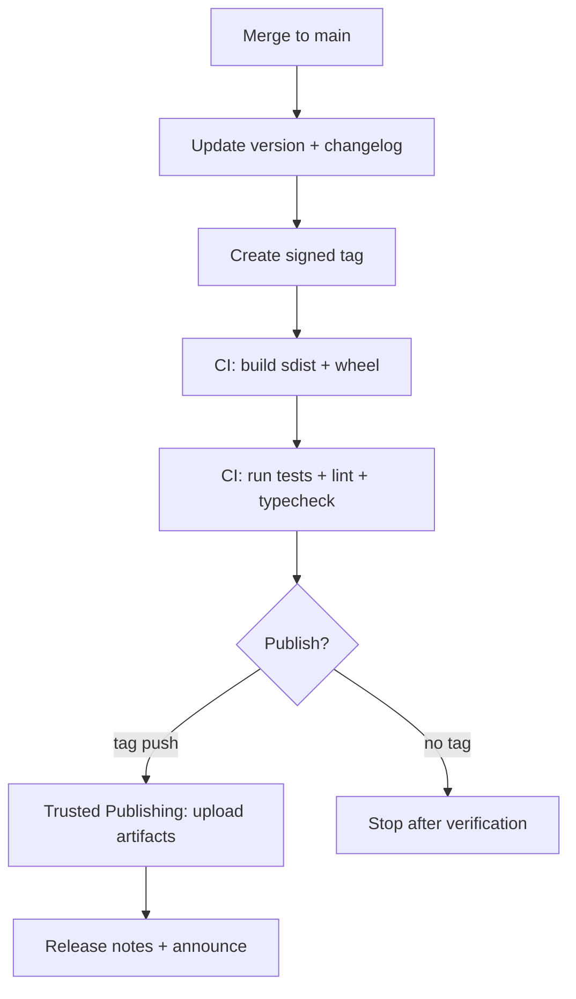
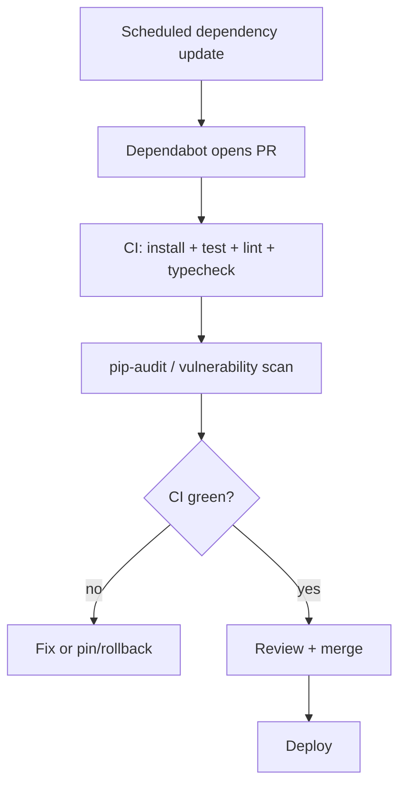
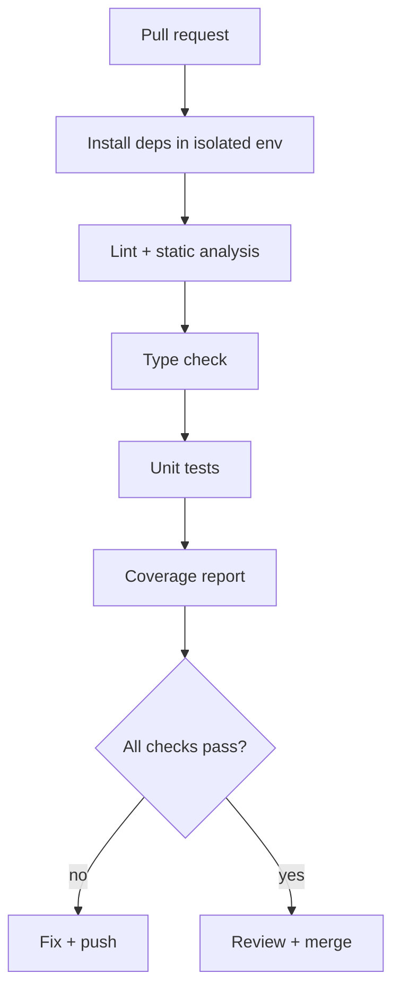

# Python Development Best Practices Playbook

## Executive summary

This report synthesizes Python-specific engineering best practices into a generalized, domain- and size-agnostic document suitable for teams building anything from small libraries to large services. Because the project’s size and domain are unspecified, the recommendations emphasize defaults that scale “up” (monorepos, multiple deploy targets, many contributors) without imposing heavy process for small projects. citeturn20search1turn20search0

A modern “default posture” for Python development is to (a) standardize style and configuration across tools, (b) isolate environments and make dependency resolution reproducible, (c) automate verification in CI, and (d) ship repeatable build artifacts (sdists/wheels) with a consistent release workflow. The ecosystem’s “center of gravity” for project metadata and tool configuration is `pyproject.toml` (PEP 518/517, PyPA specs), complemented by separate config files when a tool cannot read `pyproject.toml`. citeturn2search1turn19view2turn19view1turn20search15turn3search13turn3search3

Across topics, the most consistently supported leverage points are:
- **Automation over policy**: use formatters/linters/type checkers in CI (and locally) so “best practices” are enforced continuously, not via human memory. citeturn4search3turn4search11turn9search0turn9search1turn17search0turn3search1turn8search0turn3search13turn7search1
- **Build and publish using standardized interfaces** (PEP 517/518, wheel format) and prefer tokenless Trusted Publishing when publishing to package indices from CI. citeturn2search0turn2search1turn6search0turn16view0turn16view1turn16view2
- **Defense in depth**: dependency vulnerability auditing and automated security updates, plus safe patterns for handling untrusted inputs and secrets. citeturn7search0turn7search1turn7search3turn14view2turn14view1turn15view0turn7search2

## Coding style, conventions, and readability

**Rationale.** Python readability conventions are intentionally codified: PEP 8 defines the canonical style guide, and PEP 257 defines docstring conventions. These PEPs exist to reduce ambiguity, improve consistency, and lower the cognitive load of reviewing and maintaining code. citeturn20search0turn5search2turn8search26turn20search8turn20search1

**Prioritized recommendations.**
1. **Adopt PEP 8 + automated formatting as the default**. Treat formatter output as the “source of truth” for whitespace, wrapping, and layout, and minimize style debates in review. PEP 8 explicitly targets consistency in the Python standard library; using it (and tools derived from it) reduces friction across contributors. citeturn20search0turn20search6turn20search14turn9search0  
2. **Make naming conventions explicit and enforce them via linters**. PEP 8 provides naming guidance (classes, functions, variables), and enforcement catches drift early. citeturn20search0turn20search6  
3. **Standardize docstrings and enforce with tooling**. Use PEP 257 for structure (summary line, blank line, etc.). If your team prefers Google- or NumPy-style docstrings for richer structure, configure your documentation tooling to parse them consistently. citeturn5search2turn8search1turn5search0  
4. **Centralize configuration where possible** in `pyproject.toml`, but acknowledge tool limitations. For example, Black reads `pyproject.toml` via `[tool.black]`, while Flake8 historically reads from `setup.cfg`, `tox.ini`, or `.flake8` (and not `pyproject.toml` without an add-on). citeturn9search0turn3search13turn3search3

**Concrete examples.**

A minimal docstring that follows the “summary + blank line + details” pattern emphasized in docstring conventions is consistent with PEP 257’s guidance for multi-line docstrings. citeturn5search2turn8search1

```python
def parse_user_id(text: str) -> int:
    """Parse a user ID from text.

    Raises:
        ValueError: If the input is not a valid integer user ID.
    """
    return int(text)
```

A pragmatic baseline formatter configuration in `pyproject.toml` (Black reads `[tool.black]`) often becomes the team’s “mechanical style contract”. citeturn9search0

```toml
# pyproject.toml
[tool.black]
line-length = 88
```

Because Flake8 configuration is not natively read from `pyproject.toml`, plan to keep a `setup.cfg`/`.flake8` for it (or choose a linter that supports `pyproject.toml`). citeturn3search13turn3search3

```ini
# .flake8 (or setup.cfg)
[flake8]
max-line-length = 88
extend-ignore = E203,W503
```

**Trade-offs and common pitfalls.**
- **PEP 8 vs autoformatters**: teams often adopt a formatter that intentionally deviates in some areas (e.g., line length) to reduce manual formatting overhead; the trade-off is reduced “custom style control” in exchange for consistency and speed. citeturn20search0turn9search0  
- **Docstring “style wars”**: PEP 257 standardizes high-level structure but not markup; choosing Google/NumPy style can improve readability but requires consistent parsing in docs tooling. citeturn8search26turn5search0  
- **Configuration fragmentation**: the ecosystem still contains tools that do not read `pyproject.toml`; forcing everything into one file via unofficial plugins can create upgrade risk. citeturn3search13turn3search3

**Key primary sources.** PEP 8, PEP 257, Black configuration docs, Flake8 configuration docs. citeturn20search0turn5search2turn9search0turn3search13

## Project structure, packaging, and release engineering

**Rationale.** A predictable project layout enables reliable imports, test execution, packaging, and tooling. Packaging standards increasingly revolve around `pyproject.toml` for build system configuration (PEP 518) and a standardized build interface between frontends and backends (PEP 517). citeturn2search1turn19view2turn19view1

**Prioritized recommendations.**
1. **Use a `src/` layout by default for installable packages** unless you have a strong reason not to. The PyPA discussion notes that `src/` helps ensure you’re importing what you intend to ship (and not accidentally importing from the repository root). citeturn9search2turn9search28  
2. **Prefer `pyproject.toml` as your canonical packaging/config file**. The packaging guide describes three major tables: `[build-system]`, `[project]`, and `[tool]`, which collectively cover build backend selection, project metadata, and tool-specific configuration. citeturn19view1turn2search1turn2search0  
3. **Build wheels and sdists via standardized tooling and interfaces**. Wheels are defined by PEP 427; they package installed-form content and generally install faster and more reliably than building from sdists in end-user environments. citeturn6search0turn6search0turn5search7  
4. **Release through CI using Trusted Publishing when publishing to package indices**. The PyPA guide for GitHub Actions describes Trusted Publishing as recommended for security because tokens are short-lived and scoped; it also documents the pipeline around tag pushes. citeturn16view0turn16view1  

**Concrete examples.**

A generalized repo layout (library/package case) that supports clean imports and test discovery:

```text
repo-root/
  pyproject.toml
  README.md
  LICENSE
  src/
    your_package/
      __init__.py
      core.py
  tests/
    test_core.py
  docs/               # optional (Sphinx/MkDocs)
  .github/workflows/  # optional (CI)
```

A minimal PEP 517/518 build setup (example: setuptools backend) relies on `[build-system]` to declare build-time requirements and `build-backend`. citeturn2search1turn19view2

```toml
# pyproject.toml
[build-system]
requires = ["setuptools>=68", "wheel"]
build-backend = "setuptools.build_meta"

[project]
name = "your-package"
version = "0.1.0"
requires-python = ">=3.10"
dependencies = []
```

A GitHub Actions publishing flow (tag-triggered) is explicitly supported and documented by the packaging guide, including the requirement for `id-token: write` for Trusted Publishing. citeturn16view0turn16view1

```yaml
# .github/workflows/publish.yml
name: publish

on:
  push:
    tags: ["v*"]

jobs:
  build-and-publish:
    runs-on: ubuntu-latest
    permissions:
      id-token: write
    steps:
      - uses: actions/checkout@v5
      - uses: actions/setup-python@v5
        with:
          python-version: "3.12"
      - run: python -m pip install --upgrade pip
      - run: python -m pip install build
      - run: python -m build
      - uses: pypa/gh-action-pypi-publish@release/v1
```

**Release flow diagram (generalized).**



**Trade-offs and common pitfalls.**
- **Flat layout pitfalls**: running tests without an installed package can mask packaging/import errors; `src/` layout reduces that risk by preventing accidental imports from the repo root. citeturn9search2turn9search28  
- **Import side effects affect documentation builds**: documentation systems that import modules (e.g., autodoc) can trigger import-time behavior; “import must be side-effect safe” becomes a packaging-and-docs constraint. citeturn5search4  
- **Publishing credentials**: older “API token in secrets” workflows are operationally simple but create long-lived secret management overhead; Trusted Publishing reduces that by using scoped, expiring tokens. citeturn16view0turn16view1  
- **Versioning compatibility**: package indexes and installers interpret versions via PEP 440 rules; if your org uses SemVer for product thinking, you still need PEP 440–valid versions for published Python distributions. citeturn18search0turn10search3

**Key primary sources.** PEP 517, PEP 518, PEP 427; PyPA guides on `pyproject.toml` and GitHub Actions publishing; wheel format specs. citeturn19view2turn2search1turn6search0turn16view0turn5search7turn19view1

## Dependency and environment management

**Rationale.** Python’s packaging ecosystem assumes isolated environments. The PyPA guide explicitly recommends using `venv` to create isolated environments and then installing project dependencies into that environment, avoiding conflicts with system Python and other projects. citeturn19view3turn6search3turn17search4

**Prioritized recommendations.**
1. **Default to `venv` + `pip` for most software engineering use cases** (services, CLIs, internal libs), because it relies on standard library support and the reference installer. citeturn19view3turn17search4  
2. **Treat the system Python as “externally managed” in modern OS distributions** and avoid installing packages into it. PEP 668 exists specifically to prevent misuse of system Python environments by package installers. citeturn1search3turn20search15  
3. **Choose a dependency workflow based on artifact needs**:
   - **Libraries**: avoid over-pinning runtime dependencies; specify compatible ranges (PEP 440 specifiers) and test across supported ranges to prevent ecosystem lock-in. citeturn18search0turn18search4turn2search2  
   - **Applications/services**: lock fully (direct + transitive) to make deployments repeatable, then update dependencies via a controlled flow. citeturn7search3turn7search16turn10search7  
4. **Use `pip-tools` or Poetry when you need lockfiles and deterministic resolution**; use Conda when you have unavoidable non-Python binary dependencies or need cross-language package resolution. Conda explicitly supports creating/exporting/updating environments. citeturn1search1turn1search2turn1search3turn6search3turn6search7  

**Concrete examples.**

Create an isolated local environment and install dependencies (the canonical baseline workflow): citeturn19view3turn17search4

```bash
python -m venv .venv
source .venv/bin/activate  # macOS/Linux
# .venv\Scripts\activate   # Windows
python -m pip install --upgrade pip
python -m pip install -e ".[dev]"
```

Conda environment operations (create/export are first-class tasks): citeturn6search3turn6search7

```bash
conda create -n myenv python=3.12
conda activate myenv
conda env export > environment.yml
```

**Dependency tool comparison (practical engineering view).**

| Tooling approach | Strengths | Weak spots / pitfalls | Best fit |
|---|---|---|---|
| `pip` + `venv` + `requirements*.txt` | Standard, ubiquitous, works everywhere; aligns with PyPA guidance | Locking transitive deps is manual; multiple requirements files can drift | Most teams; internal services; simple libraries citeturn19view3turn4search11 |
| `pip-tools` (`pip-compile`, `pip-sync`) | Produces pinned lock-style requirements from higher-level inputs; still pip-compatible | Requires discipline around “input vs compiled” files; multiple environments (dev/prod) need structure | Apps/services needing lockfiles but staying close to pip citeturn1search1 |
| Poetry | Unified workflow (dependency spec + lockfile); uses PEP 508-style deps and can map to `[project]` dependencies | Opinionated; migration across tools can take time; some orgs prefer pip-native artifacts | Teams wanting one CLI for env + deps + packaging citeturn1search2turn2search26 |
| Conda | Strong for compiled deps, multi-language stacks, scientific computing; explicit env management and export support | Conda vs pip interop can be tricky; publishing differs from PyPI norms | DS/ML/HPC or compiled dependency heavy stacks citeturn6search3turn6search7 |

**Dependency update flow (recommended for applications).**



This flow reflects two complementary controls: automated updates/PRs from Dependabot and automated vulnerability auditing via tools like `pip-audit`. citeturn7search3turn7search16turn7search0turn7search8

**Trade-offs and common pitfalls.**
- **“Works on my machine” environments**: failing to isolate dependencies leads to non-reproducible behavior; the PyPA guide explicitly frames isolation as the reason to use virtual environments. citeturn19view3turn17search4  
- **Conda export portability**: exported env files can include machine-specific paths or channel constraints, and you may need to tune export strategy for cross-platform reproducibility. citeturn6search7turn6search3  
- **PEP 508 vs “whatever pip accepts”**: dependency declarations are standardized by PEP 508 and version semantics by PEP 440; nonstandard conventions make builds fragile across tools. citeturn2search3turn2search2turn18search4  

**Key primary sources.** PyPA `pip` + `venv` guide, PEP 668, conda environment docs, PEP 440/508, Poetry and pip-tools docs. citeturn19view3turn1search3turn6search3turn18search0turn2search3turn1search1turn1search2

## Testing, QA automation, and CI

**Rationale.** Correctness requires continuous verification. The Python standard library includes `unittest`, while `pytest` has become a dominant ecosystem choice due to fixtures, parametrization, and extensibility. CI operationalizes “definition of done” by running tests and quality gates on every change. citeturn4search1turn4search0turn4search3turn4search11turn17search0

**Prioritized recommendations.**
1. **Define test layers explicitly**:
   - **Unit tests**: pure logic, fast, deterministic; no network/DB.  
   - **Integration tests**: exercise boundaries (DB, HTTP, filesystem) and may run slower; isolate them via markers or separate directories.  
   This separation allows CI to run fast checks on every PR and run slower checks on schedule or before releases. citeturn17search0turn4search11  
2. **Adopt `pytest` as the default for new projects** unless you have a strict “stdlib only” constraint. It supports parametrization and fixtures as first-class patterns. citeturn4search0turn4search8turn4search25  
3. **Configure test discovery and defaults in version control** using `pyproject.toml` (supported by pytest), so local and CI runs match. citeturn17search0  
4. **Measure coverage and wire it into CI**; Coverage.py can read configuration from `pyproject.toml` when TOML support is present. citeturn4search10turn17search1  
5. **Use CI caching and explicit Python version selection**. The `actions/setup-python` action recommends setting the Python version explicitly and supports dependency caching. citeturn4search3turn4search11  

**Concrete examples.**

Pytest configuration in `pyproject.toml` (INI-style or native TOML). citeturn17search0

```toml
[tool.pytest.ini_options]
minversion = "6.0"
addopts = "-ra"
testpaths = ["tests"]
```

Coverage configuration in `pyproject.toml`. citeturn4search10turn17search1

```toml
[tool.coverage.run]
branch = true
source = ["your_package"]

[tool.coverage.report]
show_missing = true
fail_under = 85
```

A practical CI workflow skeleton with caching (unit tests + coverage):

```yaml
name: ci

on: [push, pull_request]

jobs:
  test:
    runs-on: ubuntu-latest
    strategy:
      matrix:
        python: ["3.10", "3.11", "3.12"]
    steps:
      - uses: actions/checkout@v5
      - uses: actions/setup-python@v5
        with:
          python-version: ${{ matrix.python }}
          cache: "pip"
      - run: python -m pip install --upgrade pip
      - run: python -m pip install -e ".[dev]"
      - run: pytest
      - run: python -m coverage run -m pytest
      - run: python -m coverage report
```

This aligns with GitHub’s guide describing how caching works via `setup-python` and the example install pattern. citeturn4search11turn4search3

**Pytest vs unittest (decision table).**

| Criterion | `pytest` | `unittest` |
|---|---|---|
| Availability | Third-party | Standard library citeturn4search1 |
| Expressiveness | Powerful fixtures + parametrization | Class-based xUnit style; strong but more boilerplate citeturn4search8turn4search0turn4search1 |
| Ecosystem | Large plugin ecosystem | Integrates broadly but fewer ecosystem plugins |
| Best fit | Most new projects; complex fixtures; modern workflows | Restricted environments; minimal dependencies; legacy systems citeturn4search1turn4search0 |

**CI/CD workflow diagram (quality gates).**



**Trade-offs and common pitfalls.**
- **Slow tests on every PR**: if integration tests are not isolated, CI becomes slow and contributors bypass it; use markers/dirs to create separate CI jobs. citeturn17search0turn4search11  
- **Hidden import-path bugs**: running tests against the repo root (without installation) can mask issues; using `src/` layout plus editable installs reduces false confidence. citeturn9search2turn9search28  
- **Non-deterministic tests**: avoid time, randomness, network; when needed, control them via fixtures and stable seeds. (This is a general engineering principle; enforce in review and CI policies.)

**Key primary sources.** Python `unittest` docs, pytest docs (fixtures/parametrization/config), Coverage.py config docs, GitHub Actions Python build/test docs. citeturn4search1turn4search0turn4search8turn17search0turn4search10turn4search11

## Static analysis and type checking

**Rationale.** Type hints (PEP 484) exist primarily to enable static analysis and refactoring support. Type checkers (`mypy`, Pyright) and linters (Flake8, Pylint) reduce defect rates by catching classes of errors before runtime and by enforcing consistent conventions. citeturn3search0turn3search38turn20search14turn8search16turn3search13turn8search0

**Prioritized recommendations.**
1. **Pick one primary type-checking tool for CI** (either `mypy` or Pyright) and configure it explicitly in the repo. Both support `pyproject.toml` configuration sections, but Pyright’s `pyrightconfig.json` takes precedence if present. citeturn3search1turn17search3turn17search7  
2. **Treat typing adoption as progressive**. Start with checking public APIs and new code, then widen coverage; avoid gating the entire repo on strict mode on day one unless the repo is already typed. This is consistent with PEP 484’s “gradual typing” framing. citeturn3search0turn3search38  
3. **Lint separately from typing**:
   - Use Flake8 if you need a plugin-based lint framework combining pycodestyle/pyflakes/mccabe checks. citeturn20search14turn20search6  
   - Use Pylint if you want deeper rule coverage and a strongly configurable checker; it can discover `pyproject.toml` while searching up the repo hierarchy. citeturn8search0turn8search16  
4. **Make configuration discoverable and standardized**. Pylint supports generating TOML config fragments; mypy and pytest explicitly document their `pyproject.toml` layouts. citeturn8search8turn3search1turn17search0  

**Concrete examples.**

Mypy configuration discovery includes `pyproject.toml` under `[tool.mypy]`. citeturn3search1turn17search2

```toml
[tool.mypy]
python_version = "3.12"
warn_unused_ignores = true
disallow_untyped_defs = false
check_untyped_defs = true
```

Pyright supports configuration via `[tool.pyright]`, and a `pyrightconfig.json` overrides `pyproject.toml` if both are present. citeturn17search3turn17search7

```toml
[tool.pyright]
typeCheckingMode = "standard"
include = ["src"]
exclude = ["**/__pycache__", "**/.venv", "**/build", "**/dist"]
```

Pylint supports TOML-based configuration generation and can be stored in `pyproject.toml`. citeturn8search8turn8search0

```toml
[tool.pylint.format]
max-line-length = 88

[tool.pylint.messages_control]
disable = ["missing-module-docstring", "missing-function-docstring"]
```

Flake8 configuration locations are `setup.cfg`, `tox.ini`, or `.flake8`. citeturn3search13

**Tool comparisons (implementation-level).**

| Category | Option | Strengths | Typical pitfalls |
|---|---|---|---|
| Type checker | mypy | Mature ecosystem, strong configurability; reads `pyproject.toml` | Config complexity; third-party stubs can be inconsistent citeturn3search1turn3search0 |
| Type checker | Pyright | Designed for high performance; supports `pyproject.toml` | Config precedence surprises if `pyrightconfig.json` exists; “strict” can be noisy initially citeturn3search12turn17search3turn17search7 |
| Linter | Flake8 | Glue tool combining style + static checks + plugins | Doesn’t natively use `pyproject.toml`; plugin conflicts; can overlap with other tools citeturn20search14turn3search13turn3search3 |
| Linter | Pylint | Deep rule set and configurability; supports TOML config generation and `pyproject.toml` discovery | More false positives on dynamic idioms; tuning required to avoid “warning fatigue” citeturn8search8turn8search0turn8search16 |

**Trade-offs and common pitfalls.**
- **Dual type checker drift**: running both mypy and Pyright in CI can be valuable in large orgs but often yields duplicate or conflicting diagnostics. If you run both, define a clear ownership rule (e.g., one is informational). citeturn3search0turn17search3turn3search1  
- **Lint/tool config sprawl**: `pyproject.toml` is widely used across tools, but not universal (notably Flake8), so a “one-file” mandate can force unofficial adapters and create maintenance hazards. citeturn19view1turn3search13turn3search3  

**Key primary sources.** PEP 484; mypy config docs; Pyright config docs; Flake8 config docs; Pylint docs. citeturn3search0turn3search1turn17search3turn3search13turn8search16turn8search0

## Documentation, security, performance, and observability

**Rationale.** Documentation, security, performance, and observability are “runtime-adjacent quality attributes” that determine whether software remains operable and maintainable after it ships. Each has strong leverage in early design: stable APIs and docstrings improve docs generation; safe defaults prevent classes of vulnerabilities; profiling guides optimization work; observability enables debugging in production. citeturn5search4turn7search0turn8search2turn10search0turn10search5

**Documentation: prioritized recommendations.**
1. **Choose one doc site system and standardize on it**:
   - Sphinx when you need strong API doc generation and cross-references; `sphinx.ext.autodoc` can import modules and pull docstrings automatically (but imports can have side effects). citeturn5search4turn5search16  
   - MkDocs when you want a Markdown-first documentation site; it uses a `mkdocs.yml` configuration file in the project root. citeturn5search1turn5search33  
2. **Make docstrings parseable by your doc tooling**. Sphinx’s Napoleon extension supports NumPy- and Google-style docstrings. citeturn5search0  
3. **Treat import-time side effects as a docs-and-release risk**. If autodoc imports your modules, any side effects on import will run during docs builds; keep imports “safe” and move runtime actions behind `if __name__ == "__main__":` or function calls. citeturn5search4  

Minimal MkDocs configuration: citeturn5search1turn5search5

```yaml
# mkdocs.yml
site_name: "Your Project"
nav:
  - Home: index.md
  - API: api.md
```

**Security: prioritized recommendations.**
1. **Automate dependency vulnerability scanning**:
   - `pip-audit` scans environments/requirements for known vulnerabilities using the Python Packaging Advisory Database. citeturn7search0  
   - Use automated security updates (Dependabot security updates) to open PRs when vulnerabilities are found. citeturn7search3turn7search10  
2. **Run static security analysis on code** (SAST). Bandit scans Python AST to find common security issues and is designed to run locally or in CI. citeturn7search1turn7search15  
3. **Never treat “safe evaluation” as safe for untrusted inputs**. Python’s `ast.literal_eval` is designed not to execute arbitrary code, but the standard library explicitly warns it can be attacked via memory/CPU exhaustion and is not recommended on untrusted data. Use safer, purpose-built parsers (like JSON) for user-controlled input. citeturn15view0  
4. **Prefer safe binding APIs for injection-prone contexts**:
   - SQL: the standard library’s SQLite docs explicitly recommend placeholders rather than string formatting to avoid SQL injection. citeturn14view2  
   - Shell commands: `subprocess` explicitly warns that if `shell=True` is used, it becomes the application’s responsibility to quote properly to avoid shell injection vulnerabilities, and it notes that the library does not implicitly invoke a shell. citeturn14view1  
5. **Use the standard library `secrets` module for security-sensitive tokens**, which is designed for generating secure tokens for password resets and similar. citeturn7search2  

**Performance & profiling: prioritized recommendations.**
1. **Profile before optimizing**. The standard library provides deterministic profilers (`cProfile`, `profile`) that attribute time to functions; profiling should guide where effort goes. citeturn8search2turn8search18  
2. **Use the right tool for the question**:
   - For micro-benchmarks: `timeit` is specifically designed to time small snippets and avoid measurement traps. citeturn13search16  
   - For memory investigation: `tracemalloc` traces Python memory allocations and supports snapshots/diffing to detect leaks. citeturn13search2turn13search21  
3. **Use async concurrency appropriately**. `asyncio` is explicitly designed for concurrent code using `async`/`await`; tasks schedule coroutines concurrently via APIs like `asyncio.create_task()`. Use it primarily for I/O-bound concurrency rather than CPU-bound parallelism. citeturn8search7turn8search3  

Example: quick deterministic profiling. citeturn8search2

```bash
python -m cProfile -o profile.pstats -m your_package.some_entrypoint
```

Example: trace Python memory allocations with `tracemalloc`. citeturn13search2turn13search21

```python
import tracemalloc

tracemalloc.start()
# run workload
snapshot = tracemalloc.take_snapshot()
top = snapshot.statistics("lineno")[:10]
for stat in top:
    print(stat)
```

**Observability & logging: prioritized recommendations.**
1. **Use the standard library logging hierarchy and module-level loggers**. The Logging HOWTO explicitly recommends `logger = logging.getLogger(__name__)` so logger names map to module/package hierarchy. citeturn14view3turn10search0  
2. **Correlate logs with traces when you have distributed systems**. OpenTelemetry provides language-specific SDKs for emitting traces/metrics/logs; the OpenTelemetry logging integration can inject tracing context into log records and is enabled explicitly. citeturn10search5turn10search9turn10search1  
3. **Choose a minimal structured logging approach first** (consistent fields like request id, trace id, user id) and only then standardize JSON formatting and log shipping based on the deployment environment.

**Trade-offs and common pitfalls.**
- **Docs builds can execute code**: because autodoc imports modules, import-time side effects can break documentation builds (and may leak secrets if code reads environment variables on import). citeturn5search4turn5search16  
- **Security tooling is not a substitute for secure design**: `pip-audit` detects known vulnerabilities, not unknown flaws; Bandit flags patterns, not proofs. Use them as gates, not guarantees. citeturn7search0turn7search1  
- **“Safe parsing” confusion**: `ast.literal_eval` is often recommended to avoid `eval`, but Python’s own docs caution about denial-of-service vectors and recommend not calling it on untrusted data. citeturn15view0  
- **Shell invocation hazards**: passing untrusted input into shell-invoked commands risks injection; the `subprocess` docs are explicit about this responsibility. citeturn14view1  

**Key primary sources.** Sphinx autodoc/Napoleon docs; MkDocs configuration docs; `pip-audit` docs; Bandit docs; Python `secrets`, `sqlite3`, `subprocess`, `ast.literal_eval`, `profile/cProfile`, `timeit`, `tracemalloc`, logging HOWTO; OpenTelemetry docs. citeturn5search4turn5search0turn5search1turn7search0turn7search1turn7search2turn14view2turn14view1turn15view0turn8search2turn13search16turn13search2turn14view3turn10search5turn10search9

## Maintainability, code review, and OSS community operations

**Rationale.** Maintainability is an emergent property of engineering discipline: small reviews, consistent branching, and curated release notes lower the cost of change and reduce operational risk. For open-source or internal shared code, a healthy “project surface area” (license clarity, contribution guidelines, code of conduct) increases adoption and reduces governance friction. citeturn10search6turn10search2turn12search0turn10search7turn11search26

**Prioritized recommendations.**
1. **Keep pull requests small and reviewable**. Google’s engineering practices explicitly suggest that ~100 lines is usually a reasonable size and ~1000 lines is usually too large, emphasizing that review size also depends on spread across files. citeturn10search2turn10search6  
2. **Adopt a lightweight branching strategy (e.g., GitHub Flow)** with short-lived branches and PR-based review before merge. GitHub’s own documentation describes the core steps: branch, commit, open PR, review, merge, deploy. citeturn12search0  
3. **Maintain a curated changelog**. Keep a Changelog defines a changelog as a curated, chronologically ordered list of notable changes per version. citeturn10search7  
4. **Use a versioning policy compatible with Python packaging**. For distributed Python artifacts, versions must follow PEP 440 rules; if you also want SemVer semantics, map SemVer concepts into PEP 440–valid versions and document the mapping. citeturn18search0turn10search3  
5. **For OSS (or shared internal projects), standardize “community health” files**:
   - Contributing guidelines: GitHub documents that contributors see a link to CONTRIBUTING when opening issues/PRs if it’s placed in standard locations. citeturn11search3  
   - License: GitHub and OSI emphasize that licensing defines how others can use, modify, and distribute your code; choose an OSI-approved license when aiming for open source. citeturn11search14turn11search2  
   - Code of conduct: GitHub documents adding a code of conduct as part of healthy contributions. citeturn11search11turn11search26  

**Concrete examples.**

A minimal CHANGELOG header consistent with “Keep a Changelog” expectations: citeturn10search7turn10search3

```markdown
# Changelog
All notable changes to this project will be documented in this file.

The format is based on Keep a Changelog, and this project aims to follow Semantic Versioning.
```

License metadata in `pyproject.toml` has been clarified and promoted via PEP 639 and PyPA specifications: `project.license` is an SPDX license expression and `project.license-files` is a glob list. citeturn11search0turn11search4turn11search1turn11search9turn18search2

```toml
[project]
license = "MIT"
license-files = ["LICENSE*"]
```

**Trade-offs and common pitfalls.**
- **Large PRs block learning and increase defects**: reviewers miss context in very large changes and feedback cycles slow; “small CLs” guidance treats reviewability as a primary constraint. citeturn10search2turn10search6  
- **GitFlow vs GitHub Flow**: GitFlow introduces longer-lived branches and can slow integration; GitHub Flow is intentionally lightweight. Choose based on release cadence and operational constraints. citeturn12search8turn12search0  
- **License ambiguity**: using only vague classifiers is discouraged in modern metadata; PEP 639 and PyPA core metadata specs emphasize SPDX license expressions and explicit license files. citeturn18search2turn11search0turn11search1turn11search24  

**Key primary sources.** entity["organization","Google","tech company"] engineering practices on code review; entity["company","GitHub","code hosting platform"] GitHub Flow and community health docs; Keep a Changelog; PEP 440; PEP 639; SPDX and OSI license lists. citeturn10search2turn10search6turn12search0turn11search26turn10search7turn18search0turn11search0turn11search17turn11search2