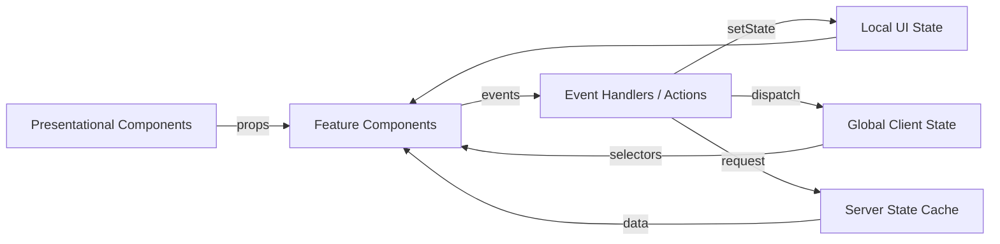
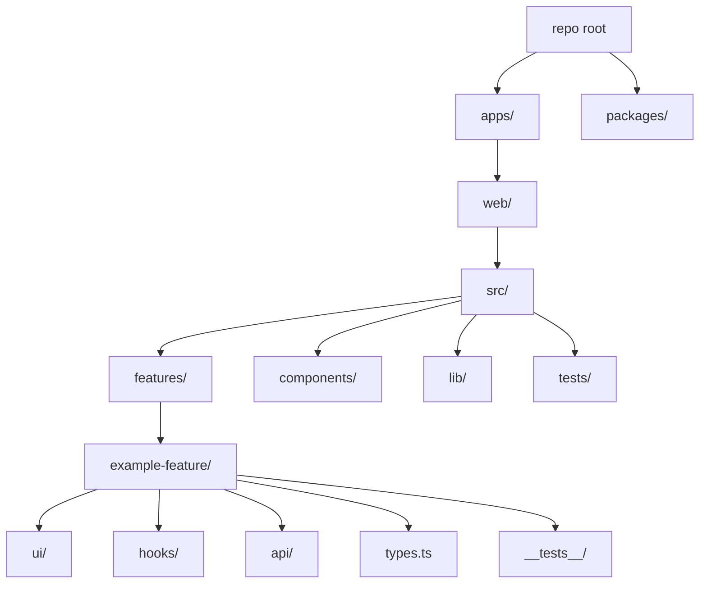

# React Best Practices Playbook

## Executive summary

A generalized best-practices document for React should optimize for three outcomes: predictable UI behavior, sustainable change over time, and fast feedback loops in development and delivery. The most reliable path is to treat React components primarily as pure render functions, keep state minimal and well-scoped, separate “server state” from “client/UI state,” and standardize how effects, errors, performance work, and tests are handled so teams don’t reinvent patterns per feature.

Across modern React codebases, the most consistently successful approaches share a few principles: default to function components and Hooks; design components around composition (small reusable building blocks) rather than deep inheritance; keep side effects explicit and cancellable; prefer data-fetching libraries that provide caching, retries, and request deduplication; measure performance before micro-optimizing; test behavior through user interactions; and enforce accessibility and security via automated tooling and code review checklists. A strong best-practices doc also includes architectural conventions (folder structure, boundaries, and naming), TypeScript typing patterns, CI/CD guardrails, and upgrade/migration playbooks.

This report provides a rigorous structure you can directly adapt into an internal “React Best Practices” document, including rationale, concrete rules, short code examples, trade-offs, comparison tables, mermaid diagrams, and a curated reference list to anchor the document in authoritative guidance. A practical goal is not to enumerate every possible option, but to define defaults and escalation paths: what to do first, when to move to more powerful patterns, and what to avoid.

## Component design and TypeScript

A best-practices document should treat component design as the foundation of the system. Most downstream problems (state sprawl, poor testability, performance issues) are symptoms of unclear component boundaries.

**Rationale**  
React is most maintainable when render logic is deterministic and data flows are obvious. Function components and Hooks encourage explicit data flow and reduce incidental complexity compared to historical class patterns. Composition scales better than inheritance because UI concerns rarely fit stable taxonomies; instead, they benefit from small, recombinable primitives.

**Concrete rules**

1. **Default to function components; use classes only when required by a capability that is still class-based (for example, an Error Boundary implementation).**
2. **Follow the Rules of Hooks strictly:** call Hooks at the top level, never inside loops/conditions; call Hooks only from React functions (components or custom hooks).
3. **Prefer composition over inheritance.** Use props, children, render props, and custom hooks to share behavior.
4. **Keep components “pure” by default:** rendering should not trigger side effects; side effects belong in event handlers or effects.
5. **Design API surfaces intentionally:**
   - Controlled vs uncontrolled inputs should be explicit.
   - Prefer stable, minimal props.
   - Avoid “boolean explosion” props; use enums/discriminated unions.
6. **Keys and identity:** never use array index as a key when the list can reorder, insert, or delete.
7. **TypeScript defaults:**
   - Use `strict: true`.
   - Prefer `type` aliases for props; use interfaces where extension is genuinely needed.
   - Prefer `ReactNode` for `children`.
   - Prefer discriminated unions for mode-dependent props.

**Short code examples**

_Function component with composition and a custom hook:_
```tsx
type NoticeProps =
  | { variant: "info"; message: string }
  | { variant: "error"; message: string; onRetry: () => void };

export function Notice(props: NoticeProps) {
  if (props.variant === "error") {
    return (
      <section role="alert">
        <p>{props.message}</p>
        <button onClick={props.onRetry}>Retry</button>
      </section>
    );
  }

  return (
    <section aria-live="polite">
      <p>{props.message}</p>
    </section>
  );
}
```

_Custom hook that isolates reusable behavior:_
```tsx
import { useEffect, useState } from "react";

export function useOnlineStatus() {
  const [online, setOnline] = useState(() => navigator.onLine);

  useEffect(() => {
    const on = () => setOnline(true);
    const off = () => setOnline(false);
    window.addEventListener("online", on);
    window.addEventListener("offline", off);
    return () => {
      window.removeEventListener("online", on);
      window.removeEventListener("offline", off);
    };
  }, []);

  return online;
}
```

_Pure component + memoization when warranted:_
```tsx
import { memo } from "react";

type RowProps = { id: string; label: string; onSelect: (id: string) => void };

export const Row = memo(function Row({ id, label, onSelect }: RowProps) {
  return <button onClick={() => onSelect(id)}>{label}</button>;
});
```

**Trade-offs to document**
- Function components + Hooks reduce boilerplate, but misuse (especially effects and dependencies) can create subtle bugs (stale closures, infinite loops).
- `React.memo` (or “pure” components) can improve performance, but adds cognitive overhead and can make performance worse if props are unstable (new objects/functions each render).
- Abstraction via custom hooks can conceal logic; your doc should define when to extract hooks (reused logic, hard-to-test effect logic) vs keep inline.

**Mermaid diagram: recommended component/data flow**  
This is useful to include early in a best-practices doc to standardize mental models.



## State management

State management guidance should emphasize that “most state is local,” “some state is shared,” and “server state is different.” Your best-practices doc should define strong defaults and anti-patterns.

**Rationale**  
React is simplest when state lives as close as possible to where it is used. Global state is powerful but easy to overuse, leading to tight coupling, complex updates, and difficult refactors. Modern practice is to distinguish:
- **Local UI state:** toggles, form input, transient UI.
- **Shared client state:** cross-cutting UI/session state (theme, auth session metadata, feature flags).
- **Server state:** fetched data with caching, invalidation, and synchronization needs.

**Concrete rules**

1. **Start with local state (`useState`, `useReducer`) and lift state only when at least two sibling subtrees need it.**
2. **Avoid redundant/derived state:** do not store values that can be computed from props or other state unless it is computationally expensive and measured.
3. **Use Context for “ambient dependencies,” not as a default global store:**
   - Theme, locale, auth session object (not large mutable data).
   - Small shared state with stable updates.
4. **Use a dedicated server-state library for remote data** (cache + dedupe + retries + invalidation). Do not treat remote data as “just another Redux slice” unless you have a strong reason.
5. **Escalation path:**
   - Local state → lifted state via props → Context (limited) → state library (Redux Toolkit/MobX/etc.) when complexity warrants.
6. **When to use `useReducer`:** complex transitions, multiple related sub-values, or “state machine”-like logic.
7. **Derived state rule of thumb:** if you find yourself syncing state from props in an effect, stop and reconsider design.

**Short code examples**

_Lifting state only when necessary:_
```tsx
function Parent() {
  const [query, setQuery] = useState("");
  return (
    <>
      <SearchBox value={query} onChange={setQuery} />
      <Results query={query} />
    </>
  );
}
```

_Avoiding derived state (compute during render):_
```tsx
const fullName = `${user.firstName} ${user.lastName}`; // no extra state
```

_UseReducer for explicit transitions:_
```tsx
type State = { status: "idle" | "saving" | "error" };
type Action = { type: "save" } | { type: "success" } | { type: "fail" };

function reducer(state: State, action: Action): State {
  switch (action.type) {
    case "save": return { status: "saving" };
    case "success": return { status: "idle" };
    case "fail": return { status: "error" };
  }
}

const [state, dispatch] = useReducer(reducer, { status: "idle" });
```

**Comparison table: state management options**

| Option | Best for | Strengths | Costs / risks | Practical rule |
|---|---|---|---|---|
| Local state (`useState`) | Component-scoped UI state | Simple, explicit | Can require lifting | Default choice |
| `useReducer` | Complex transitions, interrelated fields | Predictable updates, testable reducer | More code, learning curve | Use when transitions matter |
| Context + reducer | Small shared UI state | Avoids prop drilling | Easy to over-render; can become “poor man’s Redux” | Keep value stable; split contexts |
| Redux Toolkit | Large shared client state, complex coordination | Strong conventions, devtools, testability | Boilerplate if overused | Use when many features share state |
| RTK Query | Server state with caching/invalidation | First-class fetching, dedupe, cache | Redux dependency; learning | Prefer for server state if already on Redux |
| MobX | Highly reactive domain models | Minimal boilerplate; automatic tracking | Can hide update flow; harder to reason globally | Use when model-centric reactivity is desired |
| Lightweight stores (e.g., Zustand/Jotai) | Medium shared state with low ceremony | Simple APIs | Fewer built-in conventions | Use when you need global state without Redux overhead |

**Trade-offs to document**
- Context can be sufficient but may cause broad re-renders if not split carefully.
- Redux Toolkit enforces structure well but can increase upfront complexity for small apps.
- MobX reduces boilerplate but can make data flow less explicit, which impacts debugging and onboarding.
- Server-state libraries reduce custom effect logic substantially, but require consistent query key strategies and invalidation discipline.

## Side effects, data fetching, and error handling

A best-practices document should treat effects as “escape hatches” and define standardized patterns for network requests, cancellation, and error boundaries.

**Rationale**  
Side effects (subscriptions, network requests, timers, imperative DOM work) are the primary source of bugs in React apps because they violate pure rendering assumptions and are sensitive to timing, dependencies, and concurrency features. Standard patterns reduce cognitive load and prevent subtle leaks or race conditions.

**Concrete rules**

1. **Prefer event-driven side effects in handlers** (e.g., onClick → submit) over “effects that react to state changes,” unless you are synchronizing with an external system.
2. **`useEffect` is for synchronization, not for deriving state.**
3. **Always handle cancellation / stale responses** for requests triggered by effects:
   - Use `AbortController` when available.
   - Ignore results if they are outdated (“request versioning”).
4. **Avoid async functions directly as the effect callback**; define and call an inner async function.
5. **Data fetching default: use a server-state library** (SWR/React Query/TanStack Query/RTK Query) rather than rolling your own `useEffect` patterns, unless requirements are trivial.
6. **Server Components / framework data loading:** when using frameworks that support server-side data loading or server components, default to fetching on the server for initial render and use client fetching for interactive updates.
7. **Error handling strategy:**
   - Use **error boundaries** for render-time errors and unexpected exceptions in component trees.
   - Standardize error UI and logging/reporting.

**Short code examples**

_Effect with cancellation via AbortController:_
```tsx
useEffect(() => {
  const controller = new AbortController();

  async function load() {
    try {
      const res = await fetch(`/api/search?q=${encodeURIComponent(q)}`, {
        signal: controller.signal,
      });
      if (!res.ok) throw new Error("Request failed");
      const data = await res.json();
      setResults(data);
    } catch (e) {
      if ((e as any).name === "AbortError") return;
      setError(e as Error);
    }
  }

  load();
  return () => controller.abort();
}, [q]);
```

_Error boundary (class-based):_
```tsx
import type { ReactNode } from "react";

export class ErrorBoundary extends React.Component<
  { fallback: ReactNode; children: ReactNode },
  { hasError: boolean }
> {
  state = { hasError: false };

  static getDerivedStateFromError() {
    return { hasError: true };
  }

  componentDidCatch(error: unknown) {
    // send to monitoring service
    console.error(error);
  }

  render() {
    if (this.state.hasError) return this.props.fallback;
    return this.props.children;
  }
}
```

**Trade-offs to document**
- Hand-rolled `useEffect` fetching is flexible but tends to recreate caching, deduplication, retries, and race-handling poorly.
- Server-side fetching improves perceived performance and reduces client complexity, but requires careful boundary management (what can run on server vs client).
- Error boundaries catch render errors, but not all async errors automatically; your doc should define patterns for “async error surfaces” (toasts, banners) and logging.

## Performance and scalability

Performance guidance should focus on measurement, avoiding unnecessary re-renders, and applying high-leverage techniques like virtualization and code-splitting before micro-optimizations.

**Rationale**  
React performance problems usually come from excessive re-rendering, expensive rendering work, or shipping too much JavaScript. The best document teaches engineers to identify which of these is happening and apply targeted fixes.

**Concrete rules**

1. **Measure first:** use React DevTools Profiler and browser performance tools before optimizing.
2. **Stabilize props before `memo`:**
   - Avoid creating new objects/arrays/functions in render unless needed.
   - Use `useCallback`/`useMemo` selectively when profiling shows benefit.
3. **Prefer structural fixes:**
   - Split component trees.
   - Move state closer to consumers.
   - Reduce context breadth (multiple smaller contexts).
4. **Virtualize long lists** (windowing) rather than rendering thousands of DOM nodes.
5. **Code-split by route and heavy features:**
   - Use dynamic import and `React.lazy` with Suspense fallback.
6. **Avoid “premature memoization”:** `useMemo`/`useCallback` adds complexity and can slow down if dependencies change frequently.
7. **Keep bundles lean:**
   - Avoid large dependencies when smaller alternatives suffice.
   - Use tree-shaking-friendly imports.

**Short code examples**

_Code splitting a heavy component:_
```tsx
import { lazy, Suspense } from "react";

const Chart = lazy(() => import("./Chart"));

export function AnalyticsPanel() {
  return (
    <Suspense fallback={<div>Loading…</div>}>
      <Chart />
    </Suspense>
  );
}
```

_Targeted useCallback to stabilize props:_
```tsx
const onSelect = useCallback((id: string) => {
  setSelectedId(id);
}, []);
```

**Trade-offs to document**
- Code splitting improves initial load but can add latency for first access to a split chunk; good UX requires thoughtful fallbacks and prefetching strategies.
- Virtualization is essential for large datasets but complicates variable-height layouts and “find in page” expectations.
- Aggressive memoization can make code harder to maintain and sometimes worsens performance due to extra comparisons and memory pressure.

## Testing strategy

A strong React best-practices document treats tests as product risk management: test behaviors users rely on, at the cheapest level that provides confidence.

**Rationale**  
UI systems change frequently. Tests must be resilient to refactors and reflect user behavior, otherwise they become a drag that teams bypass. A standard testing pyramid tailored to UI is typically: many unit/integration tests for components and logic, fewer E2E tests for core flows.

**Concrete rules**

1. **Default to behavior-focused tests** (render + interact + assert user-visible outcomes). Avoid testing implementation details (internal state, private methods).
2. **Use component integration tests for most UI logic** (forms, validation, conditional rendering).
3. **Use E2E tests for critical flows only** (auth, checkout, core CRUD). Keep them deterministic and fast.
4. **Mock at the boundary:**
   - Prefer mocking network requests (e.g., service worker-based mocking) rather than mocking internal modules heavily.
   - Avoid over-mocking React hooks and component internals.
5. **Snapshot tests sparingly**—use them for stable, low-variance output (icons) and prefer explicit assertions for behavior.
6. **Test accessibility** as part of CI: run automated a11y checks on key pages/components.

**Comparison table: testing tools**

| Category | Common choices | Strengths | Weaknesses | Recommendation default |
|---|---|---|---|---|
| Unit + component integration runner | Jest, Vitest | Mature ecosystems | Jest can be slower; config complexity | Standardize one across org |
| Component testing utilities | React Testing Library | Tests user behavior | Can be verbose | Default choice for UI tests |
| E2E testing | Playwright, Cypress | Real browser confidence | Requires infra + stability work | Use for core flows only |
| Network mocking | MSW, built-in test server mocks | Realistic API simulation | Requires setup discipline | Mock at HTTP boundary |
| Visual/regression | Chromatic, Percy, Playwright screenshots | Catches UI regressions | Noise if not managed | Use for design-sensitive areas |

**Short code example (behavior-focused test style):**
```tsx
render(<LoginForm />);
await user.type(screen.getByLabelText(/email/i), "a@b.com");
await user.type(screen.getByLabelText(/password/i), "secret");
await user.click(screen.getByRole("button", { name: /sign in/i }));
expect(await screen.findByText(/welcome/i)).toBeInTheDocument();
```

**Trade-offs to document**
- E2E tests provide the most realistic confidence but are the most expensive to maintain; the document should define which flows justify this cost.
- Heavy mocking makes tests fast but increases drift from real behavior; boundary mocking is a stable compromise.

## Accessibility, styling, and architecture

These domains should be standardized because inconsistency causes compounding costs: accessibility regressions, unmaintainable CSS, and architectural sprawl.

**Rationale**  
Accessibility is a product requirement, not an enhancement, and is cheapest when built-in from the start. Styling strategies should match team scale and component reuse needs. Architecture conventions reduce onboarding time and enable safe refactors.

**Concrete rules: accessibility**

1. **Use semantic HTML first** (button, input, label, nav, main) and add ARIA only when semantics are insufficient.
2. **Keyboard support is mandatory** for interactive UI: tab order, visible focus, escape key behavior for modals, arrow key behavior for widgets when appropriate.
3. **Labels and names:** every form control has an accessible name (`<label>` or `aria-label`).
4. **Focus management:** modals trap focus; closing a modal returns focus to the trigger.
5. **Automate checks:**
   - Linting rules for JSX accessibility.
   - Automated a11y tests on key routes/components.
6. **Color contrast and motion:** enforce contrast minimums; respect reduced motion preferences.

**Concrete rules: styling**

1. **Pick one primary styling strategy per repo** and document exceptions.
2. **Component-level scoping is the default** (CSS Modules or equivalent) to avoid global leakage.
3. **Global styles are limited** to resets, typography scale, and design tokens.
4. **Avoid deeply nested selectors**; prefer flat, composable class structures.
5. **Design system alignment:** if building a design system, prioritize tokens + components over ad-hoc classes.

**Comparison table: styling approaches**

| Approach | Best for | Strengths | Weaknesses | Default guidance |
|---|---|---|---|---|
| BEM + global CSS | Simple sites, low tooling | Predictable naming | Global leakage risk | Use only with strict conventions |
| CSS Modules | Component-scoped styling | Local scope, low runtime | Build step needed | Strong default for many teams |
| CSS-in-JS | Dynamic theming, co-located styles | Powerful composition | Runtime cost; vendor lock-in | Use when theming/dynamic styles dominate |
| Utility-first (Tailwind) | Rapid UI dev in product teams | Consistency, speed | Markup can get noisy | Works well with strong conventions |
| Component libraries | Consistent UI at scale | Faster delivery | Customization constraints | Adopt when org needs uniformity |

**Concrete rules: folder structure and architecture**

1. **Prefer feature-oriented structure** for product apps:
   - Keeps related UI, hooks, types, tests together.
   - Reduces cross-layer import tangles.
2. **Define architectural boundaries:**
   - “UI components” must not import data access directly.
   - Data fetching and domain logic live in a dedicated layer per feature.
3. **Limit shared modules:** create shared components only after 2–3 real use cases; otherwise keep local to feature to avoid premature coupling.
4. **Monorepo considerations:** standardize tooling, build caching, and dependency boundaries across packages.

**Mermaid diagram: recommended folder structure**



**Trade-offs to document**
- Feature-based architecture improves cohesion, but can lead to duplication; your doc should define when/where shared packages are created.
- Utility-first CSS improves speed but can degrade readability without conventions (class ordering, extraction to components).
- CSS-in-JS offers powerful theming but adds runtime and dependency complexity.

## Delivery, security, documentation, and migration

This section turns best practices into operational outcomes: secure, repeatable builds; consistent deployments; strong onboarding; and safe upgrades.

**Rationale**  
Teams usually underestimate non-code costs: build instability, environment drift, supply-chain risk, and upgrade pain. A best-practices document should make the “right way” the easy way through CI enforcement, templates, and a migration cadence.

**Concrete rules: error handling and observability**

1. **Use error boundaries at route/feature boundaries** and show a helpful fallback UI.
2. **Log exceptions centrally** (browser + server) and attach context (user/session id, route, correlation id).
3. **Handle expected errors explicitly** (validation, 401/403, 404) rather than relying on error boundaries.

**Concrete rules: security**

1. **Default to safe rendering:** never inject HTML unless required; sanitize untrusted HTML before rendering.
2. **Protect against XSS:** treat all external content as untrusted; avoid string-based DOM injection.
3. **CSRF/auth:** use secure auth patterns appropriate to your backend (same-site cookies, CSRF tokens as needed).
4. **Dependency hygiene:**
   - Lockfiles are mandatory.
   - Audit dependencies regularly; track and patch vulnerabilities quickly.
   - Prefer well-maintained libraries with clear release practices.
5. **Secrets management:** no secrets in frontend bundles; environment variables injected into client builds must be treated as public.

**Concrete rules: CI/CD and deployment**

1. CI must run: formatting, linting, typecheck, unit/integration tests, and key E2E smoke tests on main branches.
2. **Use preview deployments** for pull requests to speed review and reduce integration risk.
3. **Build reproducibly:** pin Node/package manager versions; avoid “works on my machine.”
4. **Deploy strategy depends on app type:** SPA static hosting vs SSR vs edge rendering vs containerized services.

**Comparison table: deployment options**

| Option | Best for | Strengths | Weaknesses | When to choose |
|---|---|---|---|---|
| Static SPA on CDN | Content-heavy apps, simple APIs | Fast, cheap, simple | SEO/perf limits vs SSR | When SSR isn’t required |
| SSR (Node server) | SEO, personalization | Great UX/SEO | More ops complexity | When first-load UX matters |
| Serverless | Spiky traffic | Scales easily | Cold starts, limits | When ops team is small |
| Edge rendering | Global latency-sensitive apps | Fast worldwide | Platform lock-in | When global TTFB is critical |
| Containers/Kubernetes | Large org standardization | Control, portability | High ops cost | When you need deep control |

**Concrete rules: documentation and onboarding**

1. Maintain a short “start here” README: architecture overview, local dev, env config, common tasks.
2. Keep **Architecture Decision Records (ADRs)** to explain why key choices were made (state library, styling approach, routing, data fetching).
3. Document conventions that prevent churn: naming, folder structure, testing strategy, component dos/don’ts.
4. Provide templates/generators for new features to enforce consistency.

**Concrete rules: migration strategies and upgrade paths**

1. Upgrade regularly in small steps rather than large jumps.
2. Maintain a compatibility matrix: React version, framework version, build tool, test runner, state library versions.
3. Use codemods and linters to enforce modern patterns.
4. Run upgrades behind feature flags where feasible; verify with automated tests and canary releases.

**Common anti-patterns and pitfalls to call out explicitly**

- Storing derived data in state and trying to “keep it in sync.”
- Overusing Context as a global store, causing broad re-renders and hidden coupling.
- Fetching data in many ad-hoc `useEffect` blocks with inconsistent caching and error handling.
- Missing effect dependencies or “fixing” them by disabling lint rules.
- Using array index as a key in dynamic lists, causing UI state bugs.
- Creating unstable props (inline object literals/functions) and then adding `memo` everywhere to compensate.
- Conflating server state and client state (e.g., using global state to cache fetched lists without a consistent invalidation strategy).
- Large “god components” that mix data access, transformations, and presentation, reducing testability and reuse.
- Treating accessibility as a final QA step rather than a development constraint.

**Curated references for anchoring the best-practices document**  
(Use these as the canonical bibliography for the internal doc; link to the official pages in your final version.)

- Official React documentation (react.dev): function components, Hooks, effects, memoization, rules of Hooks, and architectural guidance.
- React RFCs and release posts covering concurrency/streaming/Suspense-related behavior and recommended migration patterns.
- entity["company","Meta","technology company"] engineering ecosystem references (where applicable) for React-adjacent tooling conventions and test approaches.
- Redux Toolkit + RTK Query documentation: recommended Redux patterns, slices, async/data fetching guidance, and store organization.
- TanStack Query / React Query documentation: caching, invalidation, retries, request cancellation patterns, and query key best practices.
- SWR documentation: stale-while-revalidate mental model and caching behavior.
- Testing Library documentation: guiding principles (test the way users use the UI).
- Jest/Vitest documentation: configuration best practices, mocking guidance, and performance tips.
- Playwright/Cypress documentation: E2E testing patterns, parallelization, and CI execution recommendations.
- WAI-ARIA Authoring Practices and accessibility references: keyboard behaviors, roles, and widget patterns.
- entity["company","Google","technology company"] engineering style guide references (TypeScript/JS conventions where relevant).
- entity["company","Airbnb","travel company"] JavaScript/React style guide conventions (component patterns, readability conventions).
- entity["company","Microsoft","technology company"] TypeScript handbook and best practices (typing patterns, strictness guidance).
- entity["company","Vercel","cloud platform company"] and entity["company","Amazon Web Services","cloud services provider"] deployment guidance for frontend hosting/SSR/serverless patterns.

