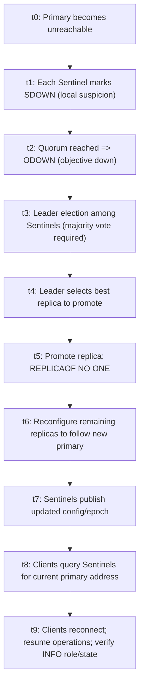

# Redis Best Practices Playbook

## Executive Summary

This report synthesizes a generalized set of best practices for Redis across data modeling, performance, scaling/architecture, operations, security, reliability, testing/benchmarking, cost optimization, and migration/upgrade strategy. The user’s environment details that materially affect many “best” choices—workload type (cache vs system-of-record), dataset size, key cardinality, read/write ratio, latency SLOs (p50/p99), durability requirements, and deployment substrate (VMs vs containers vs bare metal)—are **unspecified**, so recommendations are expressed as decision frameworks with concrete defaults and explicit tradeoffs. citeturn10view0turn12view0turn11view0

Redis is commonly deployed as an in-memory data structure store and is frequently used as a cache, database, and messaging system; these roles impose different constraints on persistence, eviction, and topology. citeturn6search9turn23view0turn9view0

**Key cross-cutting principles that remain stable across versions and topologies:**

First, treat data modeling as a performance and cost control surface: key count, key name length, and chosen data types affect memory overhead, cache locality, CPU cost, and multi-key behavior in clustered deployments. Redis does not provide namespaces, so a clear key naming scheme (commonly colon-delimited) is a foundational operational control. citeturn15search0turn15search7turn8view2turn9view1

Second, separate “latency engineering” from “throughput engineering.” Pipelining and batching reduce RTT amplification; persistence and background fork-based work can show up as tail-latency spikes; slow commands and large-key operations can block the server; client buffer growth can become a memory and availability risk if left unchecked. citeturn8view3turn12view0turn3search0turn15search2turn21view0

Third, choose scaling/HA mechanisms based on the operational contract you need: (a) single instance (simplest), (b) replication + automatic failover, or (c) sharded cluster with built-in partitioning. Redis replication is asynchronous by default; optional synchronous acknowledgment via `WAIT` improves safety but does not convert the system into strict strong consistency, and failover can still lose some acknowledged writes depending on persistence and failure timing. citeturn9view3turn9view2turn8view2

Finally, security posture should default to “assume hostile networks”: Redis is designed for trusted clients in trusted environments and should not be exposed directly to untrusted networks; use network isolation, protected mode, fine-grained ACLs (introduced in Redis 6), and TLS (supported starting in Redis 6). citeturn23view0turn23view1turn2search2turn2search9

## Data Modeling and Development Practices

**Rationale.** In Redis, data modeling is inseparable from performance, memory footprint, and operability. Memory overhead is strongly affected by the number of keys and object encodings; fewer keys with structured values (for example, hashes) can be markedly more memory-efficient than many independent small string keys, because small aggregates can use compact encodings and reduce per-key bookkeeping overhead. citeturn9view1turn4search1turn6search2

### Data types and memory-efficient structures

**Actionable recommendations.**

Use native data structures to match access patterns rather than treating everything as opaque strings. Redis supports a range of structures (strings, hashes, lists, sets, sorted sets, streams, bit-oriented encodings, and others) intended to map to common problems with efficient server-side primitives. citeturn6search9turn6search5turn6search30

When modeling “objects” with many small fields, prefer hashes over many individual keys where TTL-per-field is not required. Redis explicitly optimizes small hashes by representing them with compact linear encodings when they are small enough, keeping common operations effectively O(1) for practical sizes while improving cache locality; a key limitation is that hash fields cannot carry individual TTLs. citeturn9view1turn4search1

Where you store large populations of tiny items (sessions, feature flags, counters), consider **bucketing** (grouping many logical fields into a smaller number of keys) to reduce per-key overhead. This is a documented memory optimization pattern because key metadata and key names impose a cost that becomes dominant at high key counts. citeturn4search1turn6search2

Use `MEMORY USAGE <key>` to quantify per-key overhead and validate modeling hypotheses. The command reports bytes required for a key and its value including administrative overhead, and the example shows that even an “empty” entry has material overhead that varies by version and allocator, which is why key count and key name length matter in capacity planning. citeturn6search2turn15search7

**Tradeoffs.** Hash bucketing improves memory efficiency but can reduce operational flexibility (no per-field TTL) and can increase contention if too many logical items converge on one “hot” bucket key. citeturn9view1turn8view2

**Concrete example (object-as-hash, plus measurement).**
```bash
# Object modeling as a hash (no per-field TTL, but fewer keys):
HSET user:123 profile_name "Ada" plan "pro" last_seen_ms "1730000000000"

# Measure memory usage (exact bytes depend on version & allocator):
MEMORY USAGE user:123
```
citeturn9view1turn6search2turn15search0

### Key naming, namespacing, and cluster-aware key design

**Rationale.** Redis does not provide namespaces; you must avoid collisions and make keys operable by convention. A common convention is colon-delimited components to simulate hierarchy (e.g., `entity:id:attribute`). citeturn15search0turn15search7turn15search13

**Actionable recommendations.**

Adopt a stable key taxonomy. Minimum viable structure typically includes: `<app_or_domain>:<entity>:<id>:<attribute>:<version>`. The primary goal is operational clarity for scanning, debugging, and bulk cleanup, not aesthetics. citeturn15search0turn17view0turn16search32

Keep key names short enough for scale. Redis guidance and examples highlight that key length has direct memory cost that becomes meaningful at millions of keys. citeturn15search7turn6search2

If you use Redis Cluster, incorporate **hash tags** (`{...}`) to place related keys in the same hash slot when you need multi-key operations or transactions/scripts spanning those keys. Redis Cluster computes the slot based on CRC16 modulo 16384 and uses “hash tag” substring rules to co-locate keys. citeturn8view2turn3search2turn3search10

**Tradeoffs.** Hash tags improve multi-key capability but reduce distribution entropy—too aggressive tagging can create hot slots and uneven shard load. The official guidance for clustered key design emphasizes thinking about keyspace partitioning and avoiding “global state under a single key” that requires transactional manipulation because it can cause cross-slot constraints. citeturn15search27turn8view2

**Concrete example (cluster-friendly grouping).**
```text
# Co-located keys via hash tag (same slot because {123}):
cart:{123}
cart:{123}:items
cart:{123}:totals
```
citeturn8view2turn15search27

### TTL strategies and expiration controls

**Rationale.** TTL is central for caches and short-lived data, and it interacts with eviction policies and memory use. `EXPIRE` makes a key “volatile” (TTL-associated), and TTL can be inspected via `TTL`. citeturn15search1turn15search5turn11view0

**Actionable recommendations.**

For cache entries, default to setting TTL at write time and make the key lifecycle explicit (creation → refresh → expiration), rather than relying on manual cleanup. Use TTL-aware eviction policies only when you deliberately constrain eviction to expiring keys (e.g., `volatile-ttl`). citeturn15search1turn11view0

Prefer explicit TTL semantics when updating expiration: `EXPIRE key seconds NX|XX|GT|LT` supports conditional updates (only set if no TTL exists; only set if TTL exists; set only if greater/less), which is useful for enforcing “no accidental TTL extension” or “sliding sessions” policies. citeturn15search1

Avoid assuming TTL is “free”: setting an expire value costs memory, and documentation notes that policies like `allkeys-lru` can be more memory efficient because they don’t require TTL metadata to operate. citeturn11view1turn11view0

**Concrete example (cache write with TTL and safe updates).**
```bash
# Write through cache (set if absent, with TTL)
SET cache:user:123:profile "<blob>" EX 300 NX

# Extend TTL only if key already has TTL (prevents "resurrecting" persistent keys)
EXPIRE cache:user:123:profile 300 XX

# Inspect TTL
TTL cache:user:123:profile
```
citeturn15search1turn15search5

### Client-side development practices: pooling, transactions, optimistic locking, idempotency

**Connection pooling and concurrency.** Redis guidance on performance tuning explicitly calls out connection pooling as a lever: if not using a pool, consider it; and if using one, avoid pool starvation that forces new connection creation on critical paths. citeturn19search11

**Transactions and optimistic locking.** Use `WATCH`/`MULTI`/`EXEC` to implement optimistic concurrency: if watched keys change before `EXEC`, the transaction aborts, which is a building block for compare-and-set in multi-client environments. Transactions serialize command execution so other requests cannot interleave mid-transaction. citeturn1search18turn1search22

**Lua scripts vs transactions.** Lua scripts (via `EVAL`/`EVALSHA`) provide atomic server-side logic in one round trip and can replace complex `WATCH` retry loops, but scripts execute atomically and can block the server while running, so you must bound script work and avoid long loops. Redis replication documentation notes that during Lua execution, key expiration is conceptually “frozen,” which underscores that scripts run as an isolated unit. citeturn9view3turn23view2turn1search22

**Idempotency.** Redis primitives support idempotent workflows by writing “request IDs” or “dedupe keys” with `SET ... NX` (write-once) and TTL-bound dedupe windows; for multi-step workflows, wrap “check → write” logic in a Lua script to avoid race conditions. The atomicity guarantees of scripts and transactions are the foundation for these higher-level patterns. citeturn1search22turn9view3

**Concrete example (optimistic lock).**
```bash
WATCH balance:123
MULTI
  DECRBY balance:123 10
  INCRBY balance:fees 1
EXEC        # returns null/empty if watched key was modified
```
citeturn1search18turn1search22

## Performance and Latency Engineering

**Rationale.** Redis can execute core operations extremely quickly, but end-to-end latency is a product of network RTT, client behavior, server-side blocking operations, and background tasks like persistence forks. The official latency diagnosis checklist emphasizes: use Slow Log, avoid blocking commands, disable Transparent Huge Pages (THP), measure intrinsic scheduler latency, and use latency monitoring. citeturn12view0turn3search0turn3search9

### Latency baselining and observability primitives

**Actionable recommendations.**

Measure baseline latency from the server host using `redis-cli --intrinsic-latency` to distinguish system scheduler/hypervisor issues from Redis issues. citeturn12view0turn17view0

Measure client-perceived latency via `redis-cli --latency` and collect distributions (p95/p99) with `--latency-dist` where possible; use Slow Log and latency monitoring to attribute spikes to command execution vs fork/persistence vs eviction cycles. citeturn17view0turn3search0turn3search1turn5search6

Enable the latency monitor (disabled by default) with `CONFIG SET latency-monitor-threshold <ms>` and use `LATENCY DOCTOR`, `LATENCY LATEST`, and `LATENCY HISTORY` for diagnosis and trending. citeturn3search9turn3search1turn5search6turn5search2

**Concrete example (latency observability).**
```bash
# Enable latency monitor (example threshold)
CONFIG SET latency-monitor-threshold 10

LATENCY DOCTOR
LATENCY LATEST
LATENCY HISTORY command
SLOWLOG GET 10
```
citeturn3search9turn3search1turn5search6turn3search0

### Pipelining, batching, and server-side logic

**Pipelining.** Pipelining reduces round trips by issuing multiple commands without waiting for each reply; the official documentation explains RTT amplification and shows that throughput can become RTT-limited even when server-side processing is fast. citeturn8view3

**Actionable recommendations.**

Pipeline when you have many independent commands, especially over higher RTT links. Most clients support pipelines; treat pipeline size as a tunable (too large can inflate client memory and increase tail latency). citeturn8view3turn21view0

Prefer native multi-key/multi-field commands (e.g., `MGET`, `MSET`, `HMGET`) when they match semantics; pipeline fills the gaps where no native bulk command exists. In cluster mode, multi-key behavior differs and may require co-location. citeturn3search10turn8view2

Use Lua scripts to combine “read → compute → write” workflows atomically and eliminate client-server chatter; keep scripts short, avoid large loops, and be explicit about worst-case runtime. Lua scripts are treated similarly to transactions in that they execute as an isolated operation, and replication semantics freeze time with respect to expiries during script execution. citeturn9view3turn23view2turn1search22

### Eviction policy and memory-bound performance

**Rationale.** When Redis is used as a cache, eviction policy defines which keys are removed when `maxmemory` is exceeded. Redis enforces eviction on write-like commands that add memory and supports several policies (LRU/LFU variants, TTL-based, random, noeviction). citeturn9view0turn11view0turn11view2

**Actionable recommendations.**

Always set `maxmemory` intentionally for cache-like workloads to avoid uncontrolled memory growth; `maxmemory 0` means “no limit” on 64-bit systems, while 32-bit systems have an implicit limit (~3GB). citeturn11view0turn9view0

If using replication or persistence, leave headroom beyond `maxmemory` because Redis uses additional RAM for replication/AOF buffers that are *not* counted toward eviction checks; the eviction docs recommend leaving extra RAM and note an `INFO` metric to estimate memory not counted for eviction. citeturn11view0turn9view3

Tune `maxmemory-samples` when using LRU/LFU approximations if hit ratio is poor and CPU headroom exists; Redis LRU and LFU are approximations that sample keys, trading minor CPU for better eviction choices. citeturn11view2

**Eviction policies comparison (summary table).**  
(Policy availability and semantics are from the official eviction reference. citeturn11view0turn11view2)

| Policy | What it evicts | When it’s a good fit | Key caveats / tradeoffs |
|---|---|---|---|
| `noeviction` | None; writes that need memory fail | You must not drop data; prefer explicit errors | Backpressure shifts to app; can cause outages if not handled citeturn11view0 |
| `allkeys-lru` | Least recently used keys (approx.) | Common cache default; “hot subset” access patterns | Approximation tunable via `maxmemory-samples`; TTL metadata not required citeturn11view0turn11view2 |
| `allkeys-lfu` | Least frequently used keys (approx.) | Workloads with stable hot set; better than LRU in some cases | Tunable (`lfu-log-factor`, `lfu-decay-time`) and approximate counters citeturn11view0turn11view2 |
| `allkeys-random` | Random keys | Uniform/random access workloads | Lower CPU, but unpredictable hit ratio citeturn11view0 |
| `volatile-lru` / `volatile-lfu` | LRU/LFU among *TTL keys only* | Mixed dataset: some persistent + some cache entries | Behaves like `noeviction` if few/no TTL keys exist citeturn11view0 |
| `volatile-ttl` | TTL keys with shortest remaining TTL | When your app sets TTLs that encode eviction priority | Requires good TTL hygiene; TTL metadata costs memory citeturn11view1 |

### Persistence choices and their performance impact

**Rationale.** Redis persistence is a durability-performance continuum (RDB snapshots vs AOF logs vs both vs none). The persistence documentation defines the modes and provides explicit advantages/disadvantages, including AOF fsync options, background rewrites, and restart speed differences. citeturn10view0turn10view1turn12view0

**Actionable recommendations.**

If Redis is used as a pure cache, “no persistence” can be valid, but operationally confirm that losing the dataset on restart is acceptable. citeturn10view0turn9view3

If durability matters, use AOF with `appendfsync everysec` as a common compromise between safety and performance; official guidance explicitly calls “fsync every second” fast and relatively safe, while “always” is very slow. citeturn10view2turn12view0

For robustness and faster restart, consider combining RDB + AOF. The persistence docs recommend both when you want safety comparable to major relational systems and discourage AOF-only as a universal default because periodic RDB snapshots support backups and faster restarts. citeturn10view1turn10view0

Plan for fork-related latency and OS tuning: background saving and rewrites involve `fork()`, and latency diagnosis documentation highlights that fork speed and THP settings can dominate tail latency. citeturn12view0turn10view4

**Persistence modes comparison (decision table).**  
(Definitions and tradeoffs derive from the Redis persistence and latency diagnosis docs. citeturn10view0turn10view1turn12view0turn10view2)

| Mode | Durability window (typical) | Restart characteristics | Write latency impact | Operational notes / failure modes |
|---|---|---|---|---|
| No persistence | Data loss on restart | Fast (empty) | Lowest | Only valid if dataset is reconstructible citeturn10view0turn9view3 |
| RDB snapshotting | Up to last snapshot | Faster than AOF for big datasets | Parent avoids disk I/O; fork-based snapshot | Great for backups and DR (single compact file) citeturn10view0turn10view1 |
| AOF `everysec` | ≈ up to 1s of writes | Slower than RDB for big datasets | High performance in general; fsync cadence matters | AOF rewrite behavior differs by version (<7 vs ≥7) citeturn10view1turn10view3turn10view2 |
| AOF `always` | Strongest within single-node | Restart replays log | Very slow; “use only if you know what you are doing” | Group commit can reduce some overhead with parallel writes citeturn12view0turn10view2 |
| RDB + AOF | Stronger + backup-friendly | Best flexibility | Moderate | Recommended when you need higher data safety plus backup artifacts citeturn10view0turn10view1 |

## Scaling and Architecture Patterns

**Rationale.** “Scaling Redis” is not one mechanism; it is a choice among: scaling up (bigger instance), scaling reads (replicas), scaling writes/total capacity (sharding), and increasing availability (automatic failover). Official documentation describes replication, Sentinel’s monitoring/failover, and Redis Cluster’s partitioning and client redirection design. citeturn9view3turn9view2turn8view2

### Single node, replication, and automatic failover

**Replication.** Redis uses leader–follower replication; replicas reconnect automatically and attempt partial resynchronization; when partial is not possible, a full resync requires the primary to create and transfer a snapshot. By default replication is asynchronous, with optional synchronous acknowledgments via `WAIT`. citeturn9view3

**High availability (Sentinel).** Sentinel provides monitoring, notifications, automatic failover, and configuration discovery for clients. It is designed as a distributed system where multiple Sentinels cooperate; quorum and majority voting govern failure detection and leader election for failover. citeturn9view2turn23view1

### Sharding: Redis Cluster vs proxy-based sharding

**Redis Cluster.** Redis Cluster partitions the keyspace into 16384 hash slots; nodes do not proxy commands internally but redirect clients, enabling linear scaling of throughput with the number of primary nodes under certain workload assumptions. Cluster does not support multiple logical databases (only database 0), and multi-key operations generally require keys in the same slot (hash tags). Manual resharding can make multi-key operations temporarily unavailable. citeturn8view2turn3search33

**Proxy sharding patterns.** A common non-cluster approach is a client-facing proxy that shards keys across multiple standalone Redis instances (consistent hashing). A classic example is `twemproxy` (nutcracker), described as a lightweight proxy supporting sharding across multiple servers and consistent hashing modes; it explicitly enables automatic sharding for Redis/memcached protocols but introduces its own operational and consistency tradeoffs. citeturn4search2turn4search10

**Tradeoffs.** Redis Cluster reduces dependence on an external proxy but increases client complexity (cluster-aware clients, slot map updates). Proxy sharding can simplify clients but can limit Redis feature usage (especially multi-key operations, transactions, scripting across shards) and can make failure semantics more complex depending on whether the proxy “ejects” failed nodes and how you handle consistency. citeturn8view2turn4search10

### Deployment topologies comparison

(Topology characteristics are grounded by the official Sentinel/replication/cluster docs and the twemproxy reference. citeturn9view2turn9view3turn8view2turn4search2)

| Topology | Scales writes/capacity | HA mechanism | Client complexity | Multi-key semantics | Typical fit |
|---|---:|---|---|---|---|
| Single instance | No | External (none by default) | Lowest | Full feature set | Dev, small prod, ephemeral caches citeturn10view0 |
| Primary + replicas | No (writes), yes (reads) | Manual or Sentinel/Cluster | Low–medium | Full (single node) | Read-heavy workloads; DR replicas citeturn9view3turn9view2 |
| Sentinel-managed replication | No (writes), yes (reads) | Automatic failover | Medium (Sentinel-aware clients/service discovery) | Full (single node) | HA without sharding; common baseline citeturn9view2turn9view3 |
| Redis Cluster | Yes | Built-in node failure detection + replica promotion | High (cluster-aware client) | Multi-key usually same slot; hash tags | Large datasets and/or high write throughput citeturn8view2turn3search33 |
| Proxy-sharded (e.g., twemproxy) | Yes (by shard) | External per-shard HA | Medium (simple clients, complex ops) | Often constrained across shards | Legacy sharding, explicit routing control citeturn4search2turn4search10 |

### Mermaid architecture diagram: common topology choices

```mermaid
flowchart LR
  C[Application Clients] -->|TCP/TLS| Entry{Routing / Discovery}

  Entry -->|Direct| S1[Single Redis Instance]

  Entry -->|Sentinel discovery| Sentinels[(Sentinel quorum)]
  Sentinels --> P[Primary]
  P --> R1[Replica 1]
  P --> R2[Replica 2]

  Entry -->|Cluster-aware client| Cluster[(Redis Cluster)]
  Cluster --> M1[Shard Primary A]
  Cluster --> M2[Shard Primary B]
  Cluster --> M3[Shard Primary C]
  M1 --> MR1[Replica A]
  M2 --> MR2[Replica B]
  M3 --> MR3[Replica C]

  Entry -->|Proxy (consistent hashing)| Proxy[Sharding Proxy]
  Proxy --> S2[Shard 1]
  Proxy --> S3[Shard 2]
  Proxy --> S4[Shard 3]
```

## Operations and Deployment

**Rationale.** Operational excellence for Redis is mostly about controlling memory, avoiding tail-latency sources, and making persistence/backup/restore and monitoring routine. Redis documentation emphasizes using a configuration file (`redis.conf`) for proper configuration (defaults are recommended only for testing), and it highlights OS-level settings (THP, overcommit) that affect background saving and replication behavior. citeturn18search24turn19search0turn12view0

### Configuration tuning and memory management

**Maxmemory + buffers.** Set `maxmemory` with awareness that replication and persistence buffers are not counted toward eviction checks, and leave RAM headroom accordingly; use the `INFO` value referenced by the eviction docs to estimate buffer overhead. citeturn11view0turn9view3

**Client buffers.** Configure output buffer limits and (in newer Redis versions) consider client eviction (`maxmemory-clients`, available starting Redis 7.0) to prevent client connection buffers from consuming enough memory to trigger evictions or OOM. Defaults include explicit limits for Pub/Sub clients and replicas, and the docs explain hard vs soft limits. citeturn21view0turn21view1

**Active defragmentation.** When memory fragmentation is a problem, enable active defragmentation (`activedefrag yes`) with awareness of CPU tradeoffs. The sample `redis.conf` explains that active online defrag compacts allocator fragmentation by reclaiming spaces left between small allocations. citeturn7search4turn6search11turn6search22

**OS primitives: THP and overcommit.** The latency checklist explicitly recommends disabling THP, and Redis administration guidance recommends setting Linux `vm.overcommit_memory = 1` to reduce fork-related failures in background saving/replication. citeturn12view0turn19search0turn10view3

**Concrete redis.conf-style snippet (placeholders; values depend on workload, which is unspecified).**
```conf
# Memory (cache-like workloads)
maxmemory <SIZE>                 # e.g., 12gb (unspecified)
maxmemory-policy allkeys-lfu     # or allkeys-lru based on access pattern
maxmemory-samples 5

# Client safety
client-output-buffer-limit pubsub 32mb 8mb 60
client-output-buffer-limit replica 256mb 64mb 60
maxmemory-clients 5%             # Redis 7.0+ (example starting point)

# Persistence (durability requirements unspecified)
appendonly yes
appendfsync everysec
save 60 1000                     # example snapshot trigger

# Latency tooling
slowlog-log-slower-than 10000    # 10ms (example)
slowlog-max-len 1024
```
citeturn11view2turn21view0turn10view1turn3search0turn11view0turn10view2

### Backups, restore workflow, and validation

**Backups.** RDB snapshots are explicitly described as compact single-file point-in-time representations suitable for backups and disaster recovery, including archiving and transferring to distant locations. citeturn10view0turn18search1

A concrete, low-friction technique for capturing backups is `redis-cli --rdb <dest>`, which exploits the initial synchronization behavior to transfer an RDB file from a remote instance; the CLI documentation frames this as “simple but effective” for DR backups. citeturn17view0

**AOF repair.** In the event of truncated AOF, Redis documents `redis-check-aof --fix` and describes default behavior (in major versions) around truncation handling and configuration (`aof-load-truncated`). citeturn10view2turn10view3

**RDB validation.** `redis-check-rdb` exists specifically to check integrity of dumped database files (RDB). citeturn18search29turn18search18

### Monitoring, metrics, and alerting

Use `INFO` as the canonical lightweight telemetry stream: it returns statistics and server state intended to be machine-parsed and human-readable. citeturn6search0turn5search3

Key cache indicators include `keyspace_hits` and `keyspace_misses` for hit ratio calculation, and `evicted_keys`/`expired_keys` to distinguish eviction pressure from TTL churn; these are explicitly called out in the eviction reference. citeturn11view1turn11view0turn2search21

For latency, use Slow Log (execution-time-based, excluding I/O) and latency monitor tooling; the Slow Log documentation defines its threshold directives and notes its time measurement semantics. citeturn3search0turn3search9turn12view0

### Cost optimization lens

**Memory is a direct cost driver.** Concrete levers include reducing key count (bucketing), shortening key names where safe, choosing memory-efficient encodings via data type selection, and selecting eviction policy and sampling parameters that produce acceptable hit ratio at lower memory sizes. citeturn4search1turn15search7turn11view2turn6search2

**CPU vs memory tradeoff is explicit in eviction and defrag tuning.** Increasing LRU/LFU sampling improves eviction choice at a CPU cost; active defragmentation can reduce fragmentation at CPU cost; pipelining reduces network overhead but can increase burstiness and client memory usage. citeturn11view2turn7search4turn8view3turn21view0

**Managed service examples (non-exhaustive).** Common managed Redis offerings include services from entity["company","Amazon Web Services","cloud provider"], entity["company","Microsoft Azure","cloud provider"], and entity["company","Google Cloud","cloud provider"] (each with service-specific constraints on configuration and commands). citeturn3search37turn14search15turn5search18turn20view0

## Security and Secrets Management

**Rationale.** Redis’s security model assumes trusted clients and trusted environments, and it explicitly warns against exposing instances directly to the internet. Access should be mediated by an application layer that uses ACLs, validates input, and decides operations. citeturn23view0turn22view0

### Network isolation, protected mode, and safe exposure

Deny access to the Redis port to all but trusted clients; firewalling and binding to specific interfaces are the baseline knobs, with examples such as `bind 127.0.0.1`. citeturn23view0turn23view1

Protected mode (introduced in Redis 3.2) is a safety feature that, when running with default config and no authentication, restricts replies to loopback interfaces and returns explanatory errors to remote clients; it reduces accidental exposure but is not a substitute for real network controls. citeturn23view0turn23view1

### Authentication and authorization: ACLs, legacy password, and command restriction

Redis provides two authentication paths: modern ACLs (recommended, introduced in Redis 6) with named users and fine-grained permissions, and legacy `requirepass` for a shared password. citeturn23view1turn2search5turn2search9

Use ACL rules rather than legacy “rename-command” hardening: the security documentation marks command renaming/disabling as deprecated and points toward ACL rules for access control, while still documenting the mechanics for cases where it remains necessary. citeturn23view2turn2search1

**Concrete ACL example (principle: least privilege).**
```bash
# Example: create an app user that can read/write string+hash keys in a prefix
ACL SETUSER app_user on >"<ROTATED_SECRET>" ~app:* +@read +@write -@dangerous
```
citeturn2search1turn2search9turn23view1

### Transport security: TLS and certificate handling

TLS support for Redis is available starting with Redis 6 (optional build-time feature), and the official TLS documentation covers configuration for server ports, certificates, replication, and cluster/sentinel usage. citeturn2search2turn22view1

For older deployments without native TLS (or where build constraints exist), the Redis blog historically documented deploying TLS via `stunnel` as an external wrapper, with explicit caveats about local compromise risk. citeturn2search10turn2search2

**Secrets management (general).** Store ACL credentials/cert keys in a centralized secrets system and rotate regularly; Redis Enterprise release notes and ACL design support multiple passwords and rotation patterns, but exact operational mechanisms vary by platform and version. (Rotation specifics beyond the ACL model are environment-dependent and thus **unspecified**.) citeturn2search9turn2search5turn1search11

## Reliability, Recovery, Testing, Migration, and Common Pitfalls

**Rationale.** Reliability in Redis is governed by (1) replication and failover semantics, (2) persistence and crash recovery, and (3) operational discipline: tested restores, rehearsed failovers, and measured capacity headroom. Official replication docs emphasize asynchronous defaults and the limitations of `WAIT`; persistence docs describe recovery tools; Sentinel and Cluster docs describe failover triggers and orchestration. citeturn9view3turn10view2turn9view2turn8view2

### Failover and recovery procedures

**Sentinel failover mechanics.** Sentinel performs failure detection by quorum agreement and performs failover only when a leader is elected by majority vote; it promotes a replica via `REPLICAOF NO ONE`, reconfigures other replicas, and acts as a configuration authority for clients to discover the new primary. citeturn9view2turn23view1

**Cluster failover mechanics.** Redis Cluster nodes detect failures and can promote replicas to primaries; the cluster bus and gossip protocol propagate state. Clients are redirected rather than proxied, and they maintain slot maps; this affects how applications reconnect after failover. citeturn8view2turn3search33

### Mermaid timeline flowchart: Sentinel-style failover and application recovery


citeturn9view2turn23view1turn9view3

### Backups, restores, and disaster recovery discipline

Treat backups as incomplete until you have (a) validated artifacts and (b) performed restore testing. RDB is explicitly positioned as a compact artifact suitable for backups and DR; AOF truncation/corruption procedures rely on `redis-check-aof`. citeturn10view0turn10view2turn10view3

Use `redis-cli --rdb` to routinely pull backup snapshots and store them in separate fault domains; the CLI docs describe this as a DR facility exploiting replication sync mechanics. citeturn17view0turn10view0

Validate RDB backups with `redis-check-rdb` (integrity checker for dumped database files). citeturn18search29turn18search18

### Testing and benchmarking methodology

**Tools.** Redis provides `redis-benchmark` as a quick way to evaluate performance on given hardware, but the official benchmarks documentation warns that default settings may not represent maximum sustainable throughput (pipelining and fast clients can generate more). citeturn14search16turn8view3

For richer workload generation and reporting, `memtier_benchmark` is an established open-source tool developed by Redis (formerly Garantia Data Ltd.) and is used widely for benchmarking. citeturn14search2turn14search9turn14search1

**What to measure.** At minimum, collect latency distributions (p50/p95/p99), throughput ops/sec, error rates/timeouts, hit ratio (for caches), eviction and expiration rates, replication lag/health where relevant, and fork/persistence events from `LATENCY` and `INFO`. citeturn11view1turn5search2turn3search0turn9view3

### Migration and upgrade strategies

**Data migration.** `MIGRATE` can transfer keys between instances; it supports bulk migration mode using pipelining to move multiple keys without per-key RTT overhead (available since Redis 3.0.6). citeturn3search11turn9view3

**Rolling upgrades.** Rolling upgrades are recommended for production environments requiring continuous availability; official upgrade documentation for Redis clusters emphasizes practicing upgrades in controlled environments and defines supported upgrade paths (e.g., Redis 7.x or Redis Stack 7.x to Redis 8 in the documented path). citeturn3search7turn3search3

**Version compatibility constraints.** Persistence artifacts can be portable across architectures in certain cases; for example, the memory optimization docs note RDB and AOF file compatibility between 32-bit and 64-bit binaries (and endian differences), enabling certain migration patterns, though the practical choice between 32-bit and 64-bit has strong limitations (32-bit ceiling ~4GB). citeturn8view1turn6search6

### Common anti-patterns and pitfalls

**Blocking keyspace scans.** `KEYS` is explicitly intended for debugging and special operations and is warned against for regular application code due to performance risk on large datasets; the latency diagnosis doc calls it a very common source of latency and points to SCAN-family commands introduced for incremental iteration. citeturn16search32turn12view1turn14search3

**Big keys.** Big keys increase latency and operational risk (deletes, replication payload size, resharding pain). Use `redis-cli --bigkeys` (and optionally `--memkeys`) to scan for big keys in a way based on SCAN, and throttle with `-i` when needed. citeturn17view0turn14search3turn16search1

**Blocking deletes.** `DEL` can block when freeing large values; use `UNLINK` to unlink keys immediately and reclaim memory asynchronously in another thread. citeturn15search2turn16search26

**Hot keys / hot slots.** In clustered environments, skewed access can overload a single key/slot/node. Recent Redis release communication describes new tooling: Redis 8.2 introduced `CLUSTER SLOT-STATS` for hot slot detection, Redis 8.4 introduced atomic slot migration, and Redis 8.6 introduced the `HOTKEYS` command for hot key detection. citeturn16search20

**Client buffer blowups (Pub/Sub, slow replicas).** Output buffer limits exist because output buffers can grow without bound if clients cannot consume responses fast enough; defaults for Pub/Sub and replicas are explicitly documented, and exceeding limits disconnects clients. This is both a reliability and memory management concern. citeturn21view0turn21view1turn16search19

**Long-running Lua scripts.** Lua scripts execute atomically and can functionally freeze time for expirations while running; therefore, long scripts can create latency spikes and delay expiration cycles. Treat scripts as “micro-transactions” with strict runtime budgets. citeturn9view3turn3search1turn23view2

### Real-world operational examples

entity["organization","GitLab","devops platform company"] publishes Redis operational guidance and runbooks that reinforce core best practices: structured key naming to avoid collisions in a flat namespace and using latency tooling (`LATENCY DOCTOR`, enabling latency monitor thresholds) during troubleshooting. citeturn15search13turn3search35turn3search9

The `twemproxy` project (nutcracker) from entity["organization","Twitter","social media company"] illustrates a widely known proxy-based sharding pattern: a lightweight proxy that shards automatically and supports consistent hashing, showing a practical alternative to native clustering when clients are not cluster-aware or when the operator wants explicit proxy control. citeturn4search2turn4search10

The memory optimization work and patterns described by entity["people","Salvatore Sanfilippo","redis creator"] (with contributions historically including entity["people","Pieter Noordhuis","redis contributor"]) provide enduring guidance on compact encodings, key overhead, and bucketing patterns that remain relevant for cost and performance tuning today, even as internal encodings evolve by version. citeturn4search1turn4search5turn6search2