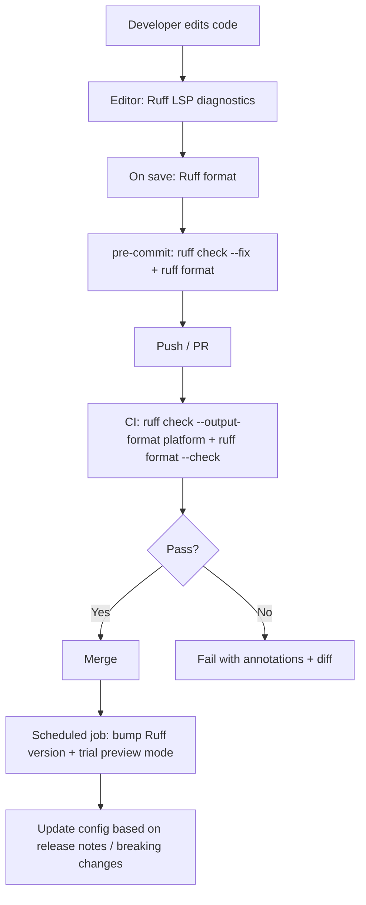

# Ruff Best Practices Report

As-of date: February 17, 2026 (America/Los_Angeles). Latest Ruff release observed during this research: **0.15.1**, released **February 12, 2026**. citeturn2view0

## Executive summary

Ruff has matured into a fast, integrated Python code-quality toolchain—**linter**, **formatter**, and now a first-party **language server**—built around a large, Rust-implemented ruleset (800+ rules) and designed for monorepo-scale workflows (configuration inheritance, caching, editor/CI integrations). citeturn11search4turn16search5turn22view0turn8view0

The best-practice posture in 2026 is to treat Ruff as a **“quality platform”** rather than “a linter,” and to standardize its use across local development, pre-commit, and CI with version pinning and predictable configuration discovery. Concretely:

- Prefer a **single source of truth** in `pyproject.toml` (or `.ruff.toml`) and rely on Ruff’s configuration inheritance (`extend`) instead of duplicating settings. citeturn10search2turn18view0  
- Use **Ruff format** as the default formatter when you want Black-compatibility but higher performance and a unified toolchain. citeturn17search11  
- Start rule enablement from the **default rule set** (intentionally avoids stylistic conflicts with formatters) and add rule families intentionally (imports, upgrades, bugbear, type-checking hygiene, etc.). citeturn16search5turn0search8  
- In teams, pin the Ruff version using a combination of:
  - dependency pinning and/or container images in CI,
  - pre-commit `rev`,
  - optionally `required-version` in config (with editor caveats). citeturn16search19turn19view0turn17search8  
- Optimize performance via caching (`.ruff_cache` / `RUFF_CACHE_DIR`) and by scoping file discovery with `src`, `exclude`, `.gitignore`, and targeted CI jobs. citeturn16search0turn18view0turn21search2  

## Current features and known limitations

### Feature set that is stable and widely used

Ruff’s current “stable baseline” for most projects includes:

- **Linting** via `ruff check`, including safe autofix (`--fix`) and watch mode (`--watch`). citeturn16search2  
- **Formatting** via `ruff format`, explicitly designed as a drop-in replacement for Black, with an emphasis on performance and integration. citeturn17search11  
- **A first-party language server** exposed as `ruff server`, with official editor setup guidance (including migration away from the older `ruff-lsp`). citeturn22view0turn8view0  
- **Large built-in ruleset** (800+ rules), implemented in Rust, inspired by Flake8 + plugins, isort, pyupgrade, etc. citeturn16search5turn11search4  
- **Integrated caching** to avoid re-analyzing unchanged files. citeturn11search4turn16search0  
- **Structured output formats** intended for CI annotations and reports (e.g., GitHub annotations, GitLab code quality, JUnit, JSON). citeturn19view1turn22view3turn16search19  
- **Jupyter Notebook support** (lint + format) enabled by default since Ruff 0.6.0, with per-section excludes if you want “lint-only” or “format-only” notebook workflows. citeturn11search1  

### Versioning and “preview” mode as first-class concepts

Ruff’s release model matters operationally:

- Ruff uses a **custom versioning scheme** where **minor versions can include breaking changes**; Ruff states it does not yet have a stable API (major semver later). citeturn16search6  
- Ruff provides an explicit **preview mode** for unstable features (new rules/fixes/formatting style/interface changes), with an option to require **explicit selection** of preview rules (`explicit-preview-rules`). citeturn20view0  

### Practical limitations to account for

Key limitations that affect best practices:

- **Python version support boundaries:** Ruff does not support Python 2, and documents linting support from Python 3.7 onward (including 3.13). citeturn17search31  
- **Not all rules are enabled by default**; the default selection is intentionally conservative and focused on high-signal errors. citeturn16search5turn0search8  
- **Not all fixes are equally safe:** some rules have fixes explicitly marked *unsafe* because they may change runtime or typing semantics; teams should separate “safe autofix” from “unsafe modernization.” citeturn17search15turn21search8  
- **Config discovery can surprise people in monorepos:** Ruff uses the “closest config wins” model (no implicit cascading merge), and relies on `extend` for inheritance. citeturn10search2turn18view0  
- **Editor + version pin interactions:** enforcing `required-version` can produce IDE friction when the editor runs a bundled Ruff that doesn’t satisfy the constraint (behavior varies by client). citeturn19view0turn17search8  

## Configuration patterns at different scales

### Principles that generalize

These patterns are consistently supported by Ruff’s configuration model and CLI:

- Put configuration in **one of**: `pyproject.toml`, `ruff.toml`, `.ruff.toml`; file precedence favors `.ruff.toml` over `ruff.toml` over `pyproject.toml`. citeturn10search2  
- Use `extend` to inherit a base policy, and understand the merge semantics:
  - most settings override normally,
  - but rule selection has special behavior (a child `lint.select` resets the baseline). citeturn18view0  
- Set `target-version` explicitly for predictable upgrades and formatting behavior, or rely on “infer from `requires-python`” only if your packaging metadata is always correct. citeturn11search1turn18view0  
- For teams: consider `required-version` to enforce runtime parity (accepts PEP 440 specifiers). citeturn19view0  

### Small project pattern

Use this when:
- you have a small library or service, modest contributor count,
- you want a clean baseline with minimal bikeshedding,
- you want Ruff to replace both a linter and a formatter.

```toml
# pyproject.toml
[tool.ruff]
target-version = "py312"
line-length = 88
# Team safety: ensure CI/devs aren't silently using different Ruff builds.
required-version = ">=0.15.1"

[tool.ruff.lint]
# Keep Ruff’s default baseline, then add a few high-value families.
extend-select = [
  "I",   # import sorting (isort-like)
  "UP",  # pyupgrade-style modernizations
  "B",   # bugbear (bug-risk patterns)
  "RUF", # Ruff-specific correctness/style checks
]

[tool.ruff.format]
# Keep formatter stable until you intentionally trial preview formatting.
preview = false
```

What this accomplishes:

- The default rules already cover many “real bug” cases while avoiding formatter-overlap style fights. citeturn16search5turn0search8  
- `required-version` gives you deterministic behavior across environments, since Ruff may include breaking changes in minor releases. citeturn19view0turn16search6  

### Medium project pattern

Use this when:
- you have tests, docs, and “generated-ish” subtrees,
- you want docstring and import discipline but with pragmatic escape hatches.

```toml
[tool.ruff]
target-version = "py311"
line-length = 100
src = ["src"]

# Important for pre-commit (see below). Consider enabling if you have large excludes.
force-exclude = true

[tool.ruff.lint]
extend-select = [
  "I", "UP", "B", "SIM",
  "TCH", # type-checking block hygiene
  "E", "F",
]
ignore = [
  "E501", # let the formatter own line-length in practice
]

[tool.ruff.lint.per-file-ignores]
"tests/**" = ["D"]          # don’t require docstrings in tests
"**/__init__.py" = ["F401"] # allow re-export patterns in packages

[tool.ruff.lint.isort]
# If you use `src/` layout, ensure first-party import classification is correct.
known-first-party = ["your_package"]

[tool.ruff.format]
preview = false
```

Why these knobs matter:

- `src` maps directly to how Ruff decides first-party vs third-party imports for its import-resolution logic. citeturn18view0  
- `force-exclude` is explicitly described as useful with pre-commit, which passes changed files explicitly. citeturn17search22  
- Ignoring `E501` is common when formatting is enforced, and many real-world configs follow this approach. citeturn16search5turn28search0  

### Large project and monorepo pattern

Use this when:
- you have multiple Python packages, nested tooling configs, or mixed-language repo roots,
- you need consistent defaults but with controlled divergence for subprojects.

**Base config (root `pyproject.toml`):**

```toml
[tool.ruff]
target-version = "py311"
line-length = 88
required-version = ">=0.15.1"

# Good defaults for monorepos:
respect-gitignore = true
src = [".", "src"]

[tool.ruff.lint]
extend-select = ["E", "F", "I", "UP", "B", "RUF"]
ignore = ["E501"]

# Strongly recommended: make preview adoption deliberate.
preview = false
explicit-preview-rules = true
```

**Subproject override (e.g., `packages/foo/pyproject.toml`):**

```toml
[tool.ruff]
extend = "../../pyproject.toml"
src = ["src"]

[tool.ruff.lint]
# If you specify lint.select, you reset the rule baseline for this subtree.
# Prefer extend-select unless you truly need a different baseline.
extend-select = ["D"]  # add docstring rules only for this package

[tool.ruff.lint.pydocstyle]
convention = "google"
```

Rationale and guarantees:

- Ruff does **not** implicitly merge config files like ESLint; it uses the closest config file and ignores parent configs unless you use `extend`. citeturn10search2  
- Preview rules require preview mode, and `explicit-preview-rules` lets teams avoid “surprise new rules” when selecting categories/prefixes. citeturn20view0  
- Rule selection merge semantics (reset vs accumulate) are explicitly documented under `extend`. citeturn18view0  

## Rule selection and tuning strategies

### Understand Ruff’s default philosophy

Ruff’s defaults are intentionally designed to:

- enable high-signal correctness checks (Pyflakes `F` plus a subset of `E`),
- avoid stylistic checks that overlap with formatter behavior, to reduce “linter vs formatter” conflicts. citeturn16search5turn0search8  

This is why a best practice is usually:

- **keep the formatter in charge of code layout**,  
- **use lint rules for correctness, maintainability, and modernization**.

### A rule-family playbook

Rule families are best enabled in “layers,” so you can attribute changes and reduce adoption pain.

Layer that is usually safe and high value:

- `I` (imports), `UP` (pyupgrade), `B` (bugbear), `SIM` (simplify), `RUF` (Ruff-specific).
  - These show up repeatedly in production configs. citeturn27search11turn28search0turn30search2  

Layer that is valuable but requires policy decisions:

- `D` (docstrings): high payoff in public libraries, but noisy in internal services/tests; use `per-file-ignores` and a chosen convention (`google`, `numpy`, etc.). citeturn31view1turn30search2  
- `PL` (pylint-inspired) and complexity checks (`C90` / mccabe): can produce a lot of actionable signal in large repos but may require staged enforcement. citeturn28search0turn31view1turn23search2  
- Security-oriented families (e.g., Bandit-inspired): useful, but expect false positives and a need for allowlists. citeturn28search0turn18view0  

### Tuning patterns that reduce friction

#### Treat line length as formatter territory

A common “Ruff + formatter” tactic is to ignore `E501` once formatting is enforced, because line length is rarely actionable as a lint violation in a formatted codebase. This appears in multiple mature configurations. citeturn28search0turn16search5  

#### Use `per-file-ignores` for hotspots, not global ignores

High-return `per-file-ignores` targets:

- `__init__.py` (re-exports, import side effects),
- `tests/**` (docstrings, asserts, test patterns),
- migrations/generated code (style and complexity exemptions),
- `*.ipynb` (e.g., allow prints). citeturn11search1turn31view1turn28search0  

#### Enforce `noqa` hygiene early

Ruff provides rule `RUF100` to ensure `noqa` directives are actually used, can auto-remove unused ones, and can auto-add `noqa` during migrations (`--add-noqa`). citeturn16search20  

Practical staged approach:

1. Enable `RUF100` in CI (warn-level posture first, if needed).
2. Use `--add-noqa` when onboarding a large legacy tree to establish a clean baseline.
3. Then incrementally remove `noqa` by fixing or narrowing ignores. citeturn16search20turn11search6  

### Safe vs unsafe autofix policy

A rigorous team will separate:

- **safe autofixes** (run broadly, often on save or in pre-commit), from
- **unsafe modernizations** (run intentionally, reviewed like refactors).

Ruff rule documentation explicitly flags unsafe fixes when semantics may change (examples: future annotations insertion, PEP 695 generic rewrites). citeturn17search15turn21search8  

Operational best practice:

- In normal developer workflow: use `ruff check --fix` only.
- In modernization branches: trial unsafe fixes selectively, review diffs carefully, and coordinate with type-checkers and runtime constraints. citeturn16search2turn21search8  

## Integration into workflows and automation

### Recommended workflow topology



This combines:
- continuous editor feedback,
- local enforcement (pre-commit),
- CI-level gating with machine-readable outputs,
- periodic maintenance for fast-moving tooling. citeturn8view0turn16search19turn19view1turn16search6turn20view0  

### Editor integration best practices

image_group{"layout":"carousel","aspect_ratio":"16:9","query":["Ruff VS Code extension","Ruff linter formatter","Ruff language server ruff server"],"num_per_query":1}

#### VS Code

Ruff’s official editor docs recommend installing the Ruff extension and note that newer extension versions are needed for the best experience with the Ruff language server. citeturn8view0  

A pragmatic baseline `.vscode/settings.json`:

```json
{
  "editor.formatOnSave": true,
  "[python]": { "editor.defaultFormatter": "charliermarsh.ruff" },

  "ruff.enable": true,
  "ruff.format.args": [],
  "ruff.lint.args": [],

  "editor.codeActionsOnSave": {
    "source.fixAll": "explicit",
    "source.organizeImports": "explicit"
  }
}
```

Team note: if you use `required-version`, ensure the editor is configured to run the project’s Ruff (not an embedded binary) to avoid version mismatch behavior. citeturn19view0turn17search8  

#### PyCharm

Ruff docs state that starting with **PyCharm 2025.3**, Ruff is supported out of the box via the settings UI. citeturn8view0  

The best practice is:
- enable Ruff in PyCharm settings,
- point it at the same project environment used for CI (so it respects pinned versions and dependencies). citeturn8view0turn19view0  

#### Neovim and other LSP-capable editors

Ruff’s editor setup guide shows configuring Neovim via `nvim-lspconfig` to run the Ruff language server, and recommends disabling the older `ruff-lsp` to avoid conflicts. citeturn8view0  

Neovim example:

```lua
require('lspconfig').ruff.setup({
  init_options = {
    settings = {
      -- Ruff language server settings
    }
  }
})
```

Additionally, the guide describes how to delegate hover/type-aware features to another server (e.g., Pyright), while using Ruff specifically for lint/format/import organization. citeturn8view0  

### pre-commit integration

Ruff’s integrations documentation provides an official `pre-commit` configuration using `astral-sh/ruff-pre-commit`, with separate hooks for lint and format. citeturn16search19turn16search23  

Baseline `.pre-commit-config.yaml`:

```yaml
repos:
  - repo: https://github.com/astral-sh/ruff-pre-commit
    rev: v0.15.1
    hooks:
      - id: ruff-check
        args: [--fix]
      - id: ruff-format
```

Two operational best practices:

- Align the hook `rev` with your intended Ruff version (outdated hook pins are a common source of confusing “unknown field” or schema mismatch errors). citeturn16search19turn9search2  
- Consider `force-exclude = true` so exclusions apply even when pre-commit passes files explicitly. citeturn17search22  

### CI/CD integration patterns

#### GitHub Actions

Ruff can be run directly (install + run) or via a dedicated action; the docs explicitly reference `ruff-action`, and Ruff supports GitHub annotation output formats. citeturn16search23turn19view1  

Minimal GitHub Actions example (direct install):

```yaml
name: Lint and format
on: [push, pull_request]

jobs:
  ruff:
    runs-on: ubuntu-latest
    steps:
      - uses: actions/checkout@v4
      - uses: actions/setup-python@v5
        with:
          python-version: "3.12"

      - name: Install Ruff
        run: python -m pip install ruff==0.15.1

      - name: Ruff lint (annotations)
        run: ruff check . --output-format=github

      - name: Ruff format (check)
        run: ruff format . --check
```

Key points:

- split lint vs format so developers see the failure category immediately,
- prefer `--check` in CI for format (diff-only posture). citeturn17search11turn22view3  

#### GitLab CI and code quality reports

Ruff’s integrations docs provide a GitLab CI example that uses an official container image and emits a GitLab-compatible code quality report via `--output-format=gitlab`. citeturn16search19turn16search10  

#### Cache-aware CI

Ruff caches under `.ruff_cache` by default and supports `RUFF_CACHE_DIR` / `cache-dir` overrides. citeturn16search0turn19view0  

CI best practice:

- persist `.ruff_cache` between runs (e.g., `actions/cache`) when your CI runs are frequent and incremental,
- do not share cache across fundamentally different environments (OS / Python version / different Ruff versions), because invalidation logic may not match your assumptions. citeturn16search0turn19view0turn16search6  

### Recommended automation commands and scripts

Ruff documents core commands and tooling for introspection:

- `ruff check`, `ruff format`, `ruff clean`, `ruff server`, `ruff config`, `ruff rule`, and `ruff analyze`. citeturn22view0  
- debugging: `--show-files`, `--show-settings`, `--statistics`. citeturn22view1turn21search4  

A practical `Makefile` pattern:

```makefile
lint:
	ruff check .

lint-fix:
	ruff check --fix --exit-non-zero-on-fix .

format:
	ruff format .

format-check:
	ruff format --check .

doctor:
	ruff check --show-settings src/your_package/__init__.py
```

The flags `--exit-non-zero-on-fix` and format `--check` semantics are part of Ruff’s CLI behavior and are especially useful for CI gating. citeturn22view3  

## Real-world configurations in the wild

The table below summarizes Ruff configurations pulled from notable open-source repositories’ `pyproject.toml` (raw views). “Project size” here is a **qualitative** proxy (ecosystem prominence + apparent configuration complexity), because repository LOC counts were not consistently available through the same primary sources in this session.

| Project | Size (heuristic) | Key Ruff settings observed | Integration signals |
|---|---|---|---|
| entity["organization","Home Assistant","open home automation org"] (`home-assistant/core`) | Very large | Extensive ignore list incl. formatter-conflict rules; import conventions aliases; `isort` tuning; broad `per-file-ignores` (scripts, components, tests); mccabe complexity limit; Google docstring convention; banned API list (e.g., discourage `pytz`). citeturn32view0 | Strong evidence of large-scale, policy-driven lint governance (banned APIs, conventions, complexity limits). citeturn32view0 |
| entity["organization","Poetry","python packaging tool org"] (`python-poetry/poetry`) | Large | `fix = true`; `line-length = 88`; `src = ["src"]`; `target-version = py38`; `unfixable` includes eradicate; `extend-select` includes `I`, `UP`, `B`, `SIM`, `TCH`, etc; substantial ignore list with rationale comments. citeturn27search11 | Explicit `pre-commit` dependency in dev group and aggressive autofix posture (`fix = true`). citeturn27search11 |
| Astropy (`astropy/astropy`) | Very large | Very broad `lint.extend-select` across many families (`PL`, `SIM`, `UP`, `NPY`, etc); explicit note that non-permanent exclusions should go elsewhere; indicates disciplined governance for large contributor base. citeturn28search3 | Implied multi-layer policy approach (base + non-permanent exclusions). citeturn28search3 |
| Ibis (`ibis-project/ibis`) | Large | Broad `lint.select` across correctness, security, performance; a long curated `ignore` list (incl. `E501` and rules handled by formatting); explicit `unfixable` exclusions; per-file target versions; docstring code formatting; required imports via isort. citeturn28search0 | Strong “lint as policy” posture; docstring formatting enabled; advanced per-file rules. citeturn28search0 |
| Biotite (`biotite-dev/biotite`) | Medium | `lint.select` includes `F/E/W`, import and naming, tidy-import bans; targeted ignores; many per-file-ignores for docs/tests/scripts; `known-first-party` and strong `isort` tuning; bans relative imports. citeturn30search0 | Pins Ruff in `lint` extras (`ruff == 0.9.7`) suggesting reproducible lint environments. citeturn30search0 |
| entity["company","Microsoft","technology company"] TorchGeo (`microsoft/torchgeo`) | Medium–large | `fix = true`; formatter settings (docstring code formatting, single quotes); `extend-select` includes annotations/docstrings/imports/pyupgrade; docs/tests per-file ignores; Google pydocstyle convention; isort tuning. citeturn30search2 | Demonstrates a “docs/tests are different” policy and unified format+lint configuration. citeturn30search2 |

Cross-cutting observations from these real configs:

- Mature repos commonly:
  - ignore `E501` and other formatter-overlap rules,
  - invest in `per-file-ignores`,
  - tune import classification (`src`, `known-first-party`),
  - lock behavior via explicit selections and curated ignores. citeturn16search5turn28search0turn27search11turn30search2  

## Troubleshooting and future-proofing

### Common pitfalls and how to debug them

#### Configuration not being picked up

Symptoms:
- unexpected default line length,
- missing ignores,
- different behavior between CLI, pre-commit, and editor.

Checks:

1. Confirm which config Ruff is using:
   - `ruff check path/to/file.py --show-settings` citeturn21search4turn22view1  
2. Confirm file discovery scope:
   - `ruff check . --show-files` (or run on target directory explicitly). citeturn22view1  
3. Verify config precedence (`.ruff.toml` > `ruff.toml` > `pyproject.toml`) and “closest config wins,” then use `extend` if you need inheritance. citeturn10search2turn18view0  

#### pre-commit schema mismatch

A frequent failure mode is pinning an old pre-commit hook revision (and therefore an old Ruff binary) while using modern configuration keys (e.g., newer `[tool.ruff.lint.*]` namespaces). This can manifest as parsing errors and “unknown field” messages. citeturn9search2turn16search19  

Mitigation:
- keep `ruff-pre-commit` `rev` current and aligned with your intended Ruff version,
- treat config namespace migrations as breaking changes that require coordinated rollout. citeturn16search19turn16search6  

#### `.gitignore` and monorepo path confusion

When config files live in subdirectories, the interaction between current working directory, config discovery, and `respect-gitignore` can lead to surprising results (e.g., runs appear to pass but actually skipped files). This shows up in user reports and is best handled by running Ruff against explicit paths and/or using `--no-respect-gitignore` for diagnostic comparison. citeturn17search4turn22view1  

#### Unsafe fixes changing semantics

If a fix is marked unsafe, Ruff is warning you that automatic transformation may not be semantics-preserving (examples: adding `from __future__ import annotations`, PEP 695 generic rewrites). citeturn17search15turn21search8  

Best practice:
- treat unsafe fixes as code changes requiring review, test runs, and type-check verification.

### Future-proofing strategy

Ruff evolves quickly and uses minor releases for breaking changes. citeturn16search6  

A pragmatic future-proofing loop:

- **Pin and verify versions**
  - CI pins (pip / container / action) + pre-commit `rev`,
  - optionally enforce via `required-version` (PEP 440), but validate editor behavior in your environment. citeturn19view0turn16search19turn17search8  
- **Track breaking changes**
  - Monitor release notes and breaking changes documentation (especially around configuration semantics and Python-version inference). citeturn2view0turn30search1turn16search6  
- **Use preview mode intentionally**
  - Run a scheduled CI job on a cadence (weekly/monthly) with preview enabled to detect upcoming rule/style shifts, and gate preview rule inclusion with `explicit-preview-rules` when needed. citeturn20view0turn19view0  
- **Codify ownership**
  - Make lint rule changes part of your engineering governance: require PRs for rule enablement, and capture rationale (why enabled/ignored) in comments (mirroring what large projects do). citeturn27search11turn28search0turn31view1  

### Primary sources consulted

```text
Ruff documentation:
- https://docs.astral.sh/ruff/
- https://docs.astral.sh/ruff/configuration/
- https://docs.astral.sh/ruff/linter/
- https://docs.astral.sh/ruff/formatter/
- https://docs.astral.sh/ruff/rules/
- https://docs.astral.sh/ruff/settings/
- https://docs.astral.sh/ruff/integrations/
- https://docs.astral.sh/ruff/editors/setup/
- https://docs.astral.sh/ruff/versioning/
- https://docs.astral.sh/ruff/preview/

Ruff releases:
- https://github.com/astral-sh/ruff/releases

Selected real-world configs (raw):
- https://raw.githubusercontent.com/python-poetry/poetry/master/pyproject.toml
- https://raw.githubusercontent.com/home-assistant/core/refs/heads/dev/pyproject.toml
- https://raw.githubusercontent.com/ibis-project/ibis/master/pyproject.toml
- https://raw.githubusercontent.com/astropy/astropy/refs/heads/main/pyproject.toml
- https://raw.githubusercontent.com/biotite-dev/biotite/master/pyproject.toml
- https://raw.githubusercontent.com/microsoft/torchgeo/master/pyproject.toml

Other tool references:
- https://flake8.pycqa.org/en/latest/
- https://github.com/psf/black
- https://black.readthedocs.io/
- https://pycqa.github.io/isort/
- https://pylint.readthedocs.io/
```

## Comparison table: Ruff vs Flake8, Black, isort, Pylint

| Tool | Primary scope | Rule coverage model | Autofix model | Speed posture | Ecosystem / integration posture |
|---|---|---|---|---|---|
| Ruff | Lint + format + (now) language server | 800+ built-in rules, Rust re-implementations; default enables `F` + subset of `E`, avoiding formatter-overlap rules. citeturn16search5turn11search4 | `ruff check --fix` for fixable rules; formatter via `ruff format`; supports watch mode; supports CI output formats. citeturn16search2turn17search11turn19view1 | Advertised and benchmarked as orders-of-magnitude faster (with caching); official benchmarks show large improvements vs no-cache and vs legacy tools. citeturn11search4turn21search2turn16search0 | First-party docs for pre-commit, GitHub/GitLab, editor integrations; monorepo-oriented config. citeturn16search19turn8view0turn10search2 |
| Flake8 | Lint aggregation | Wraps PyFlakes + pycodestyle + McCabe; supports third-party extensions. citeturn23search4turn23search20 | No native autofix (typically paired with other tools). | Python-based; no first-party “10–100x” style claim here; performance depends on plugins. citeturn23search4 | Large plugin ecosystem; configs can sprawl across multiple tools/files. citeturn23search20 |
| Black | Formatting only | Opinionated, limited configuration; style evolves under a stability policy. citeturn23search3turn23search15 | Formats entire files in place; `--check` for CI. citeturn23search3 | Not positioned as a linter; speed is acceptable but not the main claim in these sources. citeturn23search3 | Widely adopted; common to combine with isort (or Ruff format). citeturn23search5turn17search11 |
| isort | Import sorting | Dedicated import organization with many configuration options; includes a Black compatibility profile. citeturn23search1turn23search9 | Sorts/rewrites imports automatically. citeturn23search21 | Not a linter; speed depends on project scale and config. citeturn23search21 | Commonly paired with Black; Ruff can replace import sorting via `I` rules. citeturn16search5turn23search5 |
| Pylint | Static analysis + style + refactor suggestions | Large set of checkers and messages; analyzes code without running it; configurable message controls. citeturn23search2turn23search14 | Primarily diagnostics and scoring; not positioned as an autofixer in these sources. citeturn23search2turn23search32 | Broader analysis scope generally implies heavier runtime than lightweight linters (qualitative; depends on config). citeturn23search2 | Mature ecosystem; many teams migrate some checks to Ruff while keeping Pylint for deep analysis where needed. citeturn23search2turn16search5 |