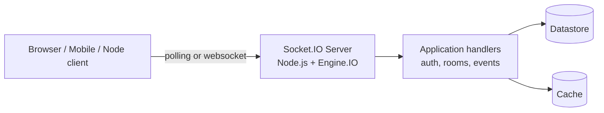
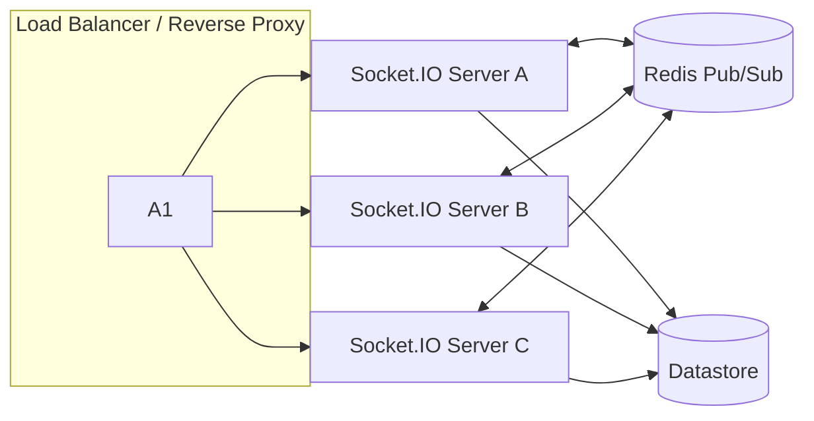
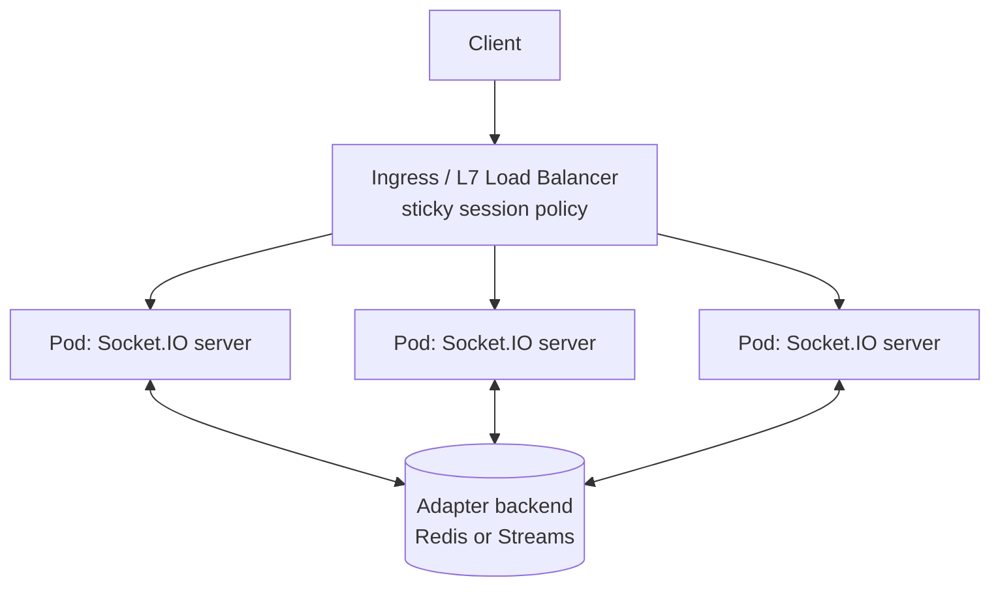

# Socket.IO Best Practices for Production Systems

## Executive summary

This report provides generalized best practices for designing, securing, operating, and scaling Socket.IO systems, with Node.js examples. Target scale, latency SLOs, and workload shape are **unspecified**, so recommendations are provided for three broad scenarios: **small** (<1k concurrent connections), **medium** (1k–100k), and **large** (>100k).

Socket.IO provides ordered messaging across transports, but its default delivery semantics are **at-most-once** (“fire and forget”). It also does **not** store messages by default; persistence and replay are application responsibilities (with a limited exception if connection state recovery is enabled).citeturn17view2turn17view0 This becomes the central architectural theme: treat Socket.IO as a session + routing layer, and build explicit reliability, authorization, and persistence semantics above it.

Recommended defaults for a typical web application (small → medium scale) are close to the library defaults, but with explicit security and operational guardrails:

- Configure **explicit CORS allowlists** (do not rely on defaults) and understand its limitations (CORS only affects browser long‑polling; WebSockets are not subject to CORS enforcement).citeturn10view0turn28view2  
- Enforce **authentication and authorization** in Socket.IO middlewares; use per‑packet `socket.use()` for event-level access control and abuse controls.citeturn3view3turn25view0  
- Keep `perMessageDeflate` **disabled by default** unless bandwidth reduction is worth the memory/CPU costs (Socket.IO explicitly warns about overhead).citeturn2view0  
- Keep heartbeat defaults (`pingInterval` 25s, `pingTimeout` 20s) unless you have a measured need; ensure reverse proxies do not time out idle upgraded connections (e.g., `proxy_read_timeout` must exceed `pingInterval + pingTimeout`).citeturn2view0turn12view0turn7view0  
- For multi-node scaling, plan for **sticky sessions whenever long‑polling is enabled** (default) and select a compatible adapter (cluster adapter for single-host multi‑process; Redis/Streams for multi-host).citeturn19view0turn3view1turn11search17  

For medium and large deployments, the dominant risks shift to operational and system limits: OS file descriptors and ephemeral ports, reverse proxy settings, adapter broker availability, memory growth with connection recovery, and reconnection storms. Socket.IO’s official performance guidance explicitly calls out OS limits (open files, local ports) and WebSocket engine choices as major factors.citeturn5view0turn21view0

## Baseline architecture and recommended defaults

Socket.IO connections can be established over multiple transports: **HTTP long‑polling**, **WebSocket**, and **WebTransport**.citeturn24search14turn2view0 The server defaults allow `["polling", "websocket"]`.citeturn2view0 WebTransport support exists but is **not enabled by default** and requires a secure context (HTTPS).citeturn17view2turn2view0

### Default operational parameters worth knowing

These defaults are frequently implicated in real incidents:

- **Heartbeat**  
  Server defaults: `pingInterval = 25000ms`, `pingTimeout = 20000ms`.citeturn2view0turn1search26  
  Aggressively lowering them increases load and reconnection churn; Socket.IO explicitly cautions that 1-second heartbeats add measurable load at “a few thousands” of clients.citeturn2view0

- **Transport upgrade and proxy timeouts**  
  `upgradeTimeout` defaults to 10s.citeturn2view0  
  Reverse proxies (notably nginx) may close idle upgraded connections unless their timeouts exceed `pingInterval + pingTimeout`.citeturn12view0turn7view0

- **Message size limits**  
  `maxHttpBufferSize` defaults to **1e6 bytes (1 MB)**, and exceeding it can close the socket.citeturn2view0turn7view0  
  The handshake exposes `maxPayload` so polling clients can split buffers accordingly (added as a backward-compatible protocol enhancement).citeturn7view0turn20search20turn20search20

- **Connection joining deadline**  
  `connectTimeout` defaults to **45000ms**, disconnecting a client that hasn’t joined a namespace in time.citeturn28view0turn25view0

### Transport options comparison

| Transport | Lowest-level mechanism | Strengths | Key trade-offs / pitfalls | CORS applicability | Sticky sessions needed in multi-node? |
|---|---|---|---|---|---|
| HTTP long‑polling | Multiple HTTP requests per session | Works where WebSocket upgrade fails; simplest for constrained networks | Higher overhead and latency; multiple requests per session require session affinity; more proxy/load balancer complexity | CORS applies (browser-enforced); Socket.IO requires explicit CORS config since v3citeturn10view0turn28view2 | **Yes**, if polling enabled (default)citeturn19view0turn3view1 |
| WebSocket | Single upgraded TCP connection | Lower overhead and lower latency; no multi-request session | Proxies must pass upgrade headers; proxy timeouts can drop idle conns; not covered by browser CORS enforcement | WebSocket connections are not subject to CORS restrictionsciteturn10view0 | Not required for WebSocket itself; required if polling fallback remains enabledciteturn19view0 |
| WebTransport | QUIC-based transport (browser API) | Potential latency and transport benefits where available | Requires HTTPS secure context; not enabled by default in Socket.IO; ecosystem maturity varies | Not a CORS mechanism; secure-context gating is central | Depends on deployment model; still design for affinity where needed |

Sources: transports list and defaultsciteturn24search14turn2view0; CORS constraints and “WebSocket not subject to CORS”citeturn10view0; sticky session requirements and WebSocket-only optionciteturn19view0turn3view2; WebTransport secure-context requirementciteturn17view2turn24search14.

### Single-server architecture diagram



This is the baseline topology described across the docs: a client connects via Engine.IO transports (polling/WebSocket/WebTransport), then Socket.IO routes events to application handlers.citeturn24search14turn1search21turn26view0

## Security best practices

### Threat model recap

Socket.IO adds framing, multiplexing, heartbeats, and packet encoding on top of transport protocols. Security failures typically arise from one or more of:

- Missing or inconsistent authz checks on event handlers (especially across rooms/namespaces).
- Accepting unvalidated payloads (injection, deserialization weirdness, or resource exhaustion).
- Abuse (connection floods, event floods, oversized messages, reconnection storms).
- Misconfigured cross-origin access controls (particularly historical Socket.IO CORS defaults) and misunderstanding what CORS does/doesn’t protect.
- Dependency flaws (Socket.IO, Engine.IO, parser, and WebSocket dependencies have had crash/DoS and validation issues and require patch discipline).citeturn8search6turn9view0turn9view2turn9view4

### Authentication and authorization

**Connection-time authentication belongs in middleware.** Socket.IO server middlewares (`io.use`) execute for every incoming connection and are explicitly recommended for authentication/authorization use cases.citeturn3view3turn4search18 The server-side handshake exposes `socket.handshake.auth`, which is intended for credentials payloads like tokens.citeturn25view0turn17view2

**Namespace-level separation is a first-class authorization boundary.** The namespaces guide specifically calls out using a privileged namespace (e.g., `/admin`) with its own middleware to ensure sufficient rights.citeturn23view0turn13view0

**Per-event authorization and abuse controls should be enforced with per-packet middleware.** Server-side socket middlewares (`socket.use(([event, ...args], next) => ...)`) are invoked for each incoming packet, and the documentation explicitly suggests using them for authorization and rate limiting.citeturn25view0

**Connection recovery can create authz footguns if you skip middlewares.** Connection state recovery supports `skipMiddlewares: true`, which causes middlewares to be skipped on successful recovery.citeturn28view1turn3view0 If your authorization derives from per-connection middleware (common), skipping can be correct only if the recovered state includes everything needed to safely resume; otherwise it risks replaying session state without re-checking current privileges. This isn’t hypothetical—Socket.IO explicitly documents the behavior and shows it being used to restore a derived `socket.data.userId`.citeturn28view1turn2view0

### Input validation and payload limits

Treat all Socket.IO messages as untrusted input. The entity["organization","OWASP","web security nonprofit"] WebSocket Security Cheat Sheet recommends validating message structure/content (e.g., JSON Schema + allowlists), enforcing size limits, and rate limiting to mitigate injection and flooding risks.citeturn22search0turn22search1

On the Socket.IO side, you have an explicit server guardrail: `maxHttpBufferSize` (default 1 MB).citeturn2view0turn7view0 This is necessary but insufficient:
- It prevents certain oversized payloads from being processed.
- It does not validate schemas or enforce per-event constraints.
- It does not prevent subtle “small but expensive” payloads (e.g., deeply nested objects) from consuming CPU.

### Rate limiting and connection limiting

Socket.IO documents middleware as appropriate for rate limiting at connection time.citeturn3view3turn4search18 For per-message rate limiting, use `socket.use()` packet middleware (server-side only).citeturn25view0

At the application security level, OWASP’s guidance for WebSocket DoS protection emphasizes limiting total connections and implementing per-user (preferred) or per-IP limits, plus rate limiting and size caps.citeturn22search0turn22search2

A practical implication for Socket.IO deployments:
- **Small scale (<1k):** an in-memory token bucket keyed by user ID/IP is usually sufficient.
- **Medium (1k–100k):** distributed rate limiting (shared store) becomes important if you operate multiple server instances; otherwise attackers can round-robin across instances.
- **Large (>100k):** enforce rate limits at multiple layers: L7 edge (ingress/load balancer), Socket.IO server, and application business logic (especially for expensive events).

### CORS, Origin, and “who can reach your server”

Socket.IO is explicit about CORS limitations:
- CORS is browser-enforced and does not stop scripts running outside browsers.citeturn10view0  
- CORS applies to HTTP long‑polling; WebSocket connections are not subject to CORS restrictions.citeturn10view0  
Therefore, if you want to restrict who can reach your server, Socket.IO points to the `allowRequest` hook.citeturn10view0turn2view1

Socket.IO’s docs also warn that setting `cors.origin: "*"` effectively disables browser-side CORS protections and should be used with caution.citeturn2view1turn22search3

### TLS

For browser-facing production deployments, terminate connections over TLS. Socket.IO’s own documentation notes that WebTransport requires HTTPS secure context and isn’t enabled by default for that reason.citeturn17view2turn2view0 In practice, this same constraint aligns with broader WebSocket hardening guidance: use encrypted connections (`wss://`) and avoid exposing unauthenticated, cross-origin endpoints.citeturn22search0turn22search12

### Dependency and advisory hygiene

Socket.IO and its transitive ecosystem have had vulnerabilities including:
- Unhandled “error” events leading to Node.js process crashes (CVE-2024-38355), patched in `socket.io@4.6.2` (and `2.5.1` for 2.x).citeturn9view0  
- Historical CORS insecure defaults in pre-2.4.0 (CVE-2020-28481).citeturn9view1  
- Parser validation issues enabling unexpected type/function references in decoded packets (CVE-2022-2421) and resource exhaustion (CVE-2020-36049).citeturn9view2turn9view3  
- Engine.IO resource exhaustion via long-polling POST requests (CVE-2020-36048).citeturn9view4turn8search6  

Operational best practice is to pin versions and regularly review advisories from the entity["company","GitHub","code hosting platform"] Advisory Database and the Socket.IO repository’s security page.citeturn8search6turn9view0turn9view2

### Security controls matrix

| Control | Where to implement | What it mitigates | Socket.IO-specific notes / pitfalls |
|---|---|---|---|
| AuthN at connect | `io.use()` / namespace middleware | Unauthorized connections; some abuse | Middlewares run once per connection.citeturn3view3turn4search18 Recovery can skip middlewares if configured.citeturn28view1turn3view0 |
| AuthZ per event | `socket.use()` packet middleware | Privilege escalation via event misuse | Designed for per-packet authorization/rate limiting.citeturn25view0 |
| Payload schema validation | Event handlers (server) | Injection and malformed payload bugs | OWASP recommends schema validation + allowlists.citeturn22search0turn22search1 |
| Size limits | `maxHttpBufferSize`, plus app-level | DoS via large messages | Default 1 MB; oversized payload can disconnect socket.citeturn2view0turn7view0 |
| Rate limiting | Edge + `io.use()` + `socket.use()` | Flooding, resource exhaustion | OWASP suggests rate limiting; Socket.IO suggests middleware.citeturn22search0turn3view3turn25view0 |
| Origin / reachability restrictions | `cors` (polling) + `allowRequest` (general) | Browser cross-site abuse and some CSWSH patterns | CORS doesn’t cover WebSockets; `allowRequest` is the “who can reach” control.citeturn10view0turn2view1 |
| TLS | HTTPS termination at proxy/LB | MitM, credential leakage | WebTransport requires HTTPS secure context.citeturn17view2turn2view0 |
| Admin UI protection | `instrument(..., { auth: ... })` | Exposure of sensitive operational data | Socket.IO warns `auth: false` should be used with caution; production mode reduces memory footprint.citeturn13view0 |
| Patch discipline | Dependency management | Known CVEs | Multiple advisories affect Socket.IO / parser / Engine.IO.citeturn9view0turn9view2turn9view4 |

## Performance and latency engineering

Socket.IO performance depends heavily on the underlying WebSocket server implementation and OS-level connection scaling.citeturn5view0turn21view0

### Transport and framing overhead: batching, binary, and parsers

**Each emit is a packet**, and framing costs matter at scale. Socket.IO gives concrete guidance for binary data:
- With the **default parser**, packets with binary content are sent as **two distinct WebSocket frames** (placeholder packet + attachment) when using WebSocket transport.citeturn15view0  
- With the **msgpack parser**, binary content can be sent as **one single WebSocket frame**, may reduce payload sizes (notably for numeric-heavy data), but is harder to debug in browser Network tools and is incompatible with very old browsers lacking ArrayBuffer support.citeturn15view0turn5view0  

This yields a practical “message batching” guideline:

- If you send many small updates (e.g., telemetry, presence, game state), prefer **coalescing** multiple logical events into a single application message at a fixed tick (e.g., 20–60 Hz), or send snapshots. This reduces packet dispatch overhead and helps avoid backpressure cascades.
- If you send binary frequently, consider a binary-efficient parser (MessagePack) once you’ve measured benefits and accepted operational debuggability trade-offs.citeturn15view0turn5view0

### Compression: when to enable and when not to

Socket.IO distinguishes:
- `httpCompression` for HTTP long-polling (default `true`).citeturn2view0turn28view2  
- `perMessageDeflate` for WebSocket transport (default `false`). Socket.IO explicitly warns it adds **significant performance and memory overhead** and suggests only enabling it if truly needed.citeturn2view0turn28view2  

For small deployments, leaving defaults is usually correct. For medium/large, selectively enabling compression can be attractive when bandwidth is expensive, but you must load test memory and CPU headroom under peak fan-out.

### WebSocket engine choices and native add-ons

Socket.IO’s performance tuning guidance highlights:
- Installing optional native add-ons for `ws` (`bufferutil`, `utf-8-validate`) improves masking/unmasking and UTF‑8 validation performance.citeturn5view0  
- You can swap the WebSocket server implementation via `wsEngine`, for example using `eiows`.citeturn5view0turn2view0  

Memory usage also varies significantly by WebSocket engine choice; Socket.IO’s own memory usage page includes comparative measurements across `ws`, `eiows`, and µWebSockets.js, emphasizing that overall memory is “heavily” dependent on the underlying WebSocket server.citeturn21view0turn5view0

### Heartbeat tuning and proxy alignment

Heartbeat defaults exist for good reasons:
- The server sends periodic PINGs at `pingInterval`; the connection is considered dead if PONG isn’t received within `pingTimeout`, and clients also consider the connection dead after `pingInterval + pingTimeout`.citeturn2view0turn1search26  
- If a reverse proxy like nginx times out earlier than that, it will force close connections, producing “transport close” errors. Socket.IO explicitly calls out nginx `proxy_read_timeout` needing to exceed this window.citeturn12view0turn7view0  

Recommended default posture:
- Keep heartbeat defaults unless you have measured needs (mobile backgrounding, network quality, aggressive failure detection).
- Align proxy and load balancer timeouts to exceed the heartbeat window.

### Latency measurement patterns

A practical way to measure end-to-end latency at the application layer is to use acknowledgements with timeouts:
- Socket.IO supports ACK callbacks and per-emit timeouts (`socket.timeout(ms).emit(...)`).citeturn17view3turn16search1  
- For multi-recipient emits, Socket.IO also supports broadcast acknowledgements (`io.timeout(ms).emit(...)`) starting since 4.5.0.citeturn1search31turn16search4  

This enables measuring:
- RTT from client to server (client emits event with ACK).
- RTT from server to client (server emits event with ACK).
- Tail latency / slow clients (ACK timeout rates across many clients).

## Scalability and architecture patterns

Scaling Socket.IO is about two simultaneous constraints:
- **Session affinity** (sticky routing) when HTTP long‑polling is enabled (default).
- **Cross-instance fan-out** (broadcast/room membership) via adapters.citeturn19view0turn26view0  

### Namespaces and rooms design

**Namespaces** partition logic over a shared underlying connection (multiplexing). Each namespace has its own event handlers, rooms, and middlewares.citeturn23view0 Socket.IO notes that multiple namespaces on the same origin typically share one WebSocket connection; multiplexing is disabled if you create multiple connections to the same namespace, use different domains, or set `forceNew`.citeturn23view0turn3view4

**Rooms** are server-only channels: sockets can join/leave, broadcasts can target unions of rooms, and exclusion is supported (`except`).citeturn24search0turn26view0

Design guidance by scale:
- **Small:** use rooms as your primary routing primitive; keep namespaces limited (e.g., `/` and `/admin`).
- **Medium:** be deliberate with namespace proliferation (especially dynamic namespaces); multiplexing helps reduce connections, but authorization and room design complexity grows.citeturn23view0turn25view0
- **Large:** treat rooms as indexed routing keys (tenant ID, conversation ID, shard ID) and design fan-out boundaries (avoid “broadcast to everyone” unless you’ve budgeted for it).

### Sticky sessions vs WebSocket-only

Socket.IO’s multi-node documentation is explicit:
- Sticky sessions are required because HTTP long‑polling sends multiple HTTP requests during a session; without stickiness you’ll see HTTP 400 “Session ID unknown”.citeturn19view0turn7view0  
- WebSocket transport doesn’t have this limitation; if you disable polling (client `transports: ["websocket"]`), sticky sessions aren’t needed—but there is **no fallback** to long‑polling.citeturn19view0turn12view3  

This is a core trade-off:
- WebSocket-only simplifies scaling and routing but reduces survivability in constrained network paths.
- Polling fallback increases compatibility but requires session affinity and increases overhead.

### Adapter patterns for horizontal scaling

Socket.IO defines an **Adapter** as the server-side component responsible for broadcasting to subsets of clients. When scaling to multiple servers, you must replace the default in-memory adapter so events route correctly across servers.citeturn26view0

The official adapter list includes Redis, Redis Streams, MongoDB, Postgres, cluster adapter, and several cloud broker adapters.citeturn26view0turn18view0

#### Scaling approaches comparison table

| Approach | Typical topology | Fan-out mechanism | Sticky sessions required (default polling)? | Strengths | Failure modes / pitfalls |
|---|---|---|---|---|---|
| Single server, single process | 1 Node.js process | In-memory | No | Simplest; lowest operational overhead | Limited by one CPU/process; OS limits still apply |
| Single host, multi-process | Node cluster + cluster adapter | IPC between workers | Yes (if polling) | Uses multiple CPU cores; official pattern includes `@socket.io/sticky` + cluster adapterciteturn11search17turn12view3 | Still single-host; proxy and stickiness still matter; worker crashes cause disconnect storms |
| Multi-host, multi-node with Redis adapter | Many servers + Redis Pub/Sub | Redis Pub/Sub channels | Yesciteturn3view1turn19view0 | Widely used; simple mental model; Redis adapter stores no keys by designciteturn3view1 | If Redis connection is down, packets only reach clients on the current serverciteturn3view1 |
| Multi-host with Redis Streams adapter | Many servers + Redis streams | Redis stream + resumption | Yesciteturn18view0turn3view2 | Handles temporary Redis disconnections without losing packets; supports connection state recovery and stores sessions in Redis when enabledciteturn18view0turn3view0 | Connection recovery at scale can cause memory spikes; per-client XRANGE fetch on reconnect noted by maintainers and usersciteturn27view0turn18view0 |
| Edge-managed / broker adapters | Cloud Pub/Sub / SQS / Service Bus adapters | External broker | Typically yes if polling | Suits multi-region/event-driven setups | Adds broker latency/complexity; must design delivery semantics explicitly |

### Redis adapter architecture diagram



This reflects Socket.IO’s guidance: multi-server deployments require both stickiness (when polling is enabled) and a compatible adapter, with Redis adapter using Pub/Sub forwarding (not key storage).citeturn19view0turn3view1

### Kubernetes / ingress architecture diagram



Socket.IO provides a concrete nginx-ingress approach using IP-based upstream hashing and warns about sticky sessions for polling-based sessions.citeturn19view2turn3view2

### Connection limits and resource sizing

At meaningful scale, your bottlenecks are frequently OS constraints and baseline per-connection memory.

Socket.IO’s official performance tuning docs call out two classic limits encountered during load testing:
- Max open files: failing above ~1000 concurrent connections can indicate file descriptor limits (`ulimit -n`).citeturn5view0  
- Max available local ports: failing around ~28k can indicate ephemeral port range constraints.citeturn5view0  

Memory also grows with connected clients and message throughput; Socket.IO expects memory usage to scale linearly with connected clients, and provides comparative measurements by WebSocket engine implementation.citeturn21view0turn5view0

## Reliability and message delivery semantics

### What Socket.IO guarantees (and what it does not)

Socket.IO guarantees message ordering regardless of the underlying transport, including when switching transports.citeturn17view2turn17view0

By default, delivery is **at-most-once**: messages can be lost under certain conditions and are not retried.citeturn17view2turn17view0 Socket.IO also clarifies:
- A disconnected client buffers events emitted while not connected (client-side), but if a connection breaks mid-send, there is no guarantee the other side received the event and there will be no retry.citeturn17view0turn17view1  
- There is no server-side buffer by default; missed events are not automatically replayed to disconnected clients.citeturn17view0turn17view2  

### Building stronger guarantees: retries, acknowledgements, and persistence

**Acknowledgements and timeouts** are built in.citeturn17view3turn16search20 For critical request/response operations, prefer:
- client emits event with `socket.timeout(ms).emit("event", data, (err, response) => ...)`
- server validates, applies changes, then calls callback with response

**Client-to-server “at least once”** is supported via `retries` and `ackTimeout`. The docs state the client will try sending up to `retries + 1` times until it receives an acknowledgement.citeturn17view0turn17view4  
Crucially: Socket.IO’s changelog notes deduplication requires user-assigned unique IDs.citeturn17view4

**Server-to-client stronger delivery** requires application-level persistence:
- assign each event an ID
- persist events
- store last-seen offset on client and send it in auth payload on reconnection
- server replays missed events since last offsetciteturn17view0turn25view0  

This approach is explicitly outlined in Socket.IO’s delivery guarantees documentation with a concrete example using `socket.handshake.auth.offset` and server-side replay logic.citeturn17view0

### Connection state recovery: power and trade-offs

Connection state recovery (added in 4.6.0) can restore a client’s `id`, rooms, `data`, and missed packets after temporary disconnection.citeturn3view0turn20search10turn28view1 It is configured with `connectionStateRecovery` and `maxDisconnectionDuration` (example: 2 minutes).citeturn3view0turn28view1

Important cautions from Socket.IO:
- Recovery will not always succeed; you still need a resynchronization path.citeturn3view0  
- Use a sensible `maxDisconnectionDuration` (not `Infinity`).citeturn3view0turn28view1  
- If `skipMiddlewares` is enabled, middlewares are skipped on recovered connections.citeturn28view1turn2view0  

For large deployments, recovery can create abrupt memory pressure. A recent discussion (Nov 2025–Jan 2026) about redis-streams-adapter recovery describes per-client stream range reads and per-client deserialization causing memory spikes during mass reconnect events (deployments, ingress reloads), with maintainers confirming each client triggers its own XRANGE.citeturn27view0turn18view0  
Practical takeaway: treat connection recovery as a bounded, carefully load-tested feature—especially with high broadcast volume and coordinated reconnects.

### Backpressure and reconnection storms

Socket.IO exposes lower-level signals via `socket.conn` (Engine.IO socket):
- `socket.conn.on("drain")` fires when the write buffer is drained.citeturn25view0  
This can be used to implement application-level backpressure policies (drop non-critical updates, reduce tick rates, switch to snapshots).

A related reliability issue is the client’s offline buffering behavior:
- By default, events emitted while disconnected are buffered until reconnection, which can create a “huge spike” when the connection is restored.citeturn17view1turn17view3  
- Socket.IO recommends mitigating via checking `socket.connected` or using volatile events.citeturn17view1turn17view3  

## API design, testing, upgrades, and operations runbook

### API design principles for Socket.IO

A Socket.IO API is a long-lived, event-driven contract. Socket.IO encourages structuring logic by namespace (e.g., `/orders` and `/users`) and demonstrates event naming like `order:list` and `order:create`.citeturn23view0

Recommended conventions (generalized, but aligned with Socket.IO’s primitives):

- **Event naming**: use stable, scoped names (`domain:verb` or `domain.action`) and avoid overloading one event with many shapes. Namespaces are better for coarse separation (admin vs user), while rooms are better for routing to subsets.citeturn23view0turn24search0  
- **Versioning**: choose one primary versioning axis:
  - namespace-based (`/v1`, `/v2`) when semantics differ widely and you want separate middleware and room graphs, or  
  - payload version fields when you want one namespace but evolving message shapes.
- **Payload schemas**: validate against JSON Schema / allowlists and enforce size limits, consistent with OWASP WebSocket guidance.citeturn22search0turn22search1  
- **Error handling**: connect errors behave differently depending on cause. Client docs note that if connection is denied by server middleware, automatic reconnection does not occur, versus transient low-level failures which do.citeturn3view4 This should inform how you represent auth failures vs transient service issues.

### Node.js server pattern (security + rooms + ack + recovery)

```js
// server.js
const http = require("node:http");
const { Server } = require("socket.io");

// Example: replace with real validation/authn libraries in production.
function verifyToken(token) {
  if (!token) return null;
  // TODO: verify JWT / session token and return user context
  return { userId: "u_123", roles: ["user"] };
}

const httpServer = http.createServer();

const io = new Server(httpServer, {
  // Recommended: explicit CORS allowlist (adjust per environment)
  cors: {
    origin: ["https://app.example.com"],
    credentials: true,
  },

  // Defaults shown for clarity (tune only with measurements)
  transports: ["polling", "websocket"],
  maxHttpBufferSize: 1e6,

  // Optional: enable only after load testing memory implications
  connectionStateRecovery: {
    maxDisconnectionDuration: 2 * 60 * 1000,
    skipMiddlewares: false,
  },
});

// Connection-time authentication/authorization
io.use((socket, next) => {
  const { token } = socket.handshake.auth || {};
  const user = verifyToken(token);
  if (!user) return next(new Error("unauthorized"));
  socket.data.user = user;
  next();
});

io.on("connection", (socket) => {
  // Per-packet middleware: authorization, rate limiting, schema checks
  socket.use(([event, payload], next) => {
    // TODO: enforce per-event authorization and validate payload schema
    next();
  });

  socket.on("room:join", async ({ roomId }, ack) => {
    // TODO: check authz: can this user join this room?
    socket.join(roomId);
    ack?.({ status: "ok" });
  });

  socket.on("chat:send", async ({ roomId, messageId, text }, ack) => {
    // TODO: schema validate + enforce messageId uniqueness (dedup)
    io.to(roomId).emit("chat:message", {
      roomId,
      messageId,
      from: socket.data.user.userId,
      text,
      ts: Date.now(),
    });
    ack?.({ status: "queued" });
  });

  socket.conn.on("drain", () => {
    // Backpressure: the write buffer drained; resume sending if you paused
  });

  socket.on("disconnect", (reason) => {
    // Log structured reason for incident debugging
  });
});

httpServer.listen(3000);
```

This pattern maps directly to Socket.IO’s documented capabilities:
- Middlewares for auth/rate limitingciteturn3view3turn4search18
- `socket.handshake.auth` and session guidanceciteturn25view0turn17view2
- Rooms and routing APIsciteturn24search0turn25view0
- Per-packet middleware with `socket.use()`citeturn25view0
- Backpressure indicator via `socket.conn` drainciteturn25view0
- Recovery configuration and cautionsciteturn3view0turn28view1

### Node.js client pattern (reconnect-safe handlers + retries + ack timeout)

```js
// client.js
const { io } = require("socket.io-client");

const socket = io("https://api.example.com", {
  auth: { token: process.env.TOKEN },

  // Optional reliability: client-to-server retries + ack timeout
  // (use only for idempotent events with dedup IDs)
  retries: 3,
  ackTimeout: 10_000,
});

socket.on("connect", () => {
  // Avoid registering handlers inside connect; connect fires on reconnect too.
});

socket.on("connect_error", (err) => {
  // If denied by middleware, reconnection won't happen automatically.
});

socket.on("chat:message", (msg) => {
  // TODO: validate msg shape before using it
});

async function joinRoom(roomId) {
  return new Promise((resolve, reject) => {
    socket.timeout(5000).emit("room:join", { roomId }, (err, res) => {
      if (err) return reject(err);
      resolve(res);
    });
  });
}
```

This follows client-side guidance:
- Don’t register event listeners inside `connect` (avoids duplicate handlers after reconnection).citeturn3view4turn7view0  
- `connect_error` semantics differ for transient vs middleware-denied failures.citeturn3view4  
- Client retry mechanism is documented via `retries` and `ackTimeout`.citeturn17view0turn17view4  

### Deployment and operations

#### Reverse proxies and load balancers

Socket.IO provides explicit reverse proxy configurations (nginx, Apache HTTPD, http-proxy, Caddy) and emphasizes correct upgrade headers.citeturn12view0turn7view0

Common pitfalls documented by Socket.IO:
- Missing WebSocket forwarding headers leads to transport mismatches or inability to upgrade.citeturn7view0turn12view0  
- nginx `proxy_read_timeout` (60s default) must exceed Socket.IO heartbeat window (~45s default) to prevent forced disconnects.citeturn12view0turn7view0  
- In multi-server setups, missing stickiness produces HTTP 400 “Session ID unknown”.citeturn19view0turn7view0  

#### Monitoring and debugging

Socket.IO provides several built-in observability affordances:

- **Admin UI** can display servers/clients, socket transport/handshake/rooms, per-event traffic, and supports administrative operations.citeturn13view0turn4search2  
  It supports basic auth, a `readonly` mode, and a production mode that reduces instrumentation memory footprint.citeturn13view0  
  The hosted UI is a static site (hosted on entity["company","Vercel","cloud hosting platform"]); self-hosting is supported.citeturn13view0

- **Logging and debugging** docs clarify that some browser console errors are emitted by the browser, not Socket.IO, which matters for incident triage.citeturn12view1  

- **Transport introspection**: client and server can inspect current transport (`socket.io.engine.transport.name` client-side; `socket.conn.transport.name` server-side) and observe upgrades.citeturn7view0turn25view0  

- **Adapter events**: Adapter instances emit room lifecycle events (`create-room`, `join-room`, etc.), useful for debugging routing behavior.citeturn26view0  

#### Resource sizing

Socket.IO states memory usage depends mainly on number of connected clients and message throughput, and should scale linearly with clients.citeturn21view0 It also provides a concrete optimization: discard the initial HTTP request reference to save memory (useful if you don’t need it for session middleware).citeturn21view0turn5view0

For high connection counts, follow Socket.IO’s OS-level tuning notes (open files and local ports).citeturn5view0

### Testing and load testing

Socket.IO provides official examples for unit/integration testing with common frameworks (mocha/jest/tape/vitest) using a real HTTP server and `socket.io-client`.citeturn12view2

For load testing:
- Socket.IO recommends generating many real Socket.IO clients due to its custom protocol (handshake, heartbeats, encoding).citeturn6view0turn11search26  
- It documents Artillery usage and warns the default Artillery installation includes a v2 client incompatible with v3/v4 servers, requiring a custom engine.citeturn6view0  

### Compatibility and upgrade strategy

Socket.IO documents compatibility pitfalls and provides explicit tables:
- Connecting a v1/v2 client to a v3/v4 server yields HTTP 400 with code 5 (“Unsupported protocol version”).citeturn7view0turn11search26  
- A v2 client can connect to v3/v4 servers only with `allowEIO3: true`.citeturn7view0turn2view1  
- Missing stickiness yields HTTP 400 with code 1 (“Session ID unknown”).citeturn7view0turn19view0  

Socket.IO’s changelog emphasizes two major protocol breaking releases in the past (v2 in May 2017, v3 in Nov 2020), while v4 (March 2021) did not change the protocol itself (only some Node.js server API breaks).citeturn1search18turn7view0

Practical migration guidance:
- Pin `socket.io` and `socket.io-client` major versions together in browser apps unless you have a specific cross-version plan and have validated protocol constraints using the official compatibility tables.citeturn7view0turn11search26  
- Treat adapter upgrades as first-class migrations (Redis adapter vs Redis Streams adapter differ in reliability and recovery behavior).citeturn3view1turn18view0  

### Concise implementation checklist

- Choose target scale tier (small/medium/large) and decide whether polling fallback is required; if not, consider WebSocket-only to simplify affinity.citeturn19view0turn12view3  
- Configure explicit CORS allowlists; do not set `origin: "*" ` for private systems.citeturn10view0turn28view2  
- Implement connect-time auth in `io.use()` and bind a stable application session/user ID (do not rely on `socket.id`).citeturn25view0turn17view2  
- Enforce per-event authorization and per-event rate limits via `socket.use()` packet middleware.citeturn25view0turn3view3  
- Validate payload schemas (JSON Schema + allowlists) and enforce size limits.citeturn22search0turn2view0  
- Decide delivery semantics per event: at-most-once vs retries/acks + dedup IDs + persistence/offset replay.citeturn17view0turn17view4  
- If enabling connection state recovery, set a bounded `maxDisconnectionDuration` and load test memory under reconnect storms.citeturn28view1turn27view0  
- For multi-node: implement sticky sessions (cookie/IP affinity) and choose an adapter (cluster, Redis, Streams).citeturn19view0turn26view0turn11search17  
- Align proxy/load balancer idle timeouts with heartbeat window; ensure upgrade headers pass through.citeturn12view0turn7view0  
- Instrument: use Admin UI (with auth + production mode) and structured logs for disconnect reasons and 400 error codes.citeturn13view0turn25view0turn20search7  
- Patch aggressively against known advisories (Socket.IO / Engine.IO / parser).citeturn9view0turn9view2turn9view4  

### Incident operations runbook

The goal of incident response is to quickly classify the failure mode: connectivity, scaling/routing, broker/adapter, or application-level overload.

#### Symptom: clients cannot connect at all

1. Verify server reachability using the documented polling handshake probe (`/socket.io/?EIO=4&transport=polling`). Expected response includes `sid`, upgrades, heartbeat values, and `maxPayload`.citeturn7view0turn10view0  
2. If HTTP 400 with `{"code":5,"message":"Unsupported protocol version"}`, check client/server version compatibility and `allowEIO3`.citeturn7view0turn2view1  
3. If HTTP 400 with `{"code":1,"message":"Session ID unknown"}`, check sticky session configuration and confirm that polling is enabled (default).citeturn7view0turn19view0  
4. If browser shows CORS errors, validate server `cors` config; remember CORS applies to long‑polling and browsers only. For reachability restrictions, evaluate `allowRequest`.citeturn10view0turn7view0  

#### Symptom: frequent disconnects (“transport close”, “ping timeout”)

1. Collect disconnect reasons emitted by server-side Socket instances (`disconnect` reason list includes `ping timeout`, `transport close`, `transport error`, etc.).citeturn25view0turn2view0  
2. Check proxy idle timeouts (`proxy_read_timeout` > `pingInterval + pingTimeout`).citeturn12view0turn7view0  
3. Verify the client isn’t stuck in long-polling due to blocked upgrades; inspect transport name and upgrade events on client/server.citeturn7view0turn25view0  

#### Symptom: events stop propagating across instances (multi-node)

1. Validate adapter health. If using Redis Pub/Sub adapter and Redis is down, Socket.IO warns packets will only reach clients on the current server.citeturn3view1turn26view0  
2. Confirm sticky sessions are still functioning; without it, you’ll see session errors and broken routing.citeturn19view0turn3view1  
3. Use Admin UI to inspect rooms and event traffic by server/node.citeturn13view0turn4search2  

#### Symptom: CPU/memory spikes after deploy (reconnect storm)

1. Check client offline buffering behavior—buffered emits can create spikes after reconnection; mitigate by gating emits with `socket.connected` or using volatile messages for non-critical telemetry.citeturn17view1turn17view3  
2. If connection state recovery is enabled (especially with Redis Streams adapter), assess memory cost of replay and consider reducing `maxDisconnectionDuration`, reducing event fan-out volume, or temporarily disabling recovery for high-volume namespaces.citeturn28view1turn27view0turn18view0  
3. Validate OS limits (open files, ephemeral ports) during peak reconnect rates.citeturn5view0  

#### Symptom: server cannot exceed ~1k or ~28k concurrent connections in load tests

1. If failing near ~1000, check `ulimit -n` and raise file descriptor limits as suggested by Socket.IO performance docs.citeturn5view0  
2. If failing near ~28k, evaluate ephemeral port range and local port availability, as Socket.IO notes.citeturn5view0  
3. Consider WebSocket engine choices and memory usage characteristics; Socket.IO provides comparative memory testing per implementation.citeturn21view0turn5view0  

### Primary sources and references

Official Socket.IO documentation and repository resources (high priority):
- https://socket.io/docs/v4/  
- https://socket.io/docs/v4/server-options/  
- https://socket.io/docs/v4/using-multiple-nodes/  
- https://socket.io/docs/v4/redis-adapter/  
- https://socket.io/docs/v4/redis-streams-adapter/  
- https://socket.io/docs/v4/delivery-guarantees  
- https://socket.io/docs/v4/performance-tuning/  
- https://socket.io/docs/v4/troubleshooting-connection-issues/  
- https://github.com/socketio/socket.io/security  
- https://github.com/advisories/GHSA-25hc-qcg6-38wj  

Security and web platform references:
- https://cheatsheetseries.owasp.org/cheatsheets/WebSocket_Security_Cheat_Sheet.html  
- https://developer.mozilla.org/en-US/docs/Web/HTTP/Guides/CORS