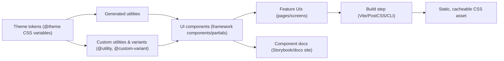

# Tailwind CSS Best Practices Guide for Modern, Scalable Front‑Ends

## Executive summary

Tailwind CSS has matured into a “compile-time styling system” that generates a static CSS bundle by scanning your project for utility classes, with zero runtime cost in production builds. citeturn8view2turn20view0 The biggest drivers of long-term success are (a) disciplined token/theming practices, (b) component boundary decisions (when to stay utility-first vs. extract), and (c) guardrails (formatters/linters and review rules) that keep class-heavy markup readable and consistent as teams scale. citeturn29view1turn28search26turn23search2turn20view0

Tailwind v4 introduced major shifts that influence “best practices” today: CSS-first configuration via `@theme`, automatic content detection (instead of manually maintaining `content` globs), and a redesigned engine and toolchain, including first-party Vite and PostCSS plugins. citeturn3view1turn18view0turn15search6turn15search7 Tailwind v4 also targets modern browsers (Safari 16.4+, Chrome 111+, Firefox 128+); if you need older browser support, remaining on v3.4 is explicitly recommended. citeturn3view0

Accessibility outcomes rely more on semantic HTML, focus management, and motion/contrast defaults than on Tailwind itself. Use Tailwind to make good accessibility practices easy to apply consistently (focus-visible rings, adequate contrast tokens, reduced-motion fallbacks), and pair it with accessible component primitives when interactive behavior is non-trivial. citeturn7search0turn7search35turn7search8turn7search1turn10search0turn10search10

## Project setup and configuration

### Installation options and recommended defaults

Tailwind v4 supports multiple integration paths; choose based on your build system:

- **Vite (and Vite-powered frameworks)**: Tailwind explicitly promotes installing as a Vite plugin (`@tailwindcss/vite`) for integration and performance. citeturn3view1turn15search7turn15search11  
- **PostCSS-based pipelines**: Use the dedicated PostCSS plugin package (`@tailwindcss/postcss`), not `tailwindcss` directly, which is a common v4 migration failure mode. citeturn15search6turn15search8  
- **CLI**: In v4, Tailwind CLI lives in a dedicated package (`@tailwindcss/cli`), and the upgrade guide shows updating build commands accordingly. citeturn3view0

If you are upgrading from v3 to v4, Tailwind provides an automated upgrade tool (`npx @tailwindcss/upgrade`) and recommends doing the upgrade in a new branch and reviewing diffs carefully. citeturn3view0

### JIT and “purge”: how it works now

Tailwind’s current production philosophy is “generate only what you use” by scanning source files for tokens that look like classes and emitting the corresponding CSS. citeturn20view0 In Tailwind v4, this is coupled with **automatic content detection** (no mandatory `content` array); Tailwind uses heuristics and ignores files in `.gitignore` by default, with escape hatches for edge cases. citeturn18view0turn20view0

This scanning approach has two practical implications:

1. **Your class strings must be statically discoverable.** Tailwind treats files as plain text and doesn’t understand string concatenation/interpolation; dynamic class construction is a top source of “missing styles” bugs. citeturn20view0  
2. **You must control what gets scanned in monorepos and component libraries.** Use `@source` to include external packages and `source()` to set a base path when the working directory differs from the project root. citeturn19view0turn20view0turn17view0

### Content scanning controls, safelisting, and monorepos

Tailwind v4 gives several explicit controls in CSS:

- Register additional sources (ex: a shared UI package) with `@source`. citeturn17view0turn19view0turn18view0  
- Set the base path for detection with `source("../src")` when builds run from a different directory (common in monorepos). citeturn19view0turn20view0  
- Ignore paths with `@source not ...`. citeturn19view0turn20view0  
- **Safelist** utilities and variants with `@source inline()`, including brace-expanded ranges. citeturn19view0turn17view0

This replaces older “PurgeCSS-era” patterns. Notably, in Tailwind v4, some JS-config-era options are explicitly unsupported; Tailwind docs call out that `corePlugins`, `safelist`, and `separator` (from JS config) are not supported in v4, and direct you to `@source inline()` for safelisting. citeturn17view0turn19view0

### Dark mode, theming, and tokens

**Dark mode** ships as a first-class variant (`dark:`). By default it uses `prefers-color-scheme`, but Tailwind documents how to override the `dark` variant to activate on a class (`.dark`) or a data attribute (`data-theme="dark"`) using `@custom-variant`. citeturn16view0turn17view0

**Theming and design tokens** are increasingly CSS-native in v4:

- Define tokens (colors, fonts, breakpoints, easing, etc.) with `@theme`. citeturn17view0turn29view1turn18view0  
- Tailwind v4 emphasizes that tokens become CSS variables (“CSS theme variables”), enabling runtime usage without JS config indirection. citeturn3view1turn18view0  
- Tailwind also notes the legacy `theme()` function is deprecated and recommends using CSS theme variables instead. citeturn17view0

### Plugins: first-party, third-party, and compatibility

Tailwind v4 uses `@plugin` to load JS plugins (described in Tailwind’s directives reference as a compatibility feature). citeturn17view0 Two widely used first-party plugins remain central:

- **Forms**: `@tailwindcss/forms` provides a utility-friendly reset for form controls and documents both v4 installation via `@plugin` and configuration options like base vs class strategies. citeturn8view1  
- **Typography**: `@tailwindcss/typography` provides `prose` classes for content you don’t control (Markdown/CMS output) and documents v4 installation via `@plugin`. citeturn9view0  

Third-party “component class” ecosystems exist as well:

- **entity["company","daisyUI","tailwind component plugin"]**: installed as a Tailwind plugin and explicitly provides component class names and theme support via configuration in CSS. citeturn10search1turn10search26turn10search5turn10search19  
- **Flowbite** positions itself as an open-source component library based on Tailwind with dark mode support and related tooling. citeturn10search6turn10search2  

Recommended “generalized” plugin shortlist (start small; expand as needed):
- `@tailwindcss/forms` for consistent form baselines. citeturn8view1  
- `@tailwindcss/typography` for rich text rendering regions. citeturn9view0  
- `daisyui` only if you explicitly want semantic component classes and theme presets (and accept the abstraction tradeoffs). citeturn10search26turn10search1turn10search19  
- Flowbite if you want a predefined component catalog and associated patterns (especially for teams who value drop-in components). citeturn10search6turn10search23  

## Architecture and organization for scalable Tailwind codebases

### A practical organizational model

A maintainable Tailwind project typically has three explicit styling strata:

1. **Tokens and global constraints** (CSS variables, breakpoints, base layer tweaks).  
2. **Reusable UI building blocks** (components, variants, patterns: buttons, inputs, badges, layout primitives).  
3. **Feature composition** (pages/screens stitch components together; avoid novel styles unless needed).

Mermaid sketch of the “token → component → product UI” flow:



This matches Tailwind’s own emphasis on customizing tokens with `@theme`, adding custom utilities with `@utility`, and using variants to express state and responsiveness. citeturn17view0turn29view1turn29view2

### Componentization vs. extracted CSS classes

Tailwind guidance strongly favors reuse through **framework components/partials** rather than building “semantic CSS classes” prematurely. A Tailwind Labs discussion quotes the documentation-style recommendation: if styles must be reused across files, create a component (React/Vue/Svelte) or template partial rather than chasing abstraction in CSS. citeturn4search23

A useful mental model is to treat “utility strings” as an implementation detail of a component; the component’s API is the semantic abstraction.

### Utility-first vs. component-class approaches

| Approach | Strengths | Risks | Best fit |
|---|---|---|---|
| Utility-first in markup | High locality (styles and structure together), fast iteration, small generated CSS (only used utilities). citeturn6search21turn20view0 | Markup can become visually dense; inconsistent patterns emerge without guardrails. | Most application UI, especially component-based frameworks. citeturn4search23 |
| Component classes (semantic abstractions, e.g., `.btn`, `.card`) | Reduces markup noise; consistent design vocabulary. | Recreates a “design system in CSS” that can drift; abstraction can hide token usage and variants; may reduce flexibility. | Design-system-heavy teams **if** governance is strong; or when using a plugin ecosystem like daisyUI by choice. citeturn10search26turn10search8 |

A pragmatic best practice is “utilities by default; semantic API at component boundaries”; reserve global component classes for cases where the ecosystem requires it (content you don’t control, third-party widgets, or explicit component-class libraries). citeturn9view0turn17view0turn10search26

### Extracting patterns: `@apply` vs. component extraction vs. `@utility`

Tailwind v4 keeps `@apply` and explains it is useful when you must write custom CSS (for example overriding a third-party library) but still want to reuse Tailwind tokens and syntax. citeturn17view0 Tailwind also provides CSS-native extension mechanisms like `@utility` for custom utilities that participate in variants. citeturn17view0turn29view1

Comparison:

| Technique | What it is | Advantages | When to avoid |
|---|---|---|---|
| Component extraction | Put the class list inside a component/partial and expose props/variants. citeturn4search23turn20view0 | Best long-term maintainability; supports type-safe APIs; keeps scanning reliable (static class maps). citeturn20view0 | Avoid only if you cannot create components/partials (CMS HTML, external markup). |
| `@apply` | Inline existing utilities into a CSS rule. citeturn17view0 | Useful for third-party overrides and legacy CSS interop. citeturn17view0 | Avoid as a general “DRY hammer” when components are available; can lead to CSS sprawl and specificity issues. |
| `@utility` | Define new utilities in CSS that work with variants. citeturn17view0turn29view1 | Encodes organization-specific primitives (e.g., `content-auto`) once; keeps usage utility-like. citeturn29view1 | Avoid for single-use “convenience utilities”; prefer tokens or components. |

## Styling patterns for responsive, stateful UI

### Mobile-first and responsive variants

Tailwind’s responsive system is mobile-first: unprefixed utilities apply to all sizes; prefixed utilities (e.g., `md:`) apply at that breakpoint and above. citeturn29view2 The docs recommend clarity when a property only matters at a breakpoint (e.g., `md:shrink-0` rather than `shrink-0` if the intent is medium+ only). citeturn29view2

Example pattern:

```html
<div class="mx-auto max-w-md md:max-w-2xl md:flex">
  
  <div class="p-6 md:p-8">
    <h2 class="text-base font-semibold md:text-lg">…</h2>
  </div>
</div>
```

This matches Tailwind’s “apply any utility conditionally at breakpoints” guidance. citeturn29view2

### Variants for state, interaction, and context

Tailwind variants are designed to be composable and stackable; the docs explicitly show stacking like `dark:md:hover:*`. citeturn4search2turn4search6

Example:

```html
<button
  class="bg-sky-500 hover:bg-sky-700 dark:bg-sky-400 dark:hover:bg-sky-300
         px-4 py-2 rounded-md"
>
  Save changes
</button>
```

Tailwind’s “hover/focus and other states” documentation is the canonical reference for this approach. citeturn4search2turn4search7

### Arbitrary values and variants: “escape hatch, not a primary vocabulary”

Tailwind documents arbitrary values (square bracket notation) as a way to break out of token constraints when necessary, and explicitly frames it as “once in a while” for pixel-perfect needs. citeturn29view1 Arbitrary values can still participate in responsive and state variants. citeturn29view1

Recommended pattern:
- Try tokens first (`@theme` variables → normal utilities).
- Use arbitrary values for rare exceptions, then consider promoting repeated special values into tokens.

Example:

```html
<div class="top-[117px] lg:top-[344px] bg-[#bada55] before:content-['Festivus']"></div>
```

This is directly aligned with Tailwind’s custom-styles guidance. citeturn29view1

### Avoiding the most common pitfall: dynamic class construction

Tailwind warns that it scans files as plain text and cannot understand interpolated class assembly. citeturn20view0 This is the root cause of many production-only styling bugs.

Pitfall:

```tsx
// Bad: Tailwind can't reliably detect bg-${color}-600
<button className={`bg-${color}-600 hover:bg-${color}-500`}>…</button>
```

Recommended fix: map props to **complete** strings:

```tsx
const variants = {
  blue: "bg-blue-600 hover:bg-blue-500",
  red: "bg-red-600 hover:bg-red-500",
};

<button className={`${variants[color]} px-4 py-2 rounded-md`}>…</button>
```

This “map to static class names” pattern is explicitly recommended in Tailwind’s class detection documentation. citeturn20view0

### Container queries as a first-class responsive tool

Tailwind v4 brought container queries into core, so you no longer need the `@tailwindcss/container-queries` plugin for v4 projects. citeturn6search3turn3view1 Example syntax shown in the v4 announcement uses `@container` on the container and `@sm:` / `@lg:` variants on children. citeturn6search3turn3view1

## Performance and production delivery

### Build output philosophy: static CSS, minimum necessary rules

Tailwind’s scanning model is designed to keep the output CSS as small as possible by generating only the utilities you actually used. citeturn20view0turn8view2 This is also why arbitrary values work—Tailwind can emit a one-off rule when it sees a token. citeturn20view0turn29view1

Tailwind v4 also introduced a new engine and reported substantial build-time improvements in Tailwind Labs benchmarks (full rebuilds faster; incremental rebuilds dramatically faster). citeturn3view1

### Content scanning and caching strategy

Because the production output is a single static CSS asset (not runtime-generated), treat it like any other versioned static asset:
- fingerprint the filename (build tool responsibility),
- use long-lived caching on the CDN,
- invalidate by changing the asset URL on deploy.

This sits naturally with Tailwind’s documented “write to a static CSS file” production model. citeturn8view2turn20view0

### CDN usage: distinguish “Play CDN” from production delivery

Tailwind’s **Play CDN** is explicitly documented as development-only and “not intended for production.” citeturn8view2 A Tailwind maintainer clarifies it’s “safe” in a security sense but bad for performance: the JS runtime approach is larger than a produced CSS file and can cause flashes of unstyled content because styles apply at runtime. citeturn6search6turn8view2

Best practice: use a build step (Vite/PostCSS/CLI) for production and serve the compiled CSS via your normal static asset pipeline/CDN. citeturn15search6turn15search7turn3view0

### Modern toolchain notes that affect performance defaults

Tailwind v4 “simplified installation” includes bundling functionality historically supplied by extra tooling: it documents built-in import support and using Lightning CSS under the hood for vendor prefixing and syntax transforms. citeturn3view1turn5search23 This can reduce “pipeline sprawl” and makes it easier to keep production builds fast and consistent.

## Accessibility practices with Tailwind

### Base standards you should design tokens against

Use **WCAG 2.2** as the baseline for non-negotiables like text contrast and focus visibility/appearance. citeturn7search0turn7search35turn7search8 Two particularly Tailwind-relevant areas:

- **Contrast (Minimum)** for text and images of text (WCAG 1.4.3). citeturn7search35  
- **Focus Appearance / Focus Visible** expectations (WCAG 2.4.7 and 2.4.13) to ensure keyboard focus is clearly perceivable. citeturn7search8  

Practical Tailwind implication: your token palette (`@theme`) should be contrast-checked for both light and dark contexts, and your component primitives should ship with consistent focus rings.

### Focus styles: use `:focus-visible` patterns, not “disable outline”

The `:focus-visible` selector is designed to show focus indications in a way that respects input modality heuristics, while still enabling customization. citeturn7search2turn7search22

Recommended button pattern (Tailwind-style, but conceptually grounded in `:focus-visible` behavior):

```html
<button
  class="rounded-md px-4 py-2
         focus-visible:outline-none focus-visible:ring-2 focus-visible:ring-offset-2"
>
  …
</button>
```

This aligns with standards-driven guidance that a visible, discernible focus indicator must exist and be sufficiently prominent. citeturn7search8turn7search22

### Reduced motion: design for users who request it

`prefers-reduced-motion` detects when users prefer reduced non-essential motion and is explicitly intended for accessibility. citeturn7search1turn7search5

Even if you primarily express motion via Tailwind utilities, ensure your system can downgrade transitions/animations under reduced motion:

```css
@media (prefers-reduced-motion: reduce) {
  * {
    animation-duration: 0.001ms !important;
    animation-iteration-count: 1 !important;
    transition-duration: 0.001ms !important;
    scroll-behavior: auto !important;
  }
}
```

This is grounded in how the media feature is defined and used for accessibility. citeturn7search1turn7search5

### Accessible interactive components: prefer proven primitives

For complex widgets (dialogs, popovers, comboboxes), accessibility depends on correct focus management and ARIA semantics. WAI-ARIA Authoring Practices describe expectations like trapping tab focus inside modal dialogs. citeturn7search3turn7search15

This is where **entity["company","Tailwind Labs","web dev company"]**’s **Headless UI** strategy is a good fit: it positions itself as “completely unstyled, fully accessible UI components” intended to integrate with Tailwind. citeturn10search0turn10search10turn10search3

## Maintainability, tooling, and team workflows

### Formatting and class-order consistency

Tailwind Labs explicitly recommends automated class sorting via the Prettier plugin, which scans templates for Tailwind class lists and sorts them in the recommended order. citeturn28search26turn23search2 In Tailwind v4, the Prettier plugin requires specifying the Tailwind stylesheet entry point (because config is often in CSS via `@theme`, etc.) using `tailwindStylesheet`. citeturn23search2turn23search6

Example `.prettierrc`:

```json
{
  "plugins": ["prettier-plugin-tailwindcss"],
  "tailwindStylesheet": "./src/styles/app.css"
}
```

This is directly documented by the plugin maintainers for v4+. citeturn23search2turn23search6

### Editor and IDE support

Tailwind documents official editor setup guidance and highlights Tailwind CSS IntelliSense for VS Code (autocomplete, linting-like feedback, etc.). citeturn23search3turn23search15 For Tailwind v4 projects, Tailwind maintainers note the extension activates when it detects (among other triggers) a CSS file that imports Tailwind (e.g., `@import "tailwindcss"`). citeturn23search34turn8view2

### Linting strategies for Tailwind-heavy codebases

A realistic approach is to separate concerns:

- **Formatting and ordering**: Prettier plugin (lowest friction, consistent diffs). citeturn28search26turn23search2  
- **Tailwind-specific linting**: the ecosystem is in flux around Tailwind v4. The long-standing `eslint-plugin-tailwindcss` documents that v4 support is partial and available on a beta channel. citeturn28search1turn26view0  
- **Alternative v4-first lints**: `poupe-ui/eslint-plugin-tailwindcss` explicitly markets itself as Tailwind v4-focused with theme-aware rules and presets. citeturn28search2turn28search12  

Best-practice recommendation: keep Tailwind linting **advisory** (warnings) until it is stable for your stack, and make formatting non-negotiable (CI gate). The goal is to prevent “style churn” from blocking feature delivery while still steering the codebase toward consistency.

### Team workflow guardrails that pay off

A scalable team workflow for Tailwind usually codifies:

- **Token governance**: new colors/spacing/radii must be added to `@theme` (or approved token lists) rather than arbitrary values, except for one-off, justified exceptions. citeturn29view1turn17view0turn18view0  
- **Component API discipline**: repeated patterns must be promoted into a component/partial rather than copied across the app. citeturn4search23  
- **Source scanning discipline**: dynamic class concatenation is prohibited; props map to static class strings. citeturn20view0  

For component-library workflows, real-world starter templates often pair Tailwind with TypeScript and formatting/testing tools; Vercel’s templates describe stacks that include Tailwind, TypeScript, and formatting support, and even component systems like shadcn/ui. citeturn13search2turn11search20turn11search15

### Sample Tailwind v4 setup: stylesheet-as-config

A maintainable “single source of truth” entry stylesheet (v4-style) typically includes:

- Tailwind import
- scanning base path override (if needed)
- tokens (`@theme`)
- dark mode override (if class/data-driven)
- plugins (`@plugin`)
- scanning additions for monorepo packages (`@source`)
- custom primitives (`@utility`, `@layer`)

Example `src/styles/app.css`:

```css
@import "tailwindcss" source("../src");

/* Theme tokens */
@theme {
  --font-sans: ui-sans-serif, system-ui, sans-serif;
  --radius-md: 0.5rem;

  /* Brand palette example (use your own vetted values) */
  --color-brand-50: oklch(0.98 0.02 250);
  --color-brand-600: oklch(0.55 0.18 250);
}

/* Use class-based dark mode toggling */
@custom-variant dark (&:where(.dark, .dark *));

/* Scan shared packages in a monorepo */
@source "../packages/ui";

/* Plugins */
@plugin "@tailwindcss/forms";
@plugin "@tailwindcss/typography";

/* Add a small “primitive” utility once */
@utility content-auto {
  content-visibility: auto;
}

/* Base tweaks (use sparingly) */
@layer base {
  :root { color-scheme: light; }
  .dark { color-scheme: dark; }
}
```

Every directive used here is directly documented: `@theme`, `@custom-variant`, `@source`, `source()`, `@plugin`, `@utility`, and `@layer` usage for base styles. citeturn17view0turn16view0turn20view0turn19view0turn8view1turn9view0turn29view1

If you must keep a legacy JS config (incremental migration, plugin theming, etc.), Tailwind v4 documents `@config` as the mechanism to load it, and a Tailwind collaborator explicitly notes you must tell v4 to use it with `@config`. citeturn17view0turn11search10

## Migration checklist and real-world anti-patterns

### Migration checklist for existing projects adopting Tailwind

This assumes “no special constraints” and focuses on risk reduction and scalability.

| Phase | Actions | Key pitfalls to avoid |
|---|---|---|
| Baseline decisions | Decide Tailwind v4 vs v3.4 based on browser support requirements. citeturn3view0 | Upgrading to v4 if you must support older browsers (v4 depends on modern CSS features and has explicit browser targets). citeturn3view0 |
| Installation and pipeline | Choose Vite plugin / PostCSS plugin / CLI and produce a static CSS asset. citeturn3view1turn15search6turn3view0 | Using `tailwindcss` as a PostCSS plugin in v4 instead of `@tailwindcss/postcss`. citeturn15search8 |
| Token mapping | Translate existing design system tokens (colors, spacing, typography, radii) into `@theme` variables first. citeturn29view1turn17view0turn18view0 | Encoding “random” one-off values everywhere (arbitrary values) instead of promoting repeated values into tokens. citeturn29view1turn17view0 |
| Incremental refactor | Start with low-risk UI (buttons, inputs, cards), then replace legacy CSS gradually. Adopt component extraction early. citeturn4search23turn20view0 | Rewriting entire screens at once without establishing component patterns and guardrails. |
| Content scanning hardening | Ensure all style sources are detected; in monorepos, set `source()` and add `@source` for external packages. citeturn19view0turn20view0 | Dynamic class construction (`bg-${color}-…`) that cannot be scanned. citeturn20view0 |
| Safelists and third-party edge cases | Use `@source inline()` to safelist required utilities and variants when class strings are not present in source. citeturn19view0turn17view0 | Trying to use v3 JS-config `safelist` semantics in v4 (explicitly unsupported in v4). citeturn17view0 |
| Production delivery | Serve compiled CSS as a static asset; use the Play CDN only for demos. citeturn8view2turn6search6 | Shipping Play CDN to production (runtime styles, larger JS payload, potential FOUC). citeturn8view2turn6search6 |
| Accessibility audit | Validate contrast tokens and focus indicators against WCAG; ensure reduced motion behavior. citeturn7search0turn7search35turn7search8turn7search1 | “outline-none everywhere” without providing an equivalent focus indicator. citeturn7search8turn7search22 |
| Tooling and governance | Add Prettier class sorting; adopt Tailwind-aware linting if stable; document patterns. citeturn28search26turn23search2turn28search1turn28search2 | Letting style conventions emerge implicitly (inconsistent spacing scales, random shadow usage, unreadable diffs). |

### Migration checklist for v3 → v4 upgrades

If you’re already on Tailwind v3 and moving to v4:

- Confirm browser support expectations; Tailwind v4 targets modern browsers and suggests sticking with v3.4 if you need older coverage. citeturn3view0  
- Use the official upgrade tool when possible (`npx @tailwindcss/upgrade`). citeturn3view0  
- Update CLI usage: v4 CLI is `@tailwindcss/cli`. citeturn3view0  
- Update PostCSS integration: use `@tailwindcss/postcss`. citeturn15search6turn15search8  
- Move configuration into CSS (`@theme`, etc.) and load legacy config only when needed via `@config`. citeturn18view0turn17view0turn11search10  
- Replace JS-config safelists with `@source inline()`. citeturn17view0turn19view0  

### Common real-world anti-patterns and safer alternatives

**Anti-pattern: dynamic class generation**
- Why it fails: Tailwind scans as plain text and can’t infer interpolated class strings. citeturn20view0  
- Fix: map to static class strings (or use a variant utility system inside code) and keep “all possible classes” explicit. citeturn20view0turn11search15  

**Anti-pattern: using Play CDN for production**
- Why it fails: it’s documented as dev-only; maintainers cite runtime overhead and FOUC risk. citeturn8view2turn6search6  
- Fix: compile CSS in the build pipeline and serve as a versioned static asset. citeturn8view2turn15search6  

**Anti-pattern: multiple Tailwind imports or fragmented “entry” stylesheets**
- Real-world symptom: dark mode and cascade ordering bugs (e.g., importing Tailwind in multiple CSS files). citeturn11search8turn16view0  
- Fix: define a single “entry” stylesheet and reference it where needed (`@reference` for component-scoped CSS usage). citeturn17view0turn11search8  

**Anti-pattern: `@apply` as a default abstraction tool**
- Why it drifts: it encourages rebuilding a traditional CSS layer rather than letting component boundaries enforce consistent reuse. Tailwind frames `@apply` as especially useful for third-party override scenarios, not as a primary architecture. citeturn17view0turn4search23  
- Fix: use component extraction first; reserve `@apply` for integration points where markup isn’t under your control. citeturn4search23turn17view0  

**Anti-pattern: uncontrolled arbitrary values**
- Why it drifts: arbitrary values are an escape hatch; overuse fragments the design system and undermines token consistency. Tailwind explicitly positions arbitrary values as occasional “break out of constraints” tooling. citeturn29view1  
- Fix: promote repeated arbitrary values to `@theme` tokens or formal component variants. citeturn17view0turn29view1turn18view0