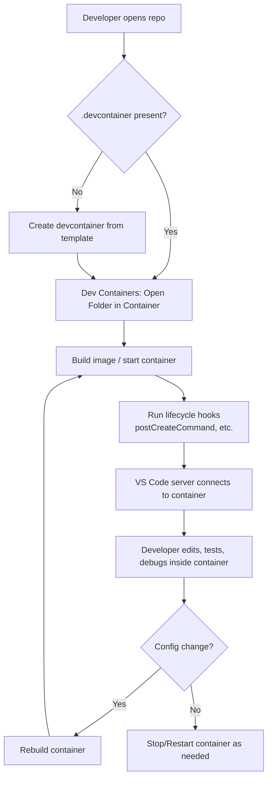
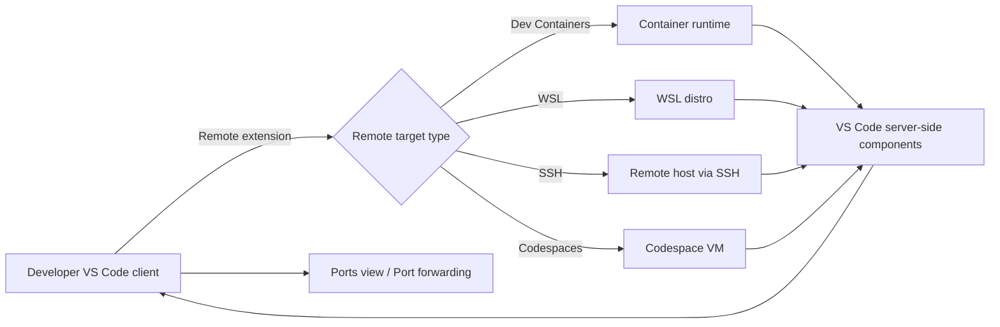
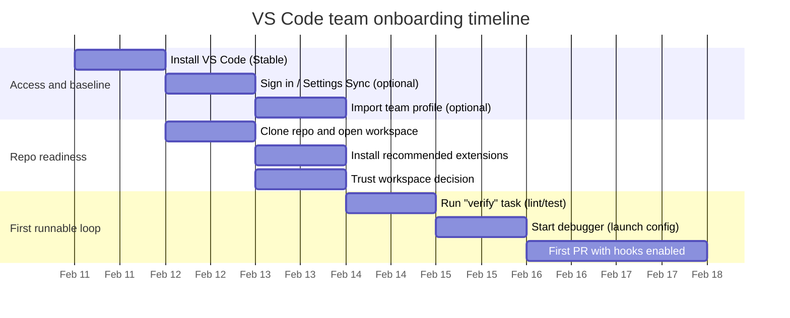

# Best Practices Playbook for Visual Studio Code

## Executive summary

A generalized “best practices” strategy for VS Code is easiest to sustain when you treat the editor as part of your engineering system—versioned, policy-driven, reproducible, and measurable—rather than as individual developer preference. VS Code ships a **monthly release cadence** and most platforms support **auto-update**, so your governance model should start with a clear update channel decision (Stable vs Insiders), an enterprise-safe update policy (if applicable), and a process for validating critical extensions and workflows after upgrades. citeturn7view1turn7view0

At the project level, the highest-leverage move is to standardize a **workspace contract**: a small, curated set of workspace settings, tasks, launch configurations, and extension recommendations that are version-controlled in the repo (typically under `.vscode/`), plus optional dev environment definitions (notably `.devcontainer/devcontainer.json`) for reproducibility. Workspace settings **override user settings** and follow a documented precedence model; this provides a clean separation between personal ergonomics and project-required behavior. citeturn6view2turn24search2turn3search6

For day-to-day productivity, focus on a small set of editor capabilities with compounding returns: keyboard shortcut customization, multi-cursor editing, snippets, code navigation (e.g., breadcrumbs), and refactor operations. These features reduce context switching and scale across languages and roles. citeturn4search20turn4search0turn4search1turn23search0turn23search1

For teams and regulated environments, extension management and security are first-class concerns: extensions run with the same permissions as VS Code and can read/write files, make network requests, and run processes, so you need explicit criteria for selecting extensions, processes for diagnosing extension-related performance issues, and controls such as workspace trust and (optionally) allow-lists. citeturn25view0turn9search2turn34view0turn28view2

Finally, operational excellence comes from measuring and acting on a small set of signals (startup performance, CPU/memory hotspots, extension impact, remote dev friction, onboarding time-to-first-commit) and having repeatable troubleshooting playbooks (process explorer, extension bisect, startup timers, remote troubleshooting guides, terminal diagnostics). citeturn28view2turn8search1turn11search18turn24search20turn26view0

## Foundations: installation, updates, workspaces, and configuration

### Installation and update strategy

**Rationale.** VS Code’s monthly releases and auto-update support mean you should design for frequent change, especially because your extension set is effectively part of your runtime. For enterprises, IT-managed update policy reduces outage risk and simplifies compliance. citeturn7view1turn7view0

**Actionable recommendations.**

1. **Choose a release channel explicitly.**
   - Use **Stable** for most developers and teams (organizational default).
   - Use **Insiders** side-by-side for a small “canary” cohort to validate upcoming changes and verify bug fixes early; VS Code supports installing Insiders alongside Stable. citeturn7view1

2. **Define an update policy based on your risk tolerance.**
   - For managed environments, standardize how update checks occur using VS Code enterprise policy options (for example: background/default, startup-only, manual-only, or completely disabled). citeturn7view0
   - If you disable updates, replace them with a documented patch cadence and a method to validate new releases against your extension baseline and critical workflows. citeturn7view0turn25view0

3. **Use Portable mode only for specialized scenarios.**
   - Portable mode keeps VS Code data “near itself” so it can be moved across environments; it is helpful for restricted machines, ephemeral lab setups, or controlled kiosks, but it raises lifecycle complexity compared with standard installs. citeturn7view1turn20search2

4. **Operationalize “clean reset” procedures.**
   - Maintain a documented reset flow for corrupted settings/extensions (especially relevant for onboarding and troubleshooting). VS Code docs describe where user data folders live and how deleting them resets state. citeturn7view1

**Trade-offs.** Faster update cadence reduces exposure to known bugs and security issues but increases change churn; slower cadence improves stability at the cost of delayed fixes and drift from ecosystem expectations (extensions and tools often assume recent VS Code versions). Enterprise policies reduce per-user autonomy but increase reproducibility and compliance. citeturn7view0turn25view0

**Priority sources.** Update cadence and Insiders side-by-side behavior are described in the setup overview. citeturn7view1 Enterprise update policy options (including disabling updates) are documented in the enterprise updates guide. citeturn7view0

### Workspace and project organization

**Rationale.** The workspace is the unit where VS Code binds editor state, language services, debugging configuration, tasks, and trust decisions. A consistent workspace layout makes your repository self-describing and reduces onboarding friction. citeturn4search5turn9search2

**Actionable recommendations.**

1. **Standardize a repository “VS Code contract.”**
   - Use a repo-level `.vscode/` directory for:
     - `settings.json` (project-level editor behavior)
     - `extensions.json` (extension recommendations)
     - `tasks.json` (build/lint/test automation)
     - `launch.json` (debug configurations)
   - This aligns with how VS Code documents workspace settings storage and task configuration. citeturn6view2turn24search2turn32view0turn18search1

2. **Use multi-root workspaces intentionally.**
   - Multi-root is valuable for polyrepo/monorepo hybrids, microservice suites, or separating infra/app docs while still enabling unified search and debugging configuration discovery. citeturn4search2turn4search5
   - Keep “root count” small and document which folders are expected to be opened together—multi-root increases cognitive load and can amplify indexing and file watching overhead.

3. **Treat generated and dependency folders as first-class “exclusion policy.”**
   - Align `files.exclude`, `search.exclude`, and `files.watcherExclude` around the same directories (e.g., `node_modules`, `.venv`, build outputs) to reduce UI noise and avoid file watcher resource exhaustion on large workspaces. VS Code’s Linux docs explicitly call out large-workspace watcher limits (ENOSPC) and recommend excluding large folders like `.venv`. citeturn27search9turn11search3turn6view2

**Example starter `.code-workspace`.**

```jsonc
{
  "folders": [
    { "path": "apps/web" },
    { "path": "services/api" },
    { "path": "infra" }
  ],
  "settings": {
    "files.exclude": { "**/.git": true, "**/node_modules": true, "**/.venv": true },
    "search.exclude": { "**/dist": true, "**/build": true }
  },
  "extensions": {
    "recommendations": [
      "dbaeumer.vscode-eslint",
      "esbenp.prettier-vscode",
      "github.vscode-pull-request-github"
    ]
  }
}
```

This matches how VS Code supports extension recommendations inside `.code-workspace` files for multi-root setups and documents workspace extension recommendation mechanisms. citeturn32view0turn4search2

**Trade-offs.** Putting `.vscode/` under source control increases consistency but risks “editor policy creep” (overly prescriptive preferences). The mitigation is to keep workspace settings minimal and focused on correctness, CI-alignment, and team ergonomics, while leaving purely personal preferences in user settings/profiles. citeturn6view2turn21view0

**Priority sources.** VS Code defines workspaces and multi-root workspaces and describes related behaviors such as debugging configuration discovery. citeturn4search5turn4search2

### Settings, scope, sync, and profiles

**Rationale.** VS Code’s settings model is designed to separate global personalization (user scope) from project requirements (workspace scope), with a documented precedence list and additional layers for remote and language-specific settings. This model enables a clean “configuration as code” approach. citeturn6view2turn5view0turn26view0

**Actionable recommendations.**

1. **Apply the scope model deliberately.**
   - Put **team-wide correctness settings** (formatters, test discovery behavior, workspace excludes) in **workspace settings**; workspace settings override user settings. citeturn6view2turn6view2
   - Put **personal ergonomics** (fonts, themes, keybinding muscle memory) in **user settings** or **profiles**. citeturn6view2turn21view0
   - Use **remote settings** when behavior must differ on a remote host (e.g., paths, shells), consistent with VS Code’s precedence list that includes remote scope. citeturn6view2turn16search7

2. **Respect the security boundary around executable settings.**
   - VS Code explicitly restricts some settings (e.g., executable paths) to user scope for security; do not attempt to push these through workspace configuration. citeturn6view2

3. **Use Settings Sync for personal continuity, not as your only team standard.**
   - Settings Sync is intended to synchronize settings, shortcuts, and extensions across machines, but it does **not** synchronize extensions to/from a remote window (SSH/devcontainer/WSL). citeturn10search3turn6view2
   - For teams, prefer repo-checked-in `.vscode/` settings plus `extensions.json` recommendations; treat Settings Sync as “your personal backpack.” citeturn32view0turn10search3

4. **Adopt Profiles as a first-class abstraction.**
   - Profiles let you create and switch sets of settings/extensions and associate them with folders/workspaces. They support export/import to a GitHub gist or local `.code-profile` file, which is useful for onboarding and standardizing roles (e.g., “Data Science”, “Backend”). citeturn21view0
   - In an enterprise, Profiles also provide a clean way to validate issues in an “empty profile” to reduce noise when troubleshooting or reporting bugs. citeturn21view0turn28view2

**Example minimal workspace settings (`.vscode/settings.json`).**

```jsonc
{
  "editor.formatOnSave": true,
  "editor.codeActionsOnSave": {
    "source.fixAll": "explicit"
  },

  "files.exclude": {
    "**/.git": true,
    "**/node_modules": true,
    "**/.venv": true,
    "**/dist": true,
    "**/build": true
  },

  "files.watcherExclude": {
    "**/.git/objects/**": true,
    "**/node_modules/**": true,
    "**/.venv/**": true
  }
}
```

Workspace settings are stored under `.vscode/` and override user settings; glob patterns are used for exclusions. citeturn6view2turn11search3turn27search9

**Trade-offs.** Profiles and Settings Sync improve portability, but they can create “invisible complexity” if teams rely on them instead of a repo-defined workspace contract. Keep your project runnable with only repo configuration plus a minimal set of documented prerequisites. citeturn21view0turn7view1

**Priority sources.** Settings scope, precedence, and limitations are documented in user/workspace settings. citeturn6view2 Settings Sync behavior and remote limitations are in the Settings Sync guide. citeturn10search3 Profiles export/import and workspace associations are detailed in the Profiles guide. citeturn21view0

## Extensions strategy and editor productivity

### Extension selection, governance, and performance impact

**Rationale.** Extensions share the extension host’s permissions—meaning they can read/write files, run external processes, and make network requests. VS Code and the Marketplace provide safeguards and signals (trusted publishers, scanning, signature verification), but the onus is still on you to choose and manage extensions intentionally. citeturn25view0

**Actionable recommendations.**

1. **Use a “minimum viable extension set” for baseline productivity.**
   - Start with a small set of cross-cutting extensions (formatter/linter, Git enhancement, YAML/JSON support) and add language tooling only when it changes correctness, not just convenience.

2. **Evaluate extensions using an explicit checklist.**
   - Use VS Code’s documented reliability signals: ratings/reviews, responsiveness, repository/issues/license presence, and verified publisher signals. citeturn25view0
   - Avoid installing extensions with unclear ownership, missing repository links, or unexplained network behavior.

3. **Prefer workspace recommendations over “everyone manually install this.”**
   - Use `.vscode/extensions.json` and/or `.code-workspace` recommendations, which VS Code will prompt users to install when the workspace is opened. citeturn32view0

4. **Create an enterprise extension control strategy when appropriate.**
   - VS Code supports an allow-list model (`extensions.allowed`) starting from specific versions and can restrict by publisher/extension/version/platform; Windows-only “bootstrap preinstall” is also available. citeturn34view0
   - This is the most scalable way to balance security/compliance with developer autonomy in regulated orgs. citeturn34view0turn25view0

5. **Treat extensions as a performance variable.**
   - Use the built-in Process Explorer and “Show Running Extensions” workflow to identify extension CPU hotspots; use extension bisect to isolate misbehaving extensions. citeturn28view2turn8search1

**Example `extensions.json` (workspace recommended extensions).**

```jsonc
{
  "recommendations": [
    "dbaeumer.vscode-eslint",
    "esbenp.prettier-vscode",
    "github.vscode-pull-request-github",
    "eamodio.gitlens"
  ]
}
```

This follows the format VS Code documents for workspace recommendations. citeturn32view0

**Trade-offs.** More extensions increase feature coverage but also increase attack surface and performance variance; “extension sprawl” is one of the most common sources of slow startup and high CPU usage. citeturn25view0turn28view2

**Priority sources.** Extension runtime permissions, publisher trust prompts, and marketplace protections are described in VS Code’s extension runtime security guide. citeturn25view0 Workspace recommended extension mechanisms are described in the Extension Marketplace doc. citeturn32view0 Enterprise extension governance is described in the enterprise extensions doc. citeturn34view0

### Recommended extensions by role and language

The goal of these recommendations is not completeness; it is to provide a defensible baseline with clear criteria: strong adoption and documentation, stable publishers, and alignment with primary language workflows.

| Role / workflow | “Core” recommended extensions | When to add more | Notes / trade-offs |
|---|---|---|---|
| General engineering baseline | ESLint (`dbaeumer.vscode-eslint`), Prettier (`esbenp.prettier-vscode`), GitLens (`eamodio.gitlens`), GitHub PRs (`github.vscode-pull-request-github`), EditorConfig (`EditorConfig.EditorConfig`) citeturn14search2turn14search3turn2search1turn15search3turn15search0 | Add YAML/Markdown tooling when repo uses them | ESLint expects ESLint installed in the workspace (local install recommended). citeturn14search2 EditorConfig helps enforce indentation/formatting across editors, but you still need consistent formatter rules for complex languages. citeturn15search0turn15search17 |
| TypeScript / JavaScript | Built-in JS/TS features plus ESLint + Prettier citeturn12search17turn12search9turn14search2turn14search3 | Add framework-specific tooling as needed | VS Code includes built-in JavaScript/TypeScript IntelliSense, navigation, and debugging support; use ESLint/Prettier for team policy consistency. citeturn12search17turn12search9turn14search3 |
| Python engineering | Python (`ms-python.python`), Pylance (`ms-python.vscode-pylance`), Jupyter (`ms-toolsai.jupyter`) citeturn14search0turn12search4turn14search1 | Add data tooling only when needed (not by default) | The Python extension provides access points for IntelliSense/debugging/testing and environment management; Pylance is the language server experience. citeturn14search0turn12search4turn14search4 |
| Go services | Go language support (VS Code Go tooling); official Go extension workflows citeturn12search5turn12search2 | Add container/remote tooling if Go runs in containers/remote hosts | Go debugging uses Delve; follow the Go extension’s documented debugging setup. citeturn12search5turn12search15 |
| Java (Spring/enterprise) | Extension Pack for Java (`vscjava.vscode-java-pack`) citeturn12search20turn12search16 | Add Spring Boot tooling when relevant | Java debugging and testing are provided through Java debugger/test extensions in the pack; VS Code docs recommend the pack for core Java dev. citeturn12search16turn12search12turn12search18 |
| .NET / C# | C# Dev Kit (`ms-dotnettools.csdevkit`) citeturn13search1turn13search3 | Add solution/project tooling as required | C# Dev Kit enables testing and improved C# workflows; VS Code docs describe F5 debugging behavior and test explorer integration. citeturn13search12turn13search0 |
| C/C++ | C/C++ (`ms-vscode.cpptools`) + CMake Tools (as needed) citeturn13search2turn13search11turn13search10 | Add CMake tools primarily for CMake-based builds | VS Code C++ support is provided by the Microsoft C/C++ extension; CMake tools support config/build/debug workflows. citeturn13search11turn13search10 |
| DevOps / platform | Dev Containers (`ms-vscode-remote.remote-containers`), Remote-SSH (`ms-vscode-remote.remote-ssh`), Remote-WSL (`ms-vscode-remote.remote-wsl`), Kubernetes tools (`ms-kubernetes-tools.vscode-kubernetes-tools`), Terraform (`HashiCorp.terraform`) citeturn16search0turn16search1turn16search2turn17search1turn17search2 | Add only what matches platform responsibilities | Remote extensions route editing/debugging through VS Code’s remote model; Kubernetes/Terraform extensions should be scoped to relevant repos to limit noise/performance impact. citeturn16search7turn17search2 |
| Docs / Markdown | markdownlint (`DavidAnson.vscode-markdownlint`) citeturn15search2 | Add diagram/viewer tooling as needed | markdownlint enforces consistency; keep rule sets minimal to avoid “lint fatigue.” citeturn15search2turn15search6 |

### Core editor workflows that scale across languages

**Rationale.** Editor workflow improvements compound because they apply to every file you touch. VS Code documents multi-cursor editing, snippets, keybinding customization, and code navigation features that reduce time spent on repetitive edits and searching. citeturn4search0turn4search1turn4search20turn23search0

**Step-by-step recommendations.**

1. **Customize keybindings only after you can articulate friction.**
   - Start with built-in shortcuts; keep customizations limited and versioned if shared (for example via profiles). citeturn4search20turn21view0

2. **Adopt multi-cursor as a default “first response” to repetitive edits.**
   - VS Code provides multiple approaches (Alt/Option+Click, add cursors above/below, select all occurrences). citeturn4search0turn4search9

3. **Create snippets for patterns your team repeatedly writes.**
   - Snippets are explicitly designed as templates for repeating patterns; maintain language-specific snippet files or bundle them as a team extension if needed. citeturn4search1turn4search12

4. **Use navigation and refactoring as “continuous maintenance.”**
   - Breadcrumbs/Outline improve structural navigation; refactorings like extract method/variable reduce long-term complexity without changing behavior. citeturn23search0turn23search1

5. **Standardize terminal profiles and shell integration where shells differ across OS.**
   - Terminal profiles provide platform-specific shell configuration; shell integration enables richer terminal behavior and navigation. citeturn23search7turn23search3

## Language-specific workflows and conventions

This section focuses on language workflows explicitly requested: TypeScript/JavaScript, Python, Go, Java, C#/.NET, C/C++, web development, plus a general “no specific constraint” pattern for other languages.

### TypeScript and JavaScript

**Rationale.** VS Code ships with strong built-in JavaScript and TypeScript language features and debugging support, so most teams mainly need to standardize project configuration, linting, formatting, and debugging recipes. citeturn12search17turn12search9turn12search0

**Actionable recommendations.**

1. **Commit `package.json` scripts for lint/format/test and wire them into tasks.**
   - Use the Tasks system so developers can run consistent commands without remembering CLI specifics. citeturn18search1turn10search5

2. **Use ESLint and Prettier as the default policy layer.**
   - The VS Code ESLint extension integrates workspace-installed ESLint (local install recommended). citeturn14search2
   - Prettier enforces consistent formatting across supported web languages. citeturn14search3

3. **Use TypeScript sourcemap-based debugging patterns.**
   - VS Code documents TypeScript debugging (Node, browser debugging) and sourcemap mapping concerns. citeturn12search0turn19search7

**Trade-offs.** Over-eager lint rules increase noise; treat linting rules as a product (curate, document, review). Debugging TS requires correct build outputs and sourcemaps; align build tasks with debug launch configurations to prevent drift. citeturn12search0turn10search5turn19search3

### Python

**Rationale.** Python productivity in VS Code depends on aligning (a) interpreter/environment selection, (b) language server configuration, and (c) testing/debugging integration. VS Code’s Python docs highlight environment switching and integrated linting/debugging/testing. citeturn14search4turn14search0turn12search1

**Actionable recommendations.**

1. **Standardize environment strategy per repo.**
   - Choose one: venv, conda, or container-based; document it in the repo and (if possible) encode it in devcontainer or tasks.

2. **Use the Python extension + Pylance and set workspace rules for import paths only when needed.**
   - Pylance activation and language server selection are documented; avoid unnecessary path hacks and prefer structured project layouts. citeturn12search4turn12search10

3. **Adopt a consistent test runner and surface it through VS Code’s testing UI.**
   - The Python extension supports unit testing integration; keep the command-line runner identical to what CI runs. citeturn14search0turn12search1

**Trade-offs.** Python environment variance is a major source of “works on my machine.” Containers reduce variance but add build overhead; local venvs are lightweight but can drift unless pinned and automated. VS Code file watching and large `.venv` folders can cause file watcher exhaustion on some platforms; excluding `.venv` can reduce strain. citeturn3search6turn27search9

### Go

**Rationale.** Go support in VS Code is centered on the Go tooling ecosystem and Delve-based debugging, with documented workflows for debugging and troubleshooting. citeturn12search5turn12search15

**Actionable recommendations.**

1. **Use the VS Code Go guidance as the baseline workflow.**
   - Follow the “Go in VS Code” docs to set up core features and align formatting/linting/test invocation with Go’s conventional tools. citeturn12search5

2. **Standardize debugging on Delve (DAP mode where applicable).**
   - Go debugging in VS Code is documented as Delve-based; use the extension’s debugging docs for consistent launch configurations. citeturn12search15turn12search2

**Trade-offs.** Go tooling tends to be opinionated and stable; the main variance comes from per-repo tool versions and environment differences—making dev containers a strong option for team reproducibility. citeturn3search6turn3search5

### Java

**Rationale.** Java support is delivered through a set of extensions (language support, debugger, test runner, etc.); VS Code recommends the Extension Pack for Java for fundamental Java development. citeturn12search16turn12search22turn12search20

**Actionable recommendations.**

1. **Use the Extension Pack for Java as the default baseline.**
   - It is explicitly recommended for core Java development (completion, running/debugging/testing, project management). citeturn12search16turn12search20

2. **Keep JDK provisioning explicit.**
   - VS Code notes that “Coding Pack for Java” availability differs by OS; for OSes outside that, install a JDK and extensions manually. citeturn12search22

3. **Leverage built-in Test Explorer integration via Java test runner extension.**
   - Java testing in VS Code is enabled by the Test Runner for Java extension, per docs. citeturn12search18

**Trade-offs.** Java language tooling is powerful but can be resource-intensive for large projects; for very large monorepos, consider multi-root segmentation or remote/containerized development to control machine load. citeturn4search2turn16search7turn3search6

### C# and .NET

**Rationale.** C# workflows in VS Code increasingly revolve around the C# Dev Kit experience; VS Code docs cover testing integration and F5 debugging behavior. citeturn13search0turn13search12turn13search3

**Actionable recommendations.**

1. **Standardize on C# Dev Kit for testing and debugging integration.**
   - Testing is enabled by C# Dev Kit; docs describe supported test frameworks and test explorer usage. citeturn13search0turn13search1

2. **Use “F5-first” debugging where feasible, but commit `launch.json` for complex scenarios.**
   - VS Code documents that with C# Dev Kit, pressing F5 can auto-discover projects in some cases; formalize it with configurations when teams need reproducibility. citeturn13search12turn19search3

**Trade-offs.** Auto-discovery is convenient but can hide configuration drift; explicit `launch.json` is more reproducible but requires maintenance. citeturn19search3turn10search2

### C and C++

**Rationale.** C/C++ support is provided by the Microsoft C/C++ extension, with cross-platform tooling and optional CMake tools for modern build systems. citeturn13search11turn13search2turn13search10

**Actionable recommendations.**

1. **Standardize compiler/debugger choices per OS.**
   - VS Code provides platform-specific docs for compilers (GCC/Clang/MSVC) and CMake workflows; treat these as your baseline references for team onboarding. citeturn13search11turn13search10

2. **Prefer CMake Tools when projects are CMake-based.**
   - The CMake Tools tutorial describes configure/build/debug workflow patterns; align these with `tasks.json` to keep consistent CLI parity. citeturn13search10turn18search1

**Trade-offs.** Native toolchain differences across OS are significant; remote dev or dev containers can reduce variance, but hardware/OS-specific debugging sometimes still requires local setup. citeturn16search7turn3search6

### Web development frameworks

**Rationale.** Framework ecosystems evolve quickly; VS Code’s strategy is to provide strong core JS/TS support and then add framework tooling when it materially improves correctness or debugging. VS Code provides official tutorials and debugging support patterns for major web frameworks. citeturn12search17turn12search0turn23search1

**Actionable recommendations.**
- Keep the baseline to ESLint + Prettier + known debug recipes.
- Add framework tooling (Angular/React/Vue) only when the repo actually uses it and document why in `extensions.json`.

### Other languages with no specific constraint

**Rationale.** VS Code’s extensibility model for language tooling is built around language servers (LSP) and debugging adapters (DAP), enabling consistent editor UX even when languages differ. citeturn30search0turn30search1turn30search2turn30search19

**Actionable recommendations.**
- Prefer language tooling that clearly declares its language server/debug adapter strategy and has visible maintenance signals (docs, issue tracker, release cadence). citeturn25view0turn30search2
- Encode build/test commands in tasks and keep them CI-aligned. citeturn18search1turn10search5

## Debugging, testing integration, tasks, and automation

### Debugging and testing as reproducible configuration

**Rationale.** VS Code’s debug configurations (`launch.json`) and tasks (`tasks.json`) are designed to encode complex “edit-build-debug” cycles as versioned configuration, with variable substitution for portability. citeturn19search3turn18search1turn10search2turn10search11

**Step-by-step recommendations.**

1. **Create tasks first, then attach them to debugging.**
   - Use tasks to represent build/test/lint steps; then reference them from debug configurations via `preLaunchTask` (where applicable). This keeps the CLI commands consistent with CI. citeturn18search1turn19search3turn10search5

2. **Use variable substitution to avoid hard-coded paths.**
   - VS Code supports `${workspaceFolder}`, `${file}`, `${env:NAME}`, and path portability guidance (including escaping Windows backslashes and using `${pathSeparator}` / `${/}`). citeturn10search11turn24search10turn10search2

3. **Use compound configurations for multi-service debugging.**
   - For front-end + back-end, define a compound configuration so developers can start both. Compound configurations are part of VS Code’s debug configuration model. citeturn19search3turn24search8

**Example `tasks.json` (build + test).**

```jsonc
{
  "version": "2.0.0",
  "tasks": [
    {
      "label": "lint",
      "type": "shell",
      "command": "npm run lint",
      "problemMatcher": []
    },
    {
      "label": "test",
      "type": "shell",
      "command": "npm test",
      "problemMatcher": []
    },
    {
      "label": "verify",
      "dependsOrder": "sequence",
      "dependsOn": ["lint", "test"]
    }
  ]
}
```

Tasks support dependencies and sequential execution; VS Code documents `dependsOrder` behavior and warns that background tasks used in sequences need appropriate problem matchers. citeturn19search2turn18search5

**Example `launch.json` (portable variable use).**

```jsonc
{
  "version": "0.2.0",
  "configurations": [
    {
      "name": "Node: Launch",
      "type": "node",
      "request": "launch",
      "program": "${workspaceFolder}${/}src${/}index.js",
      "preLaunchTask": "verify"
    }
  ]
}
```

Variable substitution for launch configs is documented and can be used to avoid absolute paths. citeturn10search11turn10search2

### Automation and macros

**Rationale.** Tasks cover build/test/run automation, but some teams also want “editor automation” for repetitive UI actions. VS Code supports tasks as a core feature; macro capabilities are commonly provided by extensions. citeturn18search1turn19search0turn19search1

**Actionable recommendations.**
- Prefer **tasks** for reproducible engineering actions (build/test/lint), since they are transparently reviewable and portable. citeturn18search1turn10search5
- Use macro extensions sparingly and only for well-defined, low-risk workflows:
  - `geddski.macros` for custom macros. citeturn19search0
  - `ryuta46.multi-command` for composing commands into a single command/keybinding. citeturn19search1turn4search20

**Trade-offs.** Macro-style automation increases productivity but can become brittle across VS Code versions, conflicting extensions, or differing keybinding setups—keep it optional and document it clearly if used. citeturn21view0turn25view0

## Version control, collaboration, CI/CD, and remote development

### Git workflows, branching, and commit hooks

**Rationale.** VS Code’s integrated Git support enables staging, committing, branching, and conflict resolution directly in the editor, reducing context switching. Advanced tooling like GitLens provides deeper repository insight. citeturn2search0turn2search3turn2search1

**Actionable recommendations.**

1. **Standardize a branching model and ensure the editor supports it.**
   - VS Code documents branch management and Git worktrees; adopt them when developers need parallel feature work without heavy context switching. citeturn2search3

2. **Adopt commit hooks to enforce quality gates early.**
   - For polyglot teams, `pre-commit` offers a multi-language framework for hooks. citeturn22search0
   - For JavaScript ecosystems, `husky` and `lint-staged` are common to run linters/formatters on staged files. citeturn22search1turn22search2
   - If you standardize commit message structure (e.g., Conventional Commits), document the rule and consider hooking a commit message linter in the same hook framework. citeturn22search3

3. **Use GitLens intentionally.**
   - GitLens’ marketplace description emphasizes blame annotations, hovers, and CodeLens-style Git insights; treat it as “optional but recommended” for code archaeology and PR review acceleration. citeturn2search1turn2search9

**Example: minimal `pre-commit` configuration (repo-level).**

```yaml
# .pre-commit-config.yaml
repos:
  - repo: https://github.com/pre-commit/pre-commit-hooks
    rev: v5.0.0
    hooks:
      - id: end-of-file-fixer
      - id: trailing-whitespace
```

The pre-commit framework is explicitly designed to manage and run multi-language hooks before commits. citeturn22search0

**Trade-offs.** Hooks reduce CI churn but can frustrate developers if they are slow or overly strict. Keep hooks fast (prefer staged-file-only execution patterns) and make the same checks run in CI to prevent “local-only enforcement.” citeturn22search2turn22search0

### Collaboration and pair programming

**Rationale.** Live collaboration is most successful when it includes shared context: co-editing, shared terminals/servers, and co-debugging. VS Code supports this via Live Share. citeturn2search4turn10search1turn10search4

**Actionable recommendations.**
- Use Live Share for pair programming sessions where code + runtime need to be shared:
  - Co-debugging attaches guests to the host’s debugging session. citeturn10search1
  - Shared terminals can be read-only or collaborative; shared server features reduce “it works on my machine” friction during pairing. citeturn10search4turn2search2
- Establish “pairing etiquette”: designate a driver/navigator, keep sessions time-boxed, and capture decisions in PR descriptions or ADRs.

**Trade-offs.** Collaboration tooling introduces access/control decisions: what is shared, who can run commands. Use least-privilege defaults and explicit session boundaries. citeturn10search4turn2search10

### Remote development options and decision matrix

**Rationale.** Remote development prevents local machine drift, enables access to specialized hardware, and can reduce onboarding time—at the cost of added infrastructure and sometimes cost. VS Code supports several first-party remote approaches: Dev Containers, WSL, Remote SSH, Codespaces, and (optionally) Tunnels/VS Code Server concepts. citeturn16search7turn3search1turn24search4turn24search1

#### Comparison table: Dev Containers vs WSL vs Remote SSH vs Codespaces

| Option | Best for | Pros | Cons | Cost / complexity |
|---|---|---|---|---|
| Dev Containers | Reproducible local/containerized dev environments; consistent tooling per repo | `devcontainer.json` defines environment; VS Code “open folder in container” experience; supports deterministic environment definition aligned with Dev Container spec citeturn3search6turn3search5 | Requires Docker runtime; container filesystem performance pitfalls on macOS/Windows unless tuned; lifecycle/build time overhead citeturn28view0 | Low direct cost; moderate complexity (Docker + devcontainer maintenance) citeturn16search0turn3search6 |
| WSL | Windows developers needing Linux toolchains and runtimes | Linux tools on Windows; VS Code WSL extension enables full-time WSL dev from VS Code citeturn16search2turn16search11 | Windows-specific; file watcher/performance caveats and configuration considerations for large workspaces in some WSL scenarios citeturn27search4 | Low direct cost; moderate complexity (WSL setup + Linux env management) citeturn16search6turn16search11 |
| Remote SSH | Development directly on remote machines/VMs/servers | Simple mental model: edit/run where code executes; useful for production-like troubleshooting; VS Code Remote-SSH opens remote folders via SSH citeturn16search5turn16search1 | Requires SSH infrastructure and server compatibility; some environments restrict installing VS Code server components on the host citeturn16search14turn24search9 | Variable cost (you provide compute); complexity depends on fleet/security posture citeturn16search5 |
| Codespaces | Cloud-hosted dev environments, fast onboarding, ephemeral environments | Project-level customization via `devcontainer.json`; can connect from VS Code or browser; predictable “environment as code” story citeturn3search1turn3search4 | Ongoing compute/storage billing; network-dependent; needs org governance for spending and access citeturn3search0turn3search3 | Direct cost: billed compute/storage (published price points) and admin complexity for budgets/policy citeturn3search0turn3search14turn3search19 |

#### Mermaid diagram: dev container lifecycle



This reflects VS Code’s described behavior: a `devcontainer.json` defines how to create/access the container and VS Code reloads into that environment; the Dev Container spec emphasizes deterministic environment creation. citeturn3search6turn3search5turn18search3

#### Mermaid diagram: remote development flow



VS Code’s remote model supports containers, WSL, SSH, and Codespaces as development environments; port forwarding support is built in via dev tunnels. citeturn16search7turn3search1turn24search0turn24search4

### CI/CD alignment via dev environments as code

**Rationale.** The strongest CI/CD practice for editor workflows is “reduce the delta” between local dev and CI execution: tasks should mirror CI scripts, and dev environments should be buildable by automation. The Dev Container CLI exists as a companion to the Development Containers Specification and can be used beyond VS Code. citeturn17search3turn3search5

**Actionable recommendations.**
- Keep `tasks.json` commands aligned with CI steps (same script entry points). citeturn18search1turn10search5
- If you use dev containers, consider using the devcontainer tooling ecosystem to prebuild or validate container definitions in CI contexts; containers.dev explicitly highlights that the CLI can prebuild and apply lifecycle scripts like `postCreateCommand`. citeturn17search22turn17search3

## Performance, security, reproducibility, onboarding, metrics, and troubleshooting

### Performance tuning: startup, large repos, and extension impact

**Rationale.** VS Code performance issues often reduce to (a) extensions, (b) workspace scale and file watchers, or (c) slow startup due to configuration or environment. VS Code’s performance guidance provides concrete diagnostic steps: process explorer, `code --status`, disabling extensions, extension bisect, and startup performance/timers. citeturn28view2turn8search1turn20search0

**Step-by-step playbook.**

1. **If CPU is high: isolate extensions first.**
   - Use Process Explorer (`Help > Open Process Explorer`) and check whether `extensionHost` is consuming CPU. citeturn28view2turn8search2
   - Run with extensions disabled (`code --disable-extensions`) to confirm extension causality. citeturn28view2turn20search0
   - Use “Help: Start Extension Bisect” for binary search isolation. citeturn28view2turn8search1

2. **If startup is slow: use startup profiling and timers.**
   - VS Code documents `code --prof-startup` and “Startup Performance” (startup timers) as diagnostic techniques. citeturn29view0turn28view2

3. **If large repos cause watcher issues or ENOSPC: exclude aggressively.**
   - VS Code’s Linux docs explicitly attribute “unable to watch for file changes in this large workspace (ENOSPC)” to file watcher handle limits and recommend `files.watcherExclude` for large folders like `.venv`. citeturn27search9
   - Ensure exclusions are aligned with your repo’s dependency/build directories.

4. **If Dev Containers are slow on macOS/Windows: use volumes to improve performance.**
   - VS Code docs note bind mount performance issues on macOS/Windows and recommend named volumes, including the “Clone Repository in Container Volume” approach and volume-mounting `node_modules`. citeturn28view0

**Trade-offs.** Aggressive exclusions can reduce indexing benefits (search, symbol discovery) if you exclude too much; treat exclusions as policy and review them when repo structure changes. Dev container performance tuning improves speed but adds complexity and can surprise developers (e.g., `node_modules` living in volumes). citeturn28view0turn11search3

### Security and privacy: workspace trust, secrets, extension risk, telemetry

**Rationale.** VS Code’s security model is built around trust boundaries. Workspace Trust is a key control for untrusted code; extensions are powerful and should be treated as supply-chain components; telemetry and online services settings require deliberate posture decisions. citeturn9search2turn25view0turn26view0

**Actionable recommendations.**

1. **Use Workspace Trust as a default safety boundary.**
   - Workspace Trust lets you decide whether code in a folder can be executed by VS Code and extensions; in Restricted Mode, VS Code limits or disables potentially harmful functionality including tasks and debugging. citeturn9search2turn24search3
   - For teams, train developers on the “when in doubt, keep restricted” posture for unfamiliar repos. citeturn9search2

2. **Control extension risk explicitly.**
   - Extensions can run with the same permissions as VS Code; use publisher trust prompts, verified publisher signals, and marketplace protections as baseline—but still apply internal review for sensitive environments. citeturn25view0
   - In enterprises, implement allow-lists (`extensions.allowed`) and consider preinstall strategies where relevant. citeturn34view0

3. **Adopt a secrets management posture that includes local guardrails.**
   - Use client-side git hooks (for example via `pre-commit`) to enforce basic hygiene and integrate secrets scanning tools as appropriate to your environment; `pre-commit` is explicitly designed to run multi-language hooks before commits. citeturn22search0turn22search18

4. **Decide your telemetry posture and document it.**
   - VS Code documents telemetry types and the `telemetry.telemetryLevel` setting (`all`, `error`, `crash`, `off`), including the implications for experimentation/feature rollouts. citeturn26view0
   - For transparency, developers can view telemetry events via “Developer: Show Telemetry” and generate a report with the `--telemetry` CLI flag. citeturn26view0turn20search0
   - Enterprises can centrally manage telemetry via policy. citeturn9search7

**Trade-offs.** Tight security controls (workspace trust defaults, extension allow-lists, reduced telemetry) improve safety and compliance but can slow adoption of new features and reduce diagnostic data available for troubleshooting. citeturn26view0turn34view0turn25view0

### Accessibility and inclusive usage

**Rationale.** Accessibility directly affects developer effectiveness and is essential for inclusive collaboration. VS Code provides a screen reader optimized mode and documents how to toggle and manage it. citeturn10search0turn10search13

**Actionable recommendations.**
- Ensure teams know how to confirm screen reader mode and how to toggle it.
- Prefer keyboard-driven workflows (command palette, keybindings) and document critical shortcuts in onboarding materials. citeturn10search0turn4search20

### Configuration as code and reproducibility: dotfiles, profiles, dev containers

**Rationale.** Reproducibility comes from convergence: a consistent editor contract (`.vscode/`), a portable personal layer (profiles, sync), and (optionally) environment-as-code (dev containers). VS Code supports profile export/import and Settings Sync; GitHub Codespaces supports personalization via dotfiles and Settings Sync. citeturn21view0turn33search1turn33search0turn3search5

**Actionable recommendations.**

1. **Use repo configuration as the source of truth for project behavior.**
   - Commit `.vscode/settings.json`, `.vscode/tasks.json`, `.vscode/launch.json`, and `.vscode/extensions.json`.

2. **Use Profiles for role-based setups.**
   - Export a “team baseline profile” to a gist for onboarding, but still keep repo config authoritative. VS Code documents exporting profiles to GitHub gist or local `.code-profile`. citeturn21view0

3. **Use dev containers when environment drift is costly.**
   - Encode tooling via `.devcontainer/devcontainer.json`; consider using official dev container templates as starting points. citeturn3search6turn18search0turn18search4

4. **Use CLI tooling for deterministic bootstrap.**
   - VS Code CLI supports extension install (including specific versions) and profile-targeted installs. citeturn20search0turn25view0

### Templates, starter configs, and onboarding timeline

**Rationale.** VS Code explicitly does not provide a traditional “File > New Project” template system; templates and scaffolding are typically external and repo-driven. For VS Code-centric onboarding, your starter assets are `.vscode/`, `.devcontainer/`, and a short onboarding checklist. citeturn7view1turn18search0

**Actionable onboarding sequence (timeline chart).**



This timeline is grounded in VS Code’s documented capabilities: Settings Sync, profiles import/export, workspace recommended extensions prompts, workspace trust, tasks, and debug configuration. citeturn21view0turn10search3turn32view0turn24search3turn18search1turn19search3

### Metrics and monitoring

**Rationale.** Without measurement, “best practices” devolve into preference. VS Code provides instrumentation-friendly diagnostics: startup performance view, extension profiling, performance issue workflows, and telemetry visibility options. citeturn28view2turn26view0

**What to measure (pragmatic set).**
- **Startup time** (use “Startup Performance” timers). citeturn29view0turn28view2
- **Extension impact** (running extensions CPU profiles; frequency of extension bisect incidents). citeturn28view2turn8search1
- **Large workspace overhead** (file watcher warnings, repo indexing load, excluded folder policy compliance). citeturn27search9turn11search3
- **Onboarding time-to-first-commit/PR** (correlate with dev container adoption and extension baseline stability). citeturn3search6turn32view0
- **Remote dev friction** (frequency of remote troubleshooting issues; port forwarding usage). citeturn24search20turn24search0

**Telemetry considerations.** If you disable usage telemetry, VS Code documents that experimentation-based rollout is disabled and new features may arrive later. For sensitive orgs, document why telemetry is disabled and how you will compensate with internal monitoring and logs. citeturn26view0turn9search7

### Troubleshooting common issues

**High CPU / extension host unresponsive.**
- Use Process Explorer and confirm whether the extension host is responsible; then try `--disable-extensions`, extension bisect, and “Show Running Extensions” profiling. citeturn28view2turn8search1

**Slow startup.**
- Use “Startup Performance” timers; for deeper analysis use `code --prof-startup` as documented. citeturn29view0turn28view2

**Remote development problems.**
- Use the Remote Development troubleshooting guide; it is designed to cover SSH, containers, and WSL troubleshooting. citeturn24search20turn16search7

**Terminal launch failures.**
- Follow the VS Code troubleshooting guide for terminal launch failures, including enabling logging and platform-specific checks. citeturn11search18

**Workspace trust confusion.**
- If tasks/debugging/extensions appear “disabled,” check whether the workspace is in Restricted Mode; VS Code documents which features are limited in Restricted Mode and how to open the Workspace Trust editor. citeturn24search3turn9search2